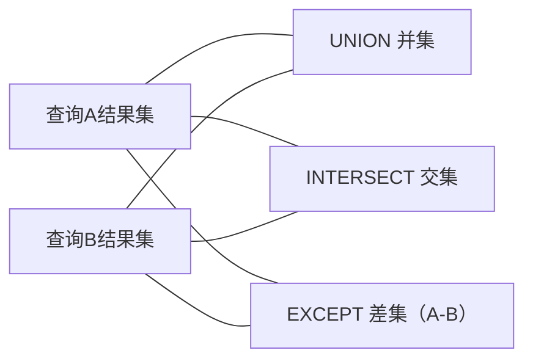

# 集合运算与运算符

本文分两部分：**集合运算**（`UNION`/`INTERSECT`/`EXCEPT`）把多个查询结果当作集合进行合并、取交、取差；**运算符**系统梳理算术、比较、逻辑、位、匹配运算及其优先级。

## 第一部分：集合运算

### 什么是集合运算

关系模型把"查询结果"视为一个**集合**（或带重复的多重集合），因此可以对多个查询结果做集合运算：



| 运算符 | 含义 | 类比 |
|--------|------|------|
| `UNION` | 并集（合并、去重） | A ∪ B |
| `UNION ALL` | 并集（合并、不去重） | A ∪ B（保留重复） |
| `INTERSECT` | 交集 | A ∩ B |
| `EXCEPT`（Oracle 用 `MINUS`） | 差集（A 有 B 无） | A − B |

### 集合运算的规则

1. 参与运算的两个查询**列数必须相同**；
2. 对应列**数据类型必须兼容**（可隐式转换）；
3. `ORDER BY` 只能放在整个集合运算之后；
4. 默认 `UNION`/`INTERSECT`/`EXCEPT` 都会**去重**；`UNION ALL` 保留重复（标准 SQL 及 MySQL 8.0.31+ 还支持 `INTERSECT ALL`/`EXCEPT ALL`，同样保留重复）。

### UNION：并集

```sql
-- 合并主要定位是法师和射手的所有英雄名（去重）
SELECT name FROM heros WHERE role_main = '法师'
UNION
SELECT name FROM heros WHERE role_assist = '法师';

-- UNION ALL：不去重，保留两个集合的全部行
SELECT name FROM heros WHERE role_main = '法师'
UNION ALL
SELECT name FROM heros WHERE role_assist = '法师';
```

**UNION vs UNION ALL**：

| 特性 | UNION | UNION ALL |
|------|:---:|:---:|
| 去重 | ✅ | ❌ |
| 性能 | 需排序去重，较慢 | 直接合并，快 |
| 语义 | 集合并集 | 保留全部（含重复） |
| 适用 | 想得到不重复结果 | 确定无重复 / 想保留重复（如日志合并） |

> 确定两个结果无交集或需保留重复时，优先用 `UNION ALL`，性能更好。

### INTERSECT：交集

```sql
-- 既是主要定位为法师，又是次要定位为法师的英雄（交集）
SELECT name FROM heros WHERE role_main = '法师'
INTERSECT
SELECT name FROM heros WHERE role_assist = '法师';
```

> MySQL 自 **8.0.31**（2022 年）起支持 `INTERSECT`/`EXCEPT`（含 `ALL` 变体），更早版本不支持（可用 `IN`/`NOT IN` 或 JOIN 模拟）；PostgreSQL、SQL Server、Oracle 也支持（Oracle 的差集写作 `MINUS`）。

### EXCEPT：差集

```sql
-- 主要定位是战士、但不是次要定位的英雄
SELECT name FROM heros WHERE role_main = '战士'
EXCEPT
SELECT name FROM heros WHERE role_assist = '战士';
```

### 集合运算中的排序与限制

```sql
-- 整个集合运算的结果再排序、分页
SELECT name FROM heros WHERE role_main = '法师'
UNION
SELECT name FROM heros WHERE role_assist = '法师'
ORDER BY name LIMIT 5;
```

### 用其他方式模拟集合运算（MySQL 8.0.31 之前的版本）

MySQL 8.0.31 之前没有 INTERSECT/EXCEPT，可用等价写法：

```sql
-- INTERSECT（交集）等价：EXISTS 或 JOIN
SELECT DISTINCT a.name
FROM heros a
WHERE a.role_main = '法师'
  AND EXISTS (
    SELECT 1 FROM heros b
    WHERE b.name = a.name AND b.role_assist = '法师'
  );

-- EXCEPT（差集）等价：NOT EXISTS 或 LEFT JOIN
SELECT DISTINCT a.name
FROM heros a
WHERE a.role_main = '战士'
  AND NOT EXISTS (
    SELECT 1 FROM heros b
    WHERE b.name = a.name AND b.role_assist = '战士'
  );
```

## 第二部分：运算符

### 算术运算符

| 运算符 | 作用 | 示例 | 结果 |
|--------|------|------|------|
| `+` | 加 | `10 + 3` | 13 |
| `-` | 减 | `10 - 3` | 7 |
| `*` | 乘 | `10 * 3` | 30 |
| `/` | 除 | `10 / 3` | 3.3333 |
| `DIV` | 整除 | `10 DIV 3` | 3 |
| `%` / `MOD` | 取模 | `10 MOD 3` | 1 |

```sql
SELECT name, hp_max + mp_max AS total,
       hp_max / 100 AS hp_ratio,
       hp_max MOD 100 AS hp_mod
FROM heros;
```

### 比较运算符

| 运算符 | 作用 | 说明 |
|--------|------|------|
| `=` | 等于 | |
| `!=` / `<>` | 不等于 | |
| `>` `<` `>=` `<=` | 大小比较 | |
| `BETWEEN a AND b` | 区间内 | 含端点，`>= a AND <= b` |
| `IN (list)` | 属于集合 | |
| `NOT IN` | 不属于 | |
| `LIKE` | 模式匹配 | `%` 任意多字符、`_` 单个字符 |
| `IS NULL` / `IS NOT NULL` | 判断 NULL | 不能用 `= NULL` |
| `<=>` | NULL 安全等于 | 与 NULL 比较也返回结果 |

```sql
-- BETWEEN
SELECT name, hp_max FROM heros WHERE hp_max BETWEEN 6000 AND 7000;
-- 等价
SELECT name, hp_max FROM heros WHERE hp_max >= 6000 AND hp_max <= 7000;

-- IN
SELECT name FROM heros WHERE role_main IN ('法师', '射手', '坦克');

-- NULL 判断（注意：不能用 = NULL）
SELECT name FROM heros WHERE role_assist IS NULL;
SELECT name FROM heros WHERE role_assist IS NOT NULL;
```

> **三值逻辑**：SQL 的比较结果是 TRUE/FALSE/**UNKNOWN**（涉及 NULL）。任何与 NULL 的 `=`、`>` 等比较都返回 UNKNOWN（不匹配）。详见《数据过滤》NULL 处理。

### 逻辑运算符

| 运算符 | 作用 | 说明 |
|--------|------|------|
| `AND` | 与 | 都真才真 |
| `OR` | 或 | 一真即真 |
| `NOT` | 非 | 取反 |
| `XOR` | 异或 | 一真一假才真 |

```sql
-- AND / OR 组合
SELECT name FROM heros
WHERE role_main = '战士' AND hp_max > 6000
   OR  role_main = '法师' AND mp_max > 1500;

-- NOT
SELECT name FROM heros WHERE NOT (role_main = '战士');
```

### 位运算符

| 运算符 | 作用 | 示例 |
|--------|------|------|
| `&` | 按位与 | `5 & 3 = 1` |
| `\|` | 按位或 | `5 \| 3 = 7` |
| `^` | 按位异或 | `5 ^ 3 = 6` |
| `~` | 按位取反 | |
| `<<` | 左移 | `1 << 4 = 16` |
| `>>` | 右移 | `16 >> 4 = 1` |

位运算常用于权限掩码等场景：

```sql
-- 权限：1读 2写 4删，按位或组合
SELECT 1 | 2 AS rw_permission;   -- 3（读+写）
```

### 模糊匹配 LIKE

| 通配符 | 匹配 |
|--------|------|
| `%` | 任意个任意字符（含 0 个） |
| `_` | 恰好一个任意字符 |

```sql
-- 以"张"开头
SELECT name FROM heros WHERE name LIKE '张%';
-- 以"飞"结尾
SELECT name FROM heros WHERE name LIKE '%飞';
-- 含"天"字
SELECT name FROM heros WHERE name LIKE '%天%';
-- 第 2 个字是"大"
SELECT name FROM heros WHERE name LIKE '_大%';
```

> 转义特殊字符用 `ESCAPE`：`LIKE '%\_%' ESCAPE '\\'`。

### 运算符优先级

从高到低（同一行优先级相同）：

```
括号 ( )
算数：*  /  DIV  %  MOD，  +  -
比较：=  >  <  >=  <=  <>  !=  BETWEEN  IN  LIKE  IS  <=>
逻辑：NOT
逻辑：AND
逻辑：XOR
逻辑：OR
```

```sql
-- AND 优先级高于 OR，注意加括号
SELECT name FROM heros
WHERE role_main = '战士'
   OR (role_main = '法师' AND hp_max > 6000);
```

> **最佳实践**：即使优先级清楚，也建议用**括号**明确分组，提高可读性、避免歧义。

## 总结

### 集合运算速查

| 运算符 | 含义 | MySQL |
|--------|------|:---:|
| `UNION` | 并集（去重） | ✅ |
| `UNION ALL` | 并集（不去重） | ✅ |
| `INTERSECT` | 交集 | ✅（8.0.31 起；更早版本用 EXISTS/JOIN 模拟） |
| `EXCEPT`（MINUS） | 差集 | ✅（8.0.31 起；更早版本用 NOT EXISTS 模拟） |

### 运算符速查

| 类别 | 运算符 |
|------|--------|
| 算术 | `+ - * / DIV % MOD` |
| 比较 | `= != <> > < >= <= BETWEEN IN LIKE IS NULL` |
| 逻辑 | `AND OR NOT XOR` |
| 位 | `& \| ^ ~ << >>` |
| 匹配 | `LIKE '%...%'` `_` |

### 关键点

1. 集合运算要求两查询**列数相同、类型兼容**，默认去重，`UNION ALL` 不去重；
2. `ORDER BY`/`LIMIT` 作用于**整个集合运算**之后；
3. MySQL 8.0.31 起支持 `INTERSECT`/`EXCEPT`（含 `ALL`），更早版本用 `EXISTS`/`JOIN`/`NOT EXISTS` 等价实现；
4. NULL 参与比较产生 **UNKNOWN**，判空必须用 `IS NULL`/`IS NOT NULL`；
5. `AND` 优先级高于 `OR`，复杂条件用括号明确；`LIKE` 的 `%`/`_` 用于模糊匹配。
