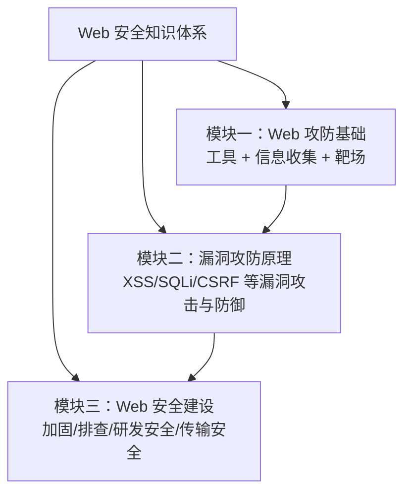

# Web 安全概述

## 0. 引言

**未知攻，焉知防**——学习网络渗透技术的目的正是为了更好地防御：如果不知道黑客如何攻击，就无法做出相应的防御对策。正如警察需要具备犯罪相关知识才能洞察犯罪行为，这是 Web 安全的核心思路。**非法入侵他人网站属于违法行为，要负法律责任**，学习的前提是合法合规。

## 1. 被入侵的代价：Equifax 案例

网站被入侵的代价往往巨大。2017 年 9 月，美国三大信用评级机构之一的 Equifax 服务器被黑、数据库被盗，**近一半美国人的隐私信息**（姓名、生日、电话、住址、信用卡号、驾驶证号等）遭泄露。被曝光当天 Equifax 股价暴跌，花了近 2 年才恢复。

大公司网站被黑通常是严重的公关事件，甚至导致股价腰斩；小网站被黑影响可能不大，但同样会造成业务损失。

## 2. 为什么要学 Web 安全？

根据 HackerOne 报告数据，**71% 的安全问题出现在网站上**，其次是一些 API 接口，再往下是 iOS 与 Android 应用。网站安全攻防（Web 安全）占比通常达到 **80% 以上**，是最受外部黑客关注的目标，也是企业应当重点防御的对象。

许多安全从业者或开发人员面对 Web 安全时，往往**只懂得利用、不懂得防御**，或**缺乏实战能力**。Web 安全是注重实战的技能——如果缺乏实战，真正被入侵时就无法有效应对。学习 Web 安全知识，能帮助前后端开发者更有效地应对、甚至提前预防安全事件。

国内外企业普遍建有安全响应中心（如 TSRC、MSRC），接收外部漏洞报告并按危害等级给予赏金；HackerOne 等第三方漏洞奖励平台也常公开漏洞案例，具有较高学习价值。但挖到有价值的高危漏洞需要系统化的 Web 安全知识——仅靠一句弹框语句测试输入框基本无效。

## 3. 系列内容结构

- **模块一，Web 攻防基础**：正式攻击前的准备工作——介绍常用工具，并**搭建靶场以避免非法测试他人网站**。掌握常用渗透工具与信息收集方法，理解漏洞原理与利用，提升实战能力；
- **模块二，漏洞攻防原理**：系列最硬核部分，在模块一基础上补充实用工具与测试方法（如 sqlmap），讲解 XSS、SQL 注入、CSRF 等常见 Web 漏洞的攻击与防御，通过靶场演练，避免成为只会使用工具的"脚本小子"；
- **模块三，Web 安全建设**：企业内部对 Web 漏洞的防御方法——如何更系统、更全面、更早地检测、修复、拦截漏洞，防止产品遭受外部恶意攻击；业务开发过程中避免安全漏洞的产生同样重要。

系列内容还结合公开的漏洞靶场和 CTF 赛题，通过实例讲解 Web 安全攻防的各个方面，指导搭建环境练习，在实践中学习与应用。

## 4. 小结

- **核心理念**：未知攻，焉知防——先理解攻击，才能有效防御；一切学习须合法合规；
- **学习价值**：Web 漏洞占全部安全问题 80% 以上，是攻防主战场；实战能力是应对入侵的关键；
- **知识体系**：基础（工具/信息收集/靶场）→ 原理（漏洞攻防）→ 建设（加固/排查/研发/传输安全）三模块递进；
- **学习方法**：靶场 + CTF 实战演练，理论结合实践，避免成为只会使用工具的"脚本小子"。

下一章讲解常用渗透测试工具。