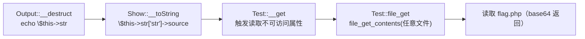

# 反序列化漏洞

## 0. 引言

反序列化漏洞近年频繁出现于 Java 公共库（如 fastjson）与 Java 应用服务器（如 JBoss）、PHP 系统（如 Joomla）中。**若对反序列化的数据未做有效过滤和限制，攻击者通过精心构造的序列化字符串控制对象属性甚至函数，即可实现远程代码执行**。本节以 PHP 为例讲解攻防。

## 1. 序列化与反序列化

序列化将对象转换为有序字节流（可阅读字符串），便于网络传输与本地存储；反序列化则重建对象，避免重写代码。

```php
<?php
class People {
    public $id = 1;
    protected $name = "john";
    private $age = 18;
}
echo serialize(new People());
// O:6:"People":3:{s:2:"id";i:1;s:7:"\x00*\x00name";s:4:"john";s:11:"\x00People\x00age";i:18;}
```

序列化格式解读：`O` 对象、`6` 名称长度、`People` 类名、`3` 变量个数、`s` 字符串、`i` 整数……常用类型标识：

```text
a-数组  b-布尔  i-整数  O-对象  s-字符串  S-转义字符串
C-自定义对象  r-对象引用  R-指针引用  N-null  U-Unicode
```

> 注意：`protected`/`private` 属性名中含 `\x00`（部分终端显示会过滤），构造利用字符串时需补回，否则反序列化失败。

## 2. 漏洞产生原因

`unserialize()` 的参数由外部可控（如 `$_GET['str']`）时，攻击者传入精心构造的序列化字符串，控制对象内部变量甚至函数调用——PHP 反序列化漏洞因此也称 **PHP 对象注入**。

## 3. 攻击手法

### 3.1 利用魔术方法

魔术方法在特定时机被**自动调用**（无需手工调用），是扩大攻击面的关键：

```php
__construct  # 对象创建时
__destruct   # 对象销毁时（漏洞利用高频入口）
__wakeup     # unserialize() 时首先调用
__sleep      # serialize() 时首先调用
__toString   # 对象被当字符串时
__get/__set  # 访问/设置不可访问属性时
__call       # 调用不可访问方法时
__invoke     # 以函数方式调用对象时
```

漏洞示例：`unserialize($_GET['str'])` 直接使用外部参数；`People::__destruct()` 调用 `$this->type->run()`，而 `Evil::run()` 执行 `system($this->cmd)`：

```php
// 构造 People 的 type 属性为 Evil（cmd='id'），序列化后传入
O:6:"People":1:{s:12:"\x00People\x00type";O:4:"Evil":1:{s:3:"cmd";s:2:"id";}}
// URL 编码 \x00 后作为 str 参数发送 → 执行 system('id')
```

**通用利用思路（五步）**：

1. 寻找含危险函数（system/eval/exec/file_get_contents）的目标方法；
2. 追踪调用该方法的上游方法/函数（如 `__destruct`）；
3. 寻找能控制目标方法参数的上游方法（如 `__construct` 属性赋值）；
4. 编写 PoC 构建恶意对象并 `serialize` 生成字符串；
5. 将字符串传给漏洞参数实现利用。

### 3.2 POP 链构造

**POP（Property-Oriented Programming，面向属性编程）** 利用程序中已有的代码序列（对象属性、方法），组合成特定调用链达到目的——与二进制的 ROP 原理相似：



CTF 实例要点：`Output::__destruct` 中 `echo` 触发 `Show::__toString`；`Show::__toString` 访问 `$this->str['str']->source`（`str` 为未定义属性）触发 `Test::__get`；`Test::__get` 经 `get()` 调用 `file_get()` 实现任意文件读取。PoC 按调用链反向构造对象嵌套，序列化后传入 `strs` 参数即可。

### 3.3 phar 文件攻击（2018 BlackHat）

phar 文件中的 meta-data 以序列化形式存储，**解析时必然触发反序列化**，配合 `phar://` 伪协议可在无 `unserialize()` 函数的情况下触发漏洞：

```php
$filename = 'phar://phar.phar/test.txt';
file_get_contents($filename);  // 触发 meta-data 反序列化
```

利用时还可伪造 phar 文件头（添加图片头）绕过上传格式限制。参考：[利用 phar 拓展 PHP 反序列化漏洞攻击面](https://paper.seebug.org/680/)。

## 4. 漏洞挖掘

| 方法 | 说明 |
|------|------|
| **代码审计** | 针对反序列化函数（unserialize/phar 场景）回溯参数来源，找外部可控且未过滤的入口（0day 首选） |
| **RASP 检测** | Hook 敏感函数（eval/unserialize）打印栈回溯，复现 POP 链、定位漏洞代码 |
| **动态黑盒扫描** | 收集历史 payload + 指纹识别（尤其第三方库），批量发送判断；常用于漏洞应急后加入日常扫描 |

## 5. 防御

- **黑白名单限制**：对反序列化类做白名单（首选）/黑名单限制——主流框架的修复方案；黑名单可能被新增类绕过（漏洞修复后复发的原因）；
- **WAF**：收集各语言反序列化攻击数据提取特征拦截；
- **RASP**：兼有检测与拦截能力。

## 6. 扩展与其他语言

| 语言 | 机制 |
|------|------|
| Python | `pickle.dump` / `pickle.load` |
| Java | 实现 `Serializable` 接口，`ObjectOutputStream` / `ObjectInputStream`（fastjson/Shiro 反序列化链是经典案例） |
| Ruby | `Marshal.dump` / `Marshal.load` |

原理与利用思路与 PHP 类似。

## 7. 小结

- **原理**：外部可控数据进入反序列化函数，构造对象控制属性/函数调用 → 代码执行（对象注入）；
- **核心技巧**：魔术方法（`__destruct`/`__wakeup`/`__toString` 等）触发点 + POP 链组装 + phar 伪协议绕过入口限制；
- **挖掘**：代码审计为主，RASP 栈回溯辅助，黑盒 payload 扫描兜底；
- **防御**：白名单限制类（首选）、WAF 特征拦截、RASP 运行期防护。

下一章讲解文件上传漏洞。