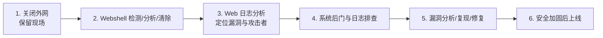

# 入侵排查与追踪

## 0. 引言

无法保证 100% 绝对安全——**网站真被入侵后，如何控制损伤、防止再次入侵、追踪攻击来源？** 本节聚焦"利用漏洞上传 Webshell 获取控制权"这一最常见入侵路径（Linux 平台），讲解入侵检测方法、应急处置六步流程与常用工具，并以实例演示完整排查过程。

## 1. 网站入侵检测

多数情况下外部报告（SRC 平台）与网页被篡改（炫耀性、较少）都不是主要发现途径——**攻击者以隐藏为主，意图长期控制服务器**。主动、及时、全面感知入侵，需要自建或采购入侵检测能力，三种方法：

| 方法 | 原理 | 代表 |
|------|------|------|
| **基于流量检测** | 收集网络流量分析攻击 payload 特征，尤其 Webshell 特征 | 流量分析平台 |
| **基于文件检测** | 文件扫描判断恶意后门 + 日志排查回溯攻击过程 | 河马、D 盾 |
| **基于行为检测** | 动态检测系统执行行为（如 RASP Hook 命令执行函数） | RASP |

## 2. 应急处置流程（六步）



**1. 关闭外网**：第一时间断外网（如 `ifdown eth1`），防进一步入侵窃取信息或内网渗透，保留现场。

**2. Webshell 检测、分析与清除**：
- 检测：河马（跨平台）、D 盾（Windows）、牧云（Linux）等工具扫描；
- 分析：从 Webshell 创建时间推测入侵时间段（注意时间可能被篡改，需结合日志）、分析其行为是否有其他后门；
- 清除：删除前**留存一份**供后续分析。

**3. Web 日志分析**：按服务器定位日志（Apache `/var/log/apache2/access.log`、Nginx `/var/log/11-Nginx基础概述/access.log` 等），找到漏洞位置、回溯攻击过程、定位攻击者 IP。

**4. 系统后门与日志排查**：攻击者为长期控制会留存后门——排查可疑文件/进程、病毒查杀，确保恶意程序清除干净，否则修复漏洞后仍会被二次入侵。

**5. 漏洞分析、复现与修复**：收集访问 Webshell 的 IP 的全部访问记录，推测漏洞成因（先访问上传接口再访问 Webshell → 上传漏洞；大批量登录尝试 → 暴力破解），**复现验证**后修复。

**6. 安全加固后上线**：参照《服务器安全加固》加固完成后再恢复业务。

## 3. 常用排查工具

| 工具 | 平台 | 特点与用法 |
|------|------|------------|
| [河马](https://www.shellpub.com/) | Win/Linux | 传统特征 + 云端大数据双引擎；`hm scan ./目录`、`hm deepscan ./目录` |
| [牧云 CloudWalker](https://github.com/chaitin/cloudwalker) | Linux | 长亭开源（已停止更新）；输出 HTML 报告，Risk 1~5 级；`./webshell-detector -html -output result.html /web-root/` |
| [PHP Malware Finder](https://github.com/jvoisin/php-malware-finder) | Linux | 基于 yara 规则，检测混淆编码 Webshell 有效；`./phpmalwarefinder <file\|folder>` |
| D 盾 | Windows | Web 防火墙 + Webshell 查杀，Windows 常用 |
| [Lorg](https://github.com/jensvoid/lorg) | Linux | Apache 日志安全分析，识别漏洞攻击行为，支持多格式报告；`./lorg -d phpids -u -g /path/to/access_log` |

## 4. 实例演示：DVWA 上传 Webshell 入侵排查

**1. 指纹识别**：Wappalyzer 确认 Apache + Ubuntu + PHP，网站目录 `/var/www/html`（软链接指向 `/app`）。

**2. Webshell 检测**：

```shell
$ ./hm scan /app   # 注意：/var/www/html 是指向 /app 的软链接，扫软链接扫不到
# 结果：识别出 1 个后门
1,冰蝎3.0 PHP-PHP后门，建议清理,/app/hackable/uploads/shell.php
# 其余 7 个"疑似"多为漏洞代码文件，需人工确认
```

> 经验：河马扫描机制不跟随软链接，需扫描真实目录。

**3. Web 日志分析**：

```shell
$ cat access.log | grep shell.php
172.17.0.1 - - [12/Feb/2021:07:45:51 +0000] "GET /hackable/uploads/shell.php HTTP/1.1" 404 ...
172.17.0.1 - - [12/Feb/2021:08:13:35 +0000] "POST /hackable/uploads/shell.php HTTP/1.1" 200 ...
# 定位攻击者 IP：172.17.0.1；先 GET（404，路径未成）后 POST（200，连接成功）
```

**4. 漏洞定位与复现**：按 IP 回溯其全部访问记录，发现访问 shell.php 前访问过 `/vulnerabilities/upload/`——推测为**上传漏洞**，访问上传入口复现验证。

**5. 清除与加固**：删除 shell.php → 排查系统其他恶意程序（rootkit、回连后门）→ 修复上传漏洞 → 加固后上线。

## 5. 小结

- **检测**：流量（payload 特征）、文件（Webshell 扫描 + 日志回溯）、行为（RASP）三管齐下；
- **流程**：断外网 → 查杀 Webshell（先留存）→ 日志分析 → 系统后门排查 → 漏洞复现修复 → 加固上线；
- **工具**：河马/牧云/PHP Malware Finder 查杀，Lorg 分析日志，D 盾（Windows）；
- **注意事项**：做好数据备份防恶意删除；恢复数据前先完成入侵排查，留存恶意文件供分析与防御方案制作。

下一章讲解研发安全：从 SDL 到 DevSecOps。