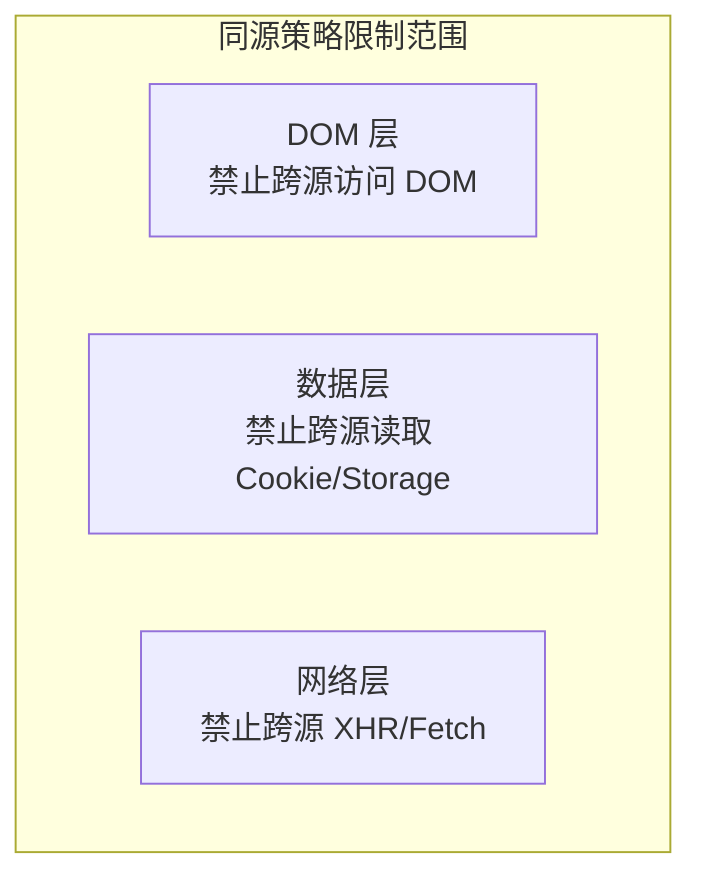
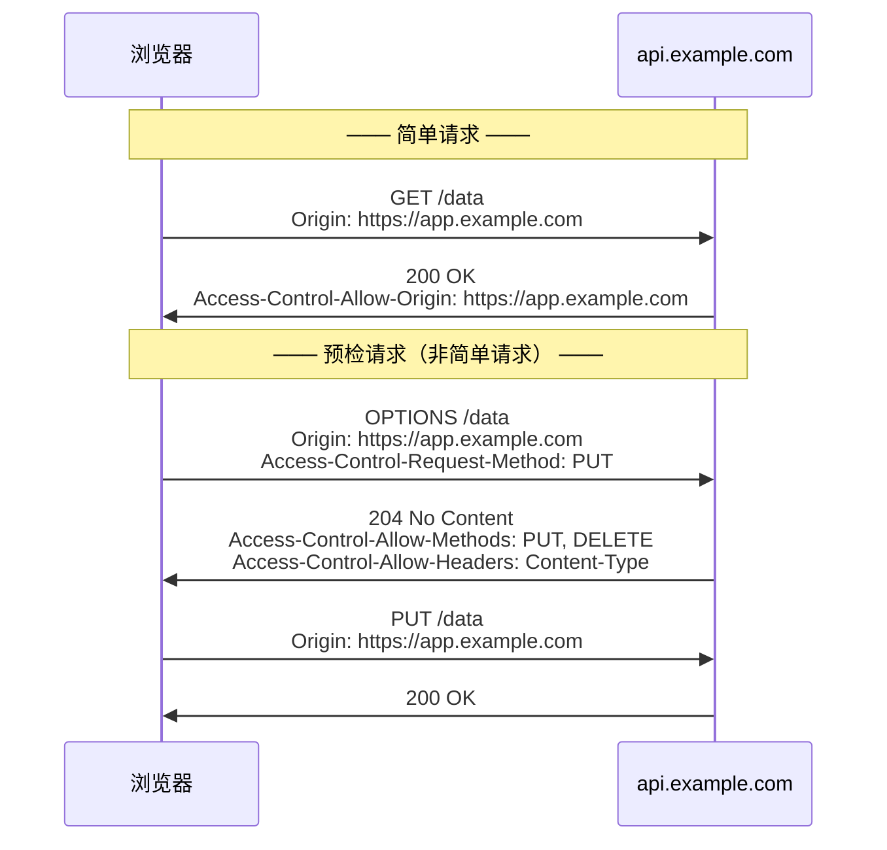
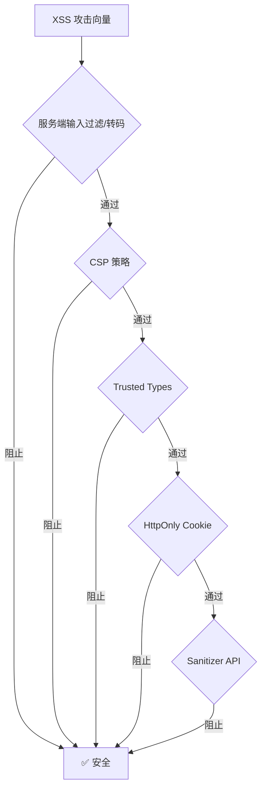
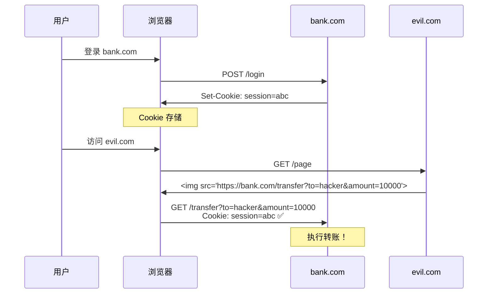
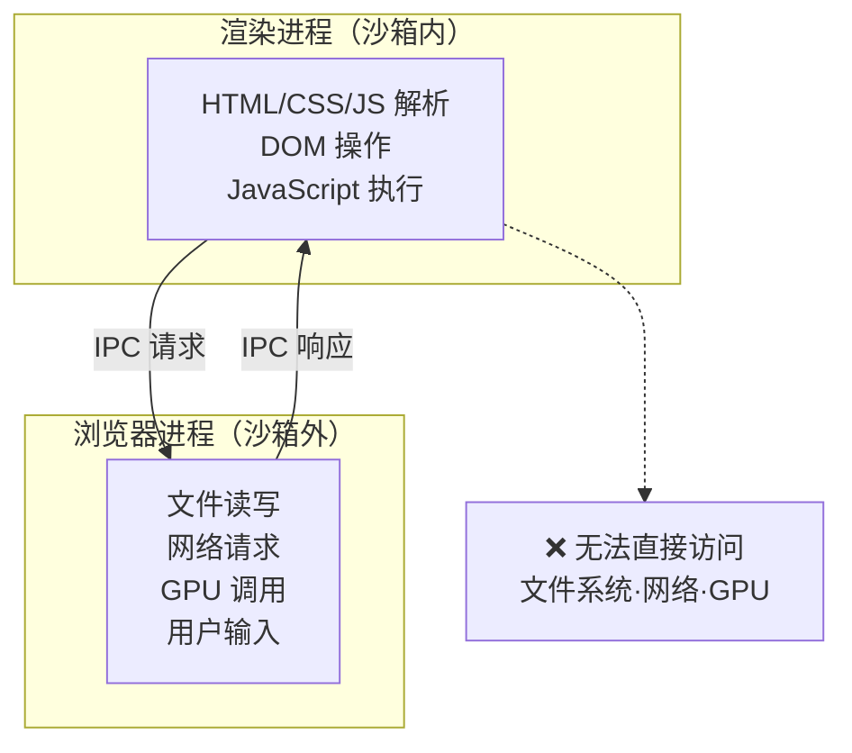
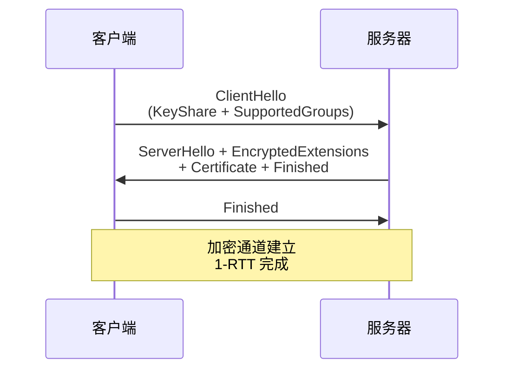
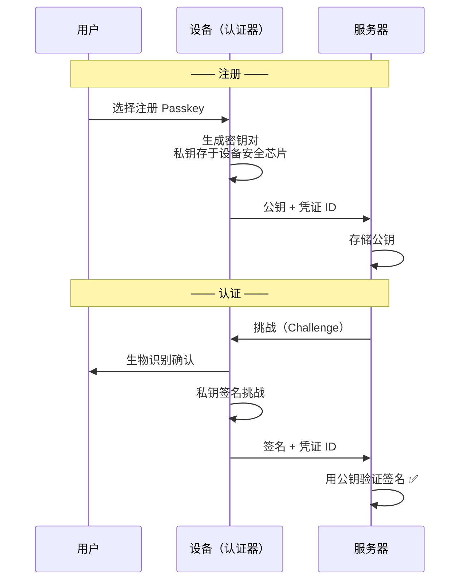

# 浏览器安全体系：同源策略、攻击防御与加密传输

## 0. 引言

浏览器安全涵盖三个维度：**Web 页面安全**（同源策略、XSS/CSRF 防御）、**浏览器系统安全**（安全沙箱、站点隔离）和**网络安全**（HTTPS/TLS）。本文将系统性地阐述这三个层面的安全机制，涵盖 COOP/COEP、Trusted Types、SameSite Cookie 默认值变更、Privacy Sandbox、Passkeys 等 2019 年以来的重大安全演进。

---

## 1. 同源策略（Same-Origin Policy）

### 1.1 同源定义

两个 URL **同源**当且仅当协议（scheme）、主机（host）和端口（port）完全相同：

| URL A | URL B | 同源？ | 原因 |
|-------|-------|--------|------|
| `https://a.com/p1` | `https://a.com/p2` | ✅ | 路径不同不影响 |
| `https://a.com` | `http://a.com` | ❌ | 协议不同 |
| `https://a.com` | `https://b.com` | ❌ | 主机不同 |
| `https://a.com` | `https://a.com:8080` | ❌ | 端口不同 |

### 1.2 同源策略的三层限制



| 层面 | 限制内容 | 合法绕过机制 |
|------|----------|--------------|
| **DOM** | 跨源 iframe/窗口的 DOM 读写 | `postMessage` 跨文档通信 |
| **数据** | Cookie、localStorage、IndexedDB | Storage Partitioning（分区访问） |
| **网络** | XMLHttpRequest/Fetch 跨源请求 | CORS（跨源资源共享） |

### 1.3 跨源资源共享（CORS）

CORS 通过 HTTP 头部协商允许跨源访问：



### 1.4 跨源隔离（Cross-Origin Isolation）

2020 年 Chrome 引入 **COOP/COEP** 机制，实现跨源隔离，作为使用 `SharedArrayBuffer` 等高权限 API 的前提：

| HTTP 头 | 值 | 作用 |
|---------|------|------|
| `Cross-Origin-Opener-Policy` | `same-origin` | 隔离窗口引用（`window.opener`） |
| `Cross-Origin-Embedder-Policy` | `require-corp` | 要求所有子资源显式授权跨源嵌入 |
| `Cross-Origin-Resource-Policy` | `cross-origin` | 资源声明允许跨源加载 |

设置 `COOP: same-origin` + `COEP: require-corp` 后，页面进入跨源隔离状态，可使用：
- `SharedArrayBuffer`（多线程共享内存）
- 高精度计时器（`performance.now()` 微秒级精度）
- `measureUserAgentSpecificMemory()` API

---

## 2. XSS 攻击与防御

### 2.1 攻击类型

| 类型 | 注入位置 | 是否经过服务器 | 持久性 |
|------|----------|----------------|--------|
| **存储型 XSS** | 数据库（评论、用户名等） | ✅ | 持久 |
| **反射型 XSS** | URL 参数 | ✅ | 非持久 |
| **DOM 型 XSS** | 客户端 DOM 操作 | ❌ | 非持久 |

### 2.2 现代防御体系



#### 2.2.1 内容安全策略（CSP）

CSP 通过 HTTP 头声明允许加载的资源来源：

```
Content-Security-Policy:
    default-src 'self';
    script-src 'self' 'nonce-abc123';
    style-src 'self' 'unsafe-inline';
    img-src 'self' data: https:;
    connect-src 'self' https://api.example.com;
    report-uri /csp-violation-report;
```

**CSP 3 及 Trusted Types 相关指令**：

| 指令 | 功能 |
|------|------|
| `script-src-elem` | 控制 `<script>` 元素 |
| `script-src-attr` | 控制内联事件处理器 |
| `require-trusted-types-for` | 强制使用 Trusted Types |
| `trusted-types` | 声明允许的 Trusted Types 策略 |

#### 2.2.2 Trusted Types API

2020 年起在 Chrome 中落地的 **Trusted Types** 在 DOM 层面阻止 XSS 注入——禁止将字符串直接赋值给危险的 DOM Sink：

```javascript
// ❌ 默认禁止（抛出 TypeError）
element.innerHTML = userInput;
document.write(untrustedData);

// ✅ 通过 Trusted Types 策略创建安全值
const policy = trustedTypes.createPolicy('sanitizer', {
    createHTML: (input) => DOMPurify.sanitize(input)
});
element.innerHTML = policy.createHTML(userInput);
```

#### 2.2.3 Sanitizer API

**Sanitizer API** 提供浏览器原生的 HTML 净化能力（截至 2026-09 标准化仍在推进中，各浏览器支持程度不一）：

```javascript
const sanitizer = new Sanitizer({
    allowElements: ['b', 'i', 'em', 'strong', 'a'],
    allowAttributes: { 'a': ['href'] }
});
element.setHTML(userInput, { sanitizer });
```

---

## 3. CSRF 攻击与防御

### 3.1 攻击原理

CSRF（Cross-Site Request Forgery）利用用户已认证的身份，在用户不知情的情况下发起跨站请求：



### 3.2 SameSite Cookie 演进

| 时间 | 事件 | 影响 |
|------|------|------|
| 2016 | `SameSite` 属性引入 | 开发者可显式声明 |
| 2020.02 | Chrome 默认 `SameSite=Lax` | 跨站 POST 请求不再携带 Cookie |
| 2024.01 | Chrome 121 对 1% 用户限制第三方 Cookie | 后于 2024.07 宣布放弃直接淘汰方案 |

```http
Set-Cookie: session=abc; SameSite=Strict; Secure; HttpOnly
```

| SameSite 值 | 同站请求 | 跨站顶层导航 | 跨站子请求 |
|--------------|----------|---------------|------------|
| `Strict` | ✅ 发送 | ❌ 不发送 | ❌ 不发送 |
| `Lax` | ✅ 发送 | ✅ 发送（GET） | ❌ 不发送 |
| `None` | ✅ 发送 | ✅ 发送 | ✅ 发送（需 `Secure`） |

### 3.3 其他 CSRF 防御

- **CSRF Token**：表单中嵌入服务器生成的随机令牌，提交时验证
- **双重 Cookie 验证**：Cookie 中的值与请求参数中的值匹配
- **自定义请求头**：AJAX 请求添加 `X-Requested-With` 头，跨站伪造的请求无法自行添加该头

---

## 4. 安全沙箱与站点隔离

### 4.1 安全沙箱机制

Chrome 利用操作系统级沙箱限制渲染进程的系统调用：



### 4.2 Site Isolation（站点隔离）

2018 年 Spectre 漏洞促使 Chrome 全面实施站点隔离：

- **标签页级隔离 → 站点级隔离**：不同站点的 iframe 运行于不同渲染进程
- **进程级内存隔离**：利用操作系统进程隔离机制阻止跨站点内存读取
- **COOP/COEP 强制执行**：站点隔离为跨源隔离提供进程级保障

---

## 5. HTTPS 与 TLS 1.3

### 5.1 HTTPS 的安全层

HTTPS 在 HTTP 与 TCP 之间插入 TLS 安全层，实现：
- **加密**：防止窃听
- **完整性**：防止篡改
- **认证**：防止冒充

### 5.2 TLS 1.3 握手

TLS 1.3 强制前向保密（ECDHE 密钥交换），移除弱密码算法，将握手从 2-RTT 缩短至 1-RTT：



### 5.3 证书透明度（Certificate Transparency）

CT 要求 CA 将签发的证书提交到公开日志，任何人可审计：

- 防止 CA 签发未授权证书
- 域名所有者可监控为其域名签发的证书
- Chrome 要求所有 TLS 证书必须提供 SCT 证明（常见做法是将 SCT 内嵌在证书中）

### 5.4 HTTPS-First Mode

2023—2024 年 Chrome 推出 **HTTPS-First Mode**：
- 用户输入不含协议的 URL 时，默认使用 HTTPS
- HTTP 连接失败时显示警告页面
- 目标：最终将 HTTP 降级为需要显式选择的协议

---

## 6. Privacy Sandbox 与第三方 Cookie 治理

### 6.1 第三方 Cookie 治理时间线

| 时间 | 事件 |
|------|------|
| 2020 | Chrome 提出 Privacy Sandbox 计划 |
| 2024.01 | Chrome 121 开始对 1% 用户限制第三方 Cookie |
| 2024.07 | Google 宣布不再"直接淘汰"第三方 Cookie，转而研究由用户自主选择的方案 |
| 2025.04 | 宣布不再推出独立的第三方 Cookie 选择提示，Chrome 维持现状 |

截至 2026-09，Chrome 未再推进第三方 Cookie 的全面淘汰，Privacy Sandbox 转向以提供可选替代 API 为主的路线。

### 6.2 替代方案

| API | 用途 | 状态 |
|-----|------|------|
| **Topics API** | 基于兴趣的广告定向 | 标准化中 |
| **Attribution Reporting** | 广告转化衡量 | 标准化中 |
| **Protected Audiences** | 重定向广告 | 标准化中 |
| **Shared Storage** | 跨站数据聚合 | 实验性 |
| **CHIPS** | 分区第三方 Cookie | 已部署 |

### 6.3 Storage Partitioning

所有浏览器存储（Cookie、localStorage、IndexedDB、Cache API）按**顶级站点 + 源**分区：

```
传统：evil.com 的 iframe 在 bank.com 中访问 evil.com 的 Cookie
分区后：evil.com 的 iframe 在 bank.com 中访问 [bank.com, evil.com] 分区的 Cookie
         → 与直接访问 evil.com 时的 Cookie 不同
```

---

## 7. Passkeys 与 WebAuthn

### 7.1 密码的终结

2022—2024 年，Apple、Google、Microsoft 联合推动 **Passkeys**（基于 FIDO2/WebAuthn 标准），用公钥密码替代传统密码：



**Passkeys 的安全优势**：
- 无密码可被钓鱼/泄露
- 认证过程绑定源（Origin），防止钓鱼攻击
- 私钥永不离开设备安全芯片
- 支持跨设备同步（iCloud Keychain / Google Password Manager）

---

## 8. 总结

| 安全层面 | 核心机制 | 2019—2026 演进 |
|----------|----------|----------------|
| 同源策略 | CORS + postMessage | COOP/COEP 跨源隔离 |
| XSS 防御 | CSP + 输入过滤 | Trusted Types + Sanitizer API |
| CSRF 防御 | CSRF Token | SameSite=Lax 默认值 + 第三方 Cookie 限制与分区 |
| 系统安全 | 安全沙箱 | Site Isolation + V8 Sandbox |
| 网络安全 | HTTPS + TLS 1.2 | TLS 1.3 + CT + HTTPS-First |
| 隐私保护 | 第三方 Cookie | Privacy Sandbox + Storage Partitioning |
| 身份认证 | 用户名/密码 | Passkeys (WebAuthn) |

浏览器安全的演进方向清晰：**从被动防御走向主动防护**——COOP/COEP 主动隔离跨源上下文，Trusted Types 在 DOM 写入时阻止 DOM XSS，SameSite 默认值消除了大量 CSRF 攻击面，Passkeys 从根本上消除了密码泄露风险。理解这一安全体系的完整图景，是构建安全 Web 应用的必要前提。

下一章讲解 HTTPS：浏览器如何验证数字证书。

---

## 参考文献

1. W3C: [CORS](https://fetch.spec.whatwg.org/#cors-protocol)
2. W3C: [Trusted Types](https://w3c.github.io/trusted-types/dist/spec/)
3. W3C: [Sanitizer API](https://wicg.github.io/sanitizer-api/)
4. RFC 8446: [TLS 1.3](https://datatracker.ietf.org/doc/html/rfc8446)
5. W3C: [WebAuthn Level 3](https://w3c.github.io/webauthn/)
6. Chrome Blog: [Privacy Sandbox](https://privacysandbox.com/)
7. FIDO Alliance: [Passkeys](https://fidoalliance.org/passkeys/)
