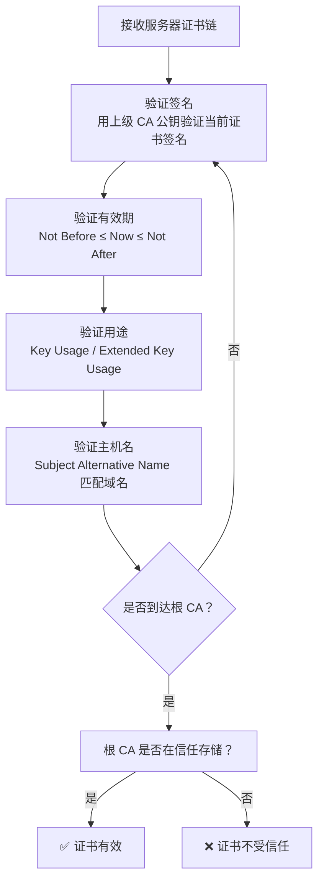
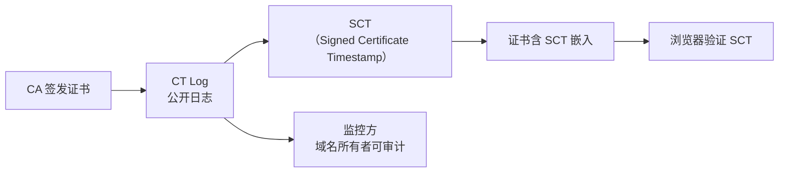

# HTTPS：浏览器如何验证数字证书

## 0. 引言

HTTPS 的安全性建立在 TLS 协议和数字证书之上。**浏览器验证数字证书的真实性和有效性，是防止中间人攻击的关键环节**。本文将阐述证书验证的完整流程，涵盖证书链、CRL/OCSP 和 Certificate Transparency。

---

## 1. 证书链验证

### 1.1 证书链结构

```
终端证书（End-Entity Certificate）
  → 中间 CA 证书（Intermediate CA Certificate）
    → 根 CA 证书（Root CA Certificate）[内置于浏览器/OS]
```

### 1.2 验证流程



---

## 2. 证书吊销检查

### 2.1 CRL vs OCSP

| 机制 | 全称 | 方式 | 缺点 |
|------|------|------|------|
| **CRL** | Certificate Revocation List | 下载完整吊销列表 | 体积大、更新延迟 |
| **OCSP** | Online Certificate Status Protocol | 实时查询证书状态 | 隐私泄露（CA 知道访问了哪个站） |
| **OCSP Stapling** | — | 服务器主动附上 OCSP 响应 | 需服务器支持 |

### 2.2 CRLSet

Chrome 使用 **CRLSet**——一个由 Google 分发的精简吊销列表，仅包含高优先级吊销证书。对于大多数证书，Chrome 不执行实时 OCSP 查询（避免延迟和隐私问题）。

---

## 3. Certificate Transparency（CT）

### 3.1 机制

CT 要求 CA 将签发的证书提交到公开的、仅追加的、可审计的日志中：



### 3.2 Chrome 的 CT 要求

Chrome 要求所有 TLS 证书必须包含至少 2 个来自不同 CT Log 的 SCT，否则拒绝连接。

---

## 4. 总结

| 验证步骤 | 检查内容 |
|----------|----------|
| 证书链 | 签名有效性 + 到达受信根 CA |
| 有效期 | Not Before / Not After |
| 主机名 | SAN 匹配 |
| 吊销状态 | CRLSet / OCSP Stapling |
| CT | 至少 2 个有效 SCT |

证书验证是 HTTPS 安全的信任基础。理解验证流程，有助于诊断 TLS 握手失败和配置正确的证书部署。

至此，Web 安全系列主体内容已完结——从攻防基础、漏洞原理到安全建设、浏览器与传输层安全，构建了完整的 Web 安全知识体系；附录《渗透测试法律法规》可作合规参考。

---

## 参考文献

1. RFC 5280: [X.509 Certificate Profile](https://datatracker.ietf.org/doc/html/rfc5280)
2. RFC 6960: [OCSP](https://datatracker.ietf.org/doc/html/rfc6960)
3. RFC 6962: [Certificate Transparency](https://datatracker.ietf.org/doc/html/rfc6962)
4. Chrome: [CT Policy](https://chromium.googlesource.com/chromium/src/+/main/net/cert/cert_transparency.md)
