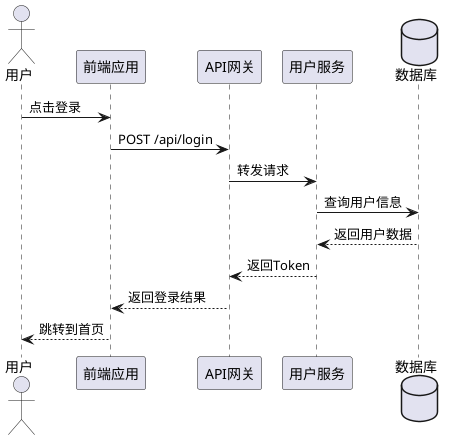

# 架构设计基础

## 一、架构设计概述 

### 1.1 什么是架构设计？

**定义**：架构设计是对软件系统的高层结构进行规划和决策的过程，包括：
- 系统的总体结构
- 组件之间的关系
- 技术选型决策
- 数据流向设计
- 扩展性和维护性考虑

### 1.2 架构设计的价值

| 维度 | 说明 |
|------|------|
| **技术层面** | 保证系统稳定性、可扩展性、高性能 |
| **团队层面** | 明确开发边界、降低沟通成本 |
| **业务层面** | 支撑业务发展、降低维护成本 |
| **风险层面** | 提前识别技术风险、制定应对方案 |

---

## 二、架构设计的常见坑点 

>  **重要提醒**：避免这些坑点可以有效提高架构设计的成功率

### 2.1 坑点一：盲目追求新技术

**现象描述**：
- 看到新技术就想用，不考虑团队技术储备
- 为了技术而技术，忽视业务需求
- 技术栈过于超前，团队无法驾驭

**正确做法**：
```
技术选型原则 = 业务需求 + 团队能力 + 维护成本 + 社区成熟度
```

**示例对比**：

 **错误示例**：
```javascript
// 团队刚熟悉 Vue 3 基础用法，却强行堆砌新技术
// 技术栈：Vue 3 + TS + Vite + 微前端 + GraphQL + Node 全栈
// 结果：开发效率低下，Bug 频出
```

 **正确示例**：
```javascript
// 根据团队现状选择合适的技术栈
// 技术栈：Vue 3 + Pinia + Axios（团队熟悉）
// 复杂特性（微前端、SSR 等）待团队驾驭后再循序渐进引入
```

### 2.2 坑点二：过度设计

**现象描述**：
- 为未来可能不会发生的需求做过多准备
- 架构复杂度过高，开发效率降低
- 增加不必要的抽象层

**判断标准**：
```javascript
// YAGNI 原则判断清单
const designChecklist = {
  currentNeeds: '当前需求是否满足？',
  futureNeeds: '未来需求是否明确？',
  cost: '过度设计的成本是否可接受？',
  team: '团队能否驾驭？',
  maintenance: '维护成本是否合理？'
}
```

**最佳实践**：
```
1. 先满足当前需求
2. 预留扩展点（但不过度实现）
3. 采用迭代式架构演进
```

### 2.3 坑点三：忽视非功能性需求

**非功能性需求清单**：

| 需求类型 | 考虑要点 | 示例 |
|---------|---------|------|
| **性能** | 响应时间、吞吐量、并发数 | QPS、TPS 指标 |
| **可用性** | 系统稳定性、故障恢复 | 99.9% 可用性保障 |
| **安全性** | 数据保护、访问控制 | HTTPS、权限控制 |
| **可维护性** | 代码质量、文档完善 | 代码规范、技术文档 |
| **可扩展性** | 业务增长应对能力 | 水平扩展、垂直扩展 |

### 2.4 坑点四：缺乏长远规划

**现象描述**：
- 只看眼前需求，不考虑未来发展
- 第三方工具选择不当，后期难以替换
- 架构缺乏灵活性，无法应对业务变化

**示例分析**：

 **错误案例**：小程序过度依赖第三方平台
```
初期：使用有赞、上线了等第三方小程序工具
优势：快速上线、成本较低
问题：
  - 可定制性差
  - 数据不在自己手中
  - 后期迁移成本高
  - 业务扩展受限
```

 **正确做法**：
```
1. 评估业务发展阶段
2. 短期：可使用第三方工具快速验证
3. 中期：逐步自研核心模块
4. 长期：建立完整技术体系
```

### 2.5 坑点五：脱离实践

**核心观点**：
> 理论来源于实践，架构设计需要在实践中验证和调整

**实践要点**：

```javascript
// 架构实践流程
const architecturePractice = {
  step1: '学习理论（微内核、微服务、响应式等）',
  step2: '小规模试点项目',
  step3: '收集问题和反馈',
  step4: '调整和优化架构',
  step5: '形成适合团队的架构规范',
  step6: '推广到更多项目'
}
```

**落地关键要素**：
1. **制定短中长期规划**
2. **梳理上下游业务依赖**
3. **确定团队配置和招聘计划** 

>  **重要**：架构落地需要考虑团队技术能力匹配度

---

## 三、架构设计的分类 

### 3.1 分类总览

```
架构设计分类
├── 系统架构（最全面）
├── 软件/应用架构
├── 数据架构
├── 网络架构
└── 安全架构
```


### 3.2 详细说明

#### 3.2.1 系统架构 

**定义**：最全面的架构设计，涵盖系统的各个方面

**包含内容**：
- 系统总体结构
- 软件组件
- 硬件组件
- 网络拓扑
- 数据存储
- 部署方案

**示例图示**：
```
┌─────────────────────────────────────────┐
│              系统架构总览                │
├─────────────────────────────────────────┤
│  客户端层                                │
│  ├── Web 应用                            │
│  ├── 移动端 APP                          │
│  └── 小程序                              │
├─────────────────────────────────────────┤
│  网络层                                  │
│  ├── CDN                                │
│  ├── 负载均衡                            │
│  └── API 网关                            │
├─────────────────────────────────────────┤
│  应用层                                  │
│  ├── 前端服务                            │
│  ├── 后端服务                            │
│  └── 微服务集群                          │
├─────────────────────────────────────────┤
│  数据层                                  │
│  ├── MySQL 主从                          │
│  ├── Redis 缓存                          │
│  └── MongoDB 文档库                      │
└─────────────────────────────────────────┘
```

#### 3.2.2 软件/应用架构 

**定义**：设计软件的高层结构，关注组件和交互方式

**核心要素**：
- 主要组件划分
- 组件间交互方式
- 设计模式应用
- 技术栈选择

**常见模式**：
```javascript
// 1. MVC 架构
Model-View-Controller

// 2. MVVM 架构（Vue 常用）
Model-View-ViewModel

// 3. 微服务架构
Microservices Architecture

// 4. 单体架构
Monolithic Architecture
```

**前端应用架构示例**：
```javascript
// Vue 项目应用架构
src/
├── api/              // API 接口层
├── assets/           // 静态资源
├── components/       // 组件层
├── composables/      // 组合式函数（Vue 3）
├── directives/       // 自定义指令
├── router/           // 路由配置
├── store/            // 状态管理
├── utils/            // 工具函数
└── views/            // 页面视图
```

#### 3.2.3 数据架构 

**定义**：设计数据的存储、处理、访问和保护方案

**核心内容**：
- 数据库设计
- 数据模型设计
- 数据流程图
- 数据管理策略

**数据架构设计要点**：

```javascript
// 数据库选型决策树
const databaseSelection = {
  relational: {
    suit: '结构化数据、事务性强',
    examples: ['MySQL', 'PostgreSQL', 'Oracle']
  },
  nosql: {
    document: { examples: ['MongoDB'], suit: '文档型数据' },
    keyvalue: { examples: ['Redis'], suit: '缓存、会话' },
    column: { examples: ['Cassandra'], suit: '大数据分析' },
    graph: { examples: ['Neo4j'], suit: '关系网络' }
  },
  newsql: {
    examples: ['TiDB', 'CockroachDB'],
    suit: '分布式事务场景'
  }
}
```

**数据架构示例**：
```sql
-- 电商系统数据库设计示例

-- 用户表
CREATE TABLE users (
  id BIGINT PRIMARY KEY AUTO_INCREMENT,
  username VARCHAR(50) NOT NULL,
  email VARCHAR(100) UNIQUE,
  created_at TIMESTAMP DEFAULT CURRENT_TIMESTAMP,
  INDEX idx_email (email)
);

-- 订单表
CREATE TABLE orders (
  id BIGINT PRIMARY KEY AUTO_INCREMENT,
  user_id BIGINT NOT NULL,
  total_amount DECIMAL(10,2) NOT NULL,
  status ENUM('pending', 'paid', 'shipped', 'completed'),
  created_at TIMESTAMP DEFAULT CURRENT_TIMESTAMP,
  FOREIGN KEY (user_id) REFERENCES users(id),
  INDEX idx_user_status (user_id, status)
);
```

#### 3.2.4 网络架构 

**定义**：设计系统的通信网络方案

**核心内容**：
- 网络设备配置
- 通信协议选择
- 路由策略设计
- 网络安全防护

**网络架构示例**：
```
互联网
    ↓
CDN (内容分发网络)
    ↓
防火墙
    ↓
负载均衡器
    ↓
┌─────────┬─────────┐
│  Web服务器1  │  Web服务器2  │
└─────────┴─────────┘
    ↓           ↓
应用服务器集群
    ↓
数据库主从复制
```

#### 3.2.5 安全架构 

**定义**：保护系统和数据安全的整体方案

**核心内容**：
- 安全策略制定
- 加密技术应用
- 身份验证机制
- 权限控制系统

**安全架构设计示例**：

```javascript
// 安全架构多层防护
const securityLayers = {
  // 1. 网络层安全
  network: {
    https: 'SSL/TLS 加密传输',
    firewall: '防火墙规则配置',
    waf: 'Web 应用防火墙'
  },
  
  // 2. 应用层安全
  application: {
    authentication: 'JWT/OAuth 2.0 身份验证',
    authorization: 'RBAC 权限控制',
    xss: 'XSS 攻击防护',
    csrf: 'CSRF Token 验证'
  },
  
  // 3. 数据层安全
  data: {
    encryption: '敏感数据加密存储',
    backup: '数据备份策略',
    audit: '操作审计日志'
  },
  
  // 4. 运维层安全
  ops: {
    monitor: '安全监控告警',
    patch: '定期安全补丁',
    drill: '安全演练'
  }
}
```

---

## 四、架构设计模式 


### 4.1 模式总览

| 模式类型 | 适用场景 | 复杂度 |
|---------|---------|--------|
| 层次架构模式 | 传统企业应用 | 低 |
| 数据流架构模式 | 数据处理系统 | 中 |
| 模块型架构模式 | 大型复杂系统 | 高 |
| 事件驱动架构模式 | 异步处理系统 | 中 |
| 分布式架构模式 | 高并发高可用系统 | 高 |
| 用户界面架构模式 | 前端应用 | 低 |

### 4.2 详细解析

#### 4.2.1 层次架构模式 

**三层架构**：
```
┌──────────────────────┐
│   表示层 (Presentation)│  ← 用户界面
├──────────────────────┤
│   业务逻辑层 (Service) │  ← 核心业务
├──────────────────────┤
│   数据访问层 (DAL)     │  ← 数据操作
└──────────────────────┘
```

**N 层架构扩展**：
```
┌──────────────────────┐
│   用户界面层 (UI)      │
├──────────────────────┤
│   应用层 (Application)│
├──────────────────────┤
│   业务层 (Domain)     │
├──────────────────────┤
│   数据访问层 (DAL)     │
├──────────────────────┤
│   数据库层 (Database)  │
└──────────────────────┘
```

**前端分层示例**：
```javascript
// 表示层 - 组件
<template>
  <div class="user-list">
    <UserCard v-for="user in users" :key="user.id" :user="user" />
  </div>
</template>

// 业务逻辑层 - 组合式函数
import { ref, onMounted } from 'vue'
import { useUserStore } from '@/store/user'
import { getUserList } from '@/api/user'

export function useUserList() {
  const users = ref([])
  const userStore = useUserStore()
  
  const fetchUsers = async () => {
    const res = await getUserList()
    users.value = res.data
  }
  
  onMounted(() => {
    fetchUsers()
  })
  
  return { users }
}

// 数据访问层 - API
import request from '@/utils/request'

export function getUserList() {
  return request.get('/api/users')
}

export function getUserById(id) {
  return request.get(`/api/users/${id}`)
}
```

#### 4.2.2 数据流架构模式 

**核心概念**：数据像流水线一样经过各个处理节点

**数据流示例**：
```
用户请求
    ↓
[网关层] - 认证、限流、日志
    ↓
[用户服务] - 用户信息验证
    ↓
[内容服务] - 内容处理
    ↓
[支付服务] - 支付处理
    ↓
[数据库] - 数据持久化
    ↓
返回用户
```

**实现示例**：
```javascript
// 中间件模式（类似 Koa/Express）
class Pipeline {
  constructor() {
    this.middlewares = []
  }
  
  use(middleware) {
    this.middlewares.push(middleware)
    return this
  }
  
  async run(context) {
    let index = 0
    
    const next = async () => {
      if (index < this.middlewares.length) {
        const middleware = this.middlewares[index++]
        await middleware(context, next)
      }
    }
    
    await next()
    return context
  }
}

// 使用示例
const pipeline = new Pipeline()

pipeline
  .use(async (ctx, next) => {
    console.log('1. 认证检查')
    await next()
  })
  .use(async (ctx, next) => {
    console.log('2. 权限验证')
    await next()
  })
  .use(async (ctx, next) => {
    console.log('3. 业务处理')
    ctx.result = '处理完成'
    await next()
  })

pipeline.run({})
```

#### 4.2.3 模块型架构模式 

**微服务架构**：
```
微服务架构特点：
├── 服务独立部署
├── 轻量级通信（HTTP/消息队列）
├── 服务可独立扩展
├── 技术栈多样性
└── 故障隔离
```

**微服务通信示例**：

```javascript
// 1. HTTP RESTful 通信
// 用户服务
class UserService {
  async getUser(id) {
    return await axios.get(`http://user-service/api/users/${id}`)
  }
}

// 2. 消息队列通信
// 订单服务
class OrderService {
  async createOrder(orderData) {
    // 创建订单
    const order = await Order.create(orderData)
    
    // 发送消息到消息队列
    await messageQueue.publish('order.created', {
      orderId: order.id,
      userId: order.userId
    })
    
    return order
  }
}

// 支付服务订阅订单创建事件
messageQueue.subscribe('order.created', async (message) => {
  // 处理支付逻辑
  await paymentService.process(message.orderId)
})
```

**微服务示例架构**：
```
┌──────────────┐
│   API 网关    │
└──────┬───────┘
       │
┌──────┴───────┬──────────┬──────────┐
│              │          │          │
▼              ▼          ▼          ▼
用户服务    订单服务    商品服务    支付服务
    │              │          │          │
    ▼              ▼          ▼          ▼
用户DB        订单DB      商品DB      支付DB
```

#### 4.2.4 事件驱动架构模式 

**核心模式**：
- 发布-订阅模式
- 观察者模式


**Vue 响应式系统原理**：
```javascript
// 简化的响应式系统实现
class Dep {
  constructor() {
    this.subscribers = new Set()
  }
  
  depend() {
    if (activeEffect) {
      this.subscribers.add(activeEffect)
    }
  }
  
  notify() {
    this.subscribers.forEach(effect => effect())
  }
}

let activeEffect = null

function watchEffect(effect) {
  activeEffect = effect
  effect()
  activeEffect = null
}

// 使用示例
const dep = new Dep()
let count = 0

watchEffect(() => {
  dep.depend()
  console.log(`count is: ${count}`)
})

// 触发更新
count++
dep.notify()  // 输出: count is: 1
```

**事件总线示例**：
```javascript
// Vue 3 事件总线
class EventBus {
  constructor() {
    this.events = {}
  }
  
  on(event, callback) {
    if (!this.events[event]) {
      this.events[event] = []
    }
    this.events[event].push(callback)
  }
  
  emit(event, ...args) {
    if (this.events[event]) {
      this.events[event].forEach(callback => callback(...args))
    }
  }
  
  off(event, callback) {
    if (this.events[event]) {
      this.events[event] = this.events[event].filter(cb => cb !== callback)
    }
  }
}

// 使用示例
const bus = new EventBus()

// 订阅事件
bus.on('user-login', (user) => {
  console.log(`用户 ${user.name} 登录成功`)
})

// 发布事件
bus.emit('user-login', { name: '张三' })
```

#### 4.2.5 分布式系统架构模式 

**主从架构模式**：
```
┌──────────────┐
│   主服务器    │ ← 读写操作
└──────┬───────┘
       │ 数据同步
┌──────┴───────┐
│              │
▼              ▼
从服务器1    从服务器2
(只读)       (只读)
```

**分布式数据模式**：
```javascript
// 数据分片示例
class ShardManager {
  constructor(shards) {
    this.shards = shards  // 分片节点列表
  }
  
  // 根据 key 决定数据存储位置
  getShard(key) {
    const hash = this.hash(key)
    const index = hash % this.shards.length
    return this.shards[index]
  }
  
  // 简单哈希函数
  hash(key) {
    let hash = 0
    for (let char of String(key)) {
      hash = (hash << 5) - hash + char.charCodeAt(0)
    }
    return Math.abs(hash)
  }
}

// 使用示例
const shards = ['shard1.db', 'shard2.db', 'shard3.db']
const shardManager = new ShardManager(shards)

const db1 = shardManager.getShard('user:1001')  // 哈希取模后存储到 shard3
const db2 = shardManager.getShard('user:1002')  // 哈希取模后存储到 shard1
```

#### 4.2.6 用户界面架构模式 

**MVC 模式**：
```
Model (数据模型)
  ↓ 数据变化
View (视图展示) ← 用户交互 → Controller (业务逻辑)
```

**MVVM 模式**：
```
Model (数据模型)
  ↕ 数据绑定
ViewModel (视图模型)
  ↕ 数据绑定
View (视图)
```

**Vue 3 MVVM 实战示例**：
```vue
<template>
  <!-- View 视图层 -->
  <div class="user-management">
    <input v-model="newUser.name" placeholder="输入用户名" />
    <button @click="addUser">添加用户</button>
    
    <ul>
      <li v-for="user in users" :key="user.id">
        {{ user.name }}
        <button @click="deleteUser(user.id)">删除</button>
      </li>
    </ul>
  </div>
</template>

<script setup>
import { ref, computed } from 'vue'

// Model 数据层
const users = ref([
  { id: 1, name: '张三' },
  { id: 2, name: '李四' }
])

const newUser = ref({ name: '' })

// ViewModel 视图模型层
const userCount = computed(() => users.value.length)

const addUser = () => {
  if (!newUser.value.name) return
  
  users.value.push({
    id: Date.now(),
    name: newUser.value.name
  })
  
  newUser.value.name = ''
}

const deleteUser = (id) => {
  users.value = users.value.filter(user => user.id !== id)
}
</script>
```

---

## 五、架构设计工具 

### 5.1 工具分类

| 工具类型 | 代表工具 | 适用场景 |
|---------|---------|---------|
| **UML 工具** | Visual Paradigm、PlantUML、StarUML | 统一建模语言设计 |
| **建模工具** | ProcessOn、Draw.io、XMind | 流程图、思维导图 |
| **系统架构工具** | Archi、Structurizr、阿里云架构图 | 系统架构设计 |
| **数据库设计工具** | Navicat、PowerDesigner、MySQL Workbench | 数据库建模 |


### 5.2 工具详解

#### 5.2.1 UML 工具 

**UML（Unified Modeling Language）统一建模语言**

**常用图表类型**：

| 图表类型 | 用途 | 示例场景 |
|---------|------|---------|
| **类图** | 类结构和关系 | 面向对象设计 |
| **时序图** | 对象交互顺序 | 接口调用流程 |
| **用例图** | 功能需求 | 需求分析 |
| **组件图** | 组件结构 | 系统组件设计 |
| **部署图** | 部署结构 | 系统部署规划 |

**时序图示例**：


#### 5.2.2 建模工具 

**推荐工具对比**：

| 工具 | 优势 | 劣势 | 推荐指数 |
|------|------|------|---------|
| **ProcessOn** | 在线协作、模板丰富 | 免费版有限制 | ★★★★ |
| **Draw.io** | 免费、功能强大 | UI 不够美观 | ★★★★★ |
| **XMind** | 思维导图专业 | 架构图功能弱 | ★★★ |

#### 5.2.3 数据库设计工具 

**Navicat 使用示例**：

```sql
-- 数据库建模步骤
1. 创建数据库连接
2. 设计表结构（字段、类型、约束）
3. 建立表关系（外键、索引）
4. 生成 SQL 脚本
5. 正向/逆向工程
```

**PowerDesigner 功能**：
```
PowerDesigner
├── 概念数据模型 (CDM)
├── 物理数据模型 (PDM)
├── 面向对象模型 (OOM)
└── 业务流程模型 (BPM)
```

---

## 六、常见问题与解决方案 

| 问题 | 原因 | 解决方案 |
|------|------|---------|
| **架构过度设计** | 追求完美、忽视实际需求 | 遵循 YAGNI 原则，迭代演进 |
| **团队技术能力不匹配** | 架构过于先进 | 渐进式引入新技术、加强培训 |
| **架构文档缺失** | 只做不说、缺乏沉淀 | 建立架构文档规范、定期更新 |
| **技术选型失误** | 盲目追新、缺乏评估 | 建立选型标准、进行 POC 验证 |
| **性能瓶颈** | 架构设计未考虑性能 | 提前进行性能规划、压力测试 |
| **维护困难** | 架构过于复杂 | 简化设计、建立清晰边界 |

---

## 七、学习要点总结

### 核心要点 

1. **架构设计五要素**：系统架构、软件架构、数据架构、网络架构、安全架构

2. **避免五大坑点**：
   - 盲目追求新技术
   - 过度设计
   - 忽视非功能性需求
   - 缺乏长远规划
   - 脱离实践

3. **六大设计模式**：
   - 层次架构（最常用）
   - 数据流架构
   - 模块型架构（微服务）
   - 事件驱动架构
   - 分布式架构
   - 用户界面架构（前端重点）

4. **架构设计工具**：UML 工具、建模工具、系统架构工具、数据库设计工具

5. **实践大于理论**：纸上得来终觉浅，绝知此事要躬行

---

## 八、延伸学习资源

### 推荐书籍 

1. **《架构整洁之道》** - Robert C. Martin
2. **《企业应用架构模式》** - Martin Fowler
3. **《微服务设计》** - Sam Newman（微服务设计经典）
4. **《凤凰架构》** - 周志明（中文）

### 在线资源 

1. **阿里云架构设计**：https://www.aliyun.com/solution/architecture
2. **AWS 架构中心**：https://aws.amazon.com/architecture/
3. **PlantUML 官方文档**：https://plantuml.com/
4. **微服务架构指南**：https://microservices.io/


### 练习建议 

1. **小试牛刀**：为现有项目画架构图
2. **对比分析**：对比开源项目的架构设计
3. **模拟设计**：设计一个电商系统架构
4. **复盘总结**：分析项目架构的优缺点

---

## 九、架构设计最佳实践清单 

```javascript
const architectureChecklist = {
  // 需求分析阶段
  requirements: [
    ' 明确业务需求',
    ' 识别非功能性需求（性能、安全、可用性）',
    ' 了解团队能力和资源',
    ' 评估技术风险'
  ],
  
  // 设计阶段
  design: [
    ' 选择合适的架构模式',
    ' 划分清晰的模块边界',
    ' 设计合理的数据流向',
    ' 考虑扩展性和维护性',
    ' 制定技术选型方案'
  ],
  
  // 实施阶段
  implementation: [
    ' 编写架构设计文档',
    ' 进行技术评审',
    ' 搭建基础框架',
    ' 建立开发规范'
  ],
  
  // 维护阶段
  maintenance: [
    ' 定期架构评审',
    ' 监控系统性能',
    ' 收集团队反馈',
    ' 持续优化改进'
  ]
}
```

---

## 十、架构设计演进路线图

```
初级阶段 → 中级阶段 → 高级阶段 → 专家阶段

┌─────────────┐
│  单体架构    │ ← 理解三层架构
│  (Monolith) │   掌握 MVC/MVVM
└──────┬──────┘
       ↓
┌─────────────┐
│  分层架构    │ ← 理解层次分离
│  (Layered)  │   掌握模块化设计
└──────┬──────┘
       ↓
┌─────────────┐
│  微服务架构  │ ← 理解服务拆分
│(Microservices)│  掌握分布式系统
└──────┬──────┘
       ↓
┌─────────────┐
│  云原生架构  │ ← 理解云原生理念
│(Cloud Native)│  掌握 Serverless
└─────────────┘
```

---

## 附录：架构设计模板

### A. 架构设计文档模板

```markdown
# [项目名称] 架构设计文档

## 1. 项目概述
- 项目背景
- 业务目标
- 技术目标

## 2. 需求分析
- 功能性需求
- 非功能性需求
- 约束条件

## 3. 架构设计
### 3.1 系统架构图
### 3.2 技术选型
### 3.3 模块划分
### 3.4 数据设计
### 3.5 接口设计

## 4. 详细设计
### 4.1 核心流程
### 4.2 异常处理
### 4.3 性能优化

## 5. 部署方案
### 5.1 部署架构
### 5.2 容器化方案
### 5.3 监控告警

## 6. 风险与应对

## 7. 附录
```

---

**笔记整理完成！** 

这份笔记涵盖了架构设计的核心概念、分类、模式和实践工具，并结合了最新的技术趋势和实际代码示例。建议结合实际项目进行实践，逐步掌握架构设计能力。
