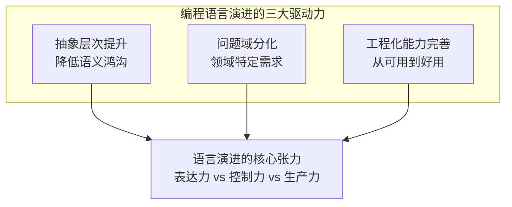
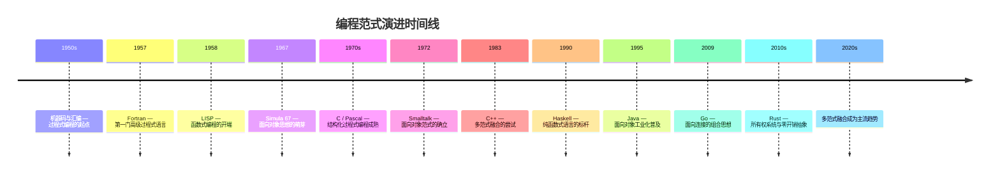
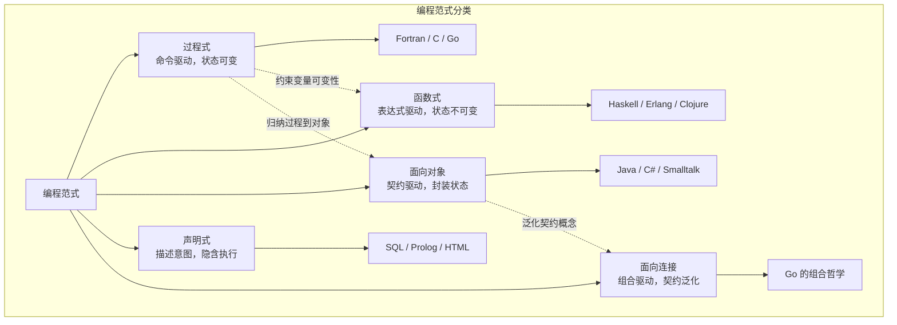
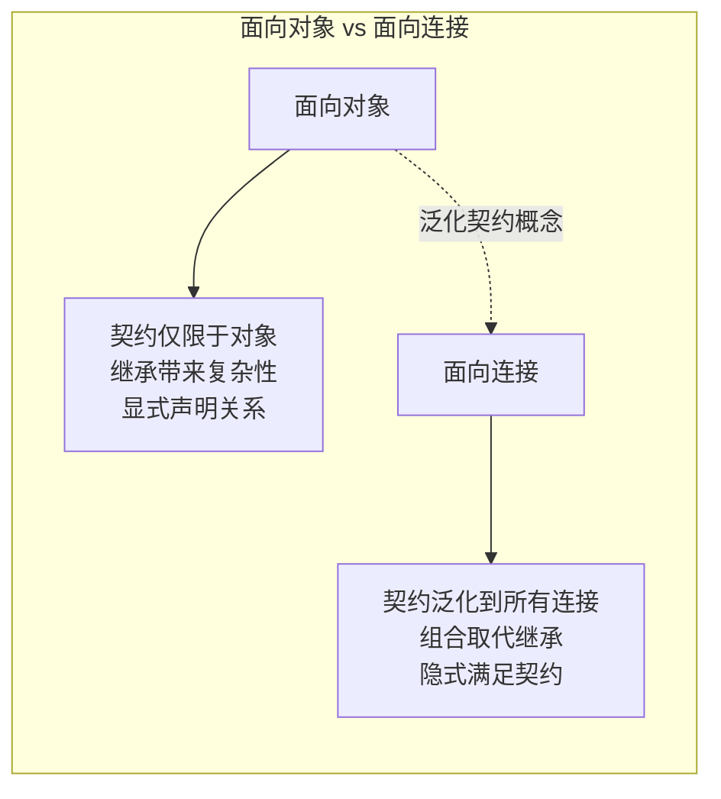
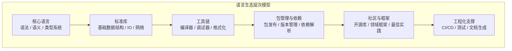
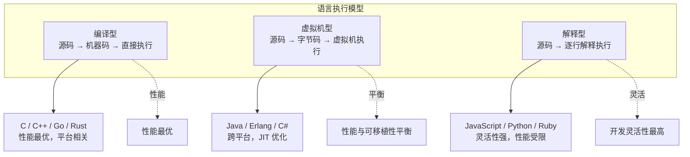
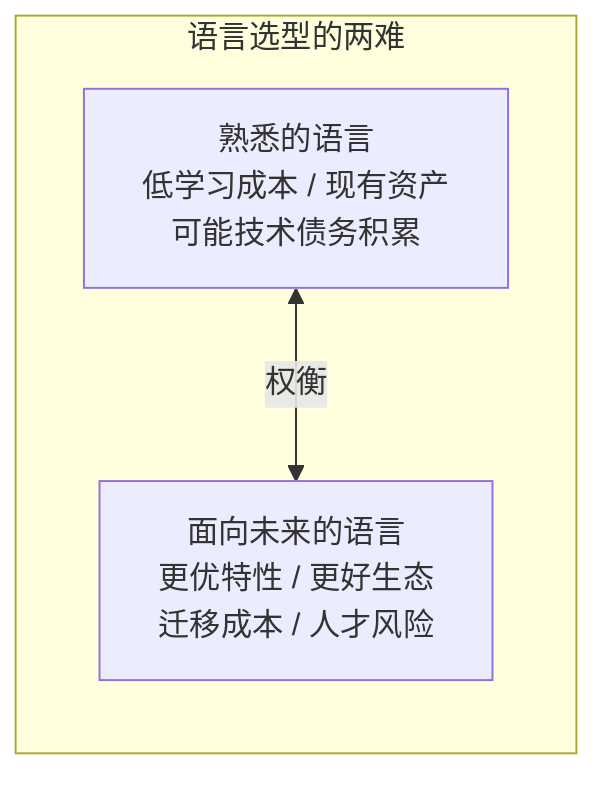

# 编程语言-生态与演进

在上一讲中，我们总览了程序完整的架构体系。今天，我们把视角拉到更宏观的层面——编程语言不仅是工程师与计算机对话的工具，更是一个完整的生态系统。理解语言的生态与演进规律，是架构师做出技术选型决策的关键前提。

## 核心问题：编程语言为何不断涌现？

编程语言从汇编算起，至今已七十余年，却已诞生了数千种语言。这一现象背后的驱动力是什么？

本质上，编程语言的演进受三股力量推动：

1. **抽象层次的提升**——从机器码到汇编，从汇编到高级语言，从命令式到声明式，每一次跃迁都在降低人类表达意图与机器执行之间的语义鸿沟。
2. **问题域的分化**——不同领域对语言特性的需求不同：系统编程追求零开销抽象，Web 开发追求快速迭代，数据科学追求表达力。
3. **工程化能力的完善**——包管理、版本控制、测试框架、文档生成等生态要素，决定了语言能否从"可用"走向"好用"。

## 编程范式的演进时间线

编程范式是语言思想的核心分类维度。从历史脉络看，范式的演进并非简单的替代关系，而是层层叠加、相互渗透的过程。

### 范式分类体系

从更结构化的视角，编程范式可以按照"对状态的态度"和"对抽象的侧重"两个维度来分类：

### 过程式：一切范式的基底

过程式编程是最基本的范式，因为计算机的机器语言本身就是指令序列——天然的过程式。过程式的两个核心构造是：

- **结构体（struct）**——对数据的组合，构建自定义数据结构
- **过程（procedure/function）**——对指令的抽象，复用已有成果

过程式并非"低级"，它是所有范式的公共底座。即使是函数式语言，最终也要编译为过程式的机器指令执行。

### 函数式：用约束换取正确性

函数式的核心主张是**变量不可变、函数无副作用**。这本质上是对过程式的一种约束——通过限制可变性，减少犯错机会，提升代码质量。

但约束的代价是显著的：在过程式中，修改数组某个元素是 O(1) 操作；在函数式中，因为数组不可变，必须复制整个数组，代价变为 O(n)。为此，函数式语言需要引入持久化数据结构（如平衡二叉树实现的 Vector），以对数级复杂度模拟数组的操作接口。

这意味着：**采用函数式编程，需要重新学习一整套数据结构**——大学课程中的数据结构在函数式语境下不再适用。

### 面向对象：契约与封装

面向对象在过程式基础上引入了对象（类）和对象方法，核心思想是**基于契约对代码的使用界面进行抽象和封装**。其两大优势是：

1. **清晰的使用界面**——某类型对象有哪些方法一目了然
2. **信息的封装**——不主张绕过对象接口侵入内部实现

面向对象还引入了**接口（interface）**概念，优雅地实现了多态。但**继承（inheritance）**这一概念则争议不断——它带来了编码便捷性，却增加了"继承还是组合"的心智负担。

> 关于面向对象的深入分析，参见 [08丨编程语言：面向对象]。

### 面向连接：Go 语言的范式创新

Go 语言提出了"面向连接"的范式主张。所谓面向连接，本质上是**朴素的组合思想**——研究人与人如何组合，研究代码与代码之间怎么组合。

面向对象将契约的重要性提升到了新高度，但契约并不只存在于对象之间。语言设计的方方面面都需要契约：

- **代码规范**——人与人的连接契约。Go 从语言设计层面消灭了最容易产生分歧的地方（如格式化、导入规范），让大家专注于意图表达。
- **消息传递**——进程与进程的连接契约。Go 提供了类型安全的 channel 机制，以消息传递取代共享内存，降低编程负担。
- **接口隐式实现**——代码与代码的连接契约。Go 的接口不需要显式声明 implements，只要类型满足了接口的方法集，就自动实现了该接口。

## 语言生态的构成要素

一门编程语言的生态，远不止语法和编译器。完整的语言生态包含以下层次：

### 工程化能力的四要素

从工程化角度看，语言生态的成熟度主要体现在四个方面：

| 要素 | 作用 | 典型实现 |
|------|------|----------|
| 包（package） | 代码的发布与复用单元 | Go modules、npm、Maven |
| 版本（version） | 包的依赖管理与兼容性保障 | semver、go.sum、package-lock |
| 文档（doc） | API 说明与知识传承 | godoc、Javadoc、Sphinx |
| 测试（test） | 质量保障与回归防护 | go test、JUnit、pytest |

**工程化能力的缺失，是许多优秀语言未能广泛采用的根本原因。** 一个语法精巧但缺乏包管理和测试框架的语言，在工业实践中往往败给语法平庸但生态成熟的语言。

## 语言的执行模型

从执行器的行为模式看，编程语言可分为三类：

值得注意的是，现代语言往往模糊了这三类的边界：

- **JIT 编译**：JVM 的 HotSpot、V8 引擎将热点代码动态编译为机器码，使"解释型"语言获得接近编译型的性能。
- **AOT 编译**：Go 直接将源码编译为机器码，GraalVM 的 native-image 则将 Java 字节码提前编译为机器码，兼顾开发效率与运行性能。
- **WebAssembly**：为浏览器提供了接近原生的执行能力，正在改变前端生态的格局。

## 语言选型对架构的影响

从架构设计角度，编程语言的选择对架构的影响体现在两个关键维度：

### 维度一：开发效率

抛开语言本身的语法效率差异，**不同语言的社区资源差异才是决定性因素**。语言长期演进中沉淀的框架、基础库，以及企业内部积累的技术资产，会导致巨大的开发效率差异。

选择一门生态成熟的语言，意味着：
- 常见问题已有现成解决方案
- 招聘市场有充足的人才供给
- 踩过的坑已被社区充分记录

### 维度二：长期维护

语言有生命周期。选择团队当前熟悉的语言，还是选择面向未来更优的语言，是架构师的两难选择。

**架构决策原则**：业务架构本身（模块拆分、业务边界）由需求决定，与语言无关。但模块规格的描述语言、实现语言的选择，会深刻影响开发效率和长期维护成本。本着"如无必要勿增实体"的原则，用开发语言本身来描述接口，而非引入额外的接口描述语言。

## 设计原则与权衡

### Trade-off 1：表达力 vs 控制力

| 维度 | 高表达力 | 高控制力 |
|------|----------|----------|
| 代表 | Python / Ruby / Haskell | C / Rust / Go |
| 优势 | 代码简洁，开发速度快 | 性能可预测，行为可推理 |
| 代价 | 运行时开销，调试困难 | 语法冗长，开发效率低 |
| 适用 | 原型验证 / 脚本 / 数据分析 | 系统编程 / 基础设施 / 高性能 |

### Trade-off 2：范式纯粹性 vs 实用性

- **纯函数式**（Haskell）：理论优美，正确性保障强，但学习曲线陡峭，工业采用率低。
- **纯面向对象**（Java 早期）：一切皆对象，概念统一，但全局函数的缺失导致过度设计。
- **多范式融合**（Go / Rust / Kotlin）：保留各范式精华，降低教条主义负担，但需要设计者有极高的品味来控制复杂度。

### Trade-off 3：生态成熟度 vs 语言先进性

一门语言的技术先进性与其生态成熟度往往负相关。新语言在语法和类型系统上更先进，但缺乏库和社区支持；老语言生态成熟，但背负历史包袱。

**架构师的判断标准**：当生态差距可以通过工程手段弥补时，选择更先进的语言；当生态差距构成不可逾越的工程障碍时，选择更成熟的语言。

## 实践案例与反模式

### 案例：Go 语言在七牛云的选型决策

七牛云选择 Go 作为核心开发语言，并非单纯的技术偏好，而是基于以下考量：

1. **面向连接的范式**契合分布式系统开发——goroutine + channel 天然适合并发编程
2. **编译型 + 快速编译**——兼顾开发效率与运行性能
3. **极简的语法设计**——降低团队协作中的沟通成本
4. **标准库的网络能力**——对服务端开发有天然优势

### 反模式：语言选型的常见误区

1. **唯新论**——盲目追逐新语言，忽视生态成熟度和团队学习成本
2. **唯熟论**——固守熟悉语言，拒绝评估更优选择，导致技术债务持续积累
3. **多语言混用无约束**——在同一个项目中引入过多语言，增加维护和招聘成本
4. **忽视工程化能力**——只看语法特性，忽略包管理、测试、文档等工程化支撑

## 小结

编程语言的演进是抽象层次提升、问题域分化、工程化能力完善三股力量共同驱动的结果。从过程式到函数式，从面向对象到面向连接，范式的演进并非替代，而是层层叠加。语言生态的成熟度——而非语法本身的优雅——往往是工业实践中选型的决定性因素。

**关键要点**

1. **范式演进是叠加而非替代**：过程式是所有范式的公共底座，函数式是对过程式的约束，面向对象是对过程式的封装，面向连接是对面向对象的泛化
2. **生态成熟度决定工业采用率**：包管理、版本控制、文档、测试四大工程化要素，比语法特性更能决定语言的生产力
3. **语言选型是架构决策**：影响开发效率（社区资源）和长期维护（语言生命周期），需在熟悉与未来之间权衡
4. **面向连接是范式的进化方向**：将契约概念从对象间泛化到所有连接维度，以组合取代继承，是 Go 语言的范式创新
5. **执行模型的边界正在模糊**：JIT、AOT、WebAssembly 等技术使传统分类不再绝对，架构师需关注实际性能特征而非标签

> 下一篇我们将深入编程语言的内部机制，探讨功能抽象与控制流模型——参见 [07丨编程语言：功能与控制]。
