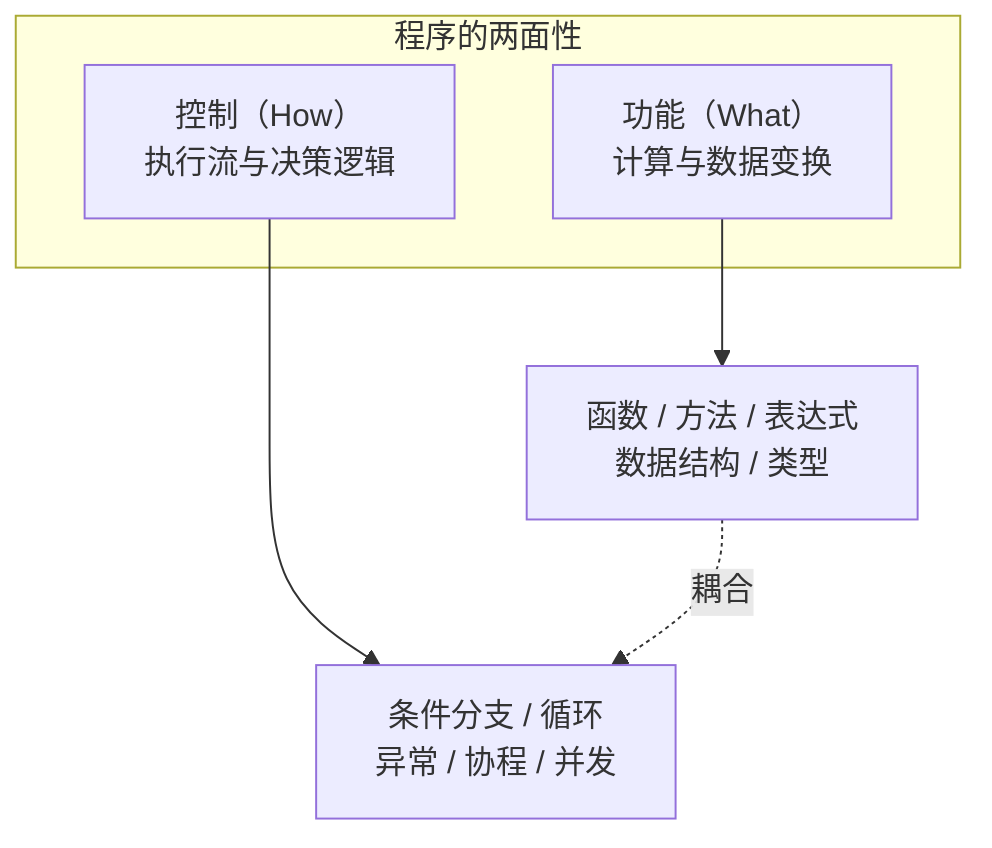
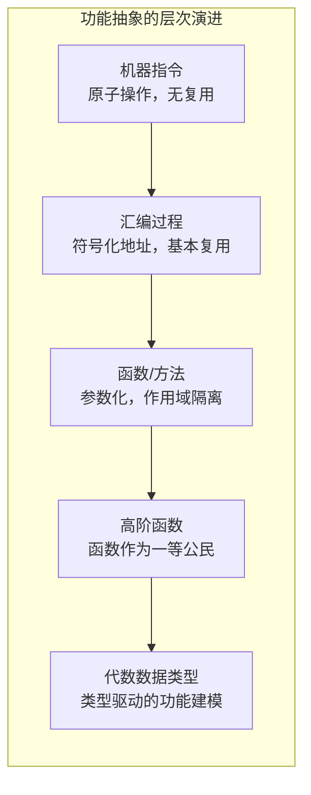
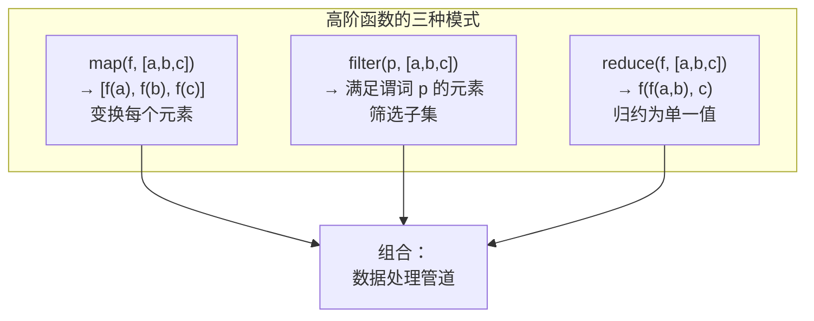
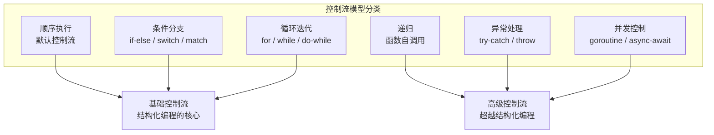
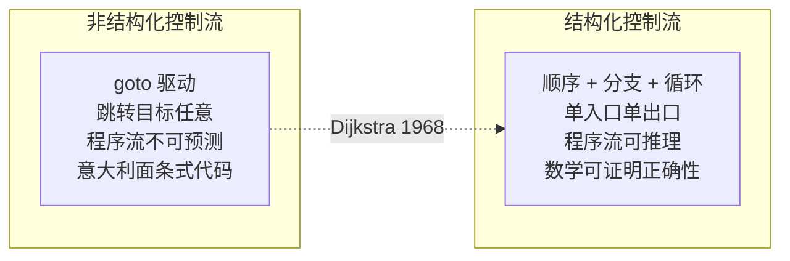
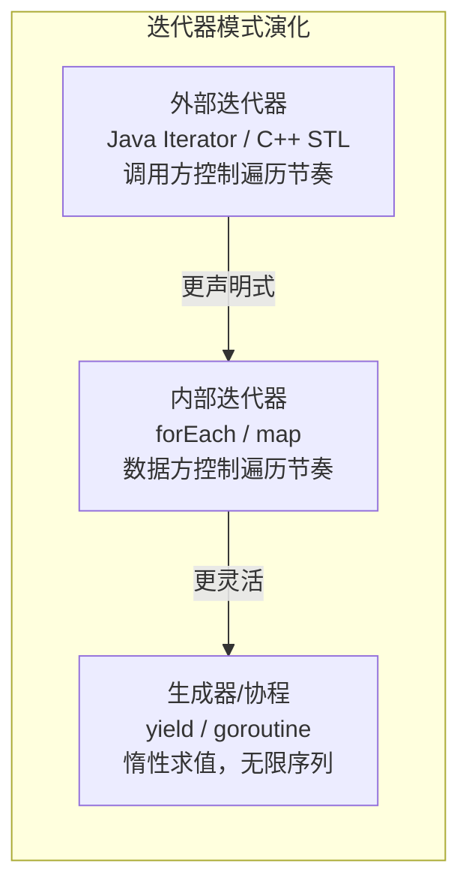
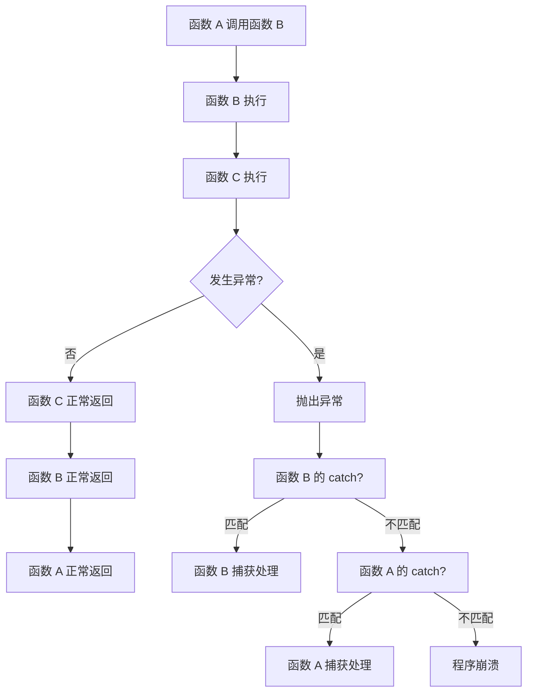
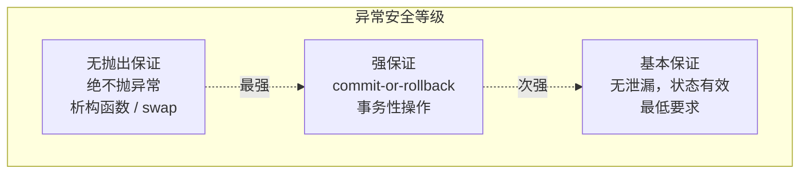
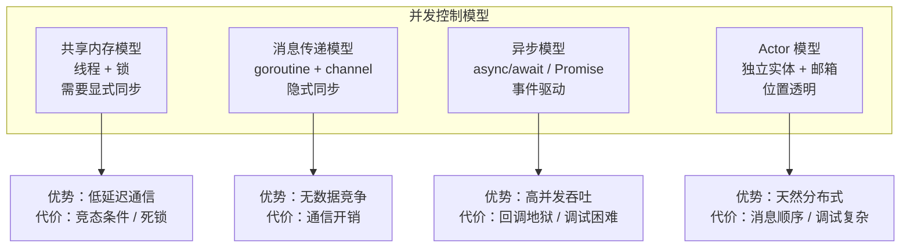

# 编程语言-功能与控制

上一篇从宏观视角审视了编程语言的生态与演进。今天，我们深入语言的内部机制，探讨两个核心命题：**程序如何表达功能（做什么）**，以及**程序如何实施控制（怎么做）**。

功能抽象决定了代码的表达力，控制流模型决定了程序的行为语义。理解这两者的本质，是掌握编程语言设计哲学的关键。

## 核心概念：功能与控制的分离

在冯·诺依曼体系结构中，CPU 指令本质上只有三类：计算、I/O、跳转。计算和 I/O 属于"功能"，跳转属于"控制"。这种最底层的分离，在高级语言中被进一步抽象和强化。



**功能与控制的理想关系**是：功能定义"做什么"，控制定义"何时做、以什么顺序做"。两者应尽量正交——改变控制流不应影响功能语义，修改功能逻辑不应破坏控制结构。

然而在实践中，两者总有耦合。好的语言设计，是让这种耦合最小化、显式化。

## 功能抽象：从指令到函数

### 抽象的层次

功能抽象的演进，是从"逐条指令"到"命名的过程"再到"可组合的抽象单元"的过程：



### 函数：功能抽象的基本单元

函数是过程式编程中最核心的抽象机制。一个函数定义了从输入到输出的映射关系，同时建立了**作用域边界**——内部变量对外不可见，外部状态通过参数显式传入。

函数抽象的关键属性：

| 属性 | 含义 | 设计意义 |
|------|------|----------|
| 参数化 | 通过参数接收输入 | 同一逻辑适配不同数据 |
| 返回值 | 通过返回值传递输出 | 功能调用的结果可组合 |
| 作用域 | 内部变量外部不可见 | 避免命名冲突，降低耦合 |
| 副作用 | 是否修改外部状态 | 纯函数可推理，有副作用需谨慎 |

### 高阶函数：函数的函数

当函数成为一等公民（first-class citizen）——可以赋值给变量、作为参数传递、作为返回值返回——就催生了高阶函数。这是函数式编程的基石，也是现代语言普遍采纳的特性。

高阶函数的三种典型模式：

1. **映射（map）**——对集合中每个元素施加同一变换
2. **过滤（filter）**——从集合中筛选满足条件的元素
3. **归约（fold/reduce）**——将集合归约为单一结果



高阶函数的威力在于**组合性**：map、filter、reduce 可以像管道一样串联，形成声明式的数据处理流程，而无需编写显式的循环和临时变量。

## 控制流模型：程序的执行语义

控制流决定程序的执行路径。从汇编的跳转指令到高级语言的结构化控制，再到异常处理和并发模型，控制流的抽象层次不断提升。

### 控制流模型的分类



### 结构化控制流 vs 非结构化控制流

1968 年，Dijkstra 发表了著名的《Go To Statement Considered Harmful》，主张用结构化的控制流（顺序、分支、循环）取代 goto 语句。其核心论点是：**结构化控制流使程序的行为可推理、可验证。**



结构化编程的数学基础是**Böhm-Jacopini 定理**：任何可计算函数都可以仅用顺序、分支、循环三种结构来表达。这意味着 goto 在理论上是不必要的——但在实践中，某些场景（如资源清理、状态机实现）中 goto 仍有其存在价值（如 C 语言中的 goto cleanup 模式、Go 语言中的 goto 和 break label）。

### 递归：控制流的函数式表达

递归是函数式语言中的主要迭代机制。从控制流角度看，递归是**用函数调用栈替代显式循环变量**的迭代方式。

递归的核心优势在于**表达力**：许多算法（树的遍历、分治策略、回溯搜索）用递归表达远比循环自然。但其代价是：

1. **栈溢出风险**——深度递归消耗调用栈空间
2. **性能开销**——函数调用的固定成本高于循环迭代

**尾调用优化（TCO）** 是解决这两个问题的关键技术：当递归调用是函数的最后一步操作时，编译器可以复用当前栈帧，将递归转化为迭代。但并非所有语言都保证 TCO——JVM 语言普遍不支持，Go 语言明确拒绝 TCO，Haskell 和 Scheme 则将其纳入语言规范。

### 迭代器模式：功能与控制的桥梁

迭代器（Iterator）是一种将遍历逻辑从数据结构中解耦的设计模式。它同时涉及功能（取下一个元素）和控制（何时停止遍历），是功能与控制正交化的典范。

现代语言中迭代器的演化：



## 异常处理：非局部控制流

异常处理是一种**非局部控制流**机制——它允许程序在异常发生点跳转到调用栈上层的处理点，跳过中间所有函数的正常返回路径。

### 异常处理的执行流



### 异常处理的两种哲学

| 维度 | 基于异常（Exception） | 基于返回值（Error Code） |
|------|----------------------|------------------------|
| 代表语言 | Java / C# / Python | Go / C / Rust |
| 优势 | 错误传播自动，正常路径代码清晰 | 错误处理显式，控制流可推理 |
| 代价 | 隐式控制流跳转，容易遗漏处理 | 冗长的 if-err 检查，正常路径被噪声干扰 |
| 本质分歧 | 优化正常路径的可读性 | 优化错误路径的可控性 |

Go 语言选择基于返回值的错误处理，并非技术能力的不足，而是**设计哲学的选择**：将错误处理视为业务逻辑的一部分，迫使开发者在每个可能出错的点做出显式决策。

Rust 的 `Result<T, E>` 类型则用类型系统弥合了两者：错误通过返回值传播（显式），但 `?` 运算符提供了类似异常的自动传播语法糖（简洁），兼顾了可控性和表达力。

### 异常安全保证

异常处理引入了一个深层问题：**当异常发生时，程序的状态是否一致？** 这就是异常安全（exception safety）保证。C++ 标准库定义了三个等级：

1. **基本保证**——异常发生后对象处于有效状态，没有资源泄漏
2. **强保证**——异常发生后操作回滚，状态与操作前一致（commit-or-rollback）
3. **无抛出保证**——操作保证不抛出异常（析构函数、swap 操作）



## 并发控制：控制流的多维扩展

并发是控制流在时间维度上的扩展——多个控制流同时推进，需要协调它们之间的交互。

### 并发模型的分类



Go 语言的并发哲学——**不要通过共享内存来通信，而要通过通信来共享内存**——正是面向连接范式在并发领域的体现。channel 作为类型安全的消息传递契约，将并发控制的复杂性从锁的粒度提升到通信的粒度。

## 设计原则与权衡

### Trade-off 1：控制流的显式性 vs 简洁性

| 选择 | 显式控制流 | 隐式控制流 |
|------|-----------|-----------|
| 代表 | Go 的 if-err / C 的错误码 | Java 的异常 / Python 的 with |
| 优势 | 行为可推理，调试友好 | 正常路径代码简洁 |
| 代价 | 样板代码多，可读性下降 | 控制流不透明，容易遗漏 |
| 适用 | 系统编程 / 关键基础设施 | 应用开发 / 快速迭代 |

### Trade-off 2：递归 vs 迭代

- **递归**：表达力强，算法描述自然，但依赖 TCO 保证性能和栈安全
- **迭代**：性能可预测，栈空间恒定，但某些算法的表达冗长
- **架构师的判断**：在保证 TCO 的语言（Haskell/Scheme）中优先递归；在不保证 TCO 的语言（Java/Go）中优先迭代；在可预测深度的场景（树操作）中适度递归

### Trade-off 3：异常 vs 错误值

这不是"谁更好"的问题，而是**错误是否属于业务逻辑**的哲学分歧：

- 当错误是业务逻辑的一部分（网络超时、文件不存在、权限不足）→ 错误值
- 当错误是程序缺陷的信号（空指针、数组越界、类型错误）→ 异常/panic
- 当错误需要跨越多层传播且中间层无需处理 → 异常更简洁

## 实践案例与反模式

### 案例：Go 语言的 defer——控制流与资源管理的融合

Go 的 `defer` 语句是控制流设计的杰作。它将资源释放逻辑紧邻资源获取逻辑，同时保证在函数返回时（无论正常还是 panic）执行：

```go
f, err := os.Open("file.txt")
if err != nil {
    return err
}
defer f.Close() // 紧邻 Open，保证 Close 必被执行
```

`defer` 的设计体现了"获取与释放成对出现"的原则，从根本上解决了 C 语言中资源泄漏的顽疾，同时避免了 C++ RAII 模式的隐式析构带来的控制流不透明问题。

### 反模式：控制流的常见误用

1. **异常用于流程控制**——将异常用于正常的业务分支（如用异常表示"未找到"），使控制流不可推理
2. **深层嵌套的条件分支**——箭头型代码（arrow code），每层 if 缩进一级，核心逻辑深埋其中。应通过提前返回（early return）扁平化
3. **全局状态 + 隐式控制流**——依赖全局变量的控制流使函数行为不可预测，破坏可测试性和可推理性
4. **忽略错误返回值**——在 Go 中丢弃 error 不处理，在 C 中忽略返回值，都是埋下隐患

## 小结

功能抽象定义了程序"做什么"，控制流模型定义了程序"怎么做"。好的语言设计让两者尽量正交，使功能逻辑的修改不波及控制结构，控制流的调整不影响功能语义。从结构化编程到异常处理，从递归到并发，控制流的抽象层次不断提升，但核心原则始终不变：**让程序的行为可推理、可预测。**

**关键要点**

1. **功能与控制应尽量正交**：函数封装功能，控制流决定执行路径，两者耦合越少，代码越可维护
2. **结构化控制流是可推理性的基础**：Dijkstra 的主张至今有效——顺序、分支、循环足以表达任何可计算函数，goto 只在极少数场景有正当性
3. **异常 vs 错误值是哲学分歧而非技术优劣**：前者优化正常路径可读性，后者优化错误路径可控性，选择取决于"错误是否属于业务逻辑"
4. **并发控制是控制流的多维扩展**：共享内存模型依赖显式同步，消息传递模型通过通信契约隐式同步，后者更契合面向连接的范式
5. **Go 的 defer 是控制流设计的典范**：将资源管理融入控制流，保证获取与释放成对出现，兼顾显式性和安全性

> 下一篇我们将深入面向对象编程，探讨封装、继承、组合的深层逻辑——参见 [08丨编程语言：面向对象]。
