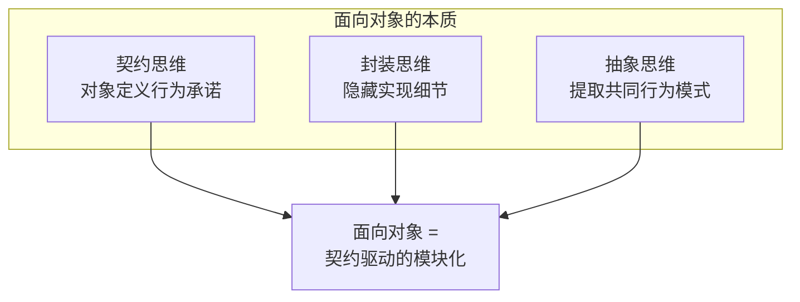
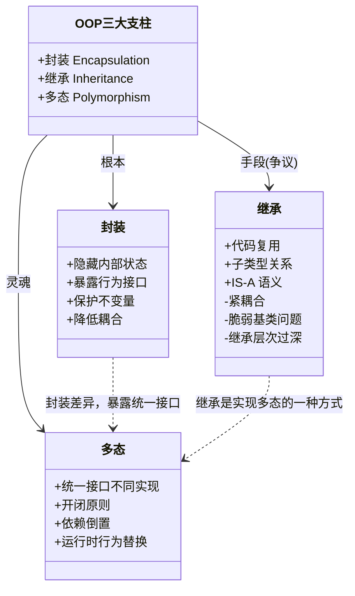
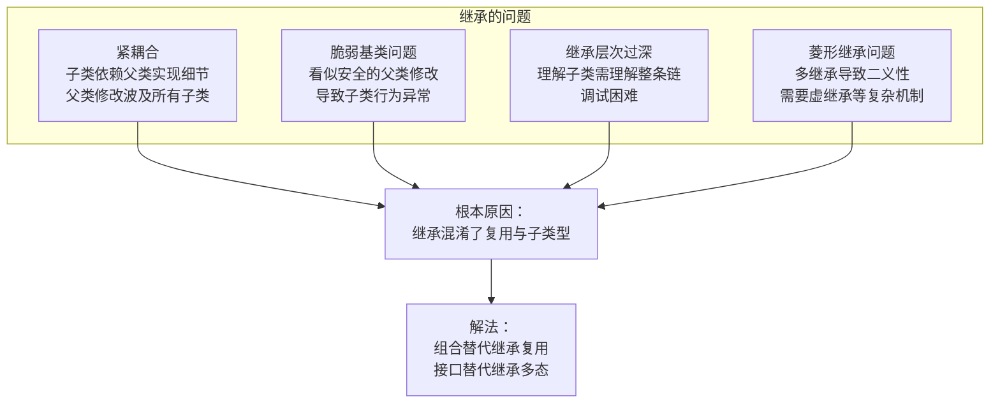
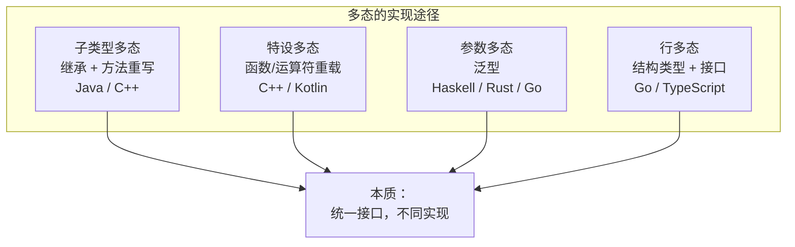
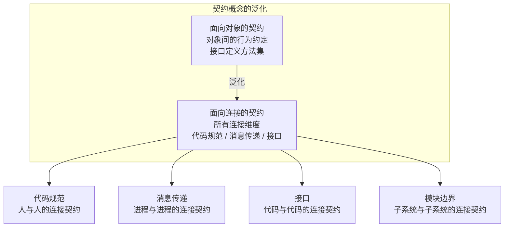
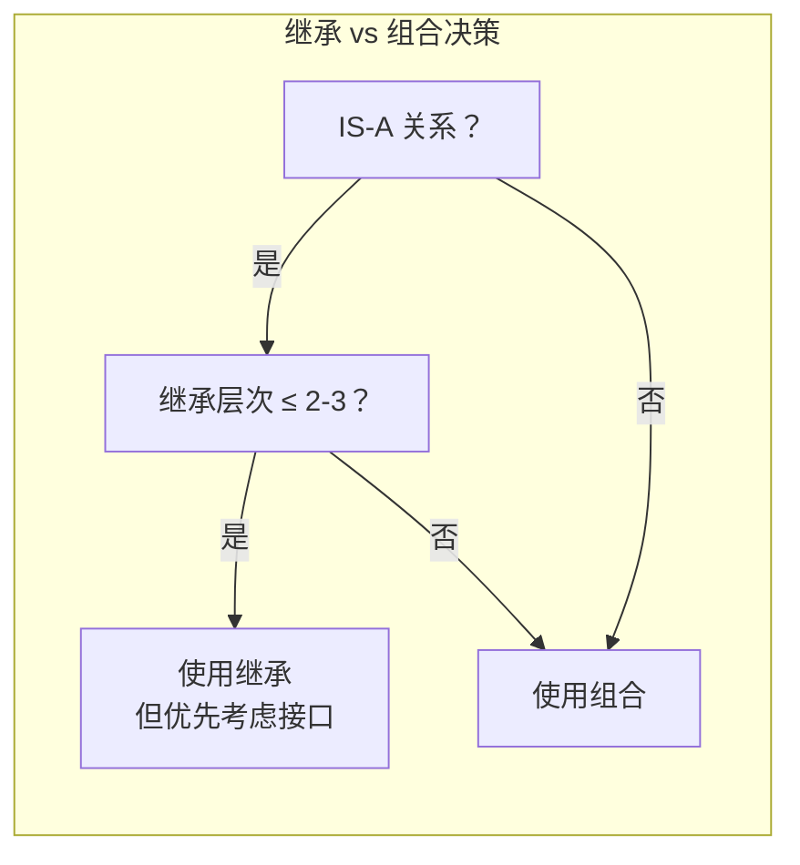
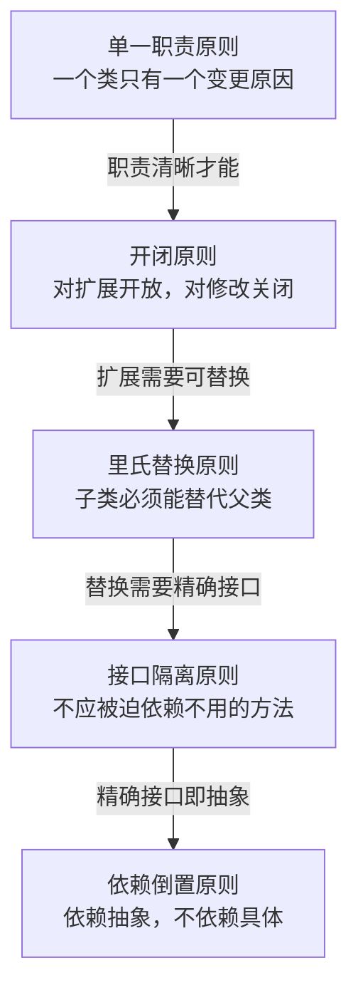

# 编程语言-面向对象

上一篇分析了功能抽象与控制流模型。今天，我们聚焦编程语言中最具影响力的范式之一——面向对象编程（OOP）。面向对象的核心思想是引入契约，基于对象的概念对代码的使用界面进行抽象和封装。但面向对象绝非铁板一块，其内部的封装、继承、多态三大支柱各有其价值与代价，需要逐一审视。

## 核心概念：面向对象的本质

面向对象并非简单的"用类写代码"，其本质是**以契约为核心的抽象与封装方法论**。对象是一种契约：它定义了对外的行为承诺（方法），同时保护内部的实现细节（状态）。



从架构视角看，面向对象回答了一个关键问题：**如何将复杂系统分解为可独立理解、可独立演化的模块？** 对象提供了一种答案——每个对象是一个自治的模块，拥有清晰的边界和明确的职责。

## 三大支柱的类图与深层分析

面向对象的三大支柱——封装、继承、多态——构成了其理论体系的基础。但三者的地位并不对等：封装是根本，多态是灵魂，继承则是争议最大的一环。



### 封装：根本

封装是面向对象的基石。它有两个维度的含义：

1. **数据封装**——将数据与操作数据的方法绑定在一起，对象的状态只能通过自身的方法修改
2. **信息隐藏**——对外仅暴露必要的接口，内部实现细节不可见

封装的价值在于**降低认知负载**：使用者只需理解接口契约，无需理解实现细节。这使得模块可以被独立理解、独立替换、独立测试。

封装的度是架构设计的关键决策。过度封装（一切 private）导致扩展困难，封装不足（一切 public）导致耦合蔓延。**最小知识原则（Law of Demeter）** 提供了一个实用的指导：一个对象应该对其他对象有最少的了解。

### 继承：争议

继承是面向对象中最具争议的特性。许式伟的观点直截了当：**继承是一个过度设计。**

继承提供了两个能力：
1. **代码复用**——子类继承父类的实现
2. **子类型多态**——子类可以替代父类使用

但这两个能力本应分离。代码复用的正确方式是**组合**（has-a），子类型多态的正确方式是**接口**（can-do）。继承将两者捆绑在一起，导致了以下问题：



Go 语言给出了最彻底的答案：**放弃继承，全面强化组合能力**。Go 没有类和继承，只有结构体和接口。结构体通过嵌入（embedding）实现组合，接口通过隐式满足实现多态——两者完全解耦。

### 多态：灵魂

多态是面向对象的灵魂。它允许**同一接口表达不同行为**，使得代码可以对扩展开放、对修改关闭（开闭原则）。

多态的实现途径：



在过程式编程中，实现多态需要借助函数指针或回调——可行但不优雅。面向对象通过接口将多态提升为语言内建的能力，这是一个重要的进步。

**接口 vs 继承实现多态的对比**：

| 维度 | 通过继承实现多态 | 通过接口实现多态 |
|------|----------------|----------------|
| 耦合度 | 高——子类依赖父类实现 | 低——只依赖接口契约 |
| 灵活性 | 单继承语言受限 | 可实现多个接口 |
| 表达力 | IS-A 语义（是什么） | CAN-DO 语义（能做什么） |
| Go 的选择 | 不支持 | 唯一方式 |

## 设计模式的分类体系

设计模式是面向对象编程的经验沉淀。GoF（Gang of Four）的 23 种设计模式，本质上都是**在特定约束下解决对象间协作问题的方案**。

```mermaid
graph TB
    subgraph GoF设计模式分类
        CREATIONAL["创建型模式<br>对象创建的抽象"]
        STRUCTURAL["结构型模式<br>对象组合的抽象"]
        BEHAVIORAL["行为型模式<br>对象交互的抽象"]
    end

    CREATIONAL --> C1["Singleton 单例"]
    CREATIONAL --> C2["Factory Method 工厂方法"]
    CREATIONAL --> C3["Abstract Factory 抽象工厂"]
    CREATIONAL --> C4["Builder 建造者"]
    CREATIONAL --> C5["Prototype 原型"]

    STRUCTURAL --> S1["Adapter 适配器"]
    STRUCTURAL --> S2["Bridge 桥接"]
    STRUCTURAL --> S3["Composite 组合"]
    STRUCTURAL --> S4["Decorator 装饰器"]
    STRUCTURAL --> S5["Facade 外观"]
    STRUCTURAL --> S6["Flyweight 享元"]
    STRUCTURAL --> S7["Proxy 代理"]

    BEHAVIORAL --> B1["Chain of Responsibility 责任链"]
    BEHAVIORAL --> B2["Command 命令"]
    BEHAVIORAL --> B3["Iterator 迭代器"]
    BEHAVIORAL --> B4["Mediator 中介者"]
    BEHAVIORAL --> B5["Observer 观察者"]
    BEHAVIORAL --> B6["Strategy 策略"]
    BEHAVIORAL --> B7["Template Method 模板方法"]

```



### 设计模式的深层解读

从更本质的角度看，设计模式的共同目标是**管理依赖关系**——让模块之间的依赖依赖于抽象（接口），而非具体实现。这正是依赖倒置原则（DIP）的核心主张。

但设计模式也存在滥用风险。每个模式都引入了额外的间接层，当间接层数量超过问题本身的复杂度时，代码反而更难理解。**"设计模式是语言缺陷的补偿"**——Peter Norvig 的观察指出了关键：在更高级的语言中，许多模式不再是模式，而是语言内建的特性。

| 设计模式 | 在高级语言中的对应 |
|----------|-------------------|
| Strategy | 高阶函数 / 函数字面量 |
| Command | 闭包 / 函数对象 |
| Observer | 事件系统 / 响应式流 |
| Iterator | 生成器 / for-of |
| Singleton | 模块系统 |
| Decorator | 函数组合 / 中间件 |
| Template Method | 高阶函数参数化 |

## 从面向对象到面向连接

面向对象将契约的重要性提升到了新高度，但契约并不只存在于对象之间。Go 语言的"面向连接"范式，将契约概念从对象间泛化到所有连接维度。



### 面向对象 vs 面向连接：关键差异

| 维度 | 面向对象 | 面向连接 |
|------|----------|----------|
| 契约范围 | 对象之间 | 所有连接维度 |
| 复用机制 | 继承 + 组合 | 纯组合 |
| 接口满足 | 显式声明（implements） | 隐式满足（duck typing） |
| 多态来源 | 继承体系 | 接口契约 |
| 并发模型 | 共享内存 + 锁 | 消息传递 |
| 设计哲学 | 万物皆对象 | 万物皆可组合 |

Go 语言之所以没有像 C++ 那样因多范式而变得复杂，是因为它**只保留了各范式的精华**：过程式的简洁、面向对象的接口契约、函数式的一等函数、面向连接的组合思想。整个语言的特性极其精简——这需要设计者有极高的品味和克制力。

## 设计原则与权衡

### Trade-off 1：继承 vs 组合

这是面向对象中最经典的权衡。**"组合优于继承"**（Composition over Inheritance）已成为业界共识，但何时仍有正当理由使用继承？

- **继承的正当场景**：当子类确实是父类的一种特化（IS-A 关系成立），且继承层次不超过 2-3 层时
- **组合的推荐场景**：几乎所有其他情况——特别是当关系是 HAS-A 或 CAN-DO 时



### Trade-off 2：接口抽象的粒度

接口粒度影响系统的灵活性：接口越小，实现者越自由，但使用者越不便；接口越大，使用者越方便，但实现者越受限。

**接口隔离原则（ISP）** 的指导是：客户端不应被迫依赖它不使用的方法。Go 的 `io.Reader` / `io.Writer` / `io.Closer` 是这一原则的典范——每个接口只有一个方法，通过组合形成 `io.ReadWriteCloser`。

### Trade-off 3：封装的度

| 封装策略 | 适用场景 | 风险 |
|----------|----------|------|
| 完全封装（全部 private） | 库的公共 API | 扩展困难 |
| 受保护封装（protected） | 框架的可扩展点 | 脆弱基类问题 |
| 最小封装（仅封装不变量） | 内部模块 | 耦合蔓延 |
| 无封装（public） | 数据传输对象（DTO） | 任何修改都可能波及使用者 |

**核心原则**：封装不变量（invariant），暴露变化点（variation point）。不变量是系统的稳定点，必须封装以防止被破坏；变化点是系统的扩展点，必须暴露以支持演化。

## 实践案例与反模式

### 案例：Go 的接口隐式满足

Go 的接口是隐式满足的——类型不需要声明 `implements Interface`，只要它实现了接口要求的所有方法，就自动满足该接口。

```go
type Writer interface {
    Write(p []byte) (n int, err error)
}

type MyBuffer struct { /* ... */ }

func (b *MyBuffer) Write(p []byte) (n int, err error) {
    return len(p), nil // 实现细节略；有了该方法，MyBuffer 即自动满足 Writer 接口
}
```

这一设计的深远意义在于**解耦了接口定义与实现**：定义接口的包不需要知道有哪些类型会实现它，实现类型的包也不需要知道有哪些接口需要满足。这正是面向连接范式中"契约泛化"的体现。

### 案例：SOLID 原则的系统化理解

SOLID 是面向对象设计的五大原则，它们之间存在内在的逻辑关系：



### 反模式：面向对象的常见误用

1. **上帝对象（God Object）**——一个类承担了过多职责，违反 SRP。解法是识别职责边界，拆分为多个协作对象
2. **过度继承**——继承层次超过 3 层，子类与父类耦合严重。解法是用组合替代继承
3. **贫血模型（Anemic Domain Model）**——对象只有数据没有行为，逻辑全部在 Service 层。这本质上是过程式编程披着面向对象的外衣
4. **接口膨胀**——一个接口包含过多方法，违反 ISP。解法是拆分为多个小接口
5. **为模式而模式**——机械地套用设计模式，引入不必要的间接层。模式是手段而非目的

## 小结

面向对象的本质是契约驱动的模块化——封装是根本，多态是灵魂，继承是争议最大的手段。Go 语言的"面向连接"范式，将契约从对象间泛化到所有连接维度，以组合取代继承，是对面向对象的进化而非否定。架构师在面对面向对象设计时，应关注契约的清晰性而非模式的完备性，关注组合的灵活性而非继承的便捷性。

**关键要点**

1. **封装是根本，多态是灵魂，继承是手段**：封装降低认知负载，多态实现开闭原则，继承的代码复用能力应被组合取代
2. **"组合优于继承"不是口号而是工程结论**：继承混淆了复用与子类型两个正交关注点，Go 的方案——组合 + 接口——是更清晰的分离
3. **接口是面向对象最重要的发明**：它将多态从实现细节提升为语言内建能力，Go 的隐式接口满足进一步解耦了定义与实现
4. **设计模式是语言缺陷的补偿**：在更高级的语言中，许多模式成为语言内建特性；架构师应关注模式背后的原则，而非模式的机械应用
5. **面向连接是面向对象的进化方向**：将契约概念从对象间泛化到所有连接维度，是 Go 语言对编程范式的重要贡献

> 下一篇我们将深入类型系统与泛型编程，探讨类型安全与抽象能力的深层关系——参见 [09丨编程语言：泛型与类型]。
