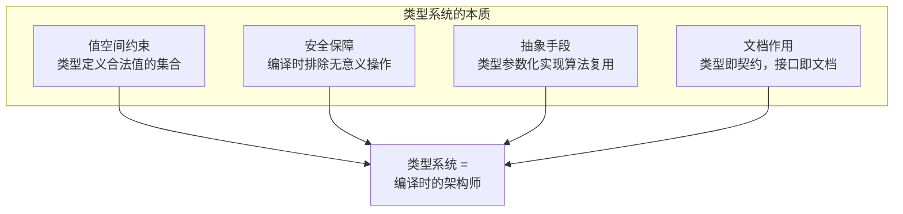
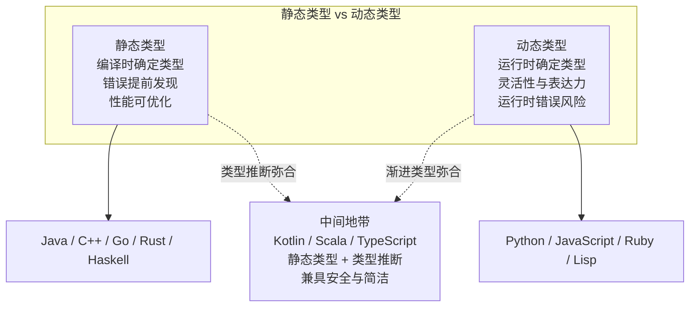
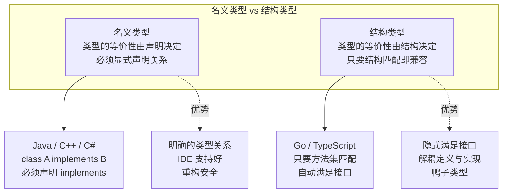
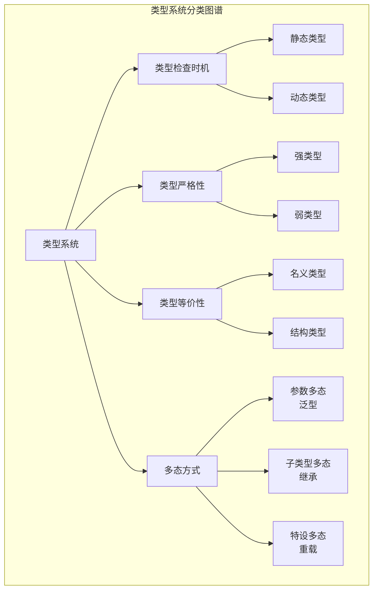
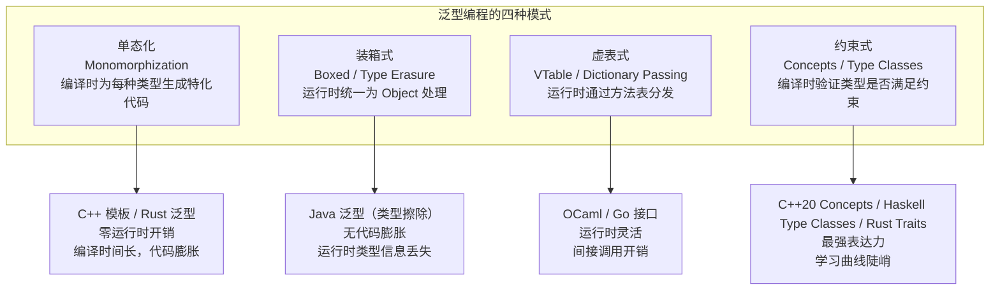
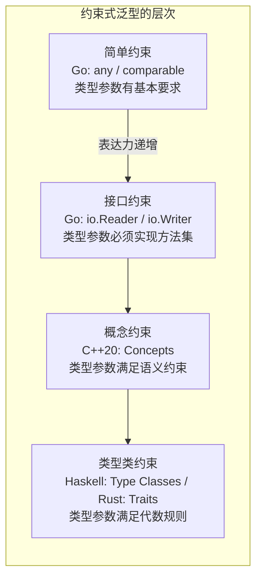
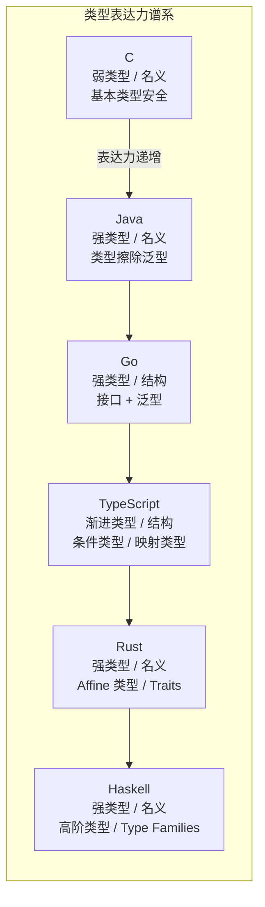
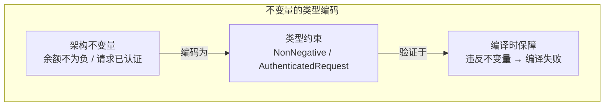
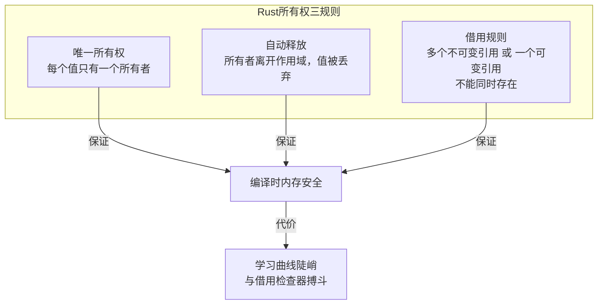

# 编程语言-泛型与类型

上一篇深入了面向对象的封装、继承与多态。今天，我们把目光投向编程语言中另一个至关重要的维度——类型系统与泛型编程。类型系统是编程语言中"最静悄悄的架构师"：它不写一行业务代码，却决定了程序的安全边界和抽象能力。

## 核心概念：类型系统的本质

类型系统的本质是**对值空间的约束**。一个类型定义了一组合法的值，以及这些值上合法的操作。类型检查的核心任务是：**在程序执行前，尽可能多地排除"无意义"的操作**——将错误从运行时提前到编译时。



从架构视角看，类型系统与架构设计有着深层的同构关系：**架构是对系统的约束，类型是对程序的约束；架构的约束保证系统层面的正确性，类型的约束保证代码层面的正确性。** 越强的类型系统，能在编译时捕获的错误越多，留给运行时的"惊喜"就越少。

## 类型系统的分类

类型系统可以从多个维度进行分类，不同维度的组合决定了语言的表达力与安全性的平衡点。

### 维度一：静态类型 vs 动态类型



静态类型与动态类型的根本分歧在于**何时发现错误**：静态类型追求"编译通过即正确"，动态类型追求"快速表达意图"。两者并非绝对对立——类型推断（type inference）使静态类型语言获得接近动态类型的简洁性，渐进类型（gradual typing）使动态类型语言获得部分静态安全保障。

### 维度二：强类型 vs 弱类型

| 维度 | 强类型 | 弱类型 |
|------|--------|--------|
| 含义 | 不允许隐式类型转换 | 允许隐式类型转换 |
| 代表 | Java / Python / Haskell | JavaScript / C / PHP |
| 优势 | 行为可预测，减少隐式错误 | 灵活，减少显式转换代码 |
| 代价 | 需要显式类型转换 | `"1" + 2 = "12"` 式的陷阱 |

强弱的本质是**对类型契约的严格程度**：强类型严格遵守契约，不允许"差不多就行"的隐式转换；弱类型追求灵活，允许编译器自行决定转换规则。

### 维度三：名义类型 vs 结构类型



Go 语言选择结构类型并非偶然——它与"面向连接"的范式一脉相承。名义类型要求类型之间显式声明关系（implements），这是一种强耦合；结构类型只要求行为匹配，类型之间无需知晓对方的存在，这正是"连接"而非"绑定"的思想。

### 完整的类型系统分类图谱



## 泛型编程：参数化多态

泛型编程（Generic Programming）的核心思想是**将类型作为参数**，使算法和数据结构不依赖于具体类型，从而实现"一次编写，多种类型复用"。

### 泛型的动机：DRY 原则的类型维度

没有泛型，语言面临两难：

1. **为每种类型重复实现**——违反 DRY 原则，维护成本随类型数量线性增长
2. **使用通用类型（如 Object/interface{}）**——丢失类型安全，运行时才能发现类型错误

泛型消除了这一两难：它允许编写类型参数化的代码，在保证类型安全的前提下实现算法复用。

### 泛型编程的四种模式



#### 模式一：单态化（Monomorphization）

单态化在编译时为每种具体类型生成一份特化的代码。C++ 模板是典型的单态化实现。

**优势**：零运行时开销——每种类型有专用的优化代码，无间接调用。
**代价**：代码膨胀（每种类型一份代码），编译时间长，错误信息难以阅读。

#### 模式二：装箱式（Type Erasure）

Java 的泛型采用类型擦除——编译时检查类型约束，运行时擦除为 Object。`List<String>` 和 `List<Integer>` 在运行时是同一个类。

**优势**：无代码膨胀，二进制兼容性好。
**代价**：运行时类型信息丢失（无法 `new T()`、无法 `instanceof List<String>`），基本类型需要装箱（`int` → `Integer`）。

#### 模式三：虚表式（Dictionary Passing）

Go 的接口和 OCaml 的多态采用虚表式——运行时通过方法表（vtable）进行分发。

**优势**：运行时灵活，支持动态分发。
**代价**：间接调用开销，编译时优化空间有限。

#### 模式四：约束式（Concepts / Type Classes）

约束式泛型通过声明类型参数必须满足的约束（能力），在编译时验证类型是否合法。这是表达力最强的泛型模式。



Haskell 的 Type Classes 和 Rust 的 Traits 是约束式泛型的典范。它们不仅约束类型"有哪些方法"，还约束类型"满足什么代数规则"——例如 `Ord` 要求类型可以全序比较，`Monoid` 要求类型有结合律的二元操作和单位元。这种约束比接口更严格，但也更强大。

### Go 1.18 泛型：务实的折中

Go 在 1.18 版本引入了泛型，其设计体现了 Go 一贯的务实哲学：

- **语法**：类型参数放在方括号中 `func Map[T any](s%20[]T,%20f%20func(T) T) []T`
- **约束**：通过接口表达类型参数的能力要求
- **实现**：采用 GC 形状模板化（gcshape stenciling）配合字典（dictionary）的混合实现，在运行时开销与代码膨胀之间折中
- **克制**：不支持特化（specialization）、不支持高级类型类（higher-kinded types）

Go 泛型的设计原则是**满足 80% 的场景，避免 20% 的复杂性**。这使得 Go 泛型在表达能力上不及 Haskell 和 Rust，但在学习曲线和代码可读性上远胜。

## 类型系统的表达力谱系

不同语言的类型系统表达力差异巨大。从弱到强排列：



表达力越强的类型系统，能在编译时证明的性质越多。Haskell 可以把"可能失败"显式建模进返回类型（如 `Either`），使失败处理成为类型签名的一部分；通过 `STM`，并发事务要么整体提交要么整体重试，避免了共享状态的不一致。Rust 的所有权系统可以在编译时证明"这段代码不会出现 use-after-free 或双重释放"。

**但表达力越强，学习曲线越陡，编译器实现越复杂，编译时间越长。** 这是类型系统设计的核心权衡。

## 类型与架构的深层关联

类型系统与软件架构有着深层同构关系，理解这种关联有助于架构师在更高的层次上思考系统设计。

### 类型即契约，接口即架构

在 [08丨编程语言：面向对象] 中，我们讨论了契约思维。类型系统是契约的形式化表达——接口定义了模块间交互的契约，类型检查器是契约的自动验证器。

**越强的类型系统，越能将架构约束编码为类型约束**，使违反架构约束的代码无法编译通过。这是"编译时架构"的思路——让编译器成为架构的守护者。

### 不变量与类型

架构设计中的不变量（invariant）——如"账户余额永远不为负"、"请求必须经过认证"——可以用类型来编码：

- 将不变量编码为类型，使得违反不变量的代码无法通过类型检查
- 用"让非法状态不可表达"（make illegal states unrepresentable）的原则指导类型设计



### 类型驱动设计

类型驱动设计（Type-Driven Development）是一种先定义类型再实现逻辑的开发方法。其核心主张是：**类型定义越精确，实现越不容易出错。**

在 Idris、Agda 等依赖类型语言中，这一理念被推向极致——类型可以表达任意精确的规约，编译器可以验证实现是否满足规约。但在任何语言中，类型驱动设计的核心思想都适用：

1. 先定义核心领域类型（领域模型）
2. 让类型之间的关系反映业务规则
3. 让类型检查器验证业务规则是否被遵守

## 设计原则与权衡

### Trade-off 1：类型安全 vs 开发效率

| 选择 | 类型安全优先 | 开发效率优先 |
|------|------------|------------|
| 代表 | Haskell / Rust | Python / JavaScript |
| 优势 | 编译时排除大量错误 | 快速原型，简洁代码 |
| 代价 | 类型定义开销，学习曲线 | 运行时错误，重构困难 |
| 适用 | 关键基础设施，金融系统 | 原型验证，数据分析 |

**架构师的判断**：在系统核心模块选择类型安全优先，在外围工具和脚本层选择开发效率优先。TypeScript 的渐进类型策略是这一权衡的优秀实践。

### Trade-off 2：泛型表达力 vs 语言简洁性

| 选择 | 高泛型表达力 | 语言简洁性 |
|------|------------|-----------|
| 代表 | Haskell / C++ / Scala | Go / C |
| 优势 | 算法极致复用，抽象层次高 | 学习成本低，代码可读性强 |
| 代价 | 编译时间长，错误信息复杂 | 某些算法需要重复实现 |
| 适用 | 库开发，框架设计 | 应用开发，团队协作 |

Go 的选择——满足 80% 场景的泛型，拒绝 20% 的高级特性——是对这一权衡的明确回答。

### Trade-off 3：编译时检查 vs 运行时灵活性

- **编译时检查**：Rust 的 Traits、Haskell 的 Type Classes——更强保障，更少灵活
- **运行时灵活性**：Go 的 interface{} / any、Python 的鸭子类型——更多灵活，更少保障
- **中间路线**：Go 的接口 + 泛型、TypeScript 的渐进类型——编译时有保障，运行时可灵活

**架构原则**：在模块边界（接口层）使用编译时检查保证契约安全，在模块内部允许运行时灵活性以提高开发效率。

## 实践案例与反模式

### 案例：Rust 的所有权类型系统

Rust 的所有权系统是类型系统设计的里程碑。它将内存安全保证从运行时（垃圾回收）提前到编译时（所有权检查），实现了"零开销抽象"——既没有 GC 的运行时开销，也没有手动管理的内存安全风险。

所有权的核心规则：

1. 每个值有且仅有一个所有者
2. 当所有者离开作用域，值被丢弃
3. 值可以被借用（引用），借用遵守借用规则



Rust 的所有权系统证明了一个重要论点：**足够强的类型系统可以将原本需要运行时保障的性质（内存安全）提前到编译时**。这是类型系统表达力的极致。

### 案例：Go 泛型的实际应用

Go 1.18 泛型最典型的应用场景是通用数据结构和工具函数：

```go
// 泛型 Map 函数
func Map[T, U any](s%20[]T,%20f%20func(T) U) []U {
    result := make([]U, len(s))
    for i, v := range s {
        result[i] = f(v)
    }
    return result
}

// 泛型 Filter 函数
func Filter[T any](s%20[]T,%20pred%20func(T) bool) []T {
    var result []T
    for _, v := range s {
        if pred(v) {
            result = append(result, v)
        }
    }
    return result
}
```

Go 泛型的价值不在于引入了什么新范式，而在于**消除了 `interface{}` 的类型不安全代码**——将运行时的类型断言错误提前到编译时的类型约束违反。

### 反模式：类型系统的常见误用

1. **类型过度抽象**——泛型嵌套过深（如 `Map[K, V] where K: Hash + Eq, V: Clone + Debug`），代码难以理解和调试。应遵循 Go 的"80% 原则"，只在确实需要类型参数化的场景使用泛型
2. **用类型系统替代业务逻辑**——将所有业务规则编码为类型约束，导致类型定义比业务逻辑更复杂。类型应编码核心不变量，而非所有业务规则
3. **反射滥用**——在静态类型语言中大量使用反射绕过类型检查，使得类型系统形同虚设。反射应仅限于框架底层（如序列化/反序列化），业务代码应避免
4. **"字符串类型"反模式**——用字符串表示本应是独立类型的值（如用 `string` 表示货币类型、电话号码），丢失了类型系统的安全保障
5. **泛型恐惧**——因 Go 1.18 之前没有泛型而形成的"泛型是不好的"心理，导致即使在 Go 1.18+ 中也拒绝使用泛型，继续用 `interface{}` 和类型断言

## 小结

类型系统是编译时的架构师——它通过值空间约束保障程序安全，通过参数化多态实现算法复用，通过约束式泛型表达类型的能力契约。从 C 的基本类型安全到 Haskell 的高阶类型，类型系统的表达力谱系覆盖了从"运行时兜底"到"编译时证明"的完整区间。架构师应理解类型系统与软件架构的同构关系，将架构不变量编码为类型约束，让编译器成为架构的守护者。

**关键要点**

1. **类型系统是编译时的架构师**：类型约束即架构约束，类型检查即架构验证——越强的类型系统，越能将架构决策编码为可自动验证的形式
2. **泛型的四种模式各有权衡**：单态化零开销但代码膨胀，类型擦除无膨胀但丢失运行时类型，虚表式灵活但有间接开销，约束式最强但最复杂
3. **Go 的结构类型契合面向连接范式**：类型等价性由结构决定而非声明决定，解耦了接口定义与实现，是契约泛化的体现
4. **"让非法状态不可表达"是类型设计的最高原则**：将不变量编码为类型约束，使违反不变量的代码无法编译通过
5. **类型表达力与语言简洁性需权衡**：Go 选择满足 80% 场景的泛型而非全功能的类型系统，是对工程实践需求的务实回答

> 本节是编程语言四讲的最后一讲。从 [06丨编程语言：生态与演进] 的宏观视角，到 [07丨编程语言：功能与控制] 的内部机制，到 [08丨编程语言：面向对象] 的契约思维，再到本节的类型系统，我们完成了对编程语言核心维度的系统梳理。
