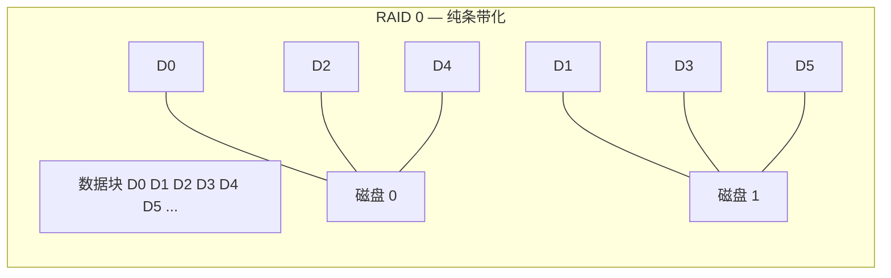
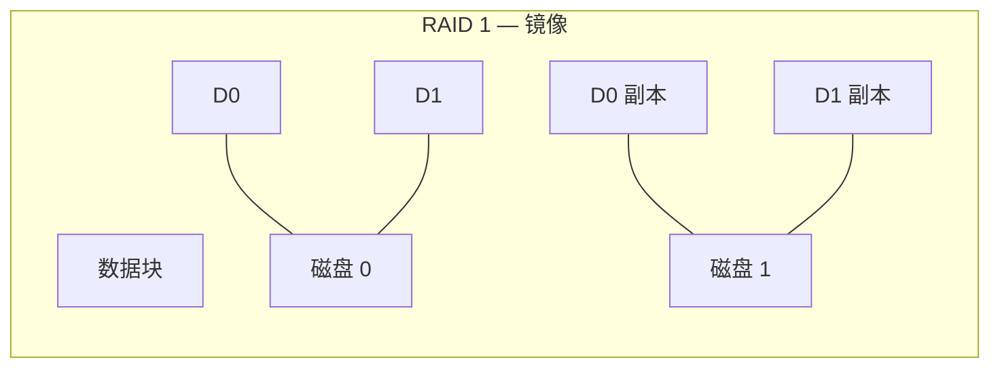
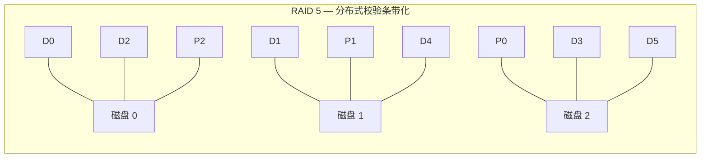
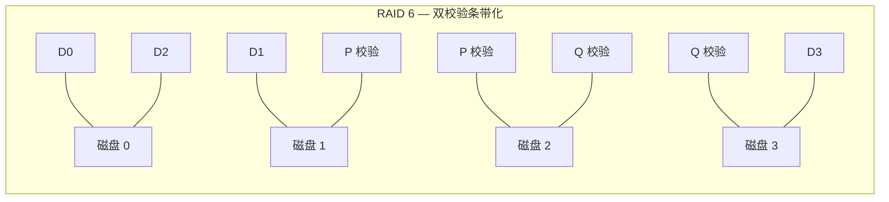
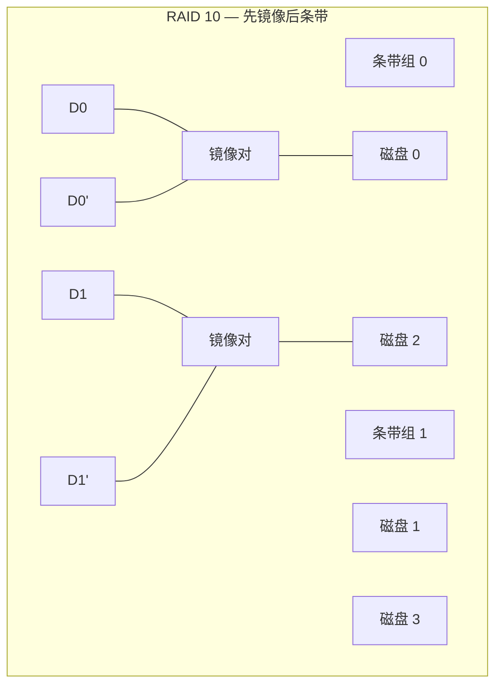
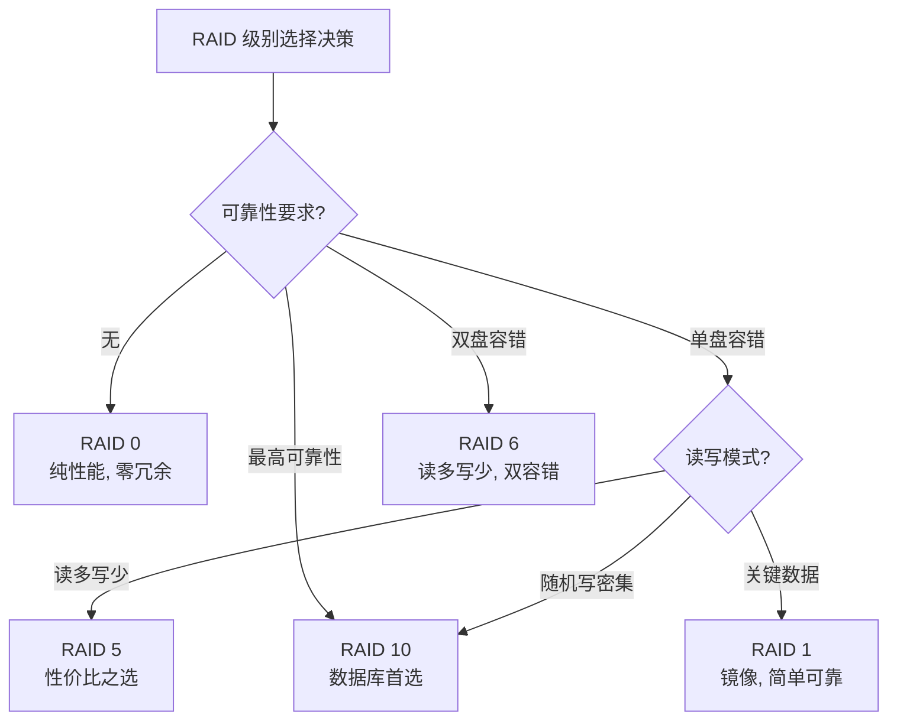
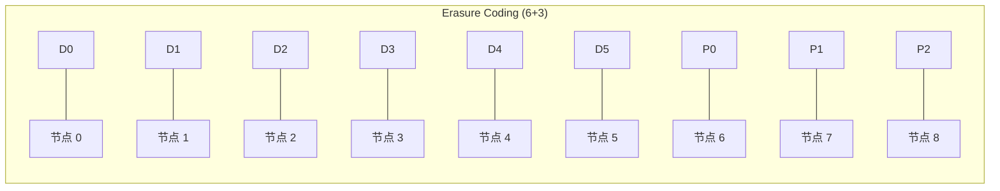

# 存储与数据库-RAID

## 导言

操作系统通过文件系统对磁盘进行了抽象，使应用程序无需关心物理扇区的读写细节。然而，单块磁盘始终面临两个根本性问题：**容量上限**与**单点故障**。一旦磁盘损坏，数据即刻丢失——这在任何生产环境中都是不可接受的。

RAID（Redundant Array of Independent Disks，独立磁盘冗余阵列）正是在这一背景下诞生的技术。它通过将多块物理磁盘组织为逻辑整体，在**性能**、**可靠性**和**成本**之间寻找平衡点，是现代存储系统的基石。无论是企业级 SAN 还是云厂商的块存储，底层无一例外都依赖 RAID 或其变体思想。

本节的核心问题是：**如何用多块廉价磁盘构建出性能更高、更可靠的存储系统？**

## 核心概念与原理

### RAID 的本质

RAID 的本质是一种**存储虚拟化**技术。它将 N 块物理磁盘抽象为一块逻辑磁盘，对上层文件系统完全透明。其核心手段有三：

1. **条带化（Striping）**：将数据分片跨磁盘分布，提升并行 I/O 能力
2. **镜像（Mirroring）**：将同一数据写入多块磁盘，实现冗余
3. **校验（Parity）**：通过异或等编码计算校验信息，以更低的存储开销实现容错

三者并非互斥，不同 RAID 级别是对这三者的不同组合与权衡。

### 核心术语

| 术语 | 含义 |
|------|------|
| Stripe | 条带，数据跨磁盘分布的最小单元 |
| Stripe Size | 条带大小，即单块磁盘上连续写入的数据量 |
| Chunk / Extent | 单块磁盘上分配的连续空间单元 |
| Rebuild | 故障磁盘更换后，从冗余信息恢复数据的过程 |
| Degraded | 降级状态，阵列中有磁盘故障但仍可工作 |
| Hot Spare | 热备盘，自动顶替故障磁盘的空闲盘 |

### RAID 级别详解

#### RAID 0：条带化



- **原理**：数据按条带轮转写入所有磁盘，无冗余
- **性能**：读写均提升 N 倍（N 为磁盘数）
- **可靠性**：任一磁盘故障即全盘数据丢失，MTTDL（平均无故障数据丢失时间）反而降低
- **空间利用率**：100%
- **适用场景**：临时数据、缓存、对可靠性无要求的场景

#### RAID 1：镜像



- **原理**：每块数据完整写入两块（或更多）磁盘
- **性能**：读性能可翻倍（可从任一副本读取），写性能无提升
- **可靠性**：允许 N-1 块磁盘故障（N 为副本数）
- **空间利用率**：50%（双副本）
- **适用场景**：操作系统盘、关键数据库日志

#### RAID 5：带校验的条带化



- **原理**：条带化 + 分布式校验，校验块轮转分布在各磁盘上
- **校验算法**：P = D0 ⊕ D1 ⊕ ... ⊕ Dn-1（异或运算），故障时通过剩余数据与校验值异或恢复
- **性能**：读性能近似 RAID 0；写性能因校验计算（读-改-写）而下降，尤其小随机写（RAID 5 Write Penalty）
- **可靠性**：允许单盘故障
- **空间利用率**：(N-1)/N
- **适用场景**：文件服务器、Web 服务器等读多写少场景

> **RAID 5 小随机写惩罚**：一次 4KB 随机写需要 2 次读（读旧数据 + 读旧校验）+ 2 次写（写新数据 + 写新校验），即 I/O 放大为 4 倍。这是 RAID 5 在 OLTP 场景下的致命缺陷。

#### RAID 6：双校验条带化



- **原理**：在 RAID 5 基础上增加第二维校验（Q），通常基于 Reed-Solomon 编码或伽罗瓦域运算
- **可靠性**：允许双盘同时故障——这在磁盘 Rebuild 周期越来越长的今天至关重要
- **空间利用率**：(N-2)/N
- **写惩罚**：小随机写 I/O 放大为 6 倍
- **适用场景**：对可靠性要求较高的企业级存储

#### RAID 10（1+0）：镜像 + 条带化



- **原理**：先做 RAID 1 镜像，再做 RAID 0 条带化
- **性能**：读性能翻倍，写性能无校验开销，整体性能最优
- **可靠性**：每个镜像对内可坏一盘，但不同镜像对不能同时坏两盘（概率上优于 RAID 5）
- **空间利用率**：50%
- **适用场景**：**数据库 OLTP 的首选**——高并发随机写无校验惩罚

### RAID 级别对比总览



| RAID 级别 | 最少磁盘 | 容错能力 | 空间利用率 | 读性能 | 写性能 | 典型场景 |
|-----------|---------|---------|-----------|--------|--------|---------|
| RAID 0 | 2 | 0 | 100% | N 倍 | N 倍 | 临时数据 |
| RAID 1 | 2 | N-1 | 50% | N 倍 | 1 倍 | 系统盘/日志 |
| RAID 5 | 3 | 1 | (N-1)/N | 近 N 倍 | 受限 | 文件服务 |
| RAID 6 | 4 | 2 | (N-2)/N | 近 N 倍 | 受限 | 归档存储 |
| RAID 10 | 4 | 每镜像对1 | 50% | N 倍 | N/2 倍 | 数据库 OLTP |

## 设计原则与权衡（Trade-off 分析）

### 三角博弈：性能、可靠性、成本

RAID 设计的核心矛盾可以用一个三角形来表示：

```mermaid
graph TD
    P["性能<br/>Performance"]
    R["可靠性<br/>Reliability"]
    C["成本<br/>Cost"]
    P --- R
    R --- C
    C --- P
    P -.|"RAID 0"| R
    R -.|"RAID 6"| C
    P -.|"RAID 10"| C
```

**不存在同时满足高性能、高可靠、低成本的 RAID 方案**。所有 RAID 级别都是在此三角形上的不同投影：

- RAID 0 极致性能与成本，但零可靠性
- RAID 6 极致可靠性，但写性能差、成本高
- RAID 10 高性能与高可靠，但成本最高

### 关键权衡维度

1. **写惩罚 vs 空间效率**：RAID 5/6 以写性能换取空间效率；RAID 10 以空间效率换取写性能。在 SSD 时代，写惩罚的影响进一步放大——SSD 寿命由写入量决定，RAID 5/6 的小写放大直接缩短 SSD 寿命。

2. **Rebuild 时间 vs 数据安全窗口**：磁盘容量增长远快于带宽增长。一块 20TB 磁盘的 Rebuild 可能需要数十小时，在此期间阵列处于降级状态。RAID 5 在 Rebuild 期间遇到不可恢复读错误（URE）将导致数据丢失。这是大容量磁盘时代 RAID 5 逐渐被淘汰的根本原因。

3. **一致性 vs 性能**：RAID 写入顺序关乎一致性。非易失性缓存（BBU/NVCache）是解决"写空洞"问题的关键——它确保断电后校验与数据的一致性。

4. **硬件 RAID vs 软件 RAID**：
   - 硬件 RAID：专用控制器、BBU 缓存、Offload 校验计算，但供应商锁定、单控制器故障
   - 软件 RAID（mdadm/ZFS）：无硬件依赖、灵活、可跨节点，但消耗 CPU 资源

## 实践案例与反模式

### 案例 1：大型互联网公司的存储演进

以某大型互联网公司为例，其存储架构经历了以下演进：

```text
阶段1: 硬件 RAID 控制器 + RAID 10 → 成本极高
阶段2: 软件 RAID + JBOD + 副本冗余 → 成本下降，灵活度提升
阶段3: 分布式存储（类 RAID 思想的软件定义）→ Erasure Coding + 多副本
```

这体现了从硬件 RAID 到**软件定义存储**的趋势。现代分布式存储系统（如 Ceph、Google Colossus）本质上是对 RAID 思想的分布式化——将校验、条带化、冗余从单机提升到集群维度。

### 案例 2：Erasure Coding — RAID 6 的分布式延伸

纠删码（Erasure Coding）可以视为 RAID 6 的泛化：将数据分为 K 个数据块，计算 M 个校验块，任意 K 个块即可恢复数据。这使得空间利用率可达 K/(K+M)，远超传统三副本的 33%。



冷数据存储中，Erasure Coding 已成为标配（可参考[38丨文件系统与对象存储]中对象存储的 EC 策略）。

### 反模式：RAID 5 在大容量磁盘上的使用

在 10TB+ 磁盘上使用 RAID 5 是一个典型反模式：

- **Rebuild 时间过长**：20TB 磁盘 Rebuild 可超过 24 小时
- **URE 风险**：SATA 磁盘的 URE 率约 10^(-14)，20TB（约 1.6×10^14 bit）全盘读取遇到至少一次 URE 的概率接近 80%
- **后果**：Rebuild 过程中遇到 URE，RAID 5 阵列直接失效

**正确做法**：大容量磁盘场景应使用 RAID 6（双校验）或 RAID 10，或转向分布式 Erasure Coding。

### 反模式：忽略 Write Barrier 与一致性

部分运维人员为追求性能关闭 RAID 控制器的 Write Cache 策略，导致文件系统元数据与 RAID 校验不一致。断电后可能出现文件系统损坏——这在数据库场景下尤为致命。

**正确做法**：确保 RAID 控制器配备 BBU（电池备份单元）或 NVCache，使 Write Cache 在掉电后数据不丢失，兼顾性能与一致性。

## 小结与关键要点

1. **RAID 是存储虚拟化的基石**：通过条带化、镜像、校验三种基本手段组合，在性能、可靠性、成本之间寻求平衡
2. **没有银弹**：不同 RAID 级别是不同权衡的结果——RAID 0 重性能、RAID 1 重简单可靠、RAID 5/6 重空间效率、RAID 10 重综合性能
3. **RAID 5 在大容量磁盘时代已不适用**：Rebuild 时间和 URE 风险使其可靠性无法满足要求
4. **写惩罚是核心性能瓶颈**：RAID 5/6 的小随机写 I/O 放大是数据库选型的决定性因素
5. **RAID 思想的延伸**：从单机 RAID 到分布式 Erasure Coding，核心思想一脉相承。现代存储系统是 RAID 思想在更大尺度上的重演（参见[37丨键值存储与数据库]和[38丨文件系统与对象存储]）
6. **软件定义存储趋势**：硬件 RAID 正在让位于软件定义的分布式冗余方案，但 RAID 的核心权衡逻辑不会改变

> **延伸阅读**：下一节[15丨存储与数据库：B+树]将从存储介质的管理转向存储数据的组织结构，讨论 B+ 树如何为数据库提供高效的索引查询能力。
