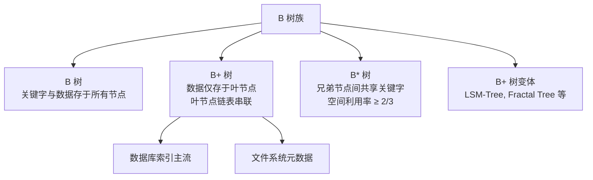
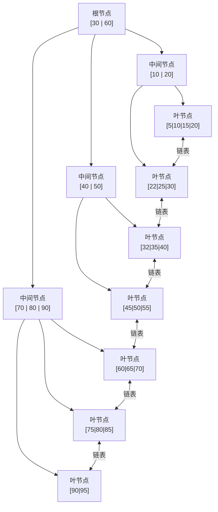
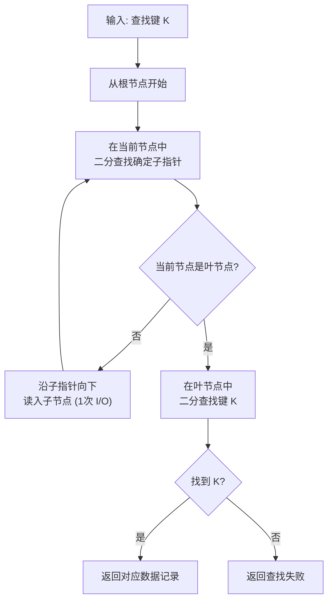
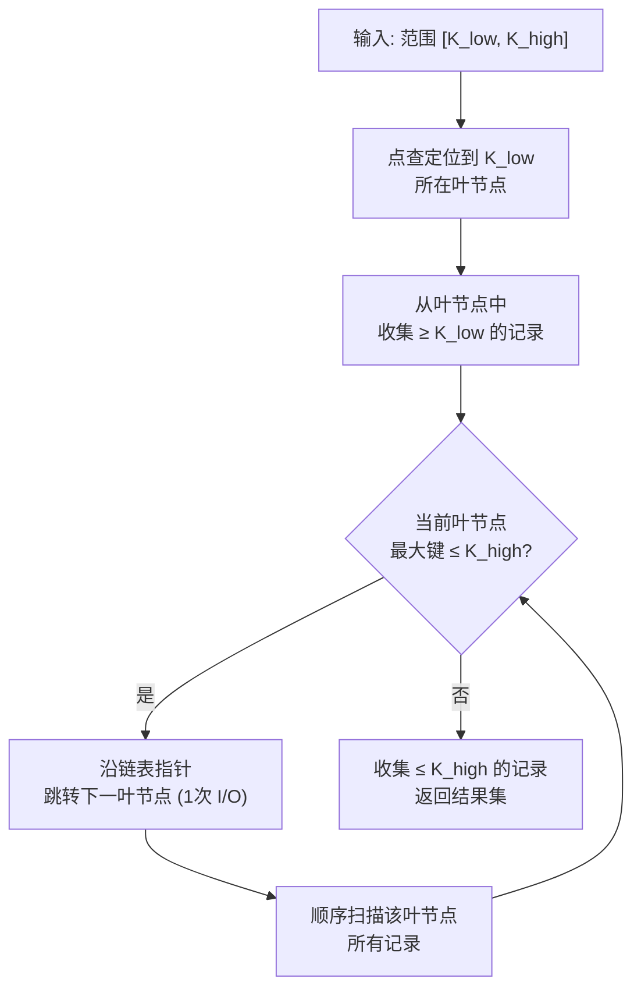
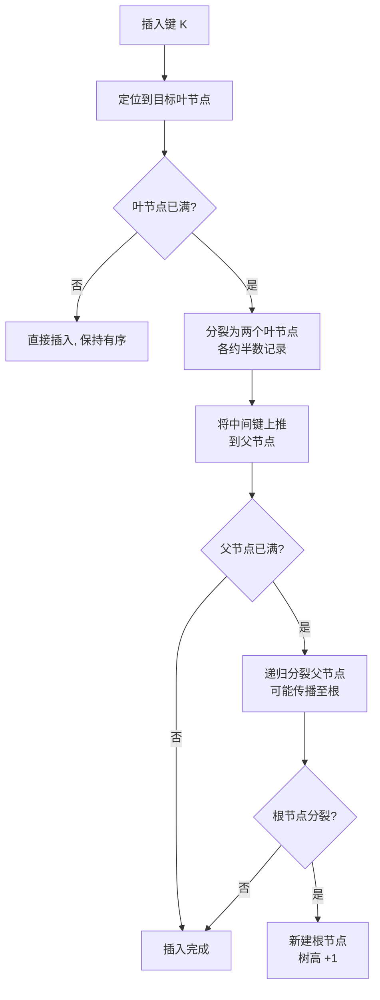
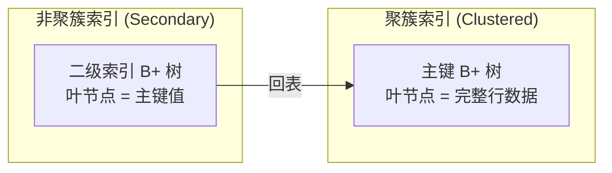
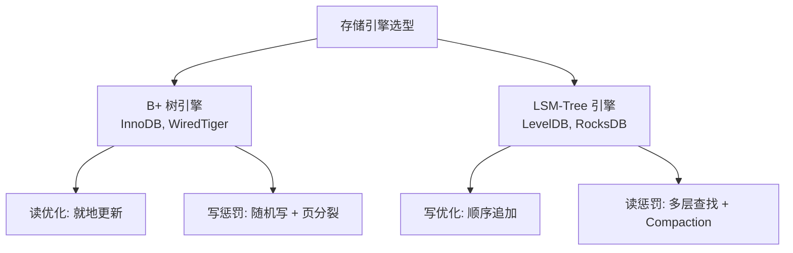

# 存储与数据库-B+树

## 导言

文件系统的元数据通常基于 B 树或 B+ 树组织；而在[14丨存储与数据库：RAID]中，我们讨论了磁盘阵列如何提供可靠的物理存储基础。然而，有了可靠的磁盘只是第一步——**如何在外存上高效地组织和检索数据**，才是存储系统真正的核心难题。

内存数据结构（哈希表、红黑树、跳表等）的访问以纳秒计，而磁盘访问以毫秒计，两者相差约 **10^6 倍**。这意味着一个设计精良的内存算法在磁盘上可能完全不可用。B+ 树正是为外存而生的数据结构：它通过**降低树高**和**顺序化访问**，将磁盘 I/O 次数从 O(N) 压缩到 O(log_f N)（f 为扇出），是关系型数据库和文件系统的索引基石。

本节的核心问题是：**为什么 B+ 树是外存数据结构的最优选择？它与内存数据结构有何本质区别？**

## 核心概念与原理

### 外存 vs 内存：访问模型的根本差异

理解 B+ 树之前，必须先理解外存与内存访问模型的根本差异：

| 维度 | 内存 | 磁盘（HDD） | 磁盘（SSD） |
|------|------|-------------|-------------|
| 访问单位 | 字节（Byte） | 扇区（512B/4KB） | 页（4KB~16KB） |
| 随机读延迟 | ~100ns | ~10ms | ~100μs |
| 顺序读吞吐 | ~10GB/s | ~200MB/s | ~3GB/s |
| 随机/顺序比 | ~1:1 | ~1:1000 | ~1:10 |
| 访问模式 | 任意地址 O(1) | 必须整页读入 | 必须整页读入 |

核心洞察：**磁盘以"页"为最小访问单位，且顺序访问远快于随机访问**。因此，外存数据结构的设计目标是：

1. **最小化 I/O 次数**：每次访问一个节点应尽量装载更多数据
2. **最大化顺序访问**：范围查询应能顺序扫描而非随机跳转

### B 树族谱

### B+ 树的定义

一棵 m 阶 B+ 树满足以下性质：

1. 每个非叶节点最多有 m 个子节点，最少有 ⌈m/2⌉ 个子节点（根节点至少 2 个）
2. 非叶节点存储 ⌈m/2⌉-1 到 m-1 个关键字，作为子树的划分界标
3. **所有数据记录仅存储在叶节点**，非叶节点仅存储索引（关键字 + 子指针）
4. **叶节点形成有序双向链表**，支持范围查询的顺序扫描
5. 所有叶节点位于同一层——B+ 树是**平衡的**

### B+ 树结构详解

**关键参数计算**（以 MySQL InnoDB 为例）：

- 非叶节点大小：16KB
- 主键索引项大小：8B（主键）+ 6B（页指针）= 14B
- 非叶节点扇出 f ≈ 16KB / 14B ≈ **1170**
- 叶节点记录数：约 16KB / 1KB ≈ **15~16 条**（假设单行 1KB）

**树高与记录数的关系**：

| 树高 | 最大记录数 | I/O 次数 |
|------|-----------|---------|
| 2 | 1170 × 16 ≈ 18,720 | 2 |
| 3 | 1170 × 1170 × 16 ≈ 21,902,400 | 3 |
| 4 | 1170^3 × 16 ≈ 25.6 亿 | 4 |

这意味着：**一张 2000 万行的表，通过主键索引查找仅需 3 次磁盘 I/O**。这就是 B+ 树的威力。

### B+ 树的核心操作

#### 点查询流程

#### 范围查询流程

范围查询的关键优势：**一旦定位到起始叶节点，后续访问沿链表顺序进行，每次 I/O 读取整个叶节点页，最大化了页内数据的利用率**。

#### 插入与分裂

插入操作可能触发节点分裂：

#### 删除与合并

删除操作可能触发节点合并或 redistribute（重分布），是插入的逆过程。实践中为避免频繁合并，许多实现采用**延迟合并**策略——节点低于半满时不立即合并，仅标记为 underflow，在后续操作中再处理。

### B+ 树 vs B 树 vs 其他结构

| 维度 | B+ 树 | B 树 | 哈希表 | LSM-Tree |
|------|-------|------|--------|----------|
| 点查询 | O(log_f N) | O(log_f N) | O(1) | O(1)~O(log N) |
| 范围查询 | O(log_f N + K) | O(log_f N + K) | 不支持 | O(K) |
| 插入 | O(log_f N) | O(log_f N) | O(1) | O(1) |
| 空间利用率 | ≥ 50% | ≥ 50% | 不定 | 写放大 |
| 顺序访问 | 优秀（链表） | 较差（需中序遍历） | 不支持 | 需 Compaction |
| 数据位置 | 仅叶节点 | 所有节点 | — | 多层组件 |

**B+ 树相对 B 树的优势**：

1. **非叶节点不存数据** → 扇出更大 → 树更矮 → I/O 更少
2. **叶节点链表** → 范围查询无需中序遍历 → 顺序 I/O
3. **查询路径稳定** → 所有查询都走到叶节点 → 缓存友好

## 设计原则与权衡（Trade-off 分析）

### 阶数（m）的选择

阶数 m 的选择直接影响扇出和树高：

- **m 过大**：节点过大，单次 I/O 读取时间长，节点内二分查找开销增加
- **m 过小**：树高增加，I/O 次数增加

**最优选择**：令节点大小等于磁盘/SSD 的**页大小**（或其整数倍），使一次 I/O 恰好读入一个节点。这也是 InnoDB 默认页大小为 16KB 的依据。

### 聚簇索引 vs 非聚簇索引

- **聚簇索引**：数据按主键物理排列，主键查询无需回表。但二级索引需先查到主键，再回表查聚簇索引——两次 B+ 树查找
- **非聚簇索引**：索引与数据分离，所有索引查找都需回表，但一张表可有多个聚簇索引的替代方案

**权衡**：聚簇索引对主键范围查询最优，但插入顺序若非主键序将导致频繁页分裂。InnoDB 的自增主键策略正是为了避免这一问题。

### 填充因子（Fill Factor）

填充因子控制叶节点预留空闲空间的比例：

- **高填充因子（如 100%）**：空间利用率高，但插入易触发分裂
- **低填充因子（如 70%）**：预留空间吸收插入，减少分裂，但空间浪费

**权衡**：读密集场景用高填充因子；写密集场景用低填充因子。InnoDB 默认填充因子约 15/16（即 6.25% 空闲），兼顾两者。

### B+ 树 vs LSM-Tree：现代存储引擎的核心抉择

| 维度 | B+ 树 | LSM-Tree |
|------|-------|----------|
| 写模式 | 就地更新（Read-Modify-Write） | 追加写入（Append-Only） |
| 写性能 | 随机写，受页分裂影响 | 顺序写，极高吞吐 |
| 读性能 | O(log_f N)，稳定 | 需查多层 + 布隆过滤器，不稳定 |
| 空间放大 | 页分裂碎片 | 过期版本 + 层级冗余 |
| 写放大 | 页分裂（1~2 次 I/O） | Compaction（多次重写） |
| 适用场景 | 读多写少（OLTP） | 写多读少（时序、日志） |

许式伟在[37丨键值存储与数据库]中强调"存储即数据结构"——B+ 树和 LSM-Tree 的选择，本质上是对**读优化 vs 写优化**这一根本权衡的回应。

## 实践案例与反模式

### 案例 1：MySQL InnoDB 的 B+ 树实现

InnoDB 是 B+ 树在工业界的标杆实现，其关键设计：

1. **聚簇索引**：主键索引的叶节点存储完整行数据，数据物理上按主键有序排列
2. **自适应哈希索引（AHI）**：对热点叶节点自动构建内存哈希索引，将 B+ 树的 O(log N) 降为 O(1)
3. **Change Buffer**：对非唯一二级索引的 DML 操作缓存在内存中，合并（Merge）到 B+ 树时利用顺序 I/O
4. **预读（Read-Ahead）**：范围查询时预读相邻叶节点页，将随机 I/O 转化为顺序 I/O

### 案例 2：文件系统中的 B+ 树

现代文件系统（如 Btrfs、ReiserFS、NTFS）广泛使用 B+ 树管理元数据：

- **目录项索引**：将目录下的文件名组织为 B+ 树，避免线性扫描
- **extent 分配**：用 B+ 树记录文件的数据块映射（extent tree），替代传统间接块
- **空间管理**：用 B+ 树跟踪空闲空间，加速分配与回收

大部分现代文件系统基于 B 树或 B+ 树组织元数据，这一设计思路一脉相承。

### 反模式 1：用 UUID 做聚簇索引主键

UUID 作为主键导致：

1. **插入随机**：每条记录插入位置随机，B+ 树频繁页分裂
2. **页分裂开销**：分裂导致页内数据搬迁，写放大严重
3. **缓存失效**：随机插入使叶节点缓存命中率极低

**正确做法**：使用自增整数作为主键，确保插入始终在 B+ 树最右端，避免页分裂。UUID 可作为业务唯一标识存储为普通列。

### 反模式 2：忽视索引选择性

在低选择性列（如性别、状态枚举）上建索引：

- B+ 树返回大量记录，回表开销远超全表扫描
- 优化器可能放弃使用该索引

**正确做法**：索引应建在高选择性列上（选择性 = 不同值数 / 总行数，应接近 1）。低选择性列适合与高选择性列组合为复合索引。

### 反模式 3：过度索引

每增加一个二级索引：

- 插入/更新/删除需维护所有索引 B+ 树
- 索引占用额外磁盘空间和内存（Buffer Pool）
- 索引维护可能导致锁竞争

**正确做法**：根据实际查询模式建立索引，定期审计并删除未使用索引。

## 小结与关键要点

1. **B+ 树是为外存而生的数据结构**：其设计围绕"最小化 I/O 次数"和"最大化顺序访问"两个核心目标
2. **扇出决定树高，树高决定 I/O 次数**：百万级数据 3 次 I/O，十亿级数据 4 次 I/O——这是 B+ 树性能的根本保证
3. **叶节点链表是范围查询的关键**：将中序遍历的随机 I/O 转化为链表扫描的顺序 I/O
4. **B+ 树 vs B 树的核心区别**：非叶节点不存数据（更大扇出）+ 叶节点链表（顺序扫描）
5. **聚簇索引是 InnoDB 的核心设计**：数据即索引，主键查询零回表，但插入顺序至关重要
6. **B+ 树适合读多写少，LSM-Tree 适合写多读少**：两者是现代存储引擎的两大范式，选择取决于读写比（参见[37丨键值存储与数据库]中"存储即数据结构"的论述）
7. **主键设计直接影响 B+ 树性能**：自增主键避免页分裂，UUID 主键导致随机插入和页分裂

> **延伸阅读**：下一节[16丨存储与数据库：SQL]将从索引结构上升到查询语言层面，讨论 SQL 如何基于关系模型对 B+ 树索引进行声明式查询，以及查询优化器如何选择最优的索引访问路径。
