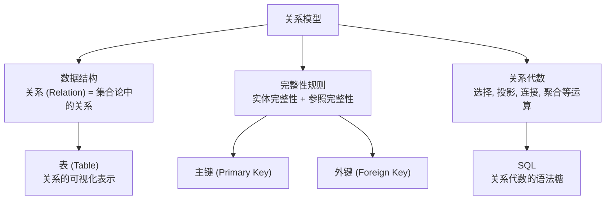
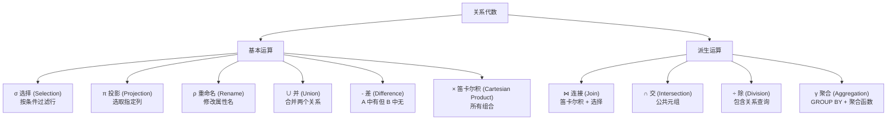
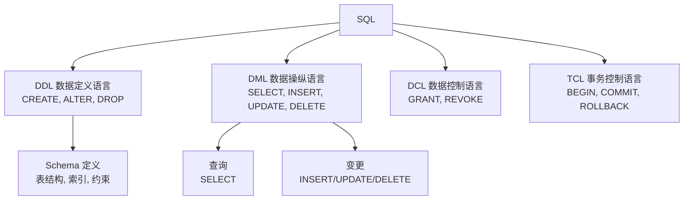
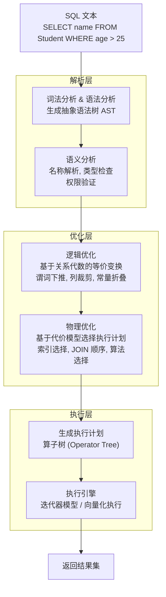
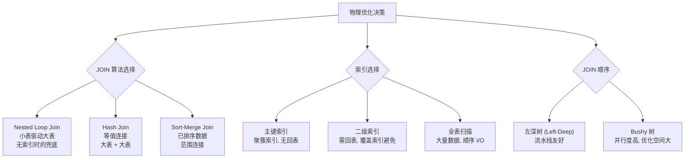
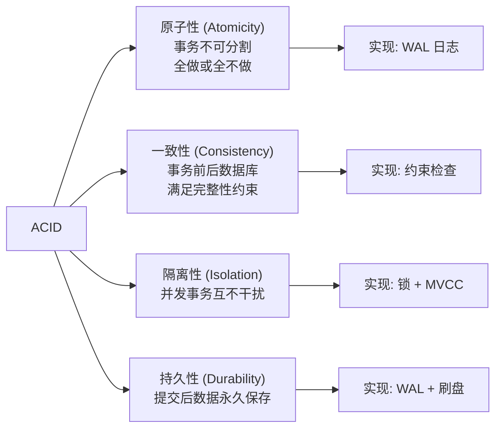
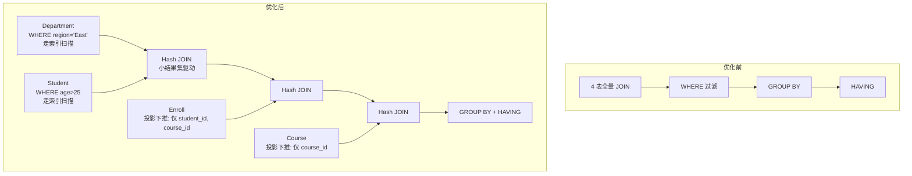

# 存储与数据库-SQL

## 导言

在[15丨存储与数据库：B+树]中，我们讨论了 B+ 树如何为外存数据提供高效的索引结构。然而，B+ 树只是一个物理层的"查找引擎"——它解决的是"怎么找"的问题，而非"找什么"和"找的关系是什么"。

SQL（Structured Query Language）是关系型数据库的查询语言，它建立在**关系模型**这一数学基础之上，将数据的**逻辑组织**与**物理存储**彻底分离。用户只需声明"我要什么"（What），数据库负责决定"怎么给"（How）——这正是声明式编程的核心思想，也是关系型数据库历经半个世纪仍然不可替代的根本原因。

本节的核心问题是：**SQL 为什么能成为数据查询的通用语言？关系模型提供了怎样的数学基础？查询优化器如何将声明式 SQL 转化为高效的执行计划？**

## 核心概念与原理

### 关系模型：SQL 的数学基础

关系模型由 E.F. Codd 于 1970 年提出，其核心由三部分组成：



**关系模型的核心概念**：

| 概念 | 数学定义 | SQL 对应 |
|------|---------|---------|
| 关系 (Relation) | 笛卡尔积的子集 | 表 (Table) |
| 元组 (Tuple) | 关系中的元素 | 行 (Row) |
| 属性 (Attribute) | 元组的分量 | 列 (Column) |
| 域 (Domain) | 属性的取值集合 | 数据类型 |
| 候选键 (Candidate Key) | 最小唯一标识属性集 | UNIQUE + NOT NULL |
| 主键 (Primary Key) | 选定的候选键 | PRIMARY KEY |
| 外键 (Foreign Key) | 引用其他关系的属性 | FOREIGN KEY |

**关键性质**：

1. **关系的元组无序**：行没有固有的物理顺序（尽管实现中有物理排列）
2. **属性无序**：列没有固有的左右顺序
3. **属性值原子性**：每个单元格不可再分（第一范式 1NF）
4. **集合语义**：关系是集合，无重复元组（SQL 实际使用包/Multiset 语义）

### 关系代数：SQL 的运算基础

关系代数是 SQL 背后的形式化运算体系，其基本运算如下：



**SQL 与关系代数的映射**：

| 关系代数 | SQL |
|---------|-----|
| σ_{age>25}(Student) | `SELECT * FROM Student WHERE age > 25` |
| π_{name,age}(Student) | `SELECT name, age FROM Student` |
| Student ⋈_{Student.id=Enroll.sid} Enroll | `SELECT * FROM Student JOIN Enroll ON Student.id = Enroll.sid` |
| γ_{dept, AVG(salary)}(Employee) | `SELECT dept, AVG(salary) FROM Employee GROUP BY dept` |

关系代数的意义在于：**SQL 语句可以被等价转换为不同的关系代数表达式，而查询优化器正是基于这种等价变换寻找最优执行计划**。

### SQL 的层次结构

SQL 并非单一语言，而是由多个子语言组成：



### SQL 执行全流程

一条 SQL 语句从提交到返回结果，经过以下完整流程：



### 查询优化器详解

查询优化器是数据库最核心、最复杂的组件。它将声明式的 SQL 转化为命令式的执行计划。

#### 逻辑优化：基于规则的等价变换

逻辑优化不依赖数据分布，仅基于关系代数的等价规则：

1. **谓词下推（Predicate Pushdown）**：尽早过滤，减少上游数据量
```text
   σ_{age>25}(Student ⋈ Enroll) ≡ (σ_{age>25}(Student)) ⋈ Enroll
   ```

2. **投影下推（Projection Pushdown）**：尽早裁剪列，减少数据传输
```text
   π_{name}(σ_{age>25}(Student)) ≡ π_{name}(σ_{age>25}(π_{name,age}(Student)))
   ```

3. **连接重排序（Join Reordering）**：根据连接条件和基数估计，选择最优 JOIN 顺序

4. **子查询展开（Subquery Unnesting）**：将相关子查询转化为 JOIN 或半连接

#### 物理优化：基于代价的执行计划选择

物理优化依赖统计信息（行数、直方图、唯一值数等）和代价模型：



**代价模型**：Cost = I/O Cost + CPU Cost，其中 I/O Cost 通常是主导因素。优化器估算每种执行计划的代价，选择代价最小的方案。

### 事务与 ACID

SQL 的事务模型（TCL）保证了数据的一致性：



**隔离级别与并发问题**：

| 隔离级别 | 脏读 | 不可重复读 | 幻读 | 实现方式 |
|---------|------|-----------|------|---------|
| READ UNCOMMITTED | 可能 | 可能 | 可能 | 无锁 |
| READ COMMITTED | 不可能 | 可能 | 可能 | 行级锁 / MVCC |
| REPEATABLE READ | 不可能 | 不可能 | 可能 | 间隙锁 / MVCC |
| SERIALIZABLE | 不可能 | 不可能 | 不可能 | 全范围锁 / 串行化 |

InnoDB 默认 REPEATABLE READ，通过 MVCC + Next-Key Lock 在大多数场景下避免幻读。

## 设计原则与权衡（Trade-off 分析）

### 声明式 vs 命令式

SQL 是声明式语言的典范：

| 维度 | 声明式 (SQL) | 命令式 (代码) |
|------|-------------|-------------|
| 描述 | 描述"要什么" | 描述"怎么做" |
| 优化 | 优化器自动选择执行路径 | 开发者手动优化 |
| 可移植 | 不同数据库可优化为不同执行计划 | 逻辑硬编码 |
| 表达力 | 关系代数范围内表达力强 | 无限制 |
| 适用范围 | 结构化数据查询 | 任意计算 |

**核心洞察**：声明式语言将**优化权交给数据库**，使其能根据数据分布、索引状态、硬件特性做出最优决策。这是 SQL 经久不衰的根本原因——同样的 SQL，在数据量增长后可能自动切换执行计划。

### 规范化 vs 反规范化

关系模型追求规范化（Normalization），消除数据冗余和更新异常：


| 范式 | 核心约束 | 消除的异常 |
|------|---------|-----------|
| 1NF | 属性不可再分 | 重复组 |
| 2NF | 非主属性完全依赖于候选键 | 部分依赖 → 插入/删除异常 |
| 3NF | 非主属性不传递依赖于候选键 | 传递依赖 → 更新异常 |
| BCNF | 每个决定因素都是候选键 | 更严格的依赖约束 |

**但实践中往往需要反规范化**：

- 高范式意味着多表 JOIN，查询性能下降
- 读密集场景中，适当冗余减少 JOIN 次数
- 数据仓库中，星型模型/雪花模型本质上是反规范化的

**权衡**：OLTP 追求规范化（写优化，避免更新异常）；OLAP 追求反规范化（读优化，减少 JOIN）。

### 查询优化的代价

查询优化本身是有代价的：

- **优化时间**：对复杂查询（多表 JOIN），搜索空间指数级增长，优化时间可能超过执行时间
- **统计信息维护**：ANALYZE 需要采样计算，数据变更后统计信息可能过时
- **计划缓存**：参数化查询的计划可能非最优（Parameter Sniffing 问题）

**权衡**：数据库通常在优化时间和执行时间之间取折中——不完全搜索所有计划，而使用启发式剪枝。

### SQL 的局限性

SQL 并非万能：

1. **递归查询受限**：WITH RECURSIVE 支持有限递归，但不如图数据库原生
2. **时序数据处理笨拙**：窗口函数提供了部分支持，但不如时序数据库专用查询
3. **半结构化数据**：JSON 支持是后期添加，类型检查和优化不如原生关系列
4. **跨库查询**：SQL 标准缺乏跨库 JOIN 的原生支持

这些局限性催生了 NoSQL、NewSQL、图数据库等分支——但它们并非替代 SQL，而是在特定场景下的补充（参见[37丨键值存储与数据库]中不同存储引擎的定位）。

## 实践案例与反模式

### 案例 1：一个复杂查询的优化过程

```sql
-- 原始查询：查找每个系中年龄大于 25 的学生及其选课数
SELECT d.dept_name, s.name, COUNT(c.course_id) AS course_count
FROM Department d
JOIN Student s ON d.dept_id = s.dept_id
JOIN Enroll e ON s.id = e.student_id
JOIN Course c ON e.course_id = c.course_id
WHERE s.age > 25 AND d.region = 'East'
GROUP BY d.dept_name, s.name
HAVING COUNT(c.course_id) > 3
ORDER BY course_count DESC;
```

优化器可能执行的变换：

1. **谓词下推**：`s.age > 25` 和 `d.region = 'East'` 在 JOIN 前过滤
2. **投影下推**：只保留后续需要的列
3. **JOIN 顺序调整**：先过滤小表，再 JOIN 大表
4. **索引选择**：`d.region` 走索引，`s.age` 走索引
5. **聚合下推**：在 JOIN 前预聚合减少数据量



### 案例 2：EXPLAIN 分析实战

```sql
EXPLAIN SELECT * FROM orders WHERE user_id = 123 AND status = 'PAID';
```

关键指标解读：

| EXPLAIN 字段 | 含义 | 优化关注点 |
|-------------|------|-----------|
| type | 访问类型 | const > eq_ref > ref > range > index > ALL |
| key | 使用的索引 | 是否命中预期索引 |
| rows | 预估扫描行数 | 过大则考虑加索引 |
| Extra | 额外信息 | Using index = 覆盖索引, Using filesort = 需优化 |

**type 字段的性能排序**：`system > const > eq_ref > ref > fulltext > ref_or_null > index_merge > unique_subquery > index_subquery > range > index > ALL`

### 反模式 1：N+1 查询

```python
# 反模式：N+1 查询
students = query("SELECT id, name FROM Student")
for s in students:
    courses = query("SELECT * FROM Enroll WHERE student_id = ?", s.id)
    # N 次额外查询！
```

```sql
-- 正确做法：JOIN 一次查询
SELECT s.id, s.name, e.course_id
FROM Student s
LEFT JOIN Enroll e ON s.id = e.student_id;
```

N+1 问题在 ORM 框架中尤为常见，本质是将集合操作降级为逐行操作，丧失了关系代数的批量处理优势。

### 反模式 2：SELECT *

- 增加网络传输量
- 阻碍覆盖索引优化（Using index）
- 表结构变更时可能引入意外字段
- 使 SQL 语义不明确，降低可维护性

**正确做法**：明确列出所需列名，配合覆盖索引避免回表。

### 反模式 3：在索引列上使用函数

```sql
-- 反模式：索引失效
SELECT * FROM orders WHERE YEAR(create_time) = 2024;

-- 正确做法：范围查询，索引有效
SELECT * FROM orders WHERE create_time >= '2024-01-01' AND create_time < '2025-01-01';
```

对索引列使用函数（包括隐式类型转换）会阻止优化器使用该索引，因为 B+ 树中存储的是原始值，函数变换后的值无法在 B+ 树中直接定位。

### 反模式 4：大事务

大事务（长事务）的危害：

1. **锁持有时间长**：阻塞其他事务，降低并发度
2. **MVCC 版本链过长**：影响读性能，增加 Purge 压力
3. **Undo Log 膨胀**：占用大量空间
4. **故障恢复慢**：WAL Redo 时间长

**正确做法**：事务粒度尽量小，只包含必要的操作，避免在事务中执行 RPC、文件 I/O 等外部调用。

## 小结与关键要点

1. **SQL 建立在关系模型之上**：关系 = 集合，SQL = 关系代数的语法表示，数学基础赋予其严谨性和可优化性
2. **声明式是 SQL 的核心优势**：用户描述"要什么"，优化器决定"怎么做"——同样的 SQL 在不同数据量下可自动选择不同执行计划
3. **查询优化器是数据库的大脑**：逻辑优化（等价变换）+ 物理优化（代价选择），将声明式 SQL 转化为最优执行计划
4. **规范化消除冗余，反规范化提升查询**：OLTP 追求规范化，OLAP 允许反规范化——这是写优化与读优化的权衡
5. **ACID 是事务的保障**：原子性（WAL）+ 一致性（约束）+ 隔离性（锁/MVCC）+ 持久性（WAL+刷盘）
6. **SQL 有其局限性**：递归、时序、半结构化、跨库等场景是 NoSQL 的补充领域
7. **反模式的核心是违背关系代数的集合思维**：N+1、SELECT *、函数索引失效、大事务——本质上都是将集合操作退化为逐行操作

> **延伸阅读**：本节与[15丨存储与数据库：B+树]构成完整的数据库内部视角——B+ 树是索引的物理结构，SQL 是查询的逻辑表达。在[37丨键值存储与数据库]中，许式伟将视角从单机数据库提升到分布式存储中间件，讨论键值存储与关系数据库的定位差异。
