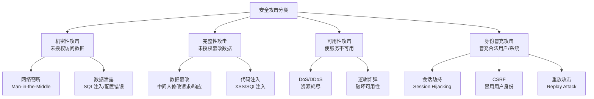
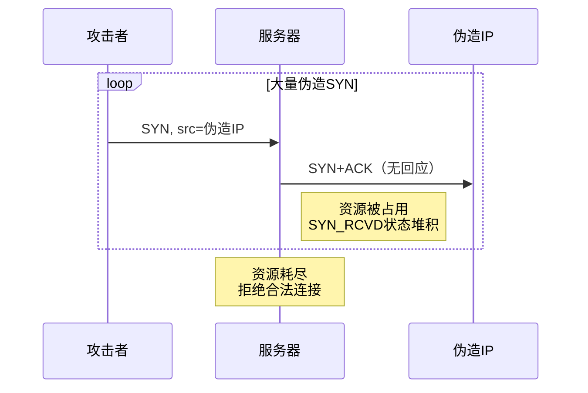
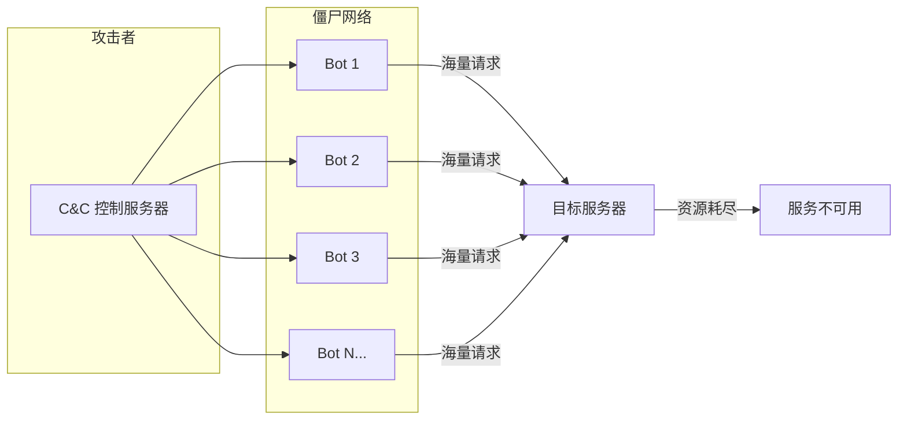
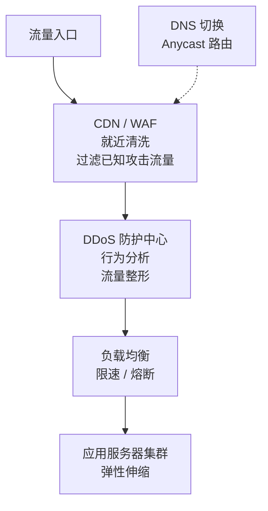
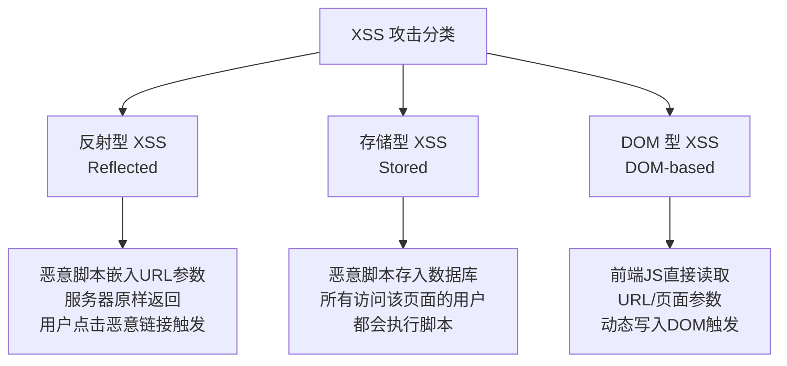
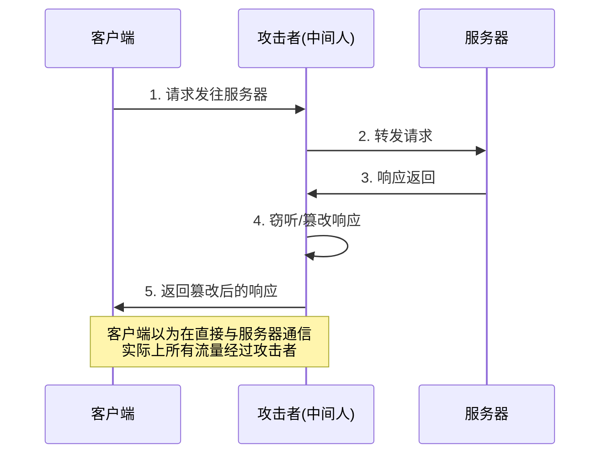
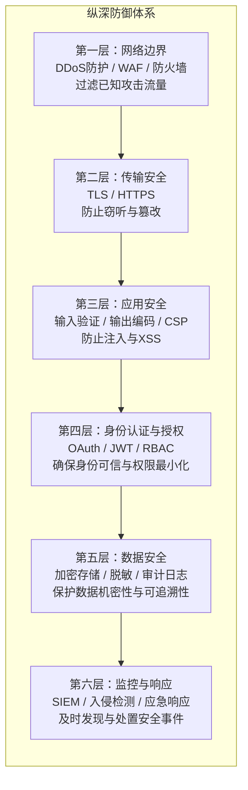

# 安全-攻击与防御

## 章节导言

加密、签名、证书等密码学原语是构建安全系统的基石，但仅拥有基石并不等于建筑安全——如何将密码学原语正确地组合为防御体系，如何识别和应对现实中的攻击模式，才是安全工程的核心命题。

安全领域有一个基本认知：**安全不是状态，而是过程。** 不存在绝对安全的系统，只存在攻击成本高于攻击收益的平衡点。架构师的任务不是追求零漏洞，而是建立纵深防御体系，使攻击者面对的是多层防线而非单点突破。

本章将从攻击者视角出发，系统梳理 Web 与网络层的主流攻击手段，并给出对应的防御架构。

---

## 核心概念与原理

### 攻击分类体系

安全攻击可以从多个维度分类。从攻击目标来看：



从攻击发生的网络层次来看：

| 层次 | 典型攻击 | 防御手段 |
|------|----------|----------|
| 网络层 | IP 欺骗、SYN Flood、Smurf | 入口过滤、SYN Cookie、流量清洗 |
| 传输层 | 会话劫持、TCP RST 攻击 | TLS、序列号随机化 |
| 应用层 | XSS、SQL 注入、CSRF、SSRF | 输入校验、CSP、CSRF Token |
| 业务层 | 越权访问、逻辑漏洞 | 权限模型、审计日志 |

### 网络层攻击

#### SYN Flood（TCP 半连接攻击）

**攻击原理**：攻击者发送大量伪造源 IP 的 SYN 报文，服务器为每个 SYN 分配资源进入 SYN_RCVD 状态。由于源 IP 伪造，ACK 永远不会到来，服务器资源被耗尽，无法服务合法请求。



**防御方案**：

1. **SYN Cookie**：不在 SYN_RCVD 状态分配资源，将状态编码在序号中（详见[网络-TCP与可靠传输](/docs/cs-basics/计算机网络/21-网络-TCP与可靠传输)）。
2. **SYN Proxy / 防火墙**：防火墙代为完成三次握手，验证合法后才将连接转发给后端服务器。
3. **限速与黑名单**：对单位时间内 SYN 报文频率进行限速。

#### IP 欺骗（IP Spoofing）

**攻击原理**：攻击者伪造 IP 报文的源地址，冒充可信主机发起请求。在基于 IP 地址做访问控制的系统中，这可能导致未授权访问。

**防御方案**：

1. **入口过滤（Ingress Filtering）**：路由器验证报文源地址是否属于其宣告的网络范围（BCP 38/RFC 2827），在源头阻止伪造报文。
2. **不依赖 IP 地址做认证**：使用更强的身份验证机制（如证书、Token）。
3. **TCP 层面**：攻击者无法完成三次握手（收不到 SYN+ACK），因此 TCP 连接上的 IP 欺骗仅限于 RST 攻击（重置连接）。

#### DDoS（Distributed Denial of Service）

**攻击原理**：利用大量受控主机（僵尸网络）同时向目标发送海量请求，耗尽带宽、连接数或计算资源。



**DDoS 的类型**：

| 类型 | 目标 | 手段 |
|------|------|------|
| 带宽耗尽型 | 网络带宽 | UDP Flood、ICMP Flood、DNS 放大攻击 |
| 协议耗尽型 | 协议栈资源 | SYN Flood、Ping of Death |
| 应用层耗尽型 | 应用计算资源 | HTTP Flood（低速请求）、Slowloris |

**防御架构**：



1. **CDN / Anycast**：通过全球分布的节点就近吸收流量，避免单点拥塞。
2. **流量清洗**：基于行为分析（请求频率、特征、来源）区分合法与恶意流量，丢弃恶意流量。
3. **弹性伸缩**：云端自动扩容应对流量尖峰。
4. **DNS 切换**：受到攻击时，将域名解析切换至清洗中心 IP。

### 应用层攻击

#### XSS（Cross-Site Scripting，跨站脚本攻击）

**攻击原理**：攻击者将恶意脚本注入网页，当其他用户浏览该网页时，脚本在用户浏览器中执行，可窃取 Cookie、劫持会话、篡改页面内容。

**XSS 的三种类型**：



**存储型 XSS 危害最大**——恶意脚本持久化存储，所有访问该页面的用户都会受害。

**防御方案**：

1. **输出编码（Output Encoding）**：根据输出上下文（HTML 标签内、属性内、JavaScript 内、URL 内）对用户输入进行对应的编码转义。这是防御 XSS 的根本手段。
2. **Content Security Policy（CSP）**：通过 HTTP 响应头 `Content-Security-Policy` 限制页面可加载的资源来源，禁止内联脚本执行。例如：`Content-Security-Policy: default-src 'self'; script-src 'self' https://trusted.cdn.com`。
3. **HttpOnly Cookie**：设置 `Set-Cookie: ...; HttpOnly`，禁止 JavaScript 通过 `document.cookie` 访问会话 Cookie，降低 XSS 窃取会话的风险。
4. **输入验证**：在服务端对用户输入进行白名单校验，拒绝不符合预期格式的输入。输入验证是辅助手段，输出编码是根本。

#### SQL 注入（SQL Injection）

**攻击原理**：攻击者将恶意 SQL 片段注入用户输入，改变后端 SQL 语句的语义，实现未授权的数据读取、修改或删除。

**示例**：
```sql
-- 原始 SQL
SELECT * FROM users WHERE username = '$username' AND password = '$password'

-- 攻击者输入: username = "admin'--", password = "anything"
-- 生成的 SQL
SELECT * FROM users WHERE username = 'admin'--' AND password = 'anything'
-- 注释掉密码验证，直接以 admin 身份登录
```

**防御方案**：

1. **参数化查询（Prepared Statement）**：使用占位符替代字符串拼接，数据库驱动自动处理转义。这是防御 SQL 注入的根本手段。
2. **ORM 框架**：成熟的 ORM（如 Hibernate、SQLAlchemy）默认使用参数化查询，降低手写 SQL 的风险。
3. **最小权限原则**：数据库用户仅授予业务所需的最小权限，禁止应用使用 DBA 账号连接数据库。
4. **输入验证**：对用户输入做类型和格式校验，但不可作为唯一防御手段。

#### CSRF（Cross-Site Request Forgery，跨站请求伪造）

**攻击原理**：攻击者诱导已登录用户访问恶意页面，该页面自动向目标网站发送请求（利用浏览器自动携带 Cookie 的特性），以用户身份执行非预期操作。

```mermaid
sequenceDiagram
    participant U as 用户浏览器
    participant T as 目标网站<br/>bank.com
    participant E as 恶意网站<br/>evil.com

    U->>T: 1. 用户登录 bank.com<br/>浏览器保存会话Cookie
    T-->>U: Set-Cookie: session=abc123

    U->>E: 2. 用户访问恶意页面
    E-->>U: 3. 返回包含隐藏表单的页面<br/>&lt;img src="bank.com/transfer?to=hacker&amp;amount=10000"&gt;

    U->>T: 4. 浏览器自动携带Cookie<br/>GET /transfer?to=hacker&amount=10000
    Note over T: 5. 服务器验证Cookie合法<br/>执行转账操作
```

**防御方案**：

1. **CSRF Token**：服务器为每个表单/请求生成随机 Token，提交时验证 Token 的合法性。攻击者无法获取 Token（受同源策略限制），因此无法伪造有效请求。
2. **SameSite Cookie**：设置 `Set-Cookie: ...; SameSite=Strict` 或 `SameSite=Lax`，限制 Cookie 仅在同站请求中发送。`Strict` 模式最安全但影响用户体验（从外部链接进入不携带 Cookie），`Lax` 是推荐默认值。
3. **双重 Cookie 验证**：要求请求在 Cookie 和请求体中同时携带 Token，服务器验证二者一致。攻击者只能让浏览器自动携带 Cookie，但无法读取跨域 Cookie 值写入请求体。
4. **验证 Origin / Referer 头**：检查请求来源是否为合法域名。但这依赖于浏览器正确发送这些头部，且可被部分场景（如隐私模式）省略。

#### SSRF（Server-Side Request Forgery，服务端请求伪造）

**攻击原理**：攻击者利用服务端发起请求的功能，使服务端向内网资源发起请求，绕过防火墙访问内部服务。

**典型场景**：应用提供 URL 预览功能（如 "输入 URL 获取网页摘要"），攻击者输入 `http://169.254.169.254/latest/meta-data/`（云环境元数据接口）或 `http://127.0.0.1:6379/`（内网 Redis）。

**防御方案**：

1. **URL 白名单**：仅允许请求预定义的域名/IP。
2. **禁止内网地址**：过滤 RFC 1918 私有地址（10.0.0.0/8, 172.16.0.0/12, 192.168.0.0/16）、环回地址（127.0.0.0/8）和链路本地地址（169.254.0.0/16）。
3. **网络隔离**：应用服务器与内网服务部署在不同网络区域，通过安全组/防火墙限制出站流量。
4. **禁用重定向跟随**：攻击者可能通过外网 URL 重定向到内网地址。

#### 中间人攻击（Man-in-the-Middle, MITM）

**攻击原理**：攻击者在通信双方之间插入自己，可以窃听、篡改双方通信内容。



**防御方案**：

1. **HTTPS（TLS）**：TLS 的证书体系确保客户端连接的是真实服务器，加密确保中间人无法窃听或篡改。这是防御 MITM 的根本手段。
2. **证书锁定（Certificate Pinning）**：移动端应用内嵌服务器证书或公钥哈希，拒绝非预期证书。防止攻击者使用合法 CA 签发的伪造证书。
3. **HSTS（HTTP Strict Transport Security）**：通过 `Strict-Transport-Security` 响应头告知浏览器仅使用 HTTPS 连接本站，防止 SSL 剥离攻击。

### 纵深防御体系架构

单一的防御手段不足以应对复杂的攻击场景。纵深防御（Defense in Depth）要求在多个层面部署安全控制，形成多层防线：



---

## 设计原则与权衡（Trade-off 分析）

### 原则一：最小权限原则（Principle of Least Privilege）

每个实体（用户、进程、服务）仅被授予完成其任务所需的最小权限集合。

**Trade-off**：权限粒度越细，管理复杂度越高。过度细分导致权限配置爆炸，反而增加配置错误的风险。架构师需在安全性与可管理性之间寻找平衡——关键资源（如数据库、管理后台）使用细粒度权限，普通资源使用角色级别的粗粒度权限。

### 原则二：纵深防御 vs 单点强化

纵深防御通过多层弱防线替代单层强防线，降低了单点失效的风险。

**Trade-off**：多层防线意味着更高的运维复杂度和性能开销（如 TLS 加解密、WAF 规则匹配）。每一层都需要正确配置和维护，任何一层的配置错误都可能成为突破口。

### 原则三：安全与可用性的冲突

许多安全措施会降低用户体验：CAPTCHA 防机器人但烦人，强制密码复杂度但难以记忆，MFA 增加登录步骤但降低便捷性。

**Trade-off**：安全措施的强度应与资产价值匹配。银行转账需要 MFA + 短信验证，而浏览公开内容无需登录。过度安全与安全不足同样有害——前者导致用户绕过安全措施，后者导致数据泄露。

### 原则四：输入验证 vs 输出编码

**输入验证**是"不允许坏数据进入"，**输出编码**是"确保坏数据不会被解释执行"。二者互补而非替代。

**Trade-off**：仅做输入验证无法防御所有场景——数据可能通过其他渠道（数据库迁移、API 集成）进入系统。仅做输出编码虽更安全，但会增加所有输出点的处理负担。最佳实践是两者结合：输入验证做白名单过滤，输出编码根据上下文转义。

### 原则五：默认安全（Secure by Default）

系统默认配置应是安全的，而非要求用户主动配置安全选项。

**Trade-off**：默认安全可能限制功能或降低性能。例如，CSP 默认禁止内联脚本，但许多遗留应用依赖内联脚本，需要逐步迁移。架构师应确保新系统默认安全，为遗留系统提供渐进式加固路径。

---

## 实践案例与反模式

### 案例：OWASP Top 10 与安全基线

OWASP（Open Web Application Security Project）定期发布 Top 10 安全风险清单，是安全审计的事实标准。2021 版 Top 10：

1. A01 - 失效的访问控制（Broken Access Control）
2. A02 - 加密机制失败（Cryptographic Failures）
3. A03 - 注入（Injection）
4. A04 - 不安全的设计（Insecure Design）
5. A05 - 安全配置错误（Security Misconfiguration）
6. A06 - 易受攻击和过时的组件（Vulnerable and Outdated Components）
7. A07 - 身份识别和认证失败（Identification and Authentication Failures）
8. A08 - 软件和数据完整性失败（Software and Data Integrity Failures）
9. A09 - 安全日志和监控失败（Security Logging and Monitoring Failures）
10. A10 - 服务器端请求伪造（SSRF）

**实践建议**：将 OWASP Top 10 纳入代码审查清单和安全测试基线，而非仅作为知识参考。

### 反模式：安全通过隐蔽（Security by Obscurity）

"只要攻击者不知道我的接口地址和参数格式，就是安全的。"——这是危险的错觉。隐蔽不是安全，因为信息总可能泄露（反编译、日志、内部人员）。

**正确做法**：假设攻击者了解系统的全部实现细节（Kerckhoffs 原则），安全性仅依赖于密钥和凭据的保密性。

### 案例：日志与可观测性——安全事件的眼睛

防御不仅是阻止攻击，还包括检测和响应。完整的安全日志应记录：

- **认证事件**：登录成功/失败、MFA 挑战
- **授权事件**：权限校验通过/拒绝
- **数据访问事件**：敏感数据的读取/修改
- **异常事件**：频繁失败、异常 IP、大量数据导出

**反模式**：日志中记录密码、Token、信用卡号等敏感信息。日志本身也需要脱敏保护。

### 案例：供应链攻击与依赖安全

SolarWinds 事件表明，攻击者可以绕过应用层防御，通过污染上游组件实现入侵。

**防御措施**：

1. **依赖锁定**：使用 lockfile（package-lock.json、go.sum）固定依赖版本和哈希。
2. **漏洞扫描**：集成 SCA（Software Composition Analysis）工具，持续扫描已知漏洞。
3. **最小依赖**：减少不必要的第三方库，降低攻击面。
4. **构建签名验证**：验证构建产物的签名完整性。

---

## 小结与关键要点

1. **安全是过程而非状态**：不存在绝对安全，目标是使攻击成本高于收益。安全需要持续评估和迭代。
2. **理解攻击才能有效防御**：从攻击者视角理解攻击原理（SYN Flood、XSS、SQL 注入、CSRF、SSRF、MITM），才能选择正确的防御手段。
3. **纵深防御是核心架构原则**：多层防线（网络边界 → 传输安全 → 应用安全 → 认证授权 → 数据安全 → 监控响应）降低单点失效风险。
4. **根本防御优于辅助防御**：参数化查询优于输入过滤，输出编码优于输入验证，TLS 优于自定义加密。
5. **最小权限与默认安全**：权限最小化、默认配置安全，是降低攻击面的基本原则。
6. **检测与响应同样重要**：完善的日志、监控和应急响应机制，是安全体系不可或缺的组成。

**延伸阅读**：
- [网络-TCP与可靠传输](/docs/cs-basics/计算机网络/21-网络-TCP与可靠传输)——TCP 层面的攻击面（SYN Flood、会话劫持）
- [网络-HTTP协议](/docs/cs-basics/计算机网络/24-网络-HTTP协议)——HTTPS 与 TLS 机制
- [21 | 安全：认证与授权](10-安全-认证与授权.md)——身份认证与访问控制的深入设计
