# 安全-认证与授权

## 章节导言

在"[20 | 安全：攻击与防御](09-安全-攻击与防御.md)"中，我们构建了纵深防御体系，从网络层到应用层逐层设防。然而，所有防御措施的起点都是一个根本问题：**你是谁？你能做什么？**

这两个问题分别对应安全领域最核心的两个概念——**认证（Authentication）** 与**授权（Authorization）**。认证解决身份确认问题，授权解决权限控制问题。二者看似简单，实则是分布式系统设计中最容易出错的环节之一。OWASP 2021 Top 10 中，"失效的访问控制"高居榜首，"身份识别和认证失败"位列第七。

安全管理的核心是信任管理。认证是建立信任的起点，授权是信任边界的定义。理解认证与授权的设计，就是理解如何在分布式系统中安全地建立和管理信任关系。

---

## 核心概念与原理

### 认证 vs 授权：本质区别

| 维度 | 认证（Authentication） | 授权（Authorization） |
|------|------------------------|----------------------|
| 核心问题 | 你是谁？ | 你能做什么？ |
| 输入 | 身份凭据（密码/Token/证书） | 身份标识 + 操作请求 |
| 输出 | 身份声明（Identity Claim） | 允许/拒绝（Permit/Deny） |
| 失败后果 | 身份无法确认，拒绝进入 | 权限不足，拒绝操作 |
| 实现层次 | 通常集中式 | 通常分布式 |
| 典型协议 | OAuth 2.0、SAML、Kerberos | RBAC、ABAC、ACL |

**关键洞察**：认证和授权的解耦是架构设计的重要原则。认证通常由专门的身份提供商（IdP, Identity Provider）集中处理，授权则分散在各业务服务中。这种解耦使身份管理可以统一，权限控制可以按业务定制。

### 认证（Authentication）

#### 认证因素分类

认证基于以下三类因素的组合：

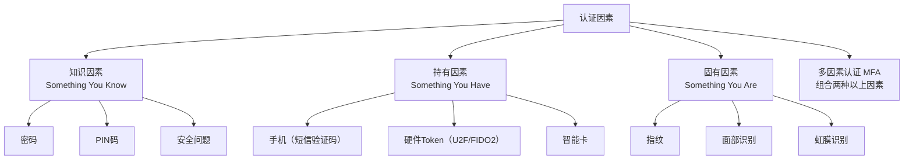

**单因素认证（如仅密码）** 的安全性有限——密码可能被钓鱼、撞库、泄露。**多因素认证（MFA）** 要求用户提供两种以上不同类型的因素，大幅提高攻击成本。

**架构师关注点**：MFA 不是可选的增强，而是高价值操作的必要保障。NIST SP 800-63B 已明确建议淘汰短信验证码（SIM Swap 攻击），推荐使用 FIDO2/WebAuthn 等基于公钥密码学的硬件认证。

#### 认证协议：从基本认证到 OAuth 2.0

##### HTTP 基本认证（Basic Authentication）

最简单的认证方式：客户端在请求头中携带 `Authorization: Basic <base64(username:password)>`。

**致命缺陷**：Base64 是编码而非加密，凭据可被任何中间人读取。除非在 HTTPS 连接上使用，否则完全不安全。即使使用 HTTPS，基本认证仍存在凭据长期有效、无法细粒度授权等局限。

##### 基于 Token 的认证

**核心思路**：用户认证成功后，服务器颁发一个 Token（令牌），客户端在后续请求中携带 Token 而非密码。

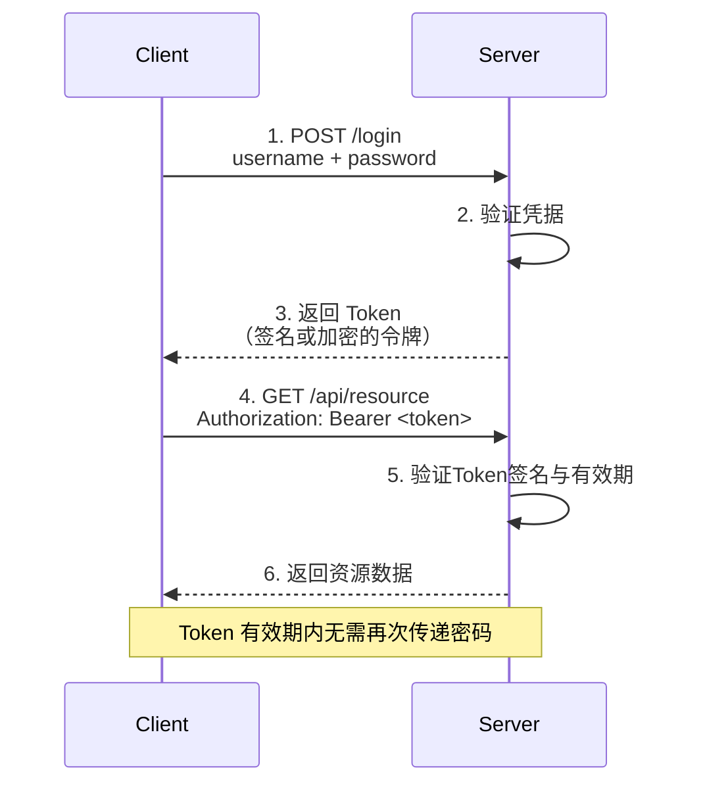

**Token 的两种实现**：

| 维度 | 不透明 Token（Opaque Token） | JWT（JSON Web Token） |
|------|------------------------------|----------------------|
| 格式 | 随机字符串（如 UUID） | 结构化 JSON（Header.Payload.Signature） |
| 验证方式 | 查询数据库/缓存 | 验证签名（无需查库） |
| 状态 | 有状态（需存储） | 无状态（自包含） |
| 撤销 | 直接删除存储记录 | 需额外机制（黑名单/短有效期） |
| 信息量 | 无（仅是引用） | 包含用户标识、角色、过期时间等 |

##### OAuth 2.0：授权框架

OAuth 2.0 是业界标准的授权框架，其核心目标是：**让用户授权第三方应用访问其在另一服务上的资源，而无需向第三方透露密码。**

OAuth 2.0 定义了四种角色：

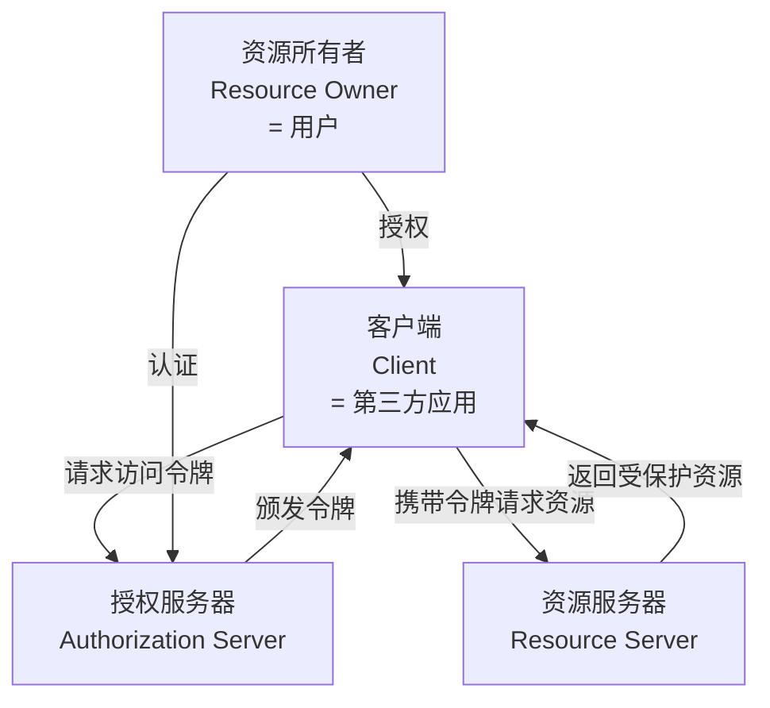

**OAuth 2.0 的四种授权流程（Grant Types）**：

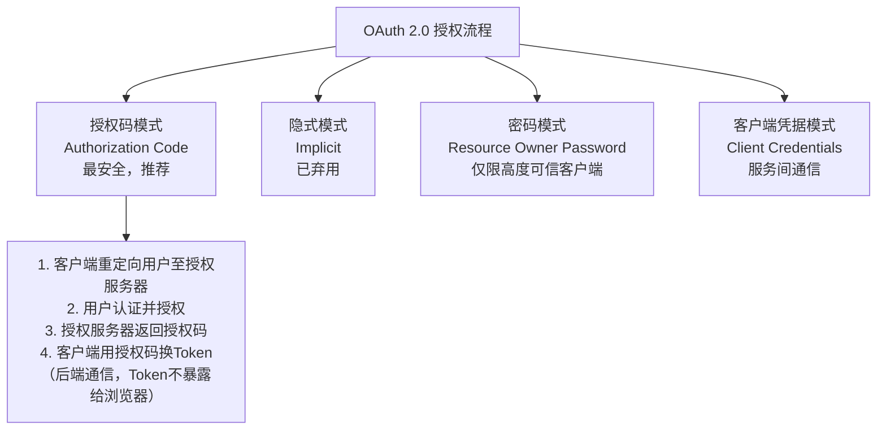

**授权码模式（Authorization Code）的完整流程**：

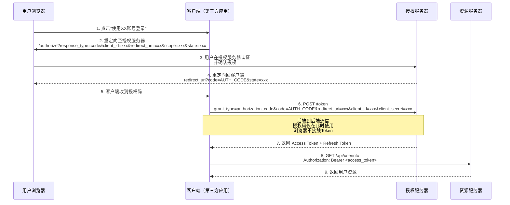

**state 参数的必要性**：防止 CSRF 攻击。客户端生成随机 state，授权服务器原样返回。客户端验证 state 一致后才使用授权码，防止攻击者伪造授权码注入。

**PKCE（Proof Key for Code Exchange）扩展**：授权码模式下，如果客户端无法安全存储 client_secret（如移动端/SPA），则使用 PKCE。客户端生成 code_verifier 和其哈希 code_challenge，授权码请求携带 code_challenge，Token 请求携带 code_verifier。授权服务器验证二者对应关系，防止授权码被截获后滥用。

##### OpenID Connect（OIDC）

OAuth 2.0 是授权框架而非认证协议。OpenID Connect 在 OAuth 2.0 之上增加了身份层：

- 新增 `id_token`（JWT 格式），包含用户身份信息（sub、name、email 等）
- 新增 `/userinfo` 端点，获取完整用户信息
- 新增 `openid` scope，触发 OIDC 流程

**关键区别**：OAuth 2.0 的 Access Token 用于访问资源，OIDC 的 ID Token 用于证明身份。用 OAuth 2.0 的 Access Token 当作身份凭证是常见反模式——Access Token 是授权凭据，不包含身份断言。

### JWT（JSON Web Token）

#### JWT 结构

JWT 由三部分组成，以 `.` 分隔：`Header.Payload.Signature`

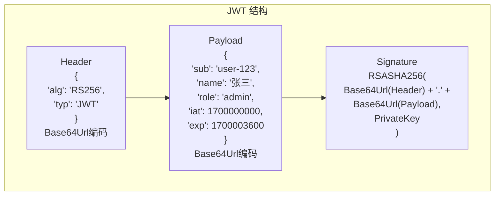

**Header**：声明令牌类型和签名算法。

**Payload**：包含声明（Claims）。标准声明包括：

| 声明 | 全称 | 含义 |
|------|------|------|
| iss | Issuer | 签发者 |
| sub | Subject | 主题（用户标识） |
| aud | Audience | 接收方 |
| exp | Expiration Time | 过期时间 |
| nbf | Not Before | 生效时间 |
| iat | Issued At | 签发时间 |
| jti | JWT ID | 唯一标识（防重放） |

**Signature**：使用 Header 中声明的算法对 `Header.Payload` 部分签名。签名确保 Payload 未被篡改。

**关键警告**：JWT 的 Header 和 Payload 仅经过 Base64Url 编码，**不是加密**。任何持有 JWT 的人都能读取 Payload 内容。敏感信息（密码、密钥）不应放入 JWT。如需保密，应使用 JWE（JSON Web Encryption）。

#### JWT 的验证流程

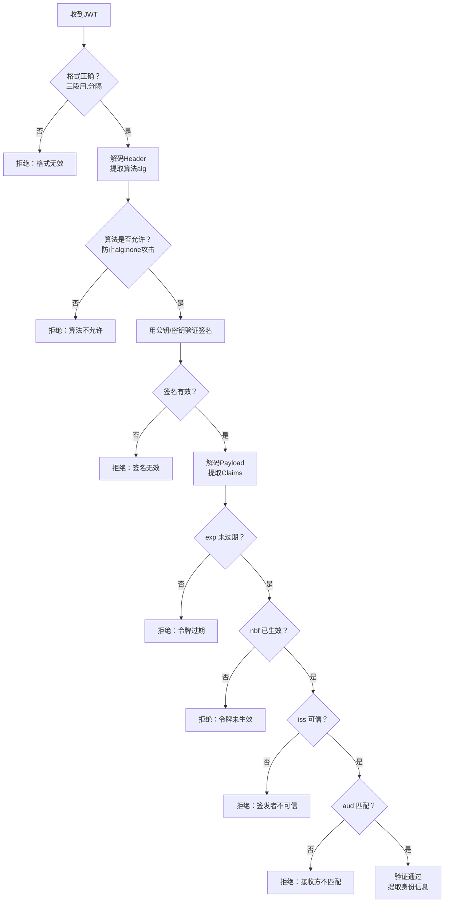

#### JWT 的撤销问题

JWT 的无状态性是其核心优势（无需查库验证），也是其核心缺陷（无法主动撤销）。一旦签发，在 exp 到期前始终有效。

**解决方案**：

1. **短有效期 + Refresh Token**：Access Token 有效期设为 5-15 分钟，Refresh Token 有效期较长（如 7 天）。Refresh Token 存储在服务端，可以随时撤销。
2. **Token 黑名单**：维护已撤销 Token 的黑名单（存储在 Redis 等高速缓存中），每次验证时检查。黑名单仅在 Token 剩余有效期内需要维护，过期后自动清理。
3. **版本号机制**：在用户表中维护 Token 版本号，签发 JWT 时纳入版本。撤销时递增版本号，旧版本 JWT 失效。验证时需查库，牺牲了无状态性。

### 授权（Authorization）

#### 授权模型分类

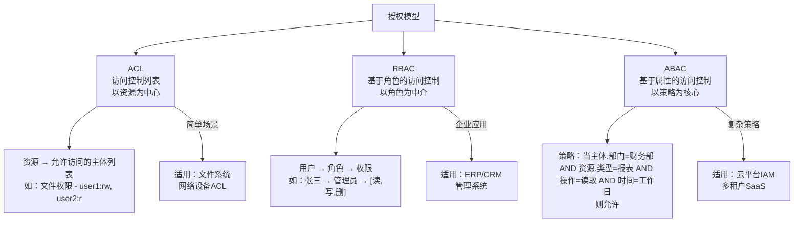

#### RBAC（Role-Based Access Control）

RBAC 是企业应用中最广泛使用的授权模型。其核心思想：**用户不直接关联权限，而是通过角色间接获得权限。**

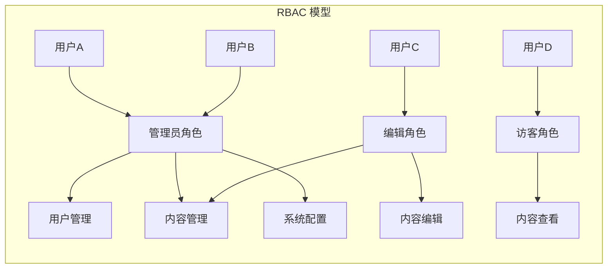

**RBAC 的演进层级**：

| 层级 | 名称 | 特性 |
|------|------|------|
| RBAC0 | 扁平 RBAC | 用户-角色-权限三者的基本映射 |
| RBAC1 | 层次 RBAC | 角色可继承（如"超级管理员"继承"管理员"的所有权限） |
| RBAC2 | 约束 RBAC | 角色互斥（如"出纳"和"审核"不能同一人）、基数约束（角色人数上限） |
| RBAC3 | 统一 RBAC | RBAC1 + RBAC2 的组合 |

**RBAC 的局限**：

1. **角色爆炸**：当权限组合复杂时，角色数量急剧增长（如"部门A的管理员 + 部门B的审核员"需要为每种组合创建角色）。
2. **缺乏上下文感知**：RBAC 无法表达"仅在工作时间可访问"或"仅能操作本部门资源"等条件约束。
3. **变更滞后**：组织架构变化时，角色-权限映射需要同步调整，存在权限残留风险。

#### ABAC（Attribute-Based Access Control）

ABAC 基于主体属性、资源属性、操作属性和环境属性的组合评估访问决策：

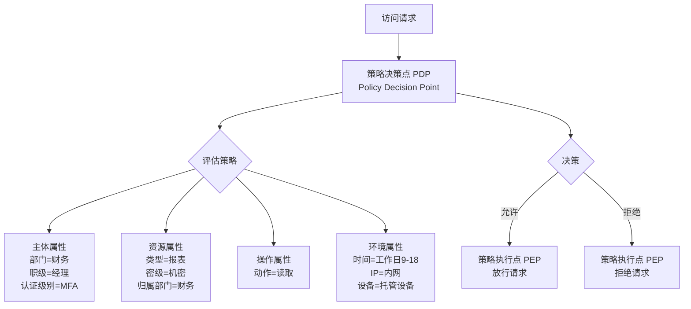

**ABAC 的优势**：

1. **细粒度控制**：可表达任意复杂的策略条件。
2. **动态适应**：属性变化自动影响权限，无需修改角色映射。
3. **策略集中管理**：策略与代码解耦，可独立更新。

**ABAC 的代价**：

1. **性能开销**：每次访问决策都需评估多个属性和策略，需高效的策略引擎。
2. **可理解性**：复杂策略难以人工审查，需可视化策略管理工具。
3. **调试困难**：权限拒绝时难以追溯具体是哪个属性/策略导致。

#### 权限模型在微服务中的实现

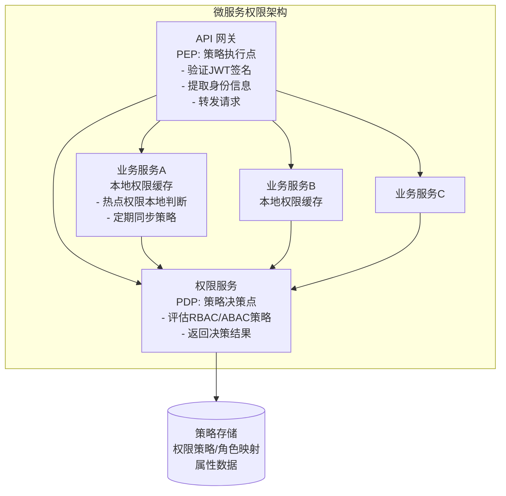

**架构关键决策**：

1. **认证前置，授权下沉**：网关负责认证（验证 JWT、提取身份），各业务服务负责授权（根据业务逻辑判断权限）。网关做粗粒度权限检查（如是否登录、是否有基本访问权限），业务服务做细粒度权限检查（如是否能操作特定资源）。
2. **权限缓存**：权限决策结果可短时间缓存（如 30 秒），减少对权限服务的请求压力。但需平衡实时性——权限变更后，缓存的过期时间决定了生效延迟。
3. **服务间信任**：微服务之间的调用也需要认证和授权。通常使用 Service Account + mTLS 实现服务间认证，使用 ACL 或 RBAC 控制服务间可调用的接口范围。

---

## 设计原则与权衡（Trade-off 分析）

### 原则一：认证集中化，授权分散化

认证应集中由 IdP 处理，避免每个服务重复实现认证逻辑。授权应分散到各业务服务，因为权限判断依赖业务上下文。

**Trade-off**：集中认证引入了单点依赖——IdP 不可用时所有服务无法认证。解决方案：Token 的无状态验证（JWT）可在 IdP 不可用时继续工作；Refresh Token 的更新走降级路径。

### 原则二：无状态 vs 有状态的 Token

JWT 的无状态性使其天然支持水平扩展，但牺牲了即时撤销能力。Opaque Token 支持即时撤销，但每次验证都需要查询存储。

**Trade-off**：推荐采用混合策略——短有效期（5-15 分钟）的 JWT Access Token + 长有效期的 Opaque Refresh Token。前者用于高频访问验证（无状态），后者用于低频的令牌刷新（有状态，可撤销）。

### 原则三：RBAC 的实用性与 ABAC 的灵活性

RBAC 简单直观，适合权限模型稳定、角色划分清晰的企业应用。ABAC 灵活强大，适合权限策略复杂、动态变化的多租户平台。

**Trade-off**：RBAC 的角色爆炸问题在大型系统中难以避免，但 ABAC 的策略复杂度也会导致管理和审计困难。实践中常采用混合模型：RBAC 作为基础框架（粗粒度），ABAC 作为补充（细粒度条件约束）。

### 原则四：安全性与用户体验的平衡

强制 MFA、频繁重新认证、复杂的密码策略虽然安全，但会降低用户体验。用户可能选择弱密码来应对复杂策略，或在便利贴上写下密码，反而降低安全性。

**Trade-off**：基于风险的自适应认证（Risk-Based Authentication）——低风险操作（常规浏览）仅需基本认证，高风险操作（大额转账、敏感数据访问）触发 MFA。这种渐进式安全模型在安全性和体验之间取得了更好的平衡。

### 原则五：零信任架构（Zero Trust Architecture）

传统安全模型基于网络边界——内网可信，外网不可信。零信任模型否定这一假设：**永不信任，始终验证**，无论请求来自内网还是外网。

**零信任的核心原则**：

1. **持续验证**：每次访问都需认证和授权，不依赖网络位置。
2. **最小权限**：仅授予完成当前任务所需的最小权限。
3. **假设违约**：假设系统已被入侵，设计微隔离和横向移动防御。
4. **全链路加密**：所有通信使用 mTLS，包括服务间内部通信。

**Trade-off**：零信任架构显著增加了认证/授权的调用频率和复杂度，需要强大的身份基础设施和高性能的策略引擎支撑。

---

## 实践案例与反模式

### 案例：OAuth 2.0 在微服务架构中的实现

在微服务架构中，OAuth 2.0 的典型实现：

1. **API 网关**：作为 PEP，验证 Access Token 的签名和有效期，提取用户身份，将身份信息注入请求头转发至下游服务。
2. **认证服务**：作为 Authorization Server，处理登录、Token 签发、Refresh Token 管理。
3. **业务服务**：根据请求中的身份信息，结合业务逻辑进行授权判断。
4. **服务间认证**：使用 Client Credentials Grant，每个服务持有自己的 client_id/client_secret，通过 mTLS 保护通信。

### 反模式：用 OAuth Access Token 当作身份凭证

OAuth 2.0 的 Access Token 是**授权凭据**而非**身份断言**。Access Token 的格式是不透明的（对资源服务器而言），其内容可能随时变化（如权限范围缩减），不能用于推断用户身份。

**正确做法**：使用 OpenID Connect 的 ID Token 作为身份凭证，Access Token 仅用于授权。

### 反模式：JWT 中存储敏感信息

JWT 的 Payload 仅经过 Base64Url 编码，任何人都能解码查看。将密码、身份证号、银行卡号等敏感信息放入 JWT 是严重的安全隐患。

**正确做法**：JWT 中仅存储最小必要的身份标识（sub）和元数据（exp、iss 等）。敏感信息通过 API 按需获取，且受授权控制。

### 案例：多租户 SaaS 的权限设计

多租户系统中的权限设计需要同时解决**租户隔离**和**租户内权限**两个层面：

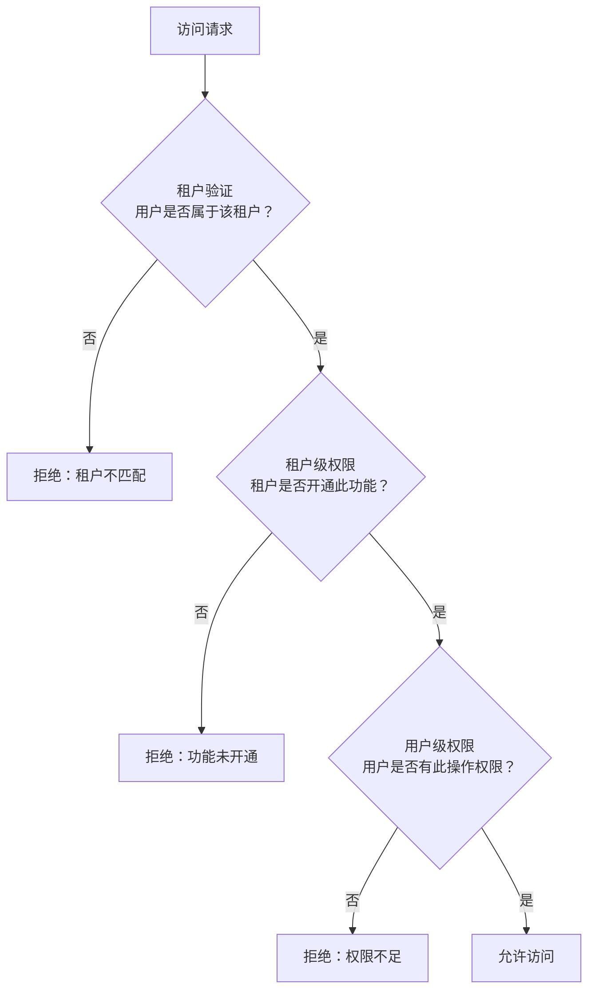

**设计要点**：

1. **租户隔离**：数据层面（行级安全策略）、应用层面（Tenant ID 过滤）、基础设施层面（独立 Schema 或独立数据库）。
2. **租户内权限**：每个租户有独立的角色-权限映射，不同租户的"管理员"角色可能拥有不同的权限集合。
3. **跨租户访问**：极少数场景需要跨租户操作（如集团管理员访问子公司数据），需通过专门的跨租户角色和严格的审计日志控制。

### 案例：API Key 与 Service Account

在服务间通信和第三方集成场景中，API Key 是常用的认证方式。API Key 与用户 Token 的关键区别：

| 维度 | API Key | 用户 Token |
|------|---------|-----------|
| 代表 | 服务/应用 | 用户 |
| 范围 | 通常固定 | 可能动态变化 |
| 撤销 | 立即生效 | 受 Token 有效期限制 |
| 审计 | 关联到服务 | 关联到具体用户 |

**最佳实践**：API Key 应设置最小权限范围、定期轮换、支持独立撤销（每把 Key 独立，撤销一把不影响其他）、记录完整的调用审计日志。

---

## 小结与关键要点

1. **认证与授权是两个不同的问题**：认证确认"你是谁"，授权确认"你能做什么"。二者应解耦设计——认证集中化，授权分散化。
2. **OAuth 2.0 是授权框架而非认证协议**：使用 OIDC 补充身份层，避免将 Access Token 当作身份凭证。
3. **JWT 是双刃剑**：无状态性带来水平扩展能力，但也带来撤销困难。短有效期 + Refresh Token 是实践中最可行的折中方案。
4. **RBAC 适合稳定的权限模型，ABAC 适合动态复杂的策略**：实践中常采用 RBAC 为基础、ABAC 为补充的混合模型。
5. **零信任是架构演进的必然方向**：从基于网络边界的信任模型转向"永不信任，始终验证"，需要强大的身份基础设施支撑。
6. **权限设计需考虑多租户隔离**：租户验证 → 租户级权限 → 用户级权限的三层检查，是 SaaS 系统权限设计的标准范式。
7. **安全与体验需渐进式平衡**：基于风险的自适应认证（低风险基本认证，高风险触发 MFA）优于一刀切的强安全策略。

**延伸阅读**：
- [网络-TCP与可靠传输](/docs/cs-basics/计算机网络/21-网络-TCP与可靠传输)——传输层安全基础
- [网络-HTTP协议](/docs/cs-basics/计算机网络/24-网络-HTTP协议)——HTTPS 与 TLS
- [20 | 安全：攻击与防御](09-安全-攻击与防御.md)——CSRF、会话劫持等与认证相关的攻击
