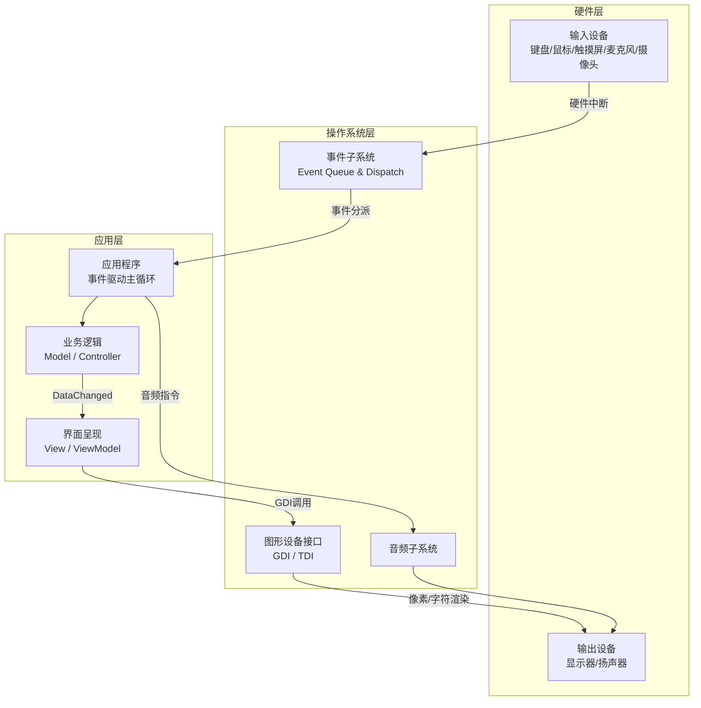
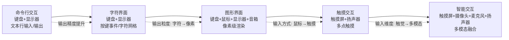
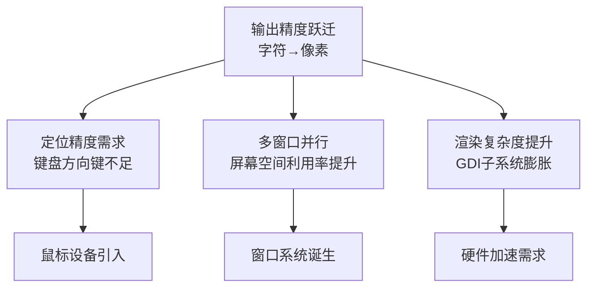

# 桌面开发的宏观视角

## 章节导言

桌面开发的核心命题是什么？不是 UI 框架的选择，不是编程语言的优劣，而是**交互范式的演进**。从架构的视角审视，无论终端设备是 PC、手机、手表还是 IoT 设备，无论开发方式是 Native、Web 还是小程序，它们的本质都是同一件事：**通过交互设备接收用户输入，通过计算处理业务逻辑，通过输出设备呈现结果**。

许式伟指出，桌面操作系统与服务端操作系统的演进方向截然不同——服务端追求简约与稳定，而桌面操作系统的演进方向是**交互范式的迭代**，向着越来越自然、越来越智能的交互前进。理解这一宏观趋势，是架构师做出正确技术决策的前提。

---

## 核心概念与原理

### 桌面程序的统一架构模型

一个桌面程序完整的架构体系可以统一表示为：

这个统一模型的关键洞察在于：**不同交互范式的桌面程序，差异集中在输入输出设备的组合方式和操作系统交互子系统的接口设计上，而应用层的业务逻辑架构是相对稳定的**。

### 交互范式的本质：输入输出抽象的演进

交互范式的演进，本质上是**输入输出抽象粒度不断细化**的过程：

| 交互范式 | 输入抽象 | 输出抽象 | 输入设备 | 输出设备 |
|---------|---------|---------|---------|---------|
| 命令行 | 以回车结尾的文本行 | 文本流（stdout/stderr） | 键盘 | 显示器 |
| 字符界面 | 键盘按键事件 | M×N字符网格 | 键盘 | 显示器 |
| 图形界面 | 键盘事件+鼠标事件 | M×N像素网格 | 键盘+鼠标 | 显示器+音箱 |
| 触摸界面 | 触摸事件+键盘事件 | 像素网格 | 触摸屏 | 内置扬声器 |
| 智能交互 | 语音+视觉+触摸 | 像素+语音 | 麦克风+摄像头+触摸屏 | 屏幕+扬声器 |

---

## Mermaid 图表：交互范式演进与桌面架构演化

### 交互范式演进图

### 各交互范式的程序架构

```mermaid
graph TB
    subgraph 命令行程序
        STDIN[标准输入 stdin] --> PROC1[业务处理]
        PROC1 --> STDOUT1[标准输出 stdout]
        PROC1 --> STDERR[标准错误 stderr]
        FILE_R[文件重定向] --> PROC1
        PROC1 --> FILE_W[文件输出]
    end

    subgraph 字符界面程序
        KEY1[键盘按键事件] --> APP2[应用程序]
        APP2 --> TDI[字符设备接口 TDI<br/>DrawText x,y,text]
        TDI --> SCREEN1[字符屏幕 M×N]
    end

    subgraph 图形界面程序
        KEY2[键盘事件] --> EDL[事件驱动循环<br/>Event Dispatch Loop]
        MOUSE[鼠标事件] --> EDL
        EDL --> WIN[窗口系统<br/>父子/兄弟关系]
        WIN --> GDI[图形设备接口 GDI<br/>几何/图像/文本]
        GDI --> SCREEN2[像素屏幕 M×N]
    end

    subgraph 智能交互程序
        TOUCH2[触摸事件] --> EDL2[融合事件循环]
        VOICE[语音输入] --> NLU[自然语言理解]
        VISION[视觉输入] --> CV[计算机视觉]
        NLU --> EDL2
        CV --> EDL2
        EDL2 --> WIN2[窗口系统]
        WIN2 --> GDI2[图形渲染]
        GDI2 --> SCREEN3[屏幕输出]
        EDL2 --> TTS[语音合成]
        TTS --> SPEAKER[扬声器输出]
    end
```

---

## 设计原则与权衡

### 原则一：交互范式的选择是架构决策，而非实现细节

选择命令行、图形界面还是智能交互，决定了程序的整体架构骨架。不同范式之间的迁移成本极高——例如从命令行迁移到图形界面，不只是换了输出方式，而是引入了窗口系统、事件驱动循环、GDI 绘制等一整套全新的编程模型。

**Trade-off 分析：**

| 维度 | 命令行 | 字符界面 | 图形界面 | 智能交互 |
|------|-------|---------|---------|---------|
| 开发复杂度 | 低 | 中 | 高 | 极高 |
| 用户学习成本 | 高 | 中 | 低 | 最低 |
| 可自动化程度 | 最高 | 高 | 低 | 最低 |
| 表达能力 | 有限 | 中等 | 强 | 最强 |
| 操作系统依赖 | 最低 | 低 | 高 | 极高 |

### 原则二：事件驱动是图形界面的编程范式基石

图形界面程序的核心编程模型是**事件驱动**。操作系统通过事件队列将硬件中断转化为结构化事件，应用程序在事件分派循环中响应事件、更新状态、重绘界面。

这意味着：**桌面程序的控制流不再由业务代码主导，而是由操作系统的界面框架主导**。业务代码成为框架的"插件"，被框架调用而非主动调用框架。这对架构设计有深远影响——参见[第21讲：图形界面程序的框架](12-图形界面程序的框架.md)。

### 原则三：智能交互与图形界面的融合困境

语音交互目前与图形界面交互**无法良好融合**，原因有二：

1. **框架侵入性冲突**：语音交互有强上下文，其业务代码同样由语音交互框架驱动。两个框架各自主控程序生命周期，难以共容。
2. **技术成熟度**：语音交互尚不成熟，独立发展更利于快速迭代。成熟后完全可以重新设计融合框架。

**这揭示了一个架构规律：当两个框架都试图主控程序生命周期时，融合的难度将指数级增长。** 这与微服务中"一个服务只能有一个 BFF 层"的道理一致。

### 原则四：输出精度的跃迁是范式变革的根本驱动力

从字符网格到像素网格，输出精度提升了数个数量级。这一跃迁直接导致了：

- **鼠标的必然出现**：像素级精度下，键盘方向键定位既笨拙又不自然
- **窗口系统的诞生**：高精度输出使得多窗口并行显示成为可能
- **GDI 子系统的复杂化**：从简单的文本绘制到几何图形、图像、文本的混合渲染

---

## 实践案例与反模式

### 案例：编辑器的交互范式困境

命令行交互时代，编辑器是最典型的"反人类"需求场景。在文本行输入模式下，如何实现光标移动、文本选择、复制粘贴？Vim 的模式切换（Normal/Insert/Visual）是一种精巧的妥协——用组合键模拟了图形界面的交互能力，但学习曲线陡峭。

这个案例说明：**当交互需求超越了当前交互范式的能力边界时，要么升级交互范式，要么用复杂的约定来弥补——后者往往是技术债的源头**。

### 反模式：忽视交互范式的架构设计

在 IoT 项目中，常见错误是为语音交互设备设计图形界面式的架构——引入完整的窗口系统和 GDI 渲染管线，只为在 2 英寸屏幕上显示几行文字。正确的做法是根据交互设备选择最小够用的交互范式，避免架构过度设计。

### 案例展望：多模态融合的终局

许式伟预判，未来智能交互不会止步于语音，而是**视频交互（兼顾视觉和听觉）与触摸屏的完美融合**。交互设备将是**触摸屏+摄像头+麦克风+内置扬声器**的组合。这意味着未来的桌面程序架构需要同时处理触摸事件流、语音输入流、视觉输入流，并在统一的事件驱动框架中进行融合与响应。

---

## 小结与关键要点

1. **桌面开发的本质是交互**：桌面操作系统与服务端操作系统的分水岭在于交互范式的演进方向。桌面操作系统向着更自然、更智能的交互持续迭代。
2. **交互范式经历了五次跃迁**：命令行 → 字符界面 → 图形界面 → 触摸交互 → 智能交互。每次跃迁的根本驱动力是输出精度的提升，并随之带来输入设备的演进。
3. **事件驱动是图形界面的编程基石**：从图形界面时代开始，操作系统的界面框架接管了程序的主逻辑，业务代码成为框架驱动的"插件"。
4. **框架融合是架构难题**：当两个框架都试图主控程序生命周期（如语音交互框架与图形界面框架），融合的难度极高，需要等待技术成熟后重新设计统一框架。
5. **架构决策应前瞻交互趋势**：选择交互范式是架构级别的决策，需要预判技术演进方向，避免在即将被淘汰的范式上过度投入。

> **交叉引用**：本章讨论的交互范式演进，直接决定了[第21讲](12-图形界面程序的框架.md)中图形界面框架的设计，也影响着[第22讲](13-桌面程序的架构建议.md)中 MVC 架构的分层策略，以及[第23讲](14-Web开发-浏览器、小程序与PWA.md)中浏览器对窗口系统的颠覆。
