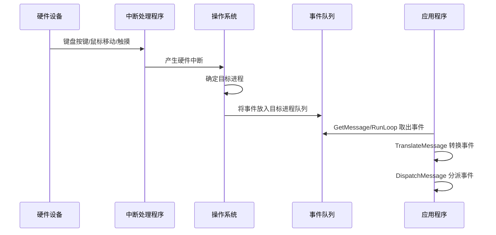
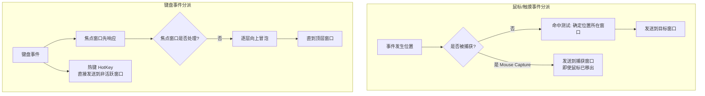
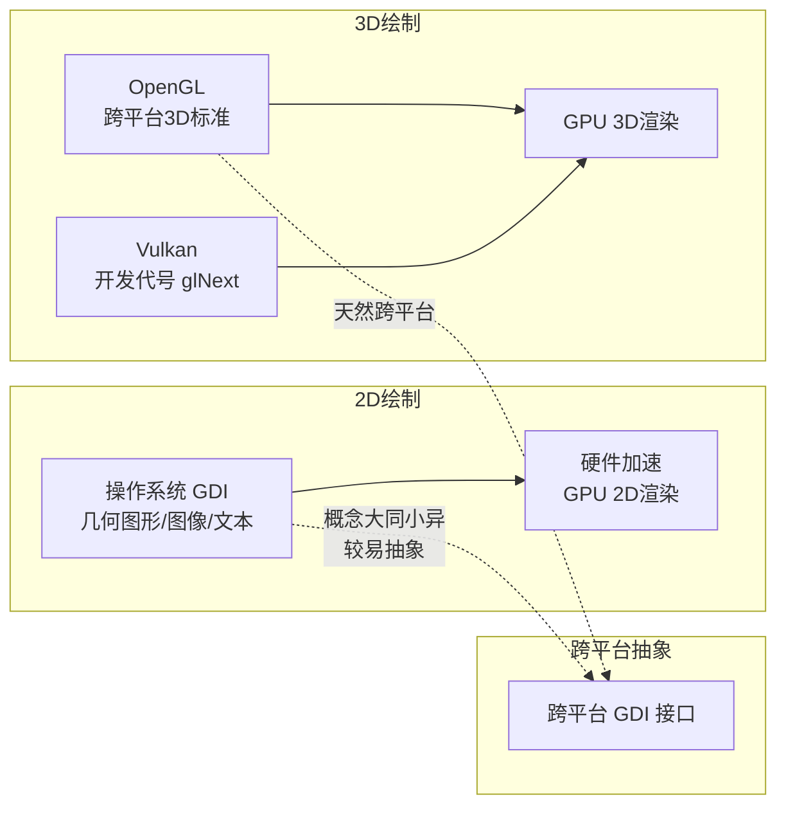
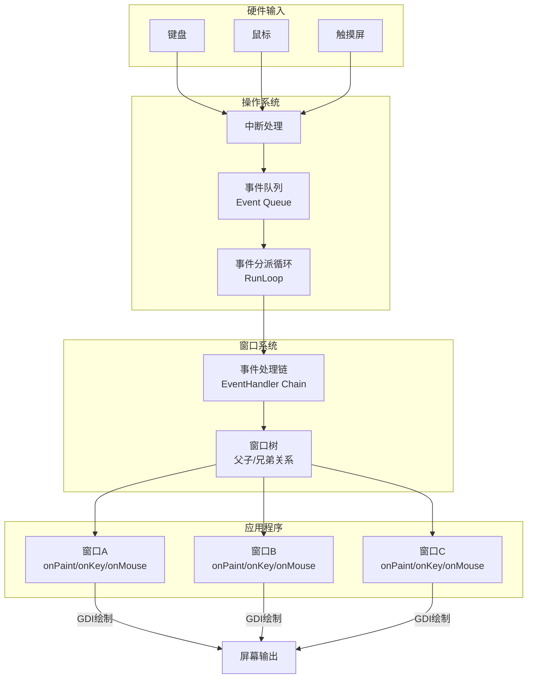
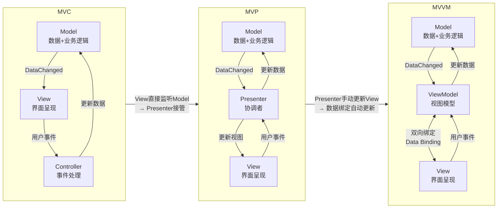

# 图形界面程序的框架

## 章节导言

在[第20讲](11-桌面开发的宏观视角.md)中，我们回顾了交互范式的演进历程。今天，我们将关注点收敛到当前仍占主流地位的**图形界面程序**，深入剖析其框架机制。

图形界面程序的核心挑战在于：**不同操作系统的使用接口差异巨大**。Windows、macOS、iOS、Android 各自定义了完全不同的窗口系统、事件模型和 GDI 接口。然而，尽管接口各异，底层的大逻辑却高度一致。理解这些共性，是构建跨平台方案、设计良好架构的前提。

---

## 核心概念与原理

### 事件：图形界面的血液

无论什么桌面操作系统，每个进程都有一个**全局事件队列（Event Queue）**。事件从硬件到应用的流转路径如下：



事件的生命周期揭示了图形界面程序的根本特征：**程序的控制流由外部事件驱动，而非内部逻辑主导**。

### 窗口与事件响应

窗口（Window / View）是图形界面的基本构建单元，它是一个**独立可复用的界面元素**。窗口响应事件、修改内部状态、调用 GDI 更新显示——这三步构成了图形界面程序的基本循环。

**事件响应的两种机制：**

| 机制 | 实现方式 | 典型平台 | 特点 |
|------|---------|---------|------|
| 事件处理类继承 | 自定义窗口类继承 EventHandler/Responder | iOS (Responder)、Android | 面向对象，类型安全 |
| 回调函数/窗口过程 | 将事件处理注册为回调函数 | Windows (WindowProc) | 语言无关，可复用 |
| 委托模式 | 事件处理委托给外部对象 | Web (onclick)、Cocoa (delegate) | 松耦合，灵活 |

**onPaint/onDraw 事件的特殊性**：操作系统不会保存被遮挡窗口的内容，当窗口从遮挡中暴露时，系统发送 onPaint 事件要求窗口重绘。这意味着窗口必须具备**从数据状态完整重建视觉呈现**的能力——这一约束深刻影响了 MVC 架构中 View 层的设计。

### 事件分派：从队列到窗口

事件分派由**事件分派循环（Event Dispatch Loop）**完成。以 Windows 平台为例：

```go
func RunLoop() {
    for {
        msg, ok := winapi.GetMessage()    // 从事件队列取出消息
        if !ok { break }
        winapi.TranslateMessage(msg)       // 键盘事件→字符事件转换
        winapi.DispatchMessage(msg)        // 分派到目标窗口
    }
}
```

`TranslateMessage` 的作用是将 `onKeyDown/onKeyUp` 转化为 `onChar` 事件——这体现了**键盘双重功能**（输入文本 vs 触发命令）在事件模型中的分离。

### 事件处理链（EventHandler Chain）

窗口系统引入父子/兄弟关系后，事件分派变得复杂。不同事件的分派策略不同：



**键盘的双重功能与事件分派的关系：**

- **输入文本**：必须有输入光标（Caret），目的窗口必然是焦点窗口
- **触发命令**：响应方不一定是焦点窗口，热键（HotKey）允许非活跃窗口响应

移动时代，键盘作为命令输入的角色大幅弱化，仅保留截屏、音量调节等系统级热键。但键盘作为文本输入的能力仍不可替代。

### 窗口内容绘制：GDI 子系统



GDI 子系统的关键特征：

1. **性能要求最高**：GDI 是操作系统最耗电、性能要求最高的子系统
2. **硬件加速是关键**：真正的性能优化依赖 GPU 硬件加速，硬件厂商在跨平台 GDI 方案中扮演关键角色
3. **2D GDI 跨平台相对容易**：不同平台概念大同小异，比整个应用框架更容易抽象
4. **3D 绘制已有跨平台标准**：OpenGL/Vulkan 天然跨平台

### 通用控件

操作系统在窗口系统之上提供通用控件（Control），进一步简化开发：

| 控件类型 | 功能 | 跨平台注意点 |
|---------|------|------------|
| Label | 静态文本展示 | 字体渲染差异 |
| Button | 按钮交互 | 点击区域、默认样式差异 |
| RadioBox | 单选 | 布局方向、选中态差异 |
| CheckBox | 复选 | 语义一致，样式差异 |
| Input/EditBox | 文本输入 | 输入法集成、软键盘行为差异 |
| ProgressBar | 进度展示 | 动画效果差异 |

**跨平台陷阱**：不同操作系统的控件在处理细节上存在微妙差异（如输入法行为、焦点切换逻辑、触摸反馈），这些差异是跨平台开发的主要"坑"。

---

## Mermaid 图表：MVC/MVP/MVVM 演进与事件驱动架构

### 事件驱动架构全景



### MVC → MVP → MVVM 演进图



**演进逻辑**：
- **MVC**：View 直接监听 Model 的 DataChanged 事件并自我更新，View 与 Model 存在耦合
- **MVP**：Presenter 接管了 View 的更新职责，View 与 Model 完全解耦，但 Presenter 需要手动操作 View
- **MVVM**：通过数据绑定（Data Binding）消除 Presenter 对 View 的手动操作，ViewModel 与 View 双向自动同步

> **交叉引用**：MVC/MVP/MVVM 的详细架构分析见[第22讲：桌面程序的架构建议](13-桌面程序的架构建议.md)。

---

## 设计原则与权衡

### 原则一：理解框架主导 vs 业务主导的根本差异

图形界面程序是**框架主导**的——操作系统的事件分派循环控制着程序的生命周期，业务代码是被调用的"回调"。这与服务端程序的**业务主导**模式（请求→处理→响应）形成鲜明对比。

**Trade-off**：

| 维度 | 框架主导（桌面） | 业务主导（服务端） |
|------|----------------|-----------------|
| 控制流 | 框架驱动，业务被动 | 业务驱动，框架辅助 |
| 可测试性 | 较差（依赖框架模拟） | 较好（请求可构造） |
| 灵活性 | 受框架约束 | 自由度高 |
| 开发效率 | 框架提供脚手架，入门快 | 需要自建更多基础设施 |

### 原则二：事件分派策略的选择影响架构灵活性

不同事件类型的分派策略（命中测试 vs 焦点链 vs 热键）决定了事件处理的架构模式：

- **命中测试分派**（鼠标/触摸）：事件与位置绑定，适合 View 层直接处理
- **焦点链分派**（键盘）：事件沿层级冒泡，适合 Controller 层拦截处理
- **热键分派**（系统级）：事件绕过焦点链，适合全局 Controller 处理

架构设计应**根据事件分派策略决定事件处理的层级归属**，而非一刀切地将所有事件处理放在同一层。

### 原则三：GDI 跨平台抽象的投入产出比最高

在图形界面程序的跨平台工作中，GDI 子系统的跨平台抽象**投入产出比最高**——概念大同小异，接口相对稳定，且 3D 绘制已有 OpenGL/Vulkan 这样的跨平台标准。相比之下，窗口系统和事件模型的跨平台抽象要困难得多。

### 原则四：控件差异是跨平台的隐性成本

通用控件在不同平台上的行为差异（输入法集成、焦点逻辑、触摸反馈）是跨平台开发的**隐性成本**。这些差异看似微小，但累积起来可能占据跨平台适配工作量的 30% 以上。

---

## 实践案例与反模式

### 案例：Windows WindowProc 回调模型的设计智慧

Windows 将事件处理设计为回调函数（WindowProc）而非继承体系，这一选择使得窗口类可以**跨语言使用**——任何能定义回调函数的语言都能创建自定义窗口。这是 COM 时代的设计哲学，虽然不如面向对象优雅，但在互操作性上具有独特优势。

### 反模式：在事件处理中执行耗时操作

图形界面程序的事件处理在主线程（UI 线程）中执行。如果在 onPaint、onClick 等事件处理中执行耗时操作（如网络请求、大量计算），将导致界面卡顿甚至"应用无响应"（ANR）。正确做法是将耗时操作异步化，通过回调或消息机制在完成后通知 UI 线程更新。

### 案例：拖放交互与 Mouse Capture

拖放（Drag & Drop）是事件分派的一个特殊场景——鼠标按下后移出窗口，事件仍需发送到原窗口。Windows 引入 Mouse Capture 机制解决此问题。这体现了**交互需求驱动事件模型扩展**的规律：当基础事件模型无法满足交互需求时，不是修改交互设计，而是扩展事件模型。

---

## 小结与关键要点

1. **事件驱动是图形界面程序的编程范式**：全局事件队列 + 事件分派循环 + 窗口事件响应，构成了图形界面程序的基本骨架。
2. **事件响应有三种机制**：事件处理类继承、回调函数、委托模式——形式不同，本质一致。
3. **事件分派策略因事件类型而异**：鼠标/触摸用命中测试，键盘用焦点链冒泡，热键绕过焦点链直达目标窗口。
4. **GDI 是跨平台抽象的最佳切入点**：概念统一、接口稳定，比窗口系统和事件模型更容易跨平台。
5. **平台差异是跨平台的永恒挑战**：从操作系统接口到控件行为细节，差异无处不在。跨平台方案必须系统性地处理这些差异。

> **交叉引用**：本章讨论的事件驱动框架是[第22讲](13-桌面程序的架构建议.md)中 MVC 架构分层的基础，也是[第23讲](14-Web开发-浏览器、小程序与PWA.md)中浏览器颠覆窗口系统的前提。
