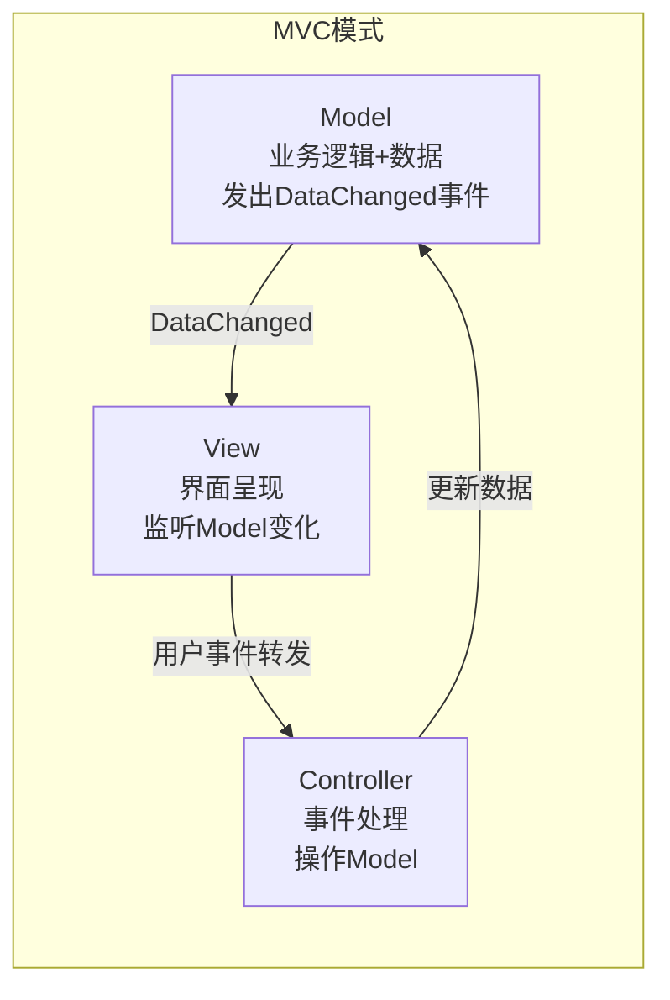
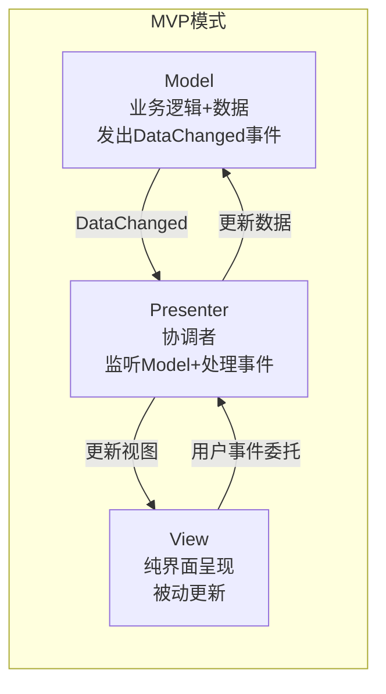
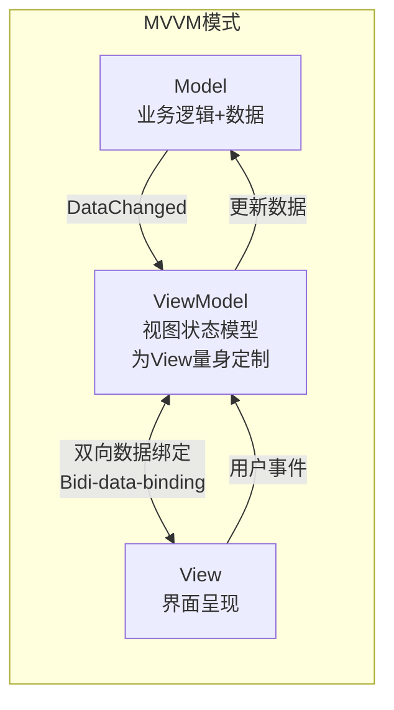
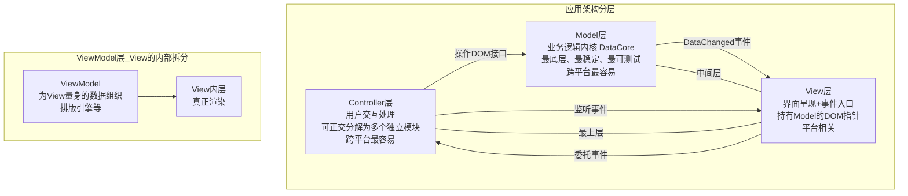
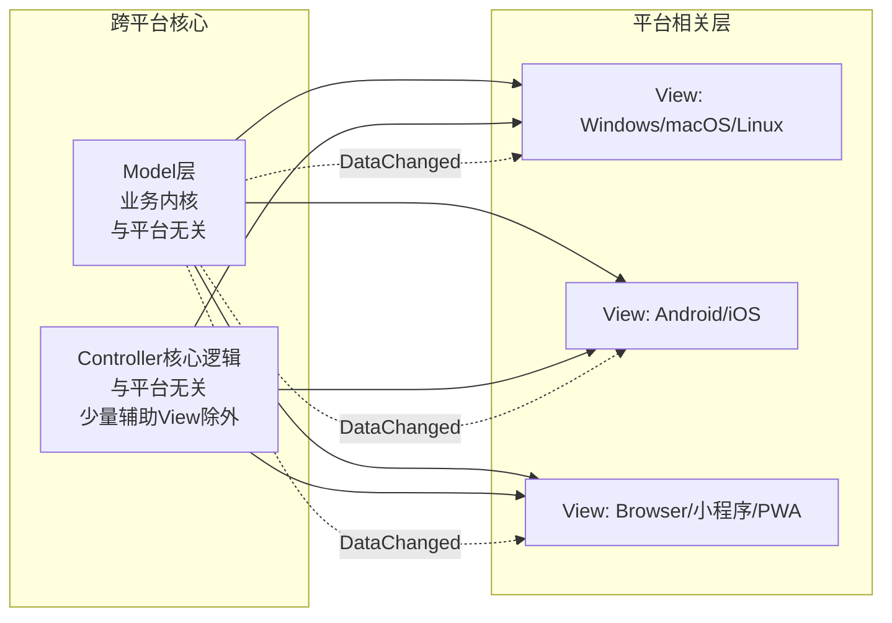
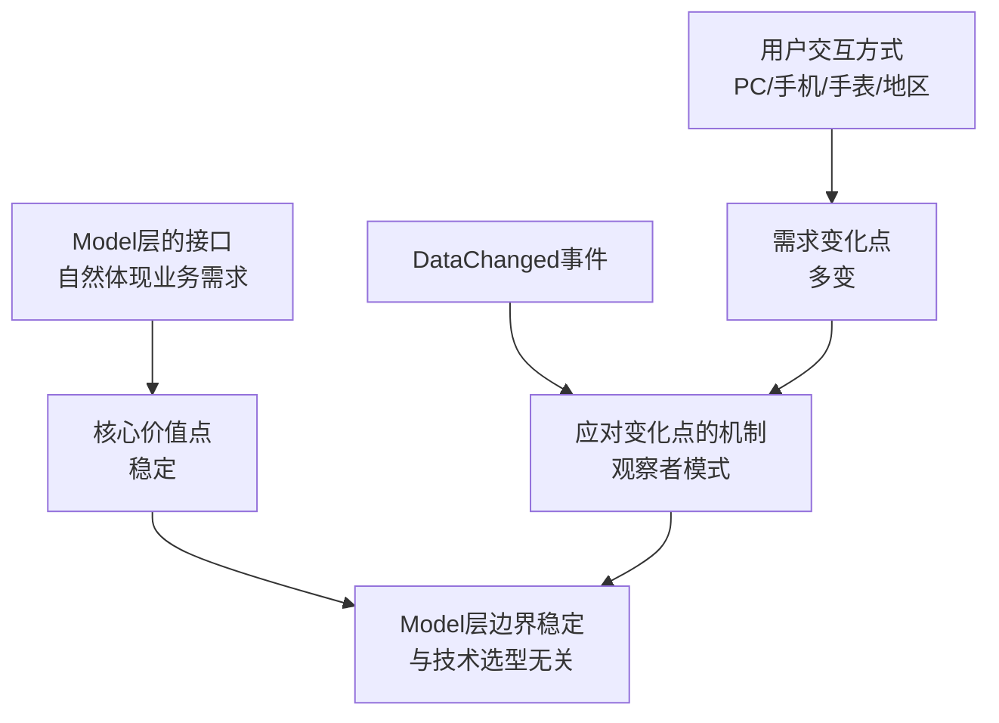
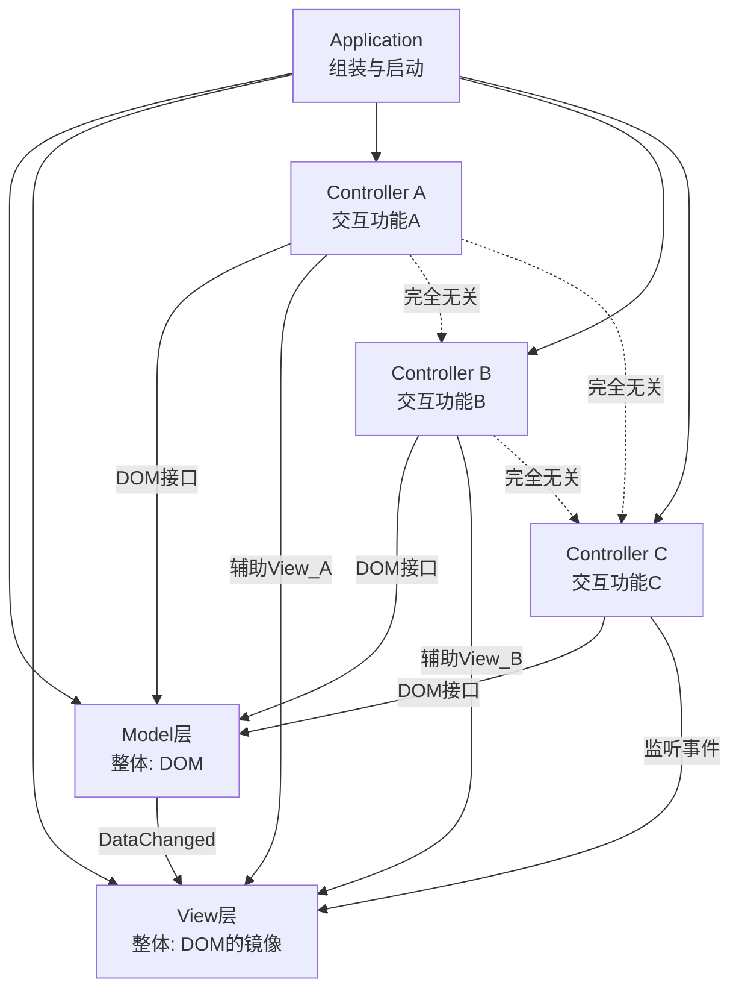

# 桌面程序的架构建议

## 章节导言

[第21讲](12-图形界面程序的框架.md)我们从操作系统交互子系统的角度审视了图形界面程序的结构。今天，我们切换视角，站在**应用架构**的角度，讨论如何设计一个桌面应用程序。

MVC 是桌面开发中流传最广的架构范式，但"一千个人眼中有一千个哈姆雷特"。同样叫 MVC，不同人的理解和实践差异巨大。许式伟指出，**判断架构优劣的关键不是套用什么模式，而是理解每一层的职责边界和依赖关系**。只有心中有架构法则，才能对 MVC 做出正确的理解与设计。

---

## 核心概念与原理

### MVC 的本质：不是 Input-Process-Output

一种常见的误解是将 MVC 等同于计算机的 Input-Process-Output 模型：Model 是 Input，View 是 Output，Controller 是 Process。这种理解并不准确。

**更精确的理解：**

- **Model**：承载业务逻辑的 DOM（文档对象模型），是面向对象意义上的数据——既有数据结构，也有访问接口
- **View**：数据的显示结果，同时也是用户交互事件的入口
- **Controller**：接受"Model + 由 View 转发的事件"作为输入，处理结果仍是 Model（更新数据）

View 之所以被理解为 Output，是因为 Model 发出 DataChanged 事件后，View 监听并更新自身——从数据角度看，View 是 Model 的镜像。

### 架构优劣的评判标准

在讨论 MVC 各层设计之前，需要明确架构优劣的基本法则：

1. **最低耦合原则**：不同子系统（或模块）之间有最少的交互频率，最简洁且自然的接口
2. **单一职责原则**：不要让一个子系统干多件事情，**也不要让它不干事情**

第二条的后半句常常被忽视——一个层如果只做转发、不做实质处理，同样违背单一职责。

---

## Mermaid 图表：桌面架构模式与 UI-业务分离

### MVC / MVP / MVVM 架构对比







### 桌面程序的分层架构



### UI 与业务分离的核心机制



---

## 设计原则与权衡

### 理解 Model 层：架构中最被低估的层

Model 层不是"数据"，更不是"数据库表"。**Model 层是承载业务逻辑的 DOM（文档对象模型）**——面向对象意义上的数据，既有数据结构，也有访问接口。

**两种常见架构误区：**

| 误区 | 做法 | 问题 |
|------|------|------|
| 误区一 | Controller 直接操作数据库 | Model 层不干事情，违背单一职责 |
| 误区二 | 基于 ORM 实现 Model 层 | Model 接口被技术选型绑架，业务语义丢失 |

**正确的 Model 层设计原则：**

1. **接口体现业务需求**：Model 层的使用接口应该自然体现业务需求，与底层技术无关
2. **独立性**：Model 层不需要知道上层是 MVC 还是 MVP，DataChanged 事件是其面对变化点的对策
3. **越厚越好**：Model 层与操作系统界面框架最无关，是最容易测试、最容易跨平台的部分
4. **职责定义**：一句话概括——"负责业务需求的内核逻辑"（DataCore）

**为什么 DataChanged 事件如此重要？**



这与 CPU 的中断机制、操作系统的信号机制一脉相承——**用事件回调解决需求的变化点**，是架构设计中的普适策略。

### 理解 View 层：看似简单实则复杂的层

View 层有两个职责：

1. **界面呈现**：要么自己调用 GDI 绘制，要么创建子 View 让别人画
2. **事件入口**：作为用户交互事件的接收者（由操作系统界面框架决定）

**View 层的设计考量：**

| 问题 | 说明 | 建议 |
|------|------|------|
| View 不一定生成所有可见元素 | Controller 临时创建的 View 属于 Controller，不属于 MVC 的 View 层 | 区分 View 层 View 与 Controller 辅助 View |
| 委托机制需要灵活 | 一组界面元素的交互事件可能需要共同委托 | 支持组合式委托 |
| View 与 Model 的数据耦合 | View 需要知道数据结构细节来渲染 | Model 提供专享只读访问接口，控制扩散 |
| 局部更新是性能关键 | 全量重绘简单但性能差，局部更新复杂但必须 | 复杂时引入 ViewModel 层 |

**ViewModel 层的本质**：当 View 的局部更新优化足够复杂时，需要在 Model 和 View 之间引入 ViewModel 层。ViewModel 为 View 量身定制数据组织方式，与 View 呈一一对应关系（双向数据绑定）。

许式伟倾向于将 ViewModel 视为 **View 层的内部拆分**，而非独立的"MVVM"模式——因为 ViewModel 的存在是因为 View 太复杂，而不是因为架构需要一个新的层。

**典型案例：Word 的排版引擎**

Word 的 Model 层是数据流式文档，但用户最常用的界面是分页视图。这需要一个 ViewModel 层按分页结构组织数据，排版引擎负责维持 Model 与 ViewModel 的数据一致性。

### 理解 Controller 层：可正交分解的交互层

Controller 层与 Model 层、View 层有一个根本差异：**Controller 可以且应该被正交分解**。



**Controller 正交分解的原则：**

- 各 Controller 模块之间**完全无关**，没有耦合
- 删除某个交互功能只需注释掉创建该 Controller 的一行代码
- 每个 Controller 可能包含辅助 View（如菜单、工具条、控制点）
- Controller 通过 DOM 接口操作 Model，不直接操作 View 改变数据

**分层依赖关系：**

```text
Controller层（最上方）
    ↓ 知道 Model 和 View
View层（中间层）
    ↓ 持有 Model 的 DOM 指针
Model层（最底层）
    ↓ 不知道任何上层
```

### 兼顾 API 与交互

桌面程序除了支持用户交互，还需提供二次开发接口（API）。**最佳 API 提供位置是 ViewModel 层**——因为 Model 层虽然也能提供 API，但可能缺少 Selection 等与界面状态相关的信息。

---

## 实践案例与反模式

### 案例：Model 层做厚的收益

假设开发一个跨平台的图片编辑器。如果将裁剪、滤镜、图层等逻辑都放在 Controller 层，那么每个平台（Windows/macOS/iOS/Android）都需要重新实现这些逻辑。如果将这些逻辑下沉到 Model 层，则只需实现一次，各平台的 Controller 只需调用 Model 接口即可。

**Model 层越厚，跨平台成本越低。**

### 反模式：让 Controller 直接操作数据库

某 CRM 系统的 Controller 层直接编写 SQL 语句操作数据库。当需要从 MySQL 迁移到 PostgreSQL 时，所有 Controller 都需要修改。更严重的是，业务逻辑散落在各 Controller 中，无法独立测试。

正确做法：Model 层封装业务逻辑，对外提供"创建客户""查询订单"等业务语义接口，Controller 只调用这些接口。

### 反模式：View 层承担业务逻辑

某电商应用的 View 层根据用户等级计算折扣价格并直接显示。当需要在 API 中也返回折扣价格时，不得不复制计算逻辑。正确做法：折扣计算属于 Model 层，View 层只负责展示 Model 返回的折扣数据。

### 案例：Controller 正交分解的实践

以 Office 软件为例：
- **Controller A**：文字编辑交互（光标移动、文本输入、选择）
- **Controller B**：图形操作交互（拖拽、缩放、旋转控制点）
- **Controller C**：格式设置交互（字体、颜色、对齐方式）

这三个 Controller 完全正交，可以独立开发、独立测试、独立禁用。

---

## 小结与关键要点

1. **Model 层是架构的基石**：它是"负责业务需求的内核逻辑"（DataCore），接口应自然体现业务需求，与底层技术选型无关。Model 层越厚，跨平台越容易，可测试性越好。
2. **DataChanged 事件是 Model 层应对变化点的机制**：Model 层不需要知道上层的存在，DataChanged 事件使得上层能感知变化并自主响应。这与 CPU 中断、操作系统信号一脉相承。
3. **View 层的核心难题是局部更新**：当局部更新优化足够复杂时，引入 ViewModel 层。ViewModel 是 View 层的内部拆分，而非独立架构模式。
4. **Controller 层应正交分解**：各 Controller 模块完全无关，可独立开发、独立测试、独立禁用。
5. **API 接口宜在 ViewModel 层提供**：相比 Model 层，ViewModel 层包含 Selection 等界面状态信息，更适合作为 API 的提供层。
6. **分层依赖的单向性**：Model 层最底，不知道上层；View 层中间，持有 Model 指针；Controller 层最上，知道 Model 和 View。

> **交叉引用**：本章的 MVC 架构分析是[第23讲](14-Web开发-浏览器、小程序与PWA.md)中浏览器环境下 MVMP 模式的基础，也是[第24讲](15-跨平台与Web开发的建议.md)中跨平台架构策略的理论依据。Model 层做厚的设计原则，直接来源于[第01-19讲](.)中反复强调的"稳定点与变化点"分析方法。
