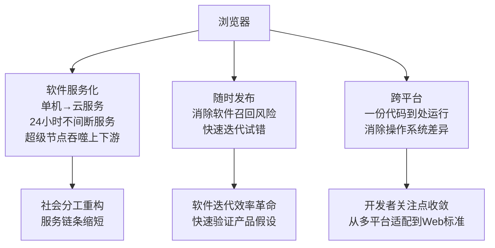
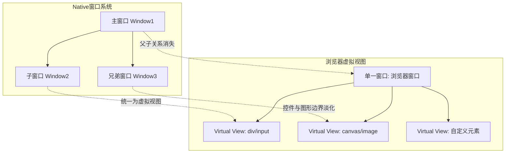
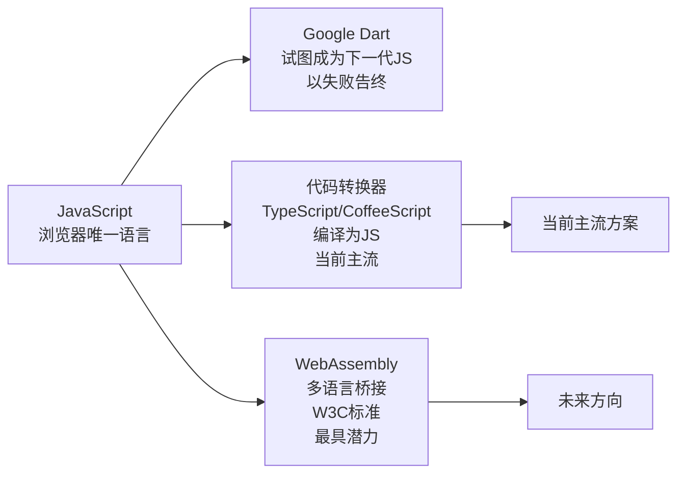
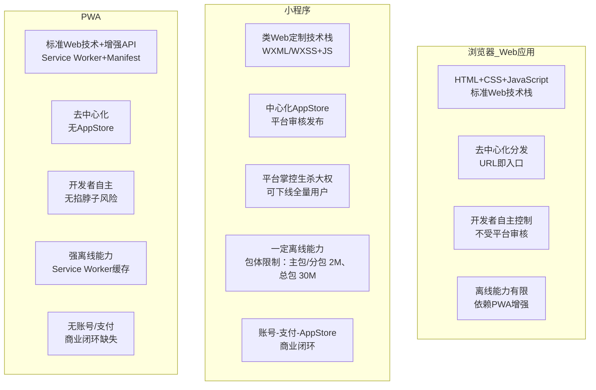
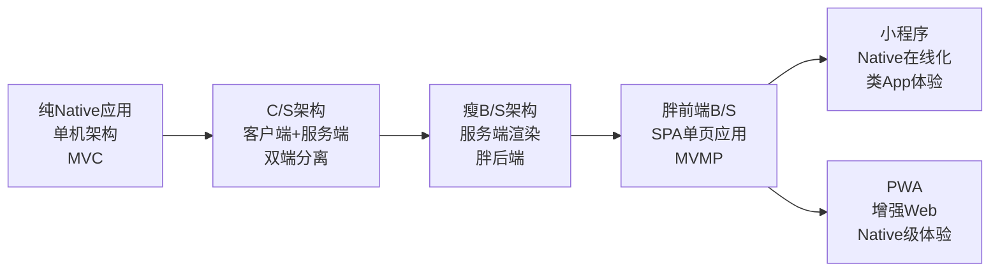
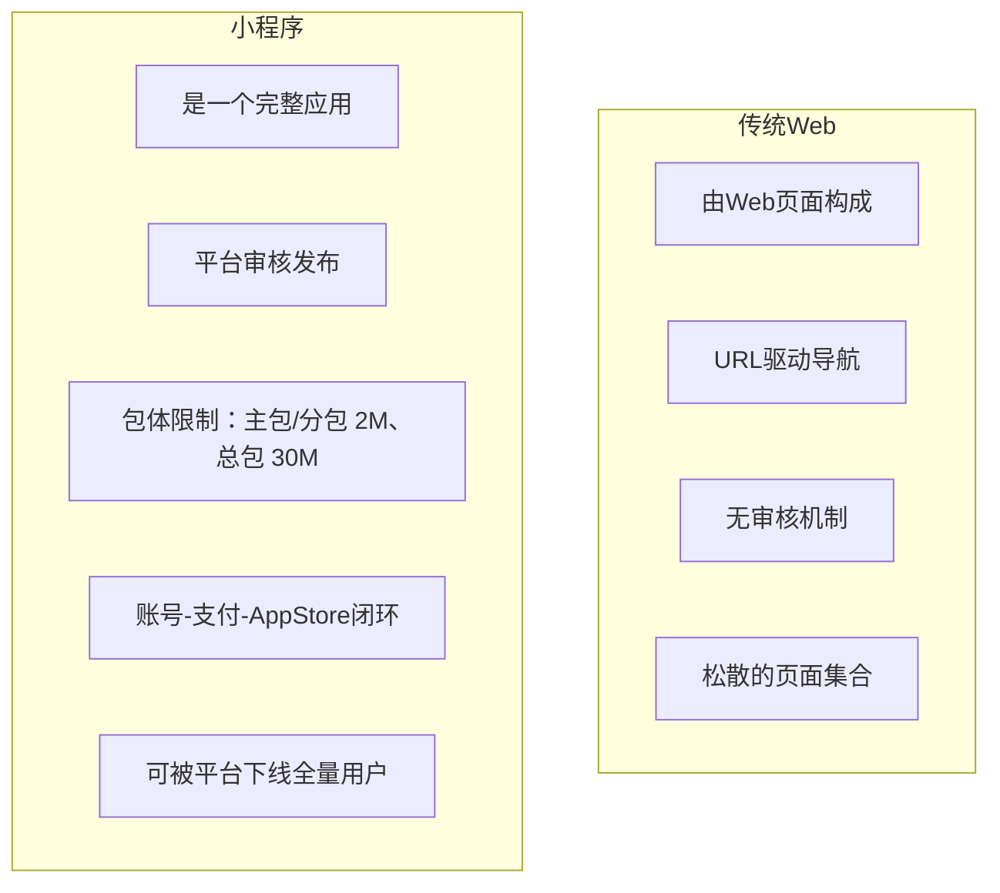

# Web开发-浏览器、小程序与PWA

## 章节导言

前面几讲我们从 Native 应用角度讨论了桌面软件开发，范围局限于单机软件。今天开始，我们进入浏览器时代——这不仅仅是增加了一个运行平台，而是**对桌面程序架构范式的根本性重构**。

许式伟指出，浏览器带来的变革可以从两个维度理解：**商业维度**上，它催生了软件服务化（SaaS，Software as a Service）、随时发布和跨平台三大进步；**架构维度**上，它颠覆了操作系统的窗口系统、重定义了界面绘制机制、引入了语言限制、并带来了 B/S 架构（Browser/Server，浏览器/服务器）的新挑战。理解这些变革的本质，是把握 Web 开发、小程序（Mini Program）和 PWA（渐进式 Web 应用，Progressive Web App）技术演进的关键。

---

## 核心概念与原理

### 浏览器：商业价值的三重跃迁

> **要点解读**：浏览器统一了运行环境与分发渠道，从而催生软件服务化、随时发布与跨平台三项商业价值，最终把开发者关注点从多平台适配收敛到 Web 标准。

### 浏览器对界面开发框架的四大颠覆

从界面开发框架的视角，浏览器带来了四项根本性变化：

#### 颠覆一：窗口系统被废除

在浏览器中，**一个网页只是一个窗口**，不再有父子窗口。所有界面元素（通用控件如 input/div，自绘窗口如 canvas）都是虚拟视图（Virtual View）。控件与图形的边界被淡化，事件分派通过统一机制完成。

#### 颠覆二：绘制机制从"命令式"变为"声明式"

这是最本质的变化：

| 维度 | Native GDI | HTML+CSS |
|------|-----------|----------|
| 本质 | **绘制**界面 | **声明**界面 |
| 方式 | 命令式：调用 DrawLine/DrawText | 声明式：描述结构+样式 |
| 局部更新 | 开发者自行实现（难点所在） | 浏览器自动处理 |
| 架构层级 | 相当于 View 层 | 实际是 ViewModel 层 |

**关键洞察**：HTML+CSS 不是 View 层，而是 **ViewModel 层**。View 层被浏览器自己实现了——修改 HTML DOM 时，浏览器自动更新 View，局部更新优化也由浏览器完成。

这正是[第22讲](13-桌面程序的架构建议.md)中讨论的 View 层局部更新难题的终极解决方案：**浏览器把 ViewModel 层标准化了，开发者不再需要自己处理局部更新**。

#### 颠覆三：语言限制

浏览器长期只支持 JavaScript 一门语言，这对开发者的技术选型形成了强约束。突破这一限制的尝试包括：

> **要点解读**：浏览器长期以来只支持 JavaScript 一门语言，突破路径分为三支——Dart 试图成为下一代语言但失败，TypeScript 等以编译转译为主流，WebAssembly 作为多语言桥接被视为最具潜力的方向。

#### 颠覆四：B/S 架构

B/S 架构对应用架构的影响是双重的：

- **Server 端**：从单用户变为多用户，数据可靠性的责任从用户转移到厂商
- **Browser 端**：仍然是单用户，但失去了数据的本地存储（数据全在 Server 端）

---

## Mermaid 图表：浏览器/PWA/小程序对比与 Web 架构演进

### 浏览器、小程序、PWA 全方位对比

> **要点解读**：三者技术路线相近但分发与掌控方式截然不同——Web 应用去中心化且开发者自主，小程序借助中心化 AppStore 实现完整商业闭环，PWA 则在标准 Web 之上用 Service Worker 补齐强离线能力。

### 小程序 vs PWA：关键差异对比

| 维度 | 小程序 | PWA |
|------|-------|-----|
| 演进思路 | 独立发展，与Web有较大差异 | 兼容并渐进改造Web标准 |
| 关注焦点 | 商业生态：撬动用户市场 | 技术标准：离线体验优化 |
| 分发方式 | 中心化AppStore，平台审核 | 去中心化，URL即入口 |
| 平台控制力 | 极强：可下线全量用户 | 极弱：开发者自主 |
| 商业闭环 | 账号-支付-AppStore 三位一体 | 无账号、无支付、无AppStore |
| 离线能力 | 包体限制下的有限能力 | Service Worker 强离线 |
| 操作系统代差 | 下一代OS（有商业闭环） | 传统OS（缺乏商业闭环） |
| 标准化 | 各厂商各自迭代，标准不统一 | W3C 标准化推进 |

### Web 架构的演进路径

> **要点解读**：Web 架构经历了从纯 Native、C/S、瘦 B/S、胖前端 SPA 到小程序与 PWA 的演进，二者的分叉点都在于如何处理商业化与平台控制力的取舍。

---

## 设计原则与权衡

### 原则一：HTML+CSS 本质是 ViewModel，不是 View

这一认知是理解 Web 开发架构的关键。在[第22讲](13-桌面程序的架构建议.md)中，我们讨论了 View 层局部更新的难题——在 Native 开发中，这是开发者必须自行解决的复杂问题。浏览器通过将 ViewModel 标准化（HTML+CSS），自动完成了 View 层的局部更新。

**这意味着浏览器下的 MVC 实际上是 MVMP（Model-ViewModel-Presenter）模式**——详见[第24讲](15-跨平台与Web开发的建议.md)的深入分析。

### 原则二：小程序是 Native 应用在线化，不是 PC Web 移动化

小程序和传统 Web 开发的本质差异：

小程序更像 Native App 的在线版本：需要提交审核、受平台管控、有完整的应用生命周期。**这是操作系统级别的商业范式**，而非简单的技术方案。

### 原则三：平台控制力是双刃剑

小程序平台的强控制力意味着：

- **正面**：质量把控、安全审核、用户体验统一
- **负面**：开发者命运被平台掌握，平台可下线拥有亿级用户的应用
- **矛盾**：所有厂商在拥抱微信的同时，必然时刻想着逃离微信

**刀刃，永远是两面的。** 这也是 Facebook 推出 Libra 时选择放弃 Control 的智慧所在——让一步，进一百步。

### 原则四：PWA 的技术优势与商业短板

PWA 在技术层面优于小程序（标准化、去中心化、强离线），但在商业层面存在根本性短板——**缺乏账号-支付-AppStore 的商业闭环**。从操作系统的角度看，PWA 相比小程序差了一个代际。

---

## 实践案例与反模式

### 案例：微信小程序的必然成功

许式伟在 2016 年微信小程序内测时，就判断其必然成功，核心逻辑是：**7 亿人同时使用的操作系统，在世界上极为罕见**。如果把不同 Android 厂商归为不同主体，微信小程序是当时世界上最大的单一来源的操作系统。

这一判断基于一个架构原则：**操作系统的核心价值是用户规模，而非技术先进性**。DOS 不如 Unix 精巧，但凭借 PC 用户规模成为主流；微信小程序不如 PWA 标准，但凭借用户规模成为事实上的操作系统。

### 反模式：忽视小程序标准分裂的风险

国内小程序厂商（微信、支付宝、快应用、头条）各自迭代，标准不统一。开发者"一次开发，到处可用"的愿望至今无法实现。与 Android 不同——Android 厂商虽多，但开发接口和工具链一致。

**教训**：在选择小程序平台时，必须考虑标准分裂带来的维护成本。优先选择用户规模最大的平台，避免在非主流平台上过度投入。

### 案例：七牛的快速投资决策

在判断微信小程序必然成功后，许式伟一个月内做出了七牛的第一笔对外投资——"即速应用"，帮助企业快速构建小程序。这个案例展示了**技术判断力驱动商业决策**的模式：先看懂技术趋势，再快速行动。

### 反模式：在 PWA 上构建封闭生态

PWA 的本质是开放标准，试图在 PWA 上构建类似小程序的封闭生态（如强制审核、集中分发）是方向性错误。PWA 的价值恰恰在于去中心化——开发者应利用 PWA 的开放性来规避平台锁定风险。

---

## 小结与关键要点

1. **浏览器从商业和架构两个维度颠覆了桌面开发**：商业维度催生软件服务化、随时发布、跨平台；架构维度废除窗口系统、引入声明式界面、限制语言选择、带来 B/S 架构。
2. **HTML+CSS 本质是 ViewModel 层**：浏览器自动完成 View 层的局部更新，开发者只需操作 ViewModel（DOM），这是 Web 开发效率远超 Native 的根本原因。
3. **小程序是 Native 应用在线化**：它不是一个 Web 页面集合，而是一个受平台管控的完整应用，具备账号-支付-AppStore 的商业闭环，是下一代操作系统的形态。
4. **PWA 是技术更先进但商业更薄弱的方案**：标准化、去中心化、强离线是优势，但缺乏商业闭环是致命短板。
5. **平台控制力是双刃剑**：小程序的强控制力既保证了生态质量，也让开发者面临被平台"掐脖子"的风险。
6. **操作系统的核心价值是用户规模**：技术先进性不如用户规模重要，这是微信小程序必然成功的底层逻辑。

> **交叉引用**：本章讨论的浏览器架构颠覆，是[第24讲](15-跨平台与Web开发的建议.md)中 MVMP 模式和 Web 开发架构的基础。HTML+CSS 作为 ViewModel 的认知，直接继承了[第22讲](13-桌面程序的架构建议.md)中 MVC/MVP/MVVM 的架构分析。
