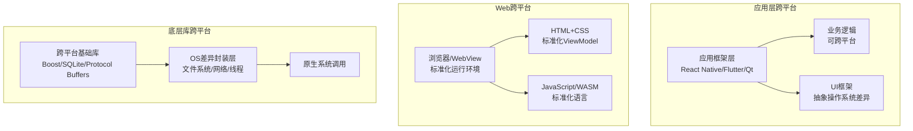
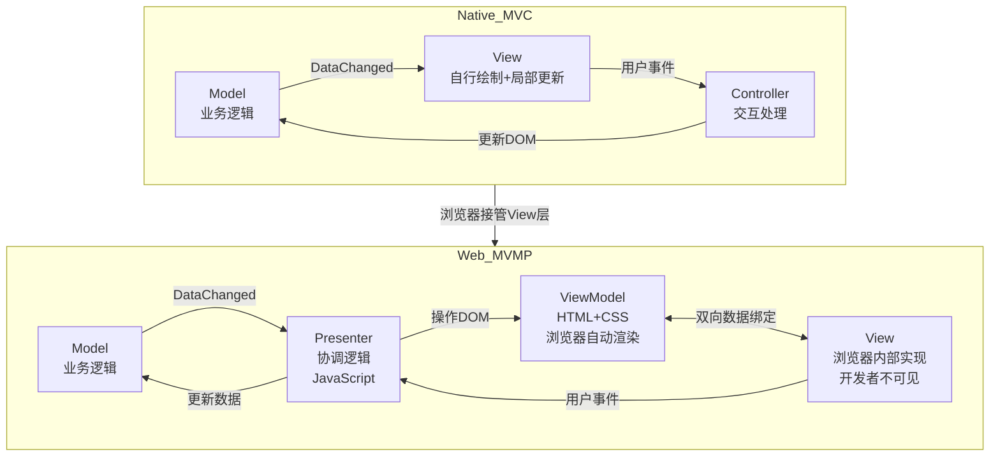
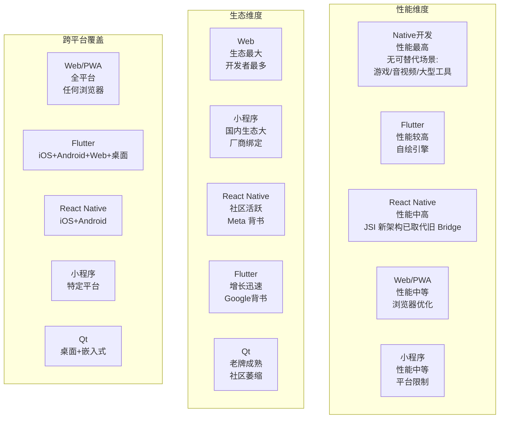
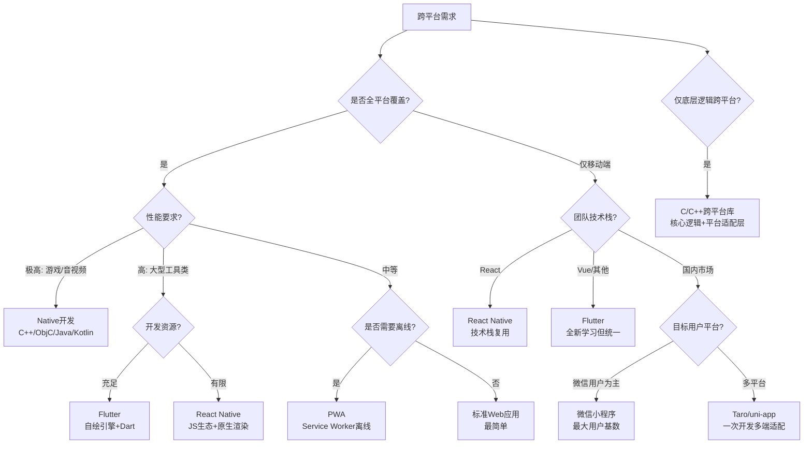
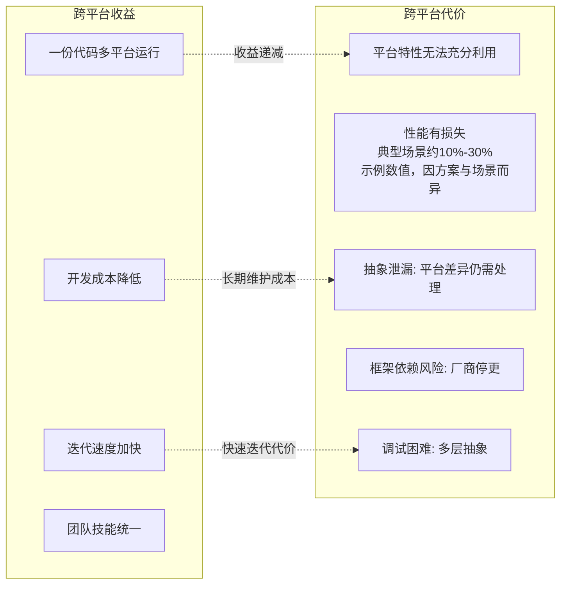

# 跨平台与Web开发的建议

## 章节导言

跨平台是桌面开发永恒的命题。从早期的 Java "Write Once, Run Anywhere"，到移动时代的 React Native、Flutter、小程序，再到 PWA 的渐进式 Web 理念，跨平台方案层出不穷，但"一次编写，到处运行"的理想至今未能完美实现。

许式伟对跨平台开发有一个核心判断：**Web 开发是桌面开发的未来**。但这个判断不是基于技术优劣，而是基于商业和生态演进的必然——正如 DOS 取代 Unix、Windows 取代 OS/2，胜出的往往不是技术最优的方案，而是生态最繁荣的方案。

本节将系统梳理跨平台技术方案的分类与权衡，并给出架构层面的选择建议。

---

## 核心概念与原理

### 跨平台的三层抽象模型

跨平台的本质是在不同操作系统之上建立一层抽象。根据抽象层次的不同，跨平台方案可以分为三类：

> **要点解读**：跨平台的核心是在不同操作系统之上建立一层抽象，依抽象层次高低可分为应用框架层、Web 层与底层库三层，抽象越靠近系统则越贴近原生、性能越高，但跨平台能力也越弱。

### 跨平台方案的四大流派

| 流派 | 代表方案 | 抽象层次 | 跨平台范围 | 性能 | 生态 |
|------|---------|---------|-----------|------|------|
| **Web 方案** | PWA、H5 | 最高（浏览器级别） | 全平台 | 中等 | 最大 |
| **小程序方案** | 微信/支付宝/快应用 | 较高（类Web定制框架） | 各小程序平台 | 中等 | 国内大 |
| **应用框架方案** | React Native / Flutter / Qt | 中等（UI框架级别） | 移动端/桌面端 | 较高 | 中等 |
| **底层库方案** | C/C++ 跨平台库 | 最低（系统调用封装） | 全平台 | 最高 | 最小 |

### MVMP：Web 环境下的 MVC 演进

在[第22讲](13-桌面程序的架构建议.md)中，我们讨论了 MVC/MVP/MVVM 的演进。在 Web 环境下，这一演进有了新的形态——**MVMP（Model-ViewModel-Presenter）**。

**MVMP 的关键洞察**：

- **ViewModel 层被标准化为 HTML+CSS**：开发者不再需要自己实现 ViewModel 的局部更新逻辑
- **View 层被浏览器接管**：开发者看不见也碰不到 View 层，浏览器负责 ViewModel → View 的自动渲染
- **Presenter 层替代 Controller**：功能等价，但在 Web 语境下更强调"协调 Model 和 ViewModel"的角色

---

## Mermaid 图表：跨平台技术对比与选型决策树

### 跨平台技术方案全景对比

> **要点解读**：跨平台方案各自在性能与生态之间权衡——Native 性能最优但生态封闭，Flutter 用自绘引擎逼近原生性能，React Native 依托 JS 生态，Web 方案生态最大而性能中等。

### 跨平台技术选型决策树

> **要点解读**：选型决策树以"覆盖范围—性能—离线—团队技术栈—目标平台"层层展开，最终在 Native、Flutter、React Native、PWA、小程序与 C/C++ 底层库之间做出取舍。

### 跨平台代价分析

> **要点解读**：跨平台收益随时间边际递减，代价却随抽象层增多而累积——平台特性难用尽、性能损失、抽象泄漏、框架停更与多层调试都是长期成本。

---

## 设计原则与权衡

### 原则一：Web 开发是桌面开发的未来

这不是技术判断，而是**商业与生态的判断**。理由如下：

1. **浏览器是用户规模最大的"操作系统"**：所有智能设备都有浏览器
2. **Web 标准由 W3C 维护，不依赖单一厂商**：与小程序的平台锁定形成对比
3. **Web 开发者数量远超其他技术栈**：人才供给决定了生态繁荣度
4. **PWA 在持续增强 Web 的 Native 能力**：离线、推送、后台同步等

**Trade-off**：Web 方案在性能和平台特性利用上不如 Native，但在开发效率、分发效率和人才供给上具有压倒性优势。对于大多数应用场景，这个 Trade-off 是有利的。

### 原则二：Model 层跨平台是基础，View 层跨平台是增值

从[第22讲](13-桌面程序的架构建议.md)的架构分析可知，Model 层是最底层、最稳定、最与平台无关的层。因此：

- **基础策略**：先确保 Model 层跨平台（C/C++ 库或服务端 API），再考虑 View 层
- **增值策略**：View 层跨平台是锦上添花，但不应以牺牲 Model 层的独立性为代价
- **反模式**：先选 UI 框架（如 Flutter/React Native），再让 Model 层适应框架——这会导致 Model 层被框架绑架

### 原则三：选型应基于商业约束，而非技术偏好

技术选型的第一考量不是"哪个框架更优雅"，而是：

| 约束维度 | 关键问题 |
|---------|---------|
| 目标用户 | 用户在哪个平台上？国内还是国际？ |
| 团队能力 | 团队擅长什么技术栈？学习成本可接受吗？ |
| 性能需求 | 是否有音视频/游戏/大型计算等高性能场景？ |
| 商业模式 | 是否依赖平台生态（支付、账号、分发）？ |
| 长期维护 | 框架的可持续性如何？厂商是否可能停更？ |

### 原则四：小程序的碎片化是不可忽视的风险

国内小程序市场已分裂为微信、支付宝、快应用、头条等多个平台，标准不统一。应对策略：

1. **选择用户规模最大的平台优先**：微信小程序
2. **使用跨小程序框架**：Taro、uni-app 等一次开发多端适配
3. **核心逻辑（Model 层）与小程序框架解耦**：避免被特定小程序 API 绑定

### 原则五：WebAssembly 是值得关注的技术方向

WebAssembly（WASM）有望打破浏览器的语言限制，使得 C/C++/Rust 等语言编写的核心逻辑可以直接在浏览器中运行。这意味着：

- **Model 层可以用 C/C++ 实现，编译为 WASM 在浏览器中运行**
- **性能敏感的计算（图像处理、加密、物理模拟）可以在 WASM 中实现**
- **现有 C/C++ 库可以复用**，无需用 JavaScript 重写

---

## 实践案例与反模式

### 案例：七牛的跨平台策略

七牛的产品覆盖服务端 SDK、客户端 SDK 和 Web 控制台。其跨平台策略是：

1. **核心逻辑用 Go 实现**（服务端），客户端 SDK 只做 API 封装
2. **Web 控制台用标准 Web 技术栈**，不依赖任何 Native 能力
3. **不追求"一次编写，到处运行"**，而是"一份设计，各自实现"——核心逻辑（Model 层）跨平台，界面（View 层）各平台原生

### 反模式：用 Flutter 重写已有的 Native 应用

某电商公司为了"统一技术栈"，将成熟的 iOS/Android 原生应用用 Flutter 重写。结果：

- 重写期间新功能开发停滞半年
- Flutter 的平台差异处理（如键盘行为、输入法）消耗大量精力
- 用户投诉体验不如原版
- 团队需要学习全新的 Dart 语言和 Flutter 框架

**教训**：跨平台的价值在于新项目的效率提升，而非已有项目的重写。已有的 Native 应用应逐步引入跨平台组件，而非推倒重来。

### 案例：Taro 的多端适配实践

Taro 是京东凹凸实验室推出的多端统一开发框架，支持微信/支付宝/百度/头条等小程序和 H5。其核心思路是：

- 使用 React 语法编写代码
- 编译时转换为各小程序平台的原生语法
- Model 层与平台无关，View 层由编译器处理差异

这种方案有效缓解了小程序碎片化问题，但仍有边界——某些平台特有 API 无法完全抽象。

### 反模式：在 Web 应用中模拟 Native 控件

某团队为了让 Web 应用"看起来像 Native"，用 CSS 模拟了 iOS 原生控件的样式。结果：

- 每次 iOS 更新设计规范都需要同步更新 CSS
- 辅助功能（VoiceOver）无法正常工作
- 性能不如原生控件

**教训**：Web 应用应该拥抱 Web 的交互范式，而非模拟 Native。用户并不关心应用是 Web 还是 Native——他们关心的是体验是否流畅、功能是否完整。

---

## 小结与关键要点

1. **跨平台方案分为四大流派**：Web 方案、小程序方案、应用框架方案、底层库方案。选择的关键是明确抽象层次和 Trade-off。
2. **Web 开发是桌面开发的未来**：这是基于商业和生态的判断，而非技术优劣。浏览器是用户规模最大的"操作系统"，Web 开发者供给最充足。
3. **MVMP 是 Web 环境下的 MVC 演进**：ViewModel 层被 HTML+CSS 标准化，View 层被浏览器接管，开发者只需关注 Model 和 Presenter。
4. **Model 层跨平台是基础策略**：先确保核心逻辑的跨平台能力，再考虑 View 层的跨平台。
5. **选型应基于商业约束**：目标用户、团队能力、性能需求、商业模式、长期维护——这些比技术偏好更重要。
6. **WebAssembly 值得关注**：它有望打破浏览器语言限制，让 C/C++ 核心逻辑在浏览器中运行。
7. **小程序碎片化是现实风险**：优先选择最大平台，使用跨小程序框架，确保核心逻辑与平台解耦。

> **交叉引用**：本章的 MVMP 模式是[第23讲](14-Web开发-浏览器、小程序与PWA.md)中浏览器架构颠覆的直接延伸，选型建议的架构基础来自[第22讲](13-桌面程序的架构建议.md)的 MVC 分层分析。Web 开发趋势的进一步讨论见[第25讲](16-桌面开发的未来.md)。
