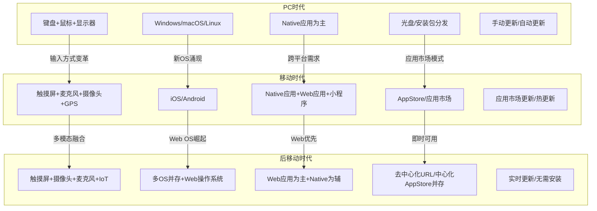
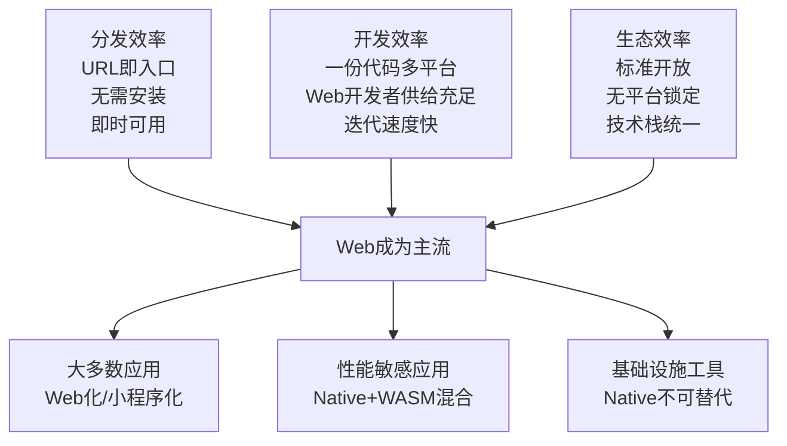
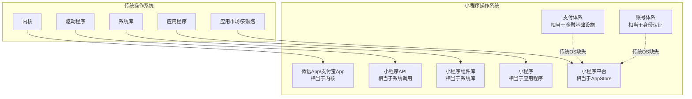
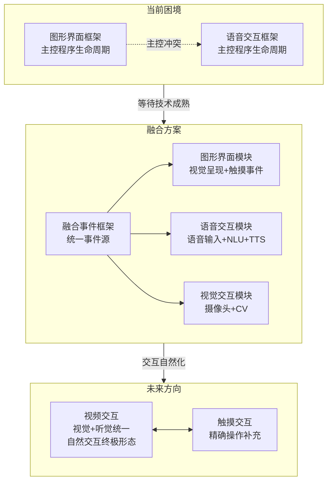
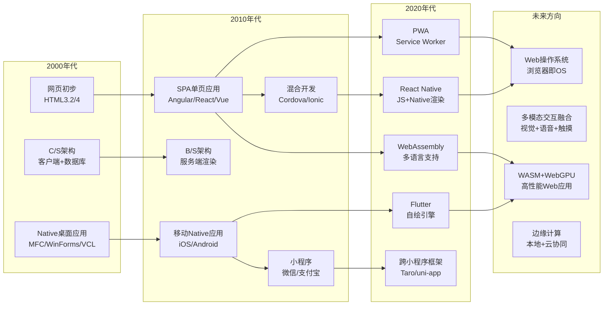
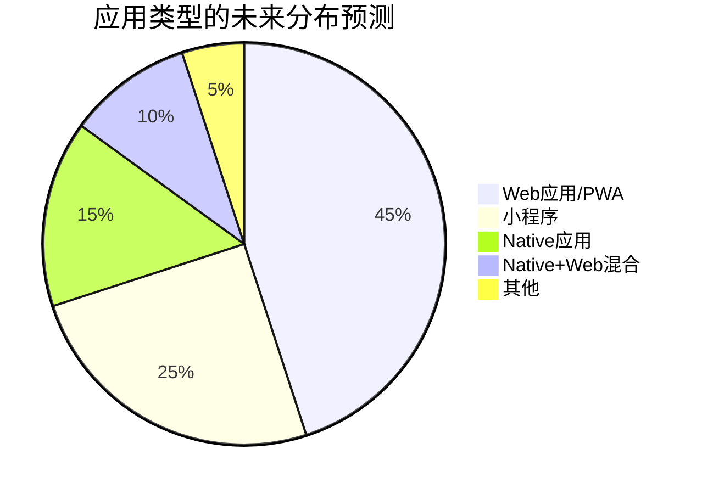
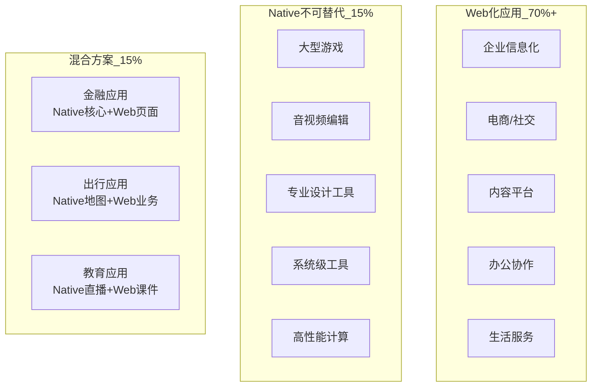
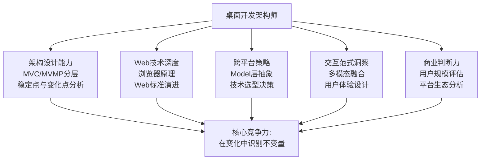

# 桌面开发的未来

## 章节导言

从[第20讲](11-桌面开发的宏观视角.md)到[第24讲](15-跨平台与Web开发的建议.md)，我们系统审视了桌面开发的技术演进、架构范式和跨平台策略。现在，让我们把目光投向未来。

许式伟的核心预判是：**桌面开发的未来是 Web 开发**。但这个判断需要精准理解——不是说 Native 开发会消失，而是说**主流应用的开发范式将从 Native 为主转向 Web 为主**。正如 PC 时代 DOS 取代了 Unix 的桌面地位、Windows 取代了 OS/2，技术胜出从来不是纯技术的胜利，而是生态的胜利。

与此同时，交互范式的演进不会停步。从图形界面到触摸交互，再到多模态智能交互，桌面开发正在经历一次更深层的范式变革。

---

## 核心概念与原理

### 从 PC 到手机：桌面开发的范式转移

### Web 成为桌面开发主流的驱动力

Web 成为桌面开发主流不是偶然，而是三股力量共同作用的结果：

### 小程序：下一代操作系统的雏形

许式伟认为小程序是下一代操作系统的雏形，核心逻辑在于：

小程序与传统操作系统的关键差异在于**商业闭环**——传统操作系统缺乏账号体系和支付体系，而小程序平台天然具备这两者。这使得小程序平台不仅仅是技术平台，更是**商业生态**。

### 多模态交互的融合挑战

从[第20讲](11-桌面开发的宏观视角.md)的分析可知，交互范式正从图形界面向多模态智能交互演进。这一演进在架构层面面临核心挑战：

**许式伟的关键预判**：未来交互的终局不是语音交互，而是**视频交互**（兼顾视觉和听觉）与触摸屏的完美融合。语音交互只是多模态交互的一个中间态——它缺少视觉通道，在需要精确操作的场景下显得力不从心。

---

## Mermaid 图表：桌面开发趋势路线图

### 桌面开发技术演进路线图

### 应用类型的未来分布

---

## 设计原则与权衡

### 原则一：拥抱 Web，但不放弃 Native 的核心价值

Web 化是趋势，但 Native 在以下领域具有不可替代的优势：

| 领域 | Native 优势 | Web 劣势 |
|------|-----------|---------|
| 游戏渲染 | 直接 GPU 访问 | WebGPU 仍在发展中 |
| 音视频处理 | 硬件编解码 | 编解码器支持有限 |
| 系统集成 | 完整系统 API | 浏览器沙箱限制 |
| 启动速度 | 本地代码执行 | JS 解析+JIT 预热 |
| 内存控制 | 精细内存管理 | GC 不可控 |

**策略**：对于性能敏感的核心模块，使用 Native 或 WASM 实现，通过 Web 应用调用——这是"Native 核心 + Web 界面"的混合策略。

### 原则二：关注 Web 标准的演进方向

Web 标准正在持续增强 Native 能力：

| 标准 | 能力 | 状态 |
|------|------|------|
| Service Worker | 离线缓存、后台同步 | 已标准化 |
| WebAssembly | 多语言支持、高性能计算 | 已标准化 |
| WebGPU | GPU 计算、高级渲染 | 推进中 |
| WebNN | 神经网络推理 | 推进中 |
| WebUSB/WebBluetooth | 硬件访问 | 部分实现 |
| File System Access | 本地文件读写 | 部分实现 |
| Web Share | 系统级分享 | 已标准化 |

每一个新标准的落地，都意味着一类 Native 应用的 Web 化成为可能。

### 原则三：架构设计应面向未来交互范式

在[第20讲](11-桌面开发的宏观视角.md)中，我们讨论了交互范式的演进方向。架构设计应为此做好准备：

1. **Model 层与交互范式无关**：无论交互方式如何变化，业务逻辑（Model 层）应保持稳定
2. **Controller 层可正交分解**：不同交互范式的 Controller 可以独立开发、独立替换
3. **View 层可适配**：同一 Model 可以适配不同的呈现方式（视觉、语音、触觉反馈）

这正是[第22讲](13-桌面程序的架构建议.md)中 MVC 架构的远见——**好的架构让交互范式的演进成为 Controller/View 层的替换，而非整体重构**。

### 原则四：操作系统的本质是用户规模

许式伟反复强调一个观点：**操作系统的本质不是技术，而是用户规模**。DOS 技术不如 Unix，但用户规模更大；Windows 技术不如 OS/2，但用户规模更大；Android 厂商众多但标准统一，用户规模碾压 iOS。

同理，小程序之所以能成为下一代操作系统的雏形，不是因为技术先进（PWA 技术上更先进），而是因为微信拥有亿级用户规模。

**架构师的启示**：在做技术选型时，"哪个平台的用户更多"比"哪个平台的技术更先进"更重要。

### 原则五：关注 WASM + WebGPU 的融合潜力

WASM 提供了多语言和高性能计算能力，WebGPU 提供了 GPU 渲染和计算能力。两者的融合意味着：

- **游戏可以在浏览器中运行**，无需安装客户端
- **专业设计工具**（Photoshop 级别）可以在浏览器中实现
- **音视频编辑**可以在浏览器中完成
- **AI 推理**可以在浏览器中执行（WebNN）

这将进一步压缩 Native 应用的不可替代空间。

---

## 实践案例与反模式

### 案例：Figma 的 Web 应用突破

Figma 是设计工具 Web 化的标杆。它使用 C++ 编写核心渲染引擎，编译为 WASM 在浏览器中运行，实现了与 Native 设计工具（Sketch）相当甚至更好的性能。这个案例证明了：

1. **WASM 可以将高性能 C++ 逻辑搬到浏览器**
2. **Web 应用可以胜任专业级工具场景**
3. **Web 化带来了 Native 无法比拟的优势**：实时协作、无需安装、跨平台

### 反模式：在所有场景下盲目 Web 化

某金融公司将交易终端 Web 化，结果高频交易场景下延迟从微秒级升到毫秒级，无法满足交易需求。**Web 化不是万能药**——对延迟和性能有极端要求的场景，Native 仍然是唯一选择。

### 案例：微信小程序的商业闭环

微信小程序的成功不仅在于技术，更在于商业闭环：
- **账号体系**：微信登录，无需注册
- **支付体系**：微信支付，一键付款
- **分发体系**：小程序搜索、扫码、分享，多种触达方式
- **社交传播**：微信群、朋友圈，天然裂变

这个闭环让小程序从"技术方案"升级为"商业基础设施"。任何试图复制小程序的方案，如果只复制技术而忽视商业闭环，都难以成功。

### 展望：桌面开发架构师的能力模型

面对未来，桌面开发架构师需要构建以下能力模型：

---

## 小结与关键要点

1. **Web 开发是桌面开发的未来**：这是基于商业和生态的判断。浏览器是用户规模最大的"操作系统"，Web 开发者供给最充足，Web 标准持续增强 Native 能力。
2. **小程序是下一代操作系统的雏形**：它不仅提供了技术平台，更构建了账号-支付-AppStore 的商业闭环——这是传统操作系统缺失的关键要素。
3. **交互范式的终局是视频交互与触摸的融合**：语音交互只是中间态，视频交互（视觉+听觉）才是多模态交互的终极形态。
4. **Native 在性能敏感领域仍不可替代**：游戏、音视频、专业工具、系统集成——这些领域的 Native 优势短期内不会被 Web 取代。
5. **WASM + WebGPU 是 Web 突破性能边界的关键**：Figma 的成功证明，C++ 核心逻辑编译为 WASM 可以在浏览器中实现专业级性能。
6. **操作系统的本质是用户规模**：技术选型应优先考虑用户规模，而非技术先进性。
7. **好的架构让交互范式演进成为层的替换**：Model 层与交互无关，Controller 层可正交分解，View 层可适配——这是应对未来变化的架构保障。

> **交叉引用**：本章的交互范式演进预测是[第20讲](11-桌面开发的宏观视角.md)的延伸，Web 化趋势分析是[第23讲](14-Web开发-浏览器、小程序与PWA.md)和[第24讲](15-跨平台与Web开发的建议.md)的综合，架构建议的实践是[第22讲](13-桌面程序的架构建议.md) MVC 分层方法的终极验证。
