# 实战-怎么设计一个"画图"程序

## 导言：从需求到架构的完整推演

在桌面开发篇的理论铺垫之后，我们需要一个实战案例将架构思维落地。画图程序（类似 Windows 画笔或 macOS 的画图板）是一个经典的桌面应用——它既具备足够的复杂度来验证架构设计的有效性，又足够直观，便于我们逐步推演从需求到架构的完整过程。

本系列的核心问题是：**如何从一个模糊的产品需求出发，推导出合理的程序骨架，并逐步演进为一个支持联网协作的完整架构？** 这不是编码问题，而是架构思维的问题。

```mermaid
graph LR
    subgraph 一·需求分析与领域建模
        A1[需求分层 P0/P1/P2]
        A2[核心概念识别]
        A3[Shape继承体系]
    end

    subgraph 二·MVC架构与渲染系统
        B1[保留模式渲染]
        B2[脏区域重绘]
        B3[双缓冲与坐标变换]
    end

    subgraph 三·交互设计与工具系统
        C1[Tool策略模式]
        C2[状态机建模]
        C3[预览与命中测试]
    end

    subgraph 四·命令模式与撤销重做
        D1[Command封装]
        D2[双栈历史管理]
        D3[网络协议映射]
    end

    subgraph 五·完整架构与总结
        E1[离线优先]
        E2[OT/CRDT冲突解决]
        E3[Model厚度演进]
    end

    A1 --> A2 --> A3
    A3 --> B1
    A3 --> C1
    B1 --> C1
    C1 --> D1
    D1 --> E1
    D3 --> E1

```

> **关联阅读**：本实战系列是桌面开发篇的核心实践，建议结合第 21 讲"图形界面程序的框架"、第 22 讲"桌面程序的架构建议"中 MVC 模式的讨论来理解。

---

## 一、需求分析与领域建模

### 1.1 功能边界的确立

画图程序的核心功能可以用一句话概括：**用户通过鼠标操作，在画布上绘制和编辑各种图形元素**。但这句话过于笼统，我们需要将其分解为可操作的需求边界。

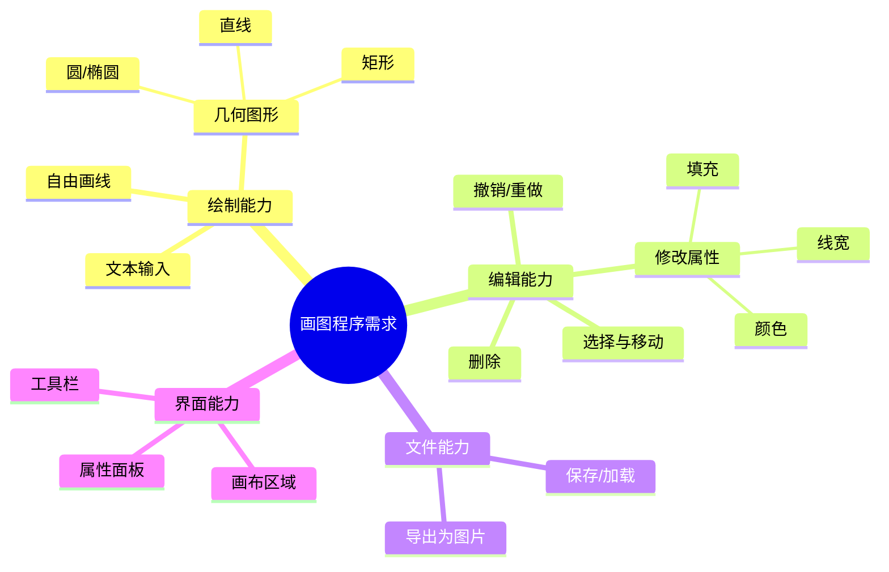
```mermaid
mindmap
  root((画图程序需求))
    绘制能力
      自由画线
      几何图形
        矩形
        圆/椭圆
        直线
      文本输入
    编辑能力
      选择与移动
      修改属性
        颜色
        线宽
        填充
      删除
      撤销/重做
    文件能力
      保存/加载
      导出为图片
    界面能力
      工具栏
      属性面板
      画布区域
```

### 1.2 需求的优先级分层

许式伟强调，架构设计的第一步不是画架构图，而是**对需求做减法**。我们需要将需求分为三层：

| 层次 | 需求 | 架构含义 |
|------|------|----------|
| **P0 核心需求** | 绘制多种图形、选择/移动/删除图形 | 决定数据模型与核心交互架构 |
| **P1 重要需求** | 撤销/重做、修改属性、保存/加载 | 决定状态管理与持久化架构 |
| **P2 增强需求** | 导出图片、多选、图层 | 决定扩展性设计 |

> **架构洞察**：P0 需求决定架构骨架，P1 需求验证架构弹性，P2 需求考验架构边界。过早为 P2 设计是过度工程，但架构不能让 P2 变得不可能。

### 1.3 识别核心概念

从需求出发，我们识别出以下领域概念：

- **Document（文档）**：一个画图文件，是持久化的基本单位
- **Shape（图形）**：文档中的基本元素，是操作的基本单位
- **Tool（工具）**：用户交互的入口，决定了鼠标操作的含义
- **Canvas（画布）**：图形的显示与交互区域

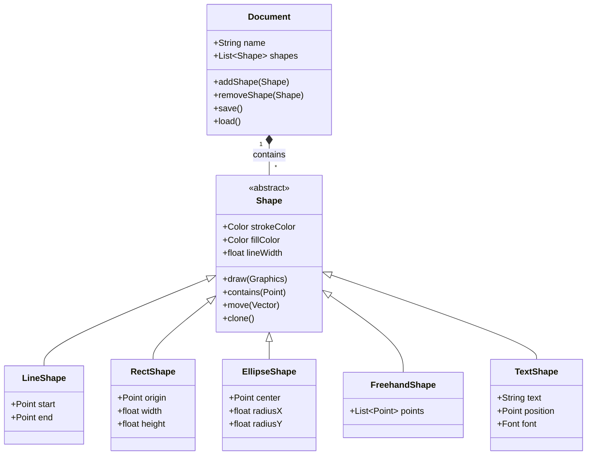
```mermaid
classDiagram
    class Document {
        +String name
        +List~Shape~ shapes
        +addShape(Shape)
        +removeShape(Shape)
        +save()
        +load()
    }

    class Shape {
        <<abstract>>
        +Color strokeColor
        +Color fillColor
        +float lineWidth
        +draw(Graphics)
        +contains(Point)
        +move(Vector)
        +clone()
    }

    class LineShape {
        +Point start
        +Point end
    }

    class RectShape {
        +Point origin
        +float width
        +float height
    }

    class EllipseShape {
        +Point center
        +float radiusX
        +float radiusY
    }

    class FreehandShape {
        +List~Point~ points
    }

    class TextShape {
        +String text
        +Point position
        +Font font
    }

    Document "1" *-- "*" Shape : contains
    Shape <|-- LineShape
    Shape <|-- RectShape
    Shape <|-- EllipseShape
    Shape <|-- FreehandShape
    Shape <|-- TextShape
```

### 1.4 Shape 继承体系的设计考量

Shape 的继承体系是画图程序领域模型的核心。这里有一个关键的架构决策：**Shape 的公共接口应该包含什么？**

许式伟的观点是：**接口应当反映"所有图形共有的行为"，而非"所有图形共有的属性"**。属性因图形类型而异，但行为是一致的：

- `draw(Graphics)`：所有图形都能绘制自己
- `contains(Point)`：所有图形都能做命中测试
- `move(Vector)`：所有图形都能移动
- `clone()`：所有图形都能复制

这种设计遵循了**行为抽象优于数据抽象**的原则——接口定义的是"能做什么"而非"有什么属性"。

### 1.5 组合模式的应用

更高级的设计可以考虑组合模式（Composite Pattern），允许图形之间的组合：

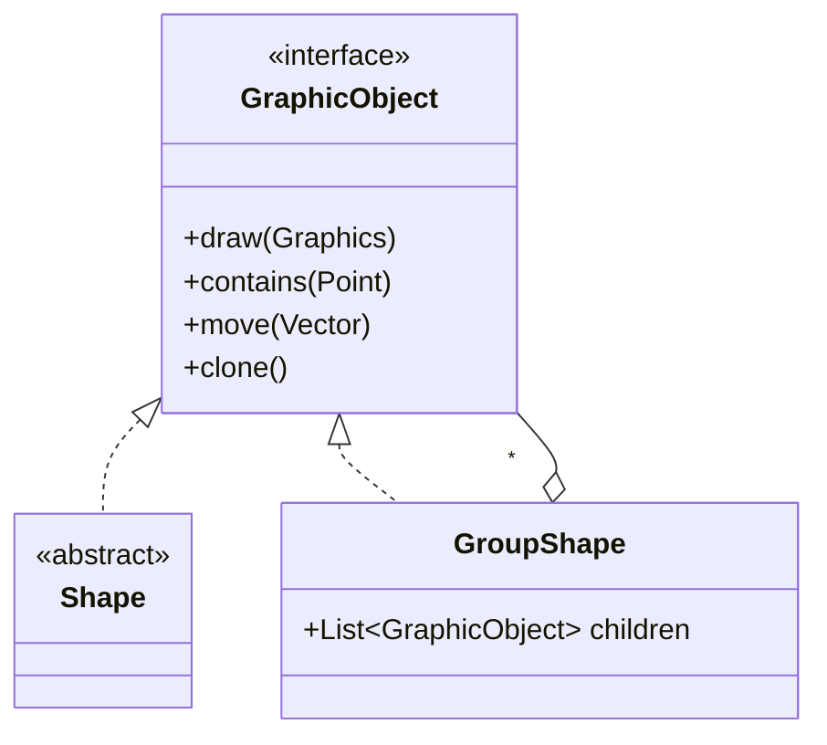
```mermaid
classDiagram
    class GraphicObject {
        <<interface>>
        +draw(Graphics)
        +contains(Point)
        +move(Vector)
        +clone()
    }

    class Shape {
        <<abstract>>
    }

    class GroupShape {
        +List~GraphicObject~ children
    }

    GraphicObject <|.. Shape
    GraphicObject <|.. GroupShape
    GroupShape o-- "*" GraphicObject
```

> **关联参考**：组合模式在架构层面的意义，参见《编程语言：面向对象》中"组合优于继承"的讨论。

### 1.6 MVC 架构的引入

画图程序天生适合 MVC 架构，因为它的三个核心关注点天然分离：

| MVC 组成 | 画图程序对应 | 职责 |
|----------|-------------|------|
| **Model** | Document + Shapes | 管理图形数据与业务逻辑 |
| **View** | Canvas | 渲染图形、响应绘制请求 |
| **Controller** | Tool | 将用户输入转化为对 Model 的操作 |

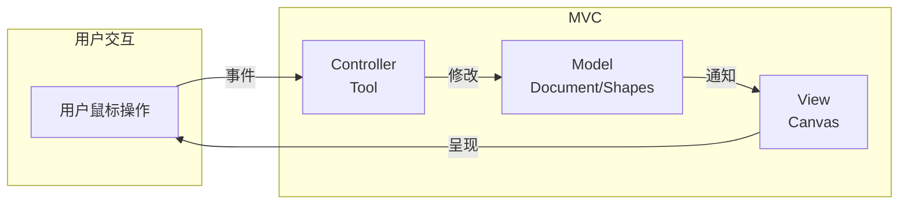
```mermaid
graph LR
    subgraph 用户交互
        U[用户鼠标操作]
    end

    subgraph MVC
        C[Controller<br/>Tool]
        M[Model<br/>Document/Shapes]
        V[View<br/>Canvas]
    end

    U -->|事件| C
    C -->|修改| M
    M -->|通知| V
    V -->|呈现| U

```

以"绘制一个矩形"为例，完整的 MVC 交互流程如下：

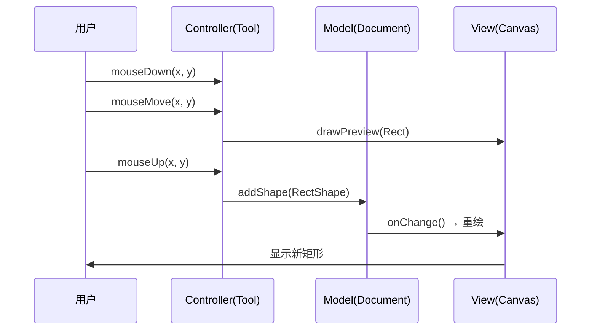
```mermaid
sequenceDiagram
    participant User as 用户
    participant Tool as Controller(Tool)
    participant Doc as Model(Document)
    participant Canvas as View(Canvas)

    User->>Tool: mouseDown(x, y)
    User->>Tool: mouseMove(x, y)
    Tool->>Canvas: drawPreview(Rect)
    User->>Tool: mouseUp(x, y)
    Tool->>Doc: addShape(RectShape)
    Doc->>Canvas: onChange() → 重绘
    Canvas->>User: 显示新矩形
```

许式伟特别强调 Model 的独立性：

> **Model 必须是完全自洽的**——它不应该知道 View 和 Controller 的存在。Model 的正确性不依赖于任何特定的 UI 呈现。

这意味着：
1. Model 不持有 View 的引用
2. Model 通过观察者模式（Observer）通知变化
3. 所有业务逻辑（命中测试、图形编辑）都在 Model 内完成

### 1.7 从最小可运行版本开始

架构设计不是纸上谈兵，需要通过代码验证。第一版应该：

1. 实现 `Shape` 基类和 `RectShape`
2. 实现 `Document` 的基本增删操作
3. 实现 `RectangleTool` 的完整流程
4. 实现 `Canvas` 的基本渲染
5. 让整个 MVC 闭环跑通

在第一版完成后，需要验证：

- [ ] 新增一种图形类型，需要改动几个文件？（应只加一个 Shape 子类）
- [ ] 新增一种工具，是否影响 Model？（不应影响）
- [ ] 修改渲染方式，是否影响 Model？（不应影响）
- [ ] 支持撤销/重做，Model 的接口需要怎么变？

---

## 二、MVC架构与渲染系统

### 2.1 渲染架构：立即模式 vs 保留模式

| 维度 | 立即模式（Immediate Mode） | 保留模式（Retained Mode） |
|------|--------------------------|--------------------------|
| **数据所有权** | 渲染时重建 | 持久化保存 |
| **绘制触发** | 每帧全量绘制 | 按需局部重绘 |
| **状态管理** | 无状态 | 有状态 |
| **典型代表** | ImGui、HTML Canvas 2D | DOM、WPF、Cocoa |
| **适合场景** | 工具类 UI | 复杂文档类应用 |

画图程序的 View 必须采用保留模式，原因有二：

1. **Model 即数据源**：Document 中持久保存了所有 Shape，View 无需每帧重建
2. **按需重绘**：只有变化的区域需要重绘，这是性能的基本保障

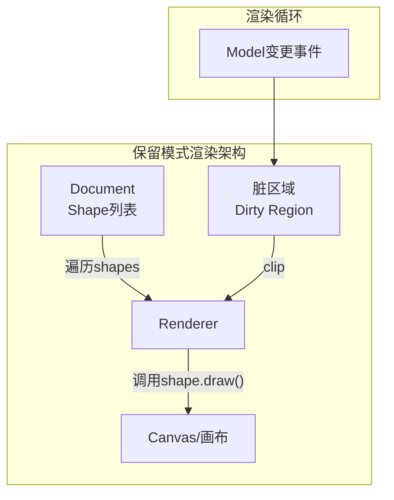
```mermaid
graph TB
    subgraph 保留模式渲染架构
        M[Document<br/>Shape列表] --> |"遍历shapes"| R[Renderer]
        R --> |"调用shape.draw()"| C[Canvas/画布]
        DC[脏区域<br/>Dirty Region] --> |"clip"| R
    end

    subgraph 渲染循环
        E[Model变更事件] --> DC
    end

```

保留模式下的渲染流程：

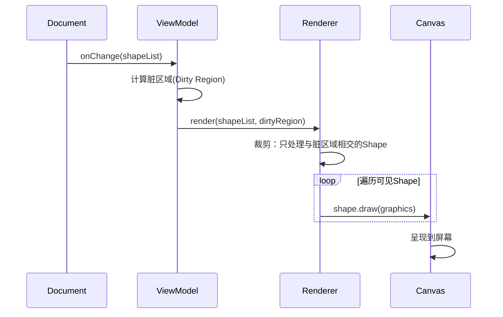
```mermaid
sequenceDiagram
    participant Doc as Document
    participant VM as ViewModel
    participant Renderer as Renderer
    participant Canvas as Canvas

    Doc->>VM: onChange(shapeList)
    VM->>VM: 计算脏区域(Dirty Region)
    VM->>Renderer: render(shapeList, dirtyRegion)
    Renderer->>Renderer: 裁剪：只处理与脏区域相交的Shape
    loop 遍历可见Shape
        Renderer->>Canvas: shape.draw(graphics)
    end
    Canvas->>Canvas: 呈现到屏幕
```

### 2.2 重绘策略：从全量重绘到局部重绘

**全量重绘（最简方案）**：每次 Model 变更后，清除画布并重新绘制所有图形。

```c
void onModelChange() {
    canvas.clear();
    for (shape in document.shapes) {
        shape.draw(canvas.graphics);
    }
}
```

优点：实现简单，不会出现渲染不一致的 bug。缺点：图形数量多时性能差。

**局部重绘（脏区域方案）**：核心思路是只重绘变化的区域。

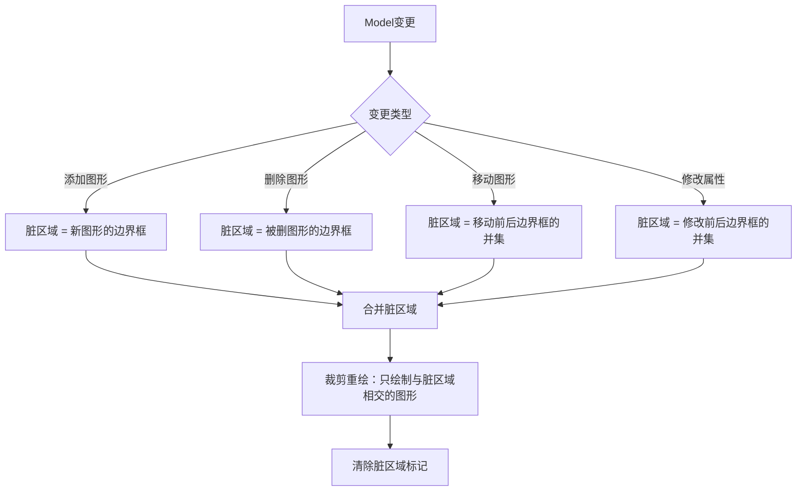
```mermaid
flowchart TD
    A[Model变更] --> B{变更类型}
    B -->|添加图形| C[脏区域 = 新图形的边界框]
    B -->|删除图形| D[脏区域 = 被删图形的边界框]
    B -->|移动图形| E[脏区域 = 移动前后边界框的并集]
    B -->|修改属性| F[脏区域 = 修改前后边界框的并集]

    C --> G[合并脏区域]
    D --> G
    E --> G
    F --> G

    G --> H[裁剪重绘：只绘制与脏区域相交的图形]
    H --> I[清除脏区域标记]
```

多个变更可能在一次事件循环中发生，需要合并脏区域：

| 策略 | 方法 | 适合场景 |
|------|------|----------|
| **边界框合并** | 取所有脏区域的包围矩形 | 变更区域集中时 |
| **区域列表** | 维护脏区域列表，分别处理 | 变更区域分散时 |
| **帧合并** | 一帧内所有变更合并为一个大脏区域 | 简单实现 |

许式伟的建议：**先用帧合并策略，性能不够再优化**。过早优化是万恶之源。

### 2.3 双缓冲与闪烁消除

当重绘涉及多个步骤（清除 + 重绘）时，用户可能看到中间状态——画面闪烁。这本质上是因为**屏幕呈现与绘制过程没有同步**。

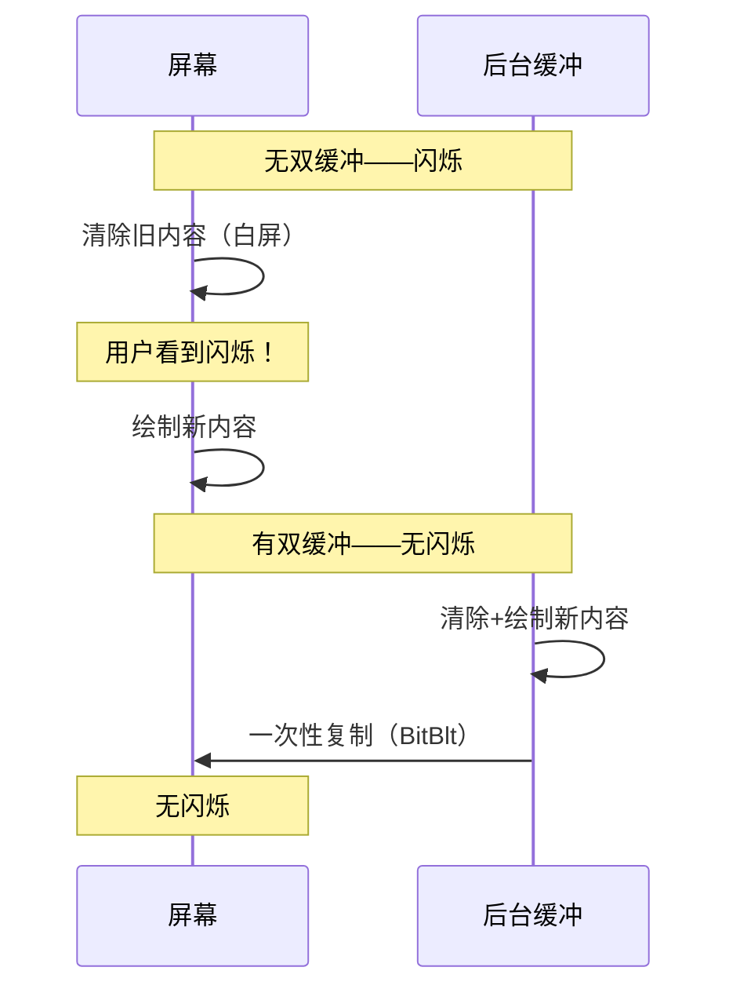
```mermaid
sequenceDiagram
    participant Screen as 屏幕
    participant Buffer as 后台缓冲

    Note over Screen,Buffer: 无双缓冲——闪烁
    Screen->>Screen: 清除旧内容（白屏）
    Note over Screen: 用户看到闪烁！
    Screen->>Screen: 绘制新内容

    Note over Screen,Buffer: 有双缓冲——无闪烁
    Buffer->>Buffer: 清除+绘制新内容
    Buffer->>Screen: 一次性复制（BitBlt）
    Note over Screen: 无闪烁
```

双缓冲的实现要点：

1. 创建与屏幕区域等大的后台缓冲（Back Buffer）
2. 所有绘制操作都在后台缓冲上进行
3. 绘制完成后，将后台缓冲一次性拷贝到前台
4. 现代 GUI 框架通常已内置双缓冲支持

### 2.4 Shape 的渲染职责

在 MVC 架构下，Shape（Model 的一部分）是否应该知道如何绘制自己？这涉及一个经典的架构权衡：

| 方案 | 优点 | 缺点 |
|------|------|------|
| **Shape 自己绘制** | 封装好，新增图形类型只需加子类 | Model 依赖 Graphics API |
| **独立 Renderer** | Model 与渲染完全解耦 | 新增图形类型需改两处 |
| **Visitor 模式** | 解耦且扩展点统一 | 复杂度高，双分派不易理解 |

许式伟的倾向：**Shape 自己绘制**。理由是画图程序的渲染逻辑与图形数据高度耦合，强行分离反而增加复杂度。Model 依赖抽象的 Graphics 接口（而非具体渲染 API），是更务实的解耦方式。

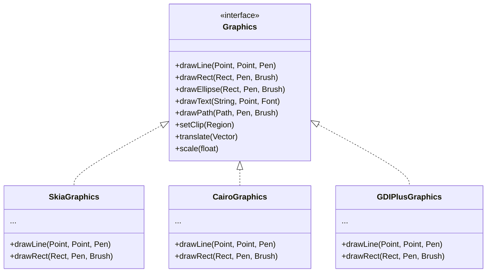
```mermaid
classDiagram
    class Graphics {
        <<interface>>
        +drawLine(Point, Point, Pen)
        +drawRect(Rect, Pen, Brush)
        +drawEllipse(Rect, Pen, Brush)
        +drawText(String, Point, Font)
        +drawPath(Path, Pen, Brush)
        +setClip(Region)
        +translate(Vector)
        +scale(float)
    }

    class SkiaGraphics {
        +drawLine(Point, Point, Pen)
        +drawRect(Rect, Pen, Brush)
        ...
    }

    class CairoGraphics {
        +drawLine(Point, Point, Pen)
        +drawRect(Rect, Pen, Brush)
        ...
    }

    class GDIPlusGraphics {
        +drawLine(Point, Point, Pen)
        +drawRect(Rect, Pen, Brush)
        ...
    }

    Graphics <|.. SkiaGraphics
    Graphics <|.. CairoGraphics
    Graphics <|.. GDIPlusGraphics
```

通过 `Graphics` 抽象层，Shape 依赖的是绘制能力的抽象而非具体平台——这比完全分离 Renderer 更务实。

### 2.5 坐标系统与变换

画图程序必须区分两种坐标系：

| 坐标系 | 含义 | 用途 |
|--------|------|------|
| **文档坐标** | 图形在文档中的位置 | Model 存储、命中测试 |
| **视口坐标** | 图形在屏幕上的位置 | 鼠标事件、渲染 |

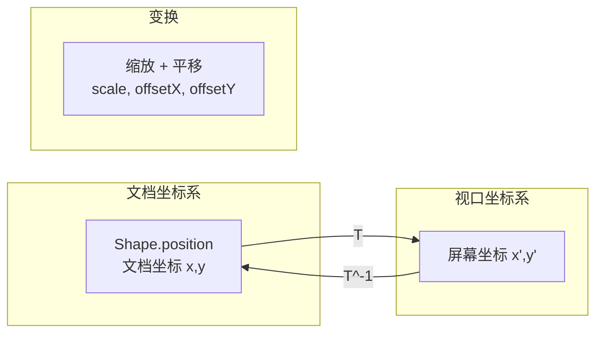
```mermaid
graph LR
    subgraph 文档坐标系
        A[Shape.position<br/>文档坐标 x,y]
    end

    subgraph 变换
        T[缩放 + 平移<br/>scale, offsetX, offsetY]
    end

    subgraph 视口坐标系
        B[屏幕坐标 x',y']
    end

    A -->|T| B
    B -->|T^-1| A

```

变换的应用：

- **鼠标事件 → 命中测试**：视口坐标通过逆变换转为文档坐标，再对 Model 做命中测试
- **Model → 渲染**：通过正向变换将文档坐标映射到屏幕坐标
- **缩放与滚动**：只需修改变换参数，无需修改 Model 数据

```c
// 正确：坐标转换在 Controller 层完成
void onMouseDown(viewX, viewY) {
    Point docPoint = viewportToDocument(viewX, viewY);
    Shape hit = document.hitTest(docPoint);
    ...
}

// 错误：让 Model 知道视口变换
void onMouseDown(viewX, viewY) {
    Shape hit = document.hitTest(viewX, viewY, viewportTransform);  // Model不应依赖View
}
```

---

## 三、交互设计与工具系统

### 3.1 Tool 体系的设计

Tool 的本质是一个**策略模式（Strategy Pattern）** 的实例——它将用户输入（鼠标/键盘事件）翻译为对 Model 的操作。不同的 Tool 就是不同的翻译策略。

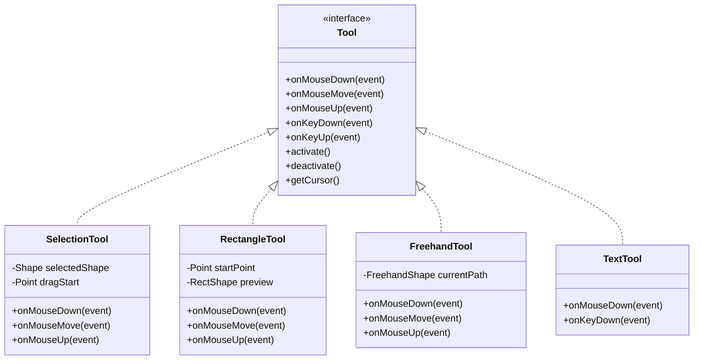
```mermaid
classDiagram
    class Tool {
        <<interface>>
        +onMouseDown(event)
        +onMouseMove(event)
        +onMouseUp(event)
        +onKeyDown(event)
        +onKeyUp(event)
        +activate()
        +deactivate()
        +getCursor()
    }

    class SelectionTool {
        -Shape selectedShape
        -Point dragStart
        +onMouseDown(event)
        +onMouseMove(event)
        +onMouseUp(event)
    }

    class RectangleTool {
        -Point startPoint
        -RectShape preview
        +onMouseDown(event)
        +onMouseMove(event)
        +onMouseUp(event)
    }

    class FreehandTool {
        -FreehandShape currentPath
        +onMouseDown(event)
        +onMouseMove(event)
        +onMouseUp(event)
    }

    class TextTool {
        +onMouseDown(event)
        +onKeyDown(event)
    }

    Tool <|.. SelectionTool
    Tool <|.. RectangleTool
    Tool <|.. FreehandTool
    Tool <|.. TextTool
```

### 3.2 Tool 的生命周期

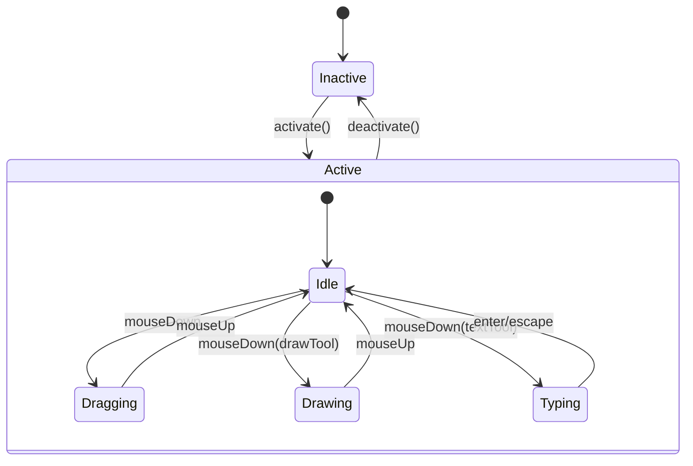
```mermaid
stateDiagram-v2
    [*] --> Inactive
    Inactive --> Active: activate()
    Active --> Inactive: deactivate()

    state Active {
        [*] --> Idle
        Idle --> Dragging: mouseDown
        Dragging --> Idle: mouseUp
        Idle --> Drawing: mouseDown(drawTool)
        Drawing --> Idle: mouseUp
        Idle --> Typing: mouseDown(textTool)
        Typing --> Idle: enter/escape
    }
```

### 3.3 Tool Manager

需要一个 Tool Manager 来管理工具的切换和生命周期：

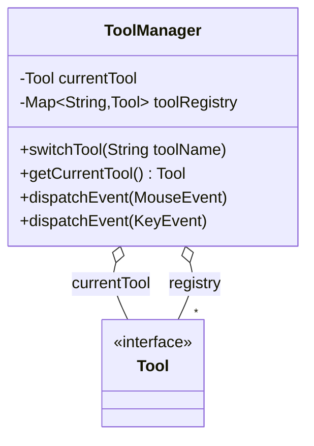
```mermaid
classDiagram
    class ToolManager {
        -Tool currentTool
        -Map~String,Tool~ toolRegistry
        +switchTool(String toolName)
        +getCurrentTool() Tool
        +dispatchEvent(MouseEvent)
        +dispatchEvent(KeyEvent)
    }

    class Tool {
        <<interface>>
    }

    ToolManager o-- Tool : currentTool
    ToolManager o-- "*" Tool : registry
```

Tool Manager 的关键职责：
1. **工具切换**：deactivate 当前工具 → activate 新工具
2. **事件分发**：将用户输入转发给当前活跃的工具
3. **工具注册**：管理可用工具的注册表

### 3.4 状态机：交互的精确建模

以 SelectionTool 为例，看似简单的"选择-拖拽"操作实际上包含多种状态：

- 未选中任何图形 → 点击空白处
- 未选中任何图形 → 点击某个图形
- 已选中图形 → 点击空白处（取消选择）
- 已选中图形 → 点击另一个图形（切换选择）
- 已选中图形 → 拖拽选中图形（移动）
- 已选中图形 → 拖拽控制点（缩放）

如果用 if-else 硬编码，代码将迅速退化成"箭头反模式"（Arrow Anti-pattern）。状态机将复杂的条件逻辑转化为清晰的状态转换。

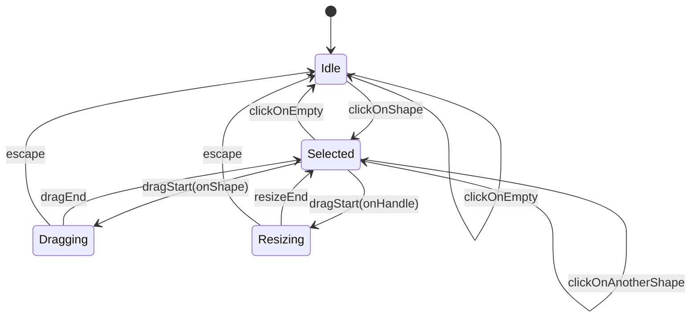
```mermaid
stateDiagram-v2
    [*] --> Idle

    Idle --> Selected: clickOnShape
    Idle --> Idle: clickOnEmpty

    Selected --> Dragging: dragStart(onShape)
    Selected --> Selected: clickOnAnotherShape
    Selected --> Idle: clickOnEmpty
    Selected --> Resizing: dragStart(onHandle)

    Dragging --> Selected: dragEnd
    Dragging --> Idle: escape

    Resizing --> Selected: resizeEnd
    Resizing --> Idle: escape
```

状态机的实现模式：

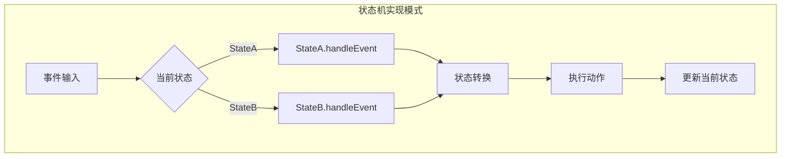
```mermaid
graph TB
    subgraph 状态机实现模式
        A[事件输入] --> B{当前状态}
        B -->|StateA| C[StateA.handleEvent]
        B -->|StateB| D[StateB.handleEvent]
        C --> E[状态转换]
        D --> E
        E --> F[执行动作]
        F --> G[更新当前状态]
    end
```

实现状态机的三种模式对比：

| 模式 | 实现方式 | 优点 | 缺点 |
|------|----------|------|------|
| **switch-case** | 状态+事件二维分支 | 直观 | 状态多了不可维护 |
| **State Pattern** | 每个状态一个类 | 符合开闭原则 | 类数量膨胀 |
| **状态转换表** | 表驱动的状态机 | 数据驱动，可序列化 | 调试不直观 |

许式伟的建议：**简单工具用 switch-case，复杂工具用 State Pattern，跨工具状态协调用状态转换表**。

### 3.5 绘制类工具的交互模式

绘制类工具（如 RectangleTool）需要一个关键机制：**实时预览**。用户在拖拽过程中需要看到正在绘制的图形。

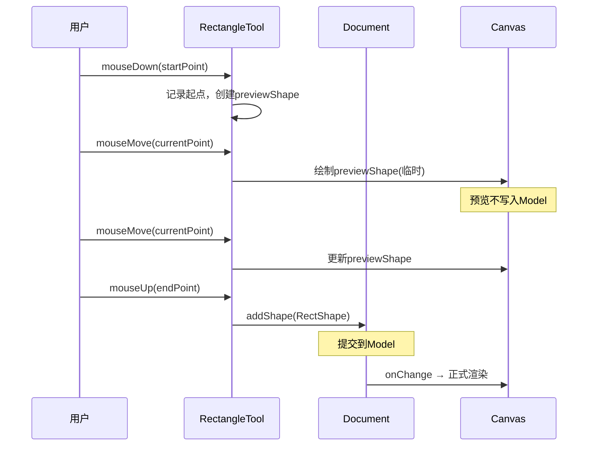
```mermaid
sequenceDiagram
    participant User as 用户
    participant Tool as RectangleTool
    participant Doc as Document
    participant Canvas as Canvas

    User->>Tool: mouseDown(startPoint)
    Tool->>Tool: 记录起点，创建previewShape

    User->>Tool: mouseMove(currentPoint)
    Tool->>Canvas: 绘制previewShape(临时)
    Note over Canvas: 预览不写入Model

    User->>Tool: mouseMove(currentPoint)
    Tool->>Canvas: 更新previewShape

    User->>Tool: mouseUp(endPoint)
    Tool->>Doc: addShape(RectShape)
    Note over Doc: 提交到Model
    Doc->>Canvas: onChange → 正式渲染
```

预览图形**不应写入 Model**，否则会污染 Document 数据。两种实现策略：

| 策略 | 方法 | 优点 | 缺点 |
|------|------|------|------|
| **叠加层渲染** | 预览图形在 View 层独立绘制 | 不侵入 Model | View 需要额外的渲染逻辑 |
| **临时 Shape** | 在 Model 中标记为"临时" | 统一渲染管线 | Model 需要过滤临时对象 |

推荐**叠加层渲染**——它保持了 Model 的纯净性，同时预览的渲染逻辑也可以复用 Shape 的 draw 方法。

更高级的绘制工具可以提供交互约束：

- **Shift 键约束**：矩形 → 正方形，椭圆 → 正圆
- **对齐辅助线**：自动吸附到其他图形的边界
- **网格对齐**：坐标对齐到网格

这些约束应该在 Tool 层实现，而非 Model 层——约束是交互行为，不是数据属性。

### 3.6 选择与编辑的交互设计

命中测试（Hit Test）——判断鼠标点击是否在某个图形上——应该由谁负责？

```c
// 方案 A：Model 负责命中测试（推荐）
class Document {
    Shape hitTest(Point docPoint) {
        for (shape in shapes.reverse()) {  // 从顶层开始
            if (shape.contains(docPoint)) return shape;
        }
        return null;
    }
}

// 方案 B：View 负责命中测试（不推荐）
class Canvas {
    Shape hitTest(Point viewPoint) {
        // 需要访问Model数据来做判断
        // View不应该有这种业务逻辑
    }
}
```

**推荐方案 A**：命中测试是业务逻辑，属于 Model。Controller 负责坐标转换后调用 Model 的 hitTest。

选中图形后需要显示控制手柄（Handle）——这些是纯 UI 元素，不属于 Model：

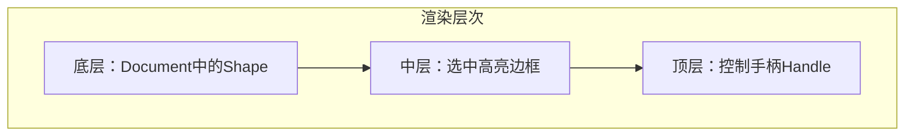
```mermaid
graph TB
    subgraph 渲染层次
        A[底层：Document中的Shape]
        B[中层：选中高亮边框]
        C[顶层：控制手柄Handle]
    end

    A --> B --> C

```

关键原则：**选中状态的视觉表示属于 View 层**，不影响 Model 数据。

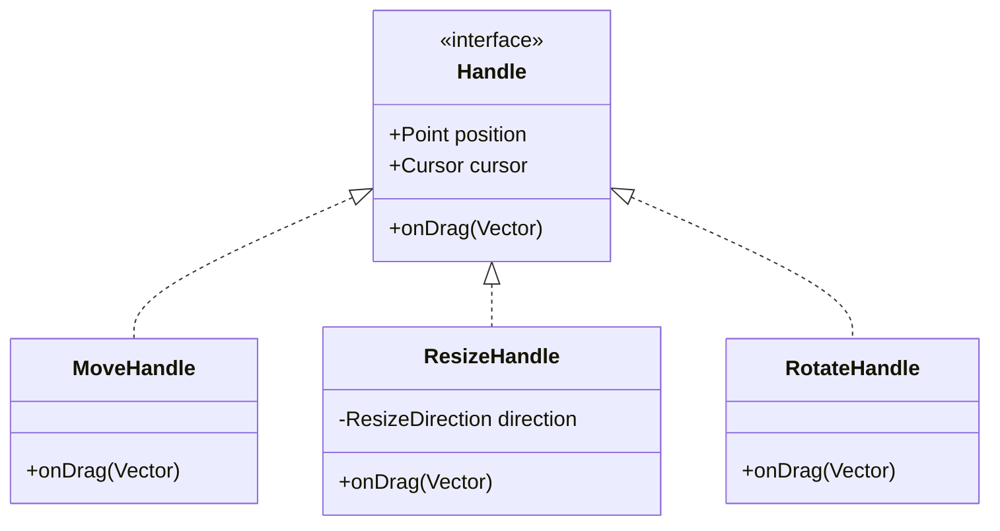
```mermaid
classDiagram
    class Handle {
        <<interface>>
        +Point position
        +Cursor cursor
        +onDrag(Vector)
    }

    class MoveHandle {
        +onDrag(Vector)
    }

    class ResizeHandle {
        -ResizeDirection direction
        +onDrag(Vector)
    }

    class RotateHandle {
        +onDrag(Vector)
    }

    Handle <|.. MoveHandle
    Handle <|.. ResizeHandle
    Handle <|.. RotateHandle
```

Handle 是一种特殊的"子 Controller"——它将 SelectionTool 的拖拽逻辑进一步细化，避免 SelectionTool 自身过于复杂。

Controller 的核心原则：

1. **Controller 不持有业务数据**——所有数据在 Model 中
2. **Controller 可以有 UI 状态**——拖拽起点、预览图形等是 UI 状态
3. **Controller 负责坐标转换**——视口坐标到文档坐标的映射
4. **Controller 是可替换的**——切换工具不应影响 Model 和 View

---

## 四、命令模式与撤销重做

### 4.1 撤销/重做的本质：操作的可逆化

撤销/重做不仅是用户体验的刚需，更是验证 MVC 架构健壮性的试金石——如果撤销/重做需要大幅修改现有架构，说明 Model 的接口设计存在缺陷。

撤销/重做的核心需求是：**任何对 Model 的修改操作都必须可以被逆转**。这意味着 Model 不能只有"修改"接口，还必须有"逆修改"接口。

三种实现策略对比：

| 策略 | 方法 | 优点 | 缺点 |
|------|------|------|------|
| **Memento 模式** | 保存每次操作前后的完整状态快照 | 实现简单，100% 可逆 | 内存消耗大 |
| **Command 模式** | 每个操作封装为可逆的 Command 对象 | 内存消耗小 | Command 设计复杂 |
| **差异记录** | 只记录状态差异（delta） | 内存最优 | 恢复逻辑复杂 |

许式伟的倾向：**Command 模式**。它将操作语义化，不仅支持撤销/重做，还为网络协议的设计奠定了基础。

### 4.2 Command 模式详解

```mermaid
classDiagram
    class Command {
        <<interface>>
        +execute()
        +undo()
        +redo()
        +getDescription() String
    }

    class AddShapeCommand {
        -Shape shape
        -int index
        +execute()
        +undo()
        +redo()
    }

    class RemoveShapeCommand {
        -Shape shape
        -int index
        +execute()
        +undo()
        +redo()
    }

    class MoveShapeCommand {
        -Shape shape
        -Vector oldPosition
        -Vector newPosition
        +execute()
        +undo()
        +redo()
    }

    class ChangeStyleCommand {
        -Shape shape
        -Style oldStyle
        -Style newStyle
        +execute()
        +undo()
        +redo()
    }

    Command <|.. AddShapeCommand
    Command <|.. RemoveShapeCommand
    Command <|.. MoveShapeCommand
    Command <|.. ChangeStyleCommand
```

每个 Command 必须遵循以下规则：

1. **自描述性**：Command 内部包含所有执行和逆操作所需的数据
2. **独立性**：Command 不依赖外部状态（除了 Model 本身）
3. **幂等性**：execute 和 undo 可以反复调用，结果一致
4. **原子性**：要么完全执行，要么完全回退

以 `AddShapeCommand` 为例的执行流程：

```mermaid
sequenceDiagram
    participant History as CommandHistory
    participant Cmd as AddShapeCommand
    participant Doc as Document

    Note over History,Cmd: execute流程
    Cmd->>Doc: addShape(shape, index)
    History->>History: push(cmd)

    Note over History,Cmd: undo流程
    History->>History: pop(cmd)
    Cmd->>Cmd: 记录shape和index
    Cmd->>Doc: removeShape(index)

    Note over History,Cmd: redo流程
    History->>History: push(cmd)
    Cmd->>Doc: addShape(shape, index)
```

### 4.3 Command History 的管理

两种历史栈模型：

```mermaid
graph LR
    subgraph 双栈模型
        A1[Undo Stack<br/>已执行Command]
        B1[Redo Stack<br/>已撤销Command]
        A1 -->|undo| B1
        B1 -->|redo| A1
    end
```

```mermaid
graph LR
    subgraph 单栈+指针模型
        S[Command List]
        P[Pointer: 当前位置]
        S -->|undo: P左移| S
        S -->|redo: P右移| S
    end
```

| 模型 | 优点 | 缺点 |
|------|------|------|
| **双栈** | 直观易懂 | 新操作清空 Redo栈 |
| **单栈+指针** | 支持分支历史 | 实现稍复杂 |

许式伟选择双栈模型——简单直观，且新操作清空 Redo栈正是用户期望的行为（撤销后做新操作，不应重做旧操作）。

```mermaid
flowchart TD
    A[新操作发生] --> B{History状态}
    B -->|有Redo栈内容| C[清空Redo栈]
    B -->|无Redo栈内容| D[正常推入Undo栈]
    C --> D

    D --> E{Undo栈是否超限?}
    E -->|是| F[丢弃栈底最旧Command]
    E -->|否| G[正常推入]

    F --> G
    G --> H[执行Command]
```

关键问题：
- **栈大小限制**：设上限（如100步），防止内存溢出
- **复合操作**：多个原子 Command 合并为一个 Macro Command
- **跨文档操作**：Command History 应随文档而非全局

### 4.4 复合操作与 Macro Command

用户操作往往包含多个原子步骤：

- "粘贴" = 创建新图形 + 添加到文档
- "删除选中图形" = 逐个删除所有选中图形
- "组合图形" = 创建 GroupShape + 删除原始图形 + 添加 GroupShape

这些应被视为**一个**撤销/重做单元。

```mermaid
classDiagram
    class Command {
        <<interface>>
        +execute()
        +undo()
        +redo()
    }

    class MacroCommand {
        -List~Command~ commands
        +execute()
        +undo()
        +redo()
        +addCommand(Command)
    }

    Command <|.. MacroCommand
    MacroCommand o-- "*" Command
```

执行顺序：execute 按正序执行，undo 按逆序执行——这是复合操作可逆性的关键。

在交互过程中，操作可能跨多个鼠标事件。Transaction 机制确保整个交互过程作为一个原子操作：

```mermaid
sequenceDiagram
    participant User as 用户
    participant Tool as SelectionTool
    participant History as CommandHistory
    participant Doc as Document

    User->>Tool: mouseDown
    Tool->>History: beginTransaction("MoveShape")

    User->>Tool: mouseMove(delta1)
    Tool->>Doc: shape.move(delta1) [预览]

    User->>Tool: mouseMove(delta2)
    Tool->>Doc: shape.move(delta2) [预览]

    User->>Tool: mouseUp
    Tool->>History: commitTransaction()
    Note over History: 整个拖拽过程作为一个Command

    User->>Tool: escape(放弃)
    Tool->>History: rollbackTransaction()
    Note over History: 回退所有预览操作
```

### 4.5 Command 与网络协议的桥梁

许式伟提出：**网络协议的定义应尽可能映射 Command 的语义**。因为 Command 天然携带了操作的全部信息。

```mermaid
graph TB
    subgraph 客户端
        C[Command对象]
    end

    subgraph 协议层
        P1[POST /drawings/ID/shapes<br/>→ AddShapeCommand]
        P2[DELETE /drawings/ID/shapes/ShapeID<br/>→ RemoveShapeCommand]
        P3[POST /drawings/ID/shapes/ShapeID<br/>→ ChangeStyleCommand]
    end

    subgraph 服务端
        S[Command执行引擎]
    end

    C --> P1
    C --> P2
    C --> P3
    P1 --> S
    P2 --> S
    P3 --> S
```

许式伟特别强调网络协议的**重试友好性**：同一操作执行两遍，结果与执行一遍一致。

| 操作类型 | 重试友好性 | 改造方案 |
|----------|-----------|----------|
| 查询操作（GET） | 天然友好 | 无需改造 |
| 创建操作（POST） | 可能不友好 | 客户端指定 ID 或 UUID |
| 删除操作（DELETE） | 天然友好 | 无需改造 |
| 修改操作（POST） | 相对值不友好 | 用绝对值或附加 RequestUUID |

```mermaid
flowchart TD
    A[网络请求失败] --> B{能否确定服务端状态?}
    B -->|确定失败| C[直接重试]
    B -->|不确定| D{操作是否重试友好?}
    D -->|友好| E[安全重试]
    D -->|不友好| F[需要改造协议]
    F --> G[客户端传UUID]
    F --> H[用绝对值代替相对值]
```

如果撤销/重做难以实现，说明 Model 的接口设计有问题：

- Model 的修改接口缺乏对称的逆操作
- Model 的状态缺乏足够的可观测性

**Command 模式是 MVC 架构的完整性检验器**。

---

## 五、完整架构与总结

### 5.1 从桌面到云端：架构的质变

联网带来的本质变化是：**Model 不再是单一数据源**，而变成分布式数据的多副本。由此产生三大核心问题：

1. **数据一致性**：多个副本如何保持一致？
2. **冲突解决**：并发修改如何合并？
3. **离线支持**：断网时如何正常编辑？

```mermaid
graph LR
    subgraph 桌面应用
        A[Model] --> B[View]
        A --> C[Controller]
    end

    subgraph 联网应用
        D[本地Model] --> E[View]
        D --> F[Controller]
        D <-->|同步| G[远程Model]
        G <-->|同步| H[其他客户端]
    end

```

### 5.2 离线优先（Offline-First）架构

许式伟的核心观点是：**离线优先，而非在线优先**。也就是说，应用应该先假设网络不可用，设计出完全离线可用的架构，再在此基础上添加同步能力。

```mermaid
flowchart TD
    A[用户操作] --> B[写入本地Model]
    B --> C[本地渲染]
    B --> D{网络是否可用?}
    D -->|是| E[推送到服务端]
    D -->|否| F[写入本地操作队列]
    F --> G[网络恢复后推送]
    E --> H{推送成功?}
    H -->|是| I[确认提交]
    H -->|否| F
```

### 5.3 数据同步的核心模型

| 维度 | 操作同步（Operation-based） | 状态同步（State-based） |
|------|---------------------------|------------------------|
| **传输内容** | Command/操作 | 完整状态快照 |
| **带宽消耗** | 小 | 大 |
| **冲突处理** | OT/CRDT | Last-Write-Wins |
| **适合场景** | 实时协作 | 简单同步 |
| **实现复杂度** | 高 | 低 |

许式伟的倾向：画图程序采用**操作同步**，因为 Command 体系天然适配。

```mermaid
sequenceDiagram
    participant ClientA as 客户端A
    participant Server as 服务端
    participant ClientB as 客户端B

    ClientA->>Server: Command(AddShape, shape1)
    Server->>Server: 校验+存储
    Server->>ClientA: ACK(seq=100)
    Server->>ClientB: Push(Command, seq=100)

    ClientB->>Server: Command(MoveShape, shape1, delta)
    Server->>Server: 校验+存储(基于seq=100)
    Server->>ClientB: ACK(seq=101)
    Server->>ClientA: Push(Command, seq=101)
```

每个客户端维护一个逻辑时钟，服务端通过版本向量判断操作之间的因果关系：

```mermaid
graph TB
    subgraph 版本向量
        V1["客户端A: (A:1, B:0)"]
        V2["客户端A: (A:2, B:0)"]
        V3["客户端B: (A:2, B:1)"]
        V4["客户端A: (A:3, B:1)"]
    end

    V1 -->|"A执行操作1"| V2
    V2 -->|"B收到A的操作"| V3
    V3 -->|"A收到B的操作"| V4

```

**因果一致性的规则**：
- 如果操作 A happened-before 操作 B，则所有节点必须先看到 A 再看到 B
- 如果 A 和 B 并发，则可以任意顺序，但需要冲突解决

### 5.4 冲突解决：OT 与 CRDT

**Operational Transformation（OT）** 的核心思想：当两个并发操作冲突时，通过变换（Transformation）使操作在对方执行后的上下文中仍然有效。

```mermaid
sequenceDiagram
    participant A as 客户端A
    participant S as 服务端(OT引擎)
    participant B as 客户端B

    Note over A,B: 初始状态：shape在(0,0)

    A->>S: Move(shape, +10, +0)
    B->>S: Move(shape, +0, +20)

    Note over S: OT变换
    S->>S: Move(A)相对于Move(B)变换 → Move(+10, +0)
    S->>S: Move(B)相对于Move(A)变换 → Move(+0, +20)

    S->>A: Move(B变换后) → Move(+0, +20)
    S->>B: Move(A变换后) → Move(+10, +0)

    Note over A,B: 最终：shape在(10,20)，A和B一致
```

**CRDT（Conflict-free Replicated Data Types）** 的核心思想：通过数学结构保证，无论操作到达顺序如何，最终状态一定一致。

| CRDT 类型 | 适用场景 | 画图程序应用 |
|-----------|---------|-------------|
| G-Counter | 只增计数 | 图形ID生成 |
| LWW-Register | 最后写入获胜 | 图形属性（颜色、位置） |
| OR-Set | 可增可删集合 | Shape 列表管理 |
| RGA | 有序列表 | 图形层叠顺序 |

```mermaid
graph LR
    subgraph CRDT保证
        A[操作以任意顺序到达] --> B[最终状态一致]
    end

    subgraph 代价
        C[数据结构冗余]
        D[部分操作需要Tombstone]
    end

    B --> C
```

OT 与 CRDT 的选择：

| 维度 | OT | CRDT |
|------|-----|------|
| **理论保证** | 依赖中心化服务端 | 去中心化，数学保证 |
| **实现复杂度** | 极高（每对操作需变换函数） | 中等（数据结构设计） |
| **服务端角色** | 必须有OT引擎 | 可选 |
| **性能** | 传输数据量小 | 数据结构有冗余 |
| **成熟度** | Google Docs等大规模验证 | 新兴，生态较弱 |

许式伟的建议：**小型团队优先考虑 CRDT**，因为 OT 的变换函数矩阵随操作类型组合爆炸。

### 5.5 Model 层"厚度"的演进规律

这是本系列最深刻的架构洞察：**Model 层的"厚度"随应用复杂度而增长，且增长方向是可预测的。**

```mermaid
graph LR
    subgraph 第一阶段<br/>纯桌面
        M1["薄Model<br/>纯数据+简单逻辑"]
    end

    subgraph 第二阶段<br/>桌面+文件
        M2["中等Model<br/>+序列化/反序列化<br/>+文件格式"]
    end

    subgraph 第三阶段<br/>联网协作
        M3["厚Model<br/>+Command体系<br/>+同步引擎<br/>+冲突解决"]
    end

    M1 -->|需求驱动| M2
    M2 -->|需求驱动| M3

```

| 阶段 | Model 包含 | 典型代码量占比 |
|------|-----------|---------------|
| **纯桌面** | 数据结构 + CRUD + 命中测试 | 20% |
| **+文件系统** | + 序列化 + 版本兼容 + 错误恢复 | 35% |
| **+网络同步** | + Command + 历史管理 + 同步引擎 + 冲突解决 | 60%+ |

这个规律的意义在于：**架构设计时必须为 Model 层的增厚预留空间**。具体做法：
1. Model 与 View/Controller 保持严格边界
2. Model 的内部结构分层（核心数据 / 持久化 / 同步）
3. 新增 Model 能力时，通过"内聚地增厚"而非"向外泄漏"

### 5.6 画图实战系列的架构全貌

```mermaid
graph TB
    subgraph 用户界面层
        TB[工具栏]
        CV[画布Canvas]
        PP[属性面板]
    end

    subgraph Controller层
        TM[ToolManager]
        T1[SelectionTool]
        T2[DrawTool]
        T3[TextTool]
    end

    subgraph Model层
        DOC[Document]
        SH[Shape体系]
        CH[CommandHistory]
        SE[SyncEngine]
    end

    subgraph 基础设施层
        FS[文件系统]
        NET[网络]
    end

    TB --> TM
    CV --> TM
    TM --> T1 & T2 & T3
    T1 & T2 & T3 --> DOC
    DOC --> SH
    DOC --> CH
    DOC --> SE
    DOC --> FS
    SE --> NET
```

---

## 设计原则与权衡（Trade-off 分析）

将五讲中的核心架构决策汇总如下：

| 决策点 | 方案 A | 方案 B | 选择与理由 |
|--------|--------|--------|-----------|
| Shape 体系 | 继承体系 | 组合模式+Component | P0 用继承，P2 引入组合——渐进复杂度 |
| 图形存储 | 扁平列表 | 树形结构（图层） | 先扁平后树形——需求驱动 |
| 渲染方式 | 立即模式 | 保留模式 | 保留模式——Model 即数据源 |
| 重绘策略 | 全量重绘 | 局部重绘 | 先全量后局部——渐进优化 |
| Shape 绘制 | Shape 自绘制 | 独立 Renderer | Shape 自绘制 + Graphics 抽象 |
| 状态管理 | Tool 自管 | 全局状态机 | Tool 自管 + 有限状态协调 |
| 坐标系统 | 视口坐标 | 文档坐标 | 文档坐标为主——支持缩放与滚动 |
| 交互建模 | if-else | 状态机 | 简单用 if-else，复杂用状态机 |
| 预览机制 | 叠加层 | 临时 Model | 叠加层——保持 Model 纯净 |
| 命中测试 | Model 负责 | View 负责 | Model 负责——业务逻辑归 Model |
| 撤销/重做 | Memento（状态快照） | Command（操作封装） | Command——语义化、内存优 |
| 历史栈模型 | 双栈 | 单栈+指针 | 双栈——简单直观 |
| 同步模型 | 操作同步 | 状态同步 | 操作同步——Command 天然适配 |
| 离线策略 | 在线优先 | 离线优先 | 离线优先——更健壮 |
| 冲突解决 | OT | CRDT | 小团队 CRDT，大团队 OT |
| 网络协议 | RESTful | Command 映射 | Command 映射——语义一致 |

画图程序应采用**事件驱动 + 数据驱动**的混合架构风格：

```mermaid
graph TB
    subgraph 事件驱动路径
        E1[鼠标事件] --> T1[Tool处理]
        T1 --> M1[修改Model]
    end

    subgraph 数据驱动路径
        M2[Model变更] --> O1[观察者通知]
        O1 --> V1[View重绘]
    end

    M1 --> M2
```

架构演进的节奏感——许式伟强调的不仅是架构设计本身，更是架构演进的节奏：

1. **第一版**：纯桌面，MVC 跑通
2. **第二版**：加入文件系统，Model 层增厚但接口不变
3. **第三版**：加入网络同步，Model 层继续增厚

每一步都是在前一步的基础上**内聚地扩展**，而非推翻重来。这种节奏感是架构师的核心能力。

---

## 实践案例与反模式

### 反模式一：巨型 Controller

初学者最容易犯的错误是将所有逻辑塞进 Controller（Tool）中：

```c
// 反模式：Tool 承担了太多职责
class RectangleTool {
    void onMouseDown(x, y) {
        // 创建图形
        // 修改属性
        // 直接操作 Canvas 绘制
        // 直接操作 Document 保存
    }
}
```

**正确做法**：Tool 只负责将输入翻译为对 Model 的操作，渲染交给 View，数据交给 Model。

### 反模式二：View 直接操作 Model

```c
// 反模式：View 既渲染又修改数据
class Canvas {
    void onPaint() {
        // 渲染
        for (shape in document.shapes) { shape.draw(...); }
        // 同时修改？View不应该修改Model！
        document.shapes[0].color = RED;
    }
}
```

View 的唯一职责是**将 Model 的状态映射为像素**。任何对 Model 的修改都必须通过 Controller 进行。

### 反模式三：God Tool

将所有交互逻辑放在一个"超级工具"中：

```c
// 反模式：一个Tool处理所有情况
class SuperTool {
    void onMouseDown(event) {
        if (mode == "select") { ... }
        else if (mode == "rect") { ... }
        else if (mode == "ellipse") { ... }
        else if (mode == "freehand") { ... }
        // 无限膨胀...
    }
}
```

**正确做法**：每个工具类型一个独立类，通过 Tool Manager 统一调度。

### 反模式四：直接修改不可逆

```text
// 反模式：直接修改属性，无法撤销
document.shapes[0].position = newPoint;
// 如果要撤销，怎么知道原来的位置？
```

**正确做法**：所有对 Model 的修改都通过 Command 封装：

```text
command = new MoveShapeCommand(shape, oldPos, newPos);
commandHistory.execute(command);
// 撤销：command.undo() → shape回到oldPos
```

### 反模式五：Model 职责泄漏

```c
// 反模式：同步逻辑泄漏到Controller
class SelectionTool {
    void onMouseUp(event) {
        document.moveShape(shape, delta);
        syncEngine.pushCommand(new MoveCommand(...)); // Controller不该管同步
    }
}

// 正确做法：同步逻辑内聚在Model层
class Document {
    void moveShape(shape, delta) {
        shape.move(delta);
        this.commandHistory.execute(new MoveCommand(shape, delta));
        this.syncEngine.notifyChange();  // Model内部协调同步
    }
}
```

---

## 小结与关键要点

| 要点 | 说明 |
|------|------|
| **需求驱动架构** | 先做需求分层（P0/P1/P2），P0 决定骨架，P1 验证弹性，P2 考验边界 |
| **领域模型先行** | 识别 Document、Shape、Tool、Canvas 四大核心概念，行为抽象优于数据抽象 |
| **MVC 天然适配** | 画图程序的交互模式与 MVC 三角完美对应，Model 必须自洽 |
| **保留模式渲染** | 画图程序的数据天然持久化，保留模式天然适配，先全量重绘再优化局部重绘 |
| **Graphics 抽象层** | Shape 依赖绘制能力的抽象而非具体平台，比完全分离 Renderer 更务实 |
| **Tool = 策略模式 + 状态机** | 每个 Tool 封装一种交互策略，复杂交互用状态机表达，预览不侵入 Model |
| **Command 模式是正道** | 操作封装为可逆对象，双栈管理历史，MacroCommand+Transaction 处理复合操作 |
| **离线优先** | 先设计离线可用的架构，再添加同步能力，Command 体系是操作同步的天然载体 |
| **Model 厚度演进** | Model 层随复杂度增厚（纯桌面 → +文件 → +同步），但必须内聚而非泄漏 |
| **架构节奏感** | 逐步演进，每步内聚扩展，不推翻重来——从 MVC 骨架到联网同步，每一步都为下一步铺路 |

> **关联阅读**：画图实战系列至此结束。下一篇将讨论辅助界面元素的架构设计，回到桌面开发的核心议题。
