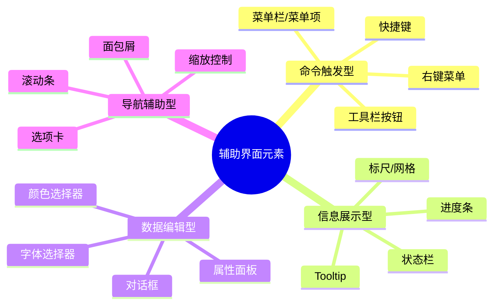
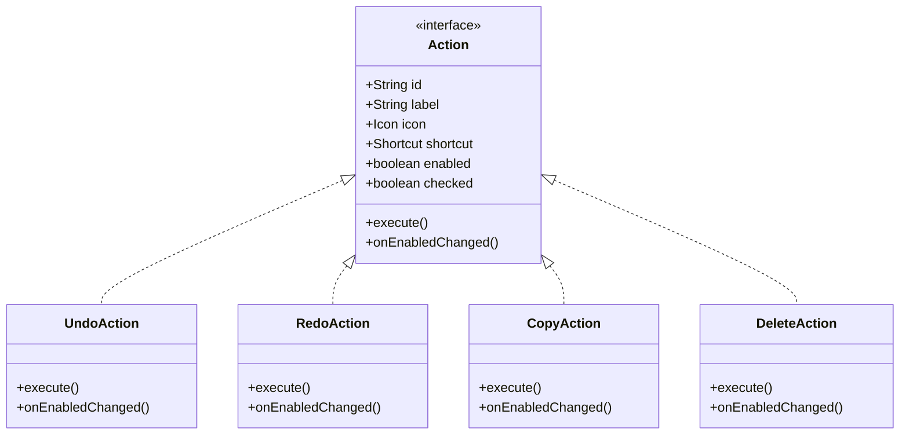
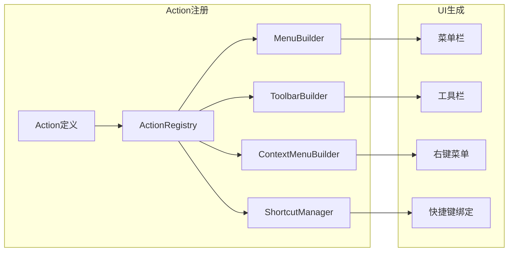
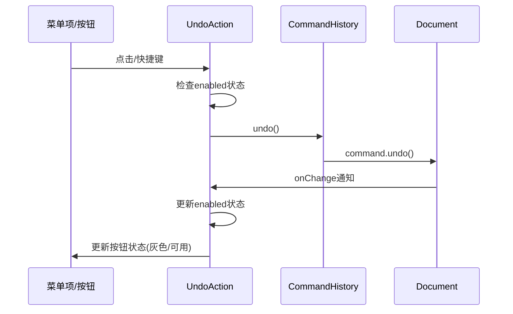
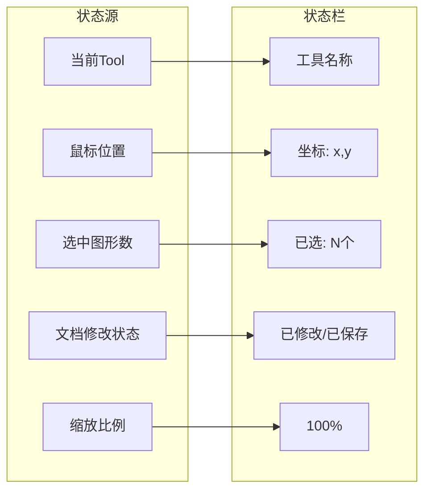
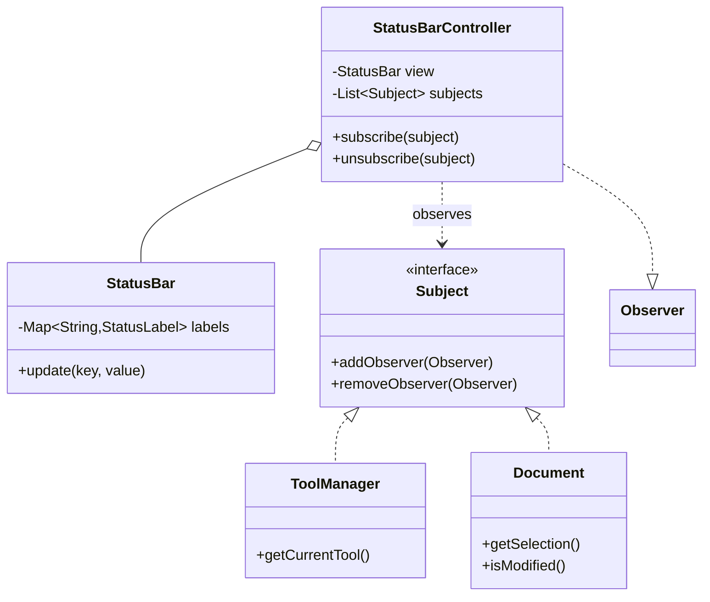
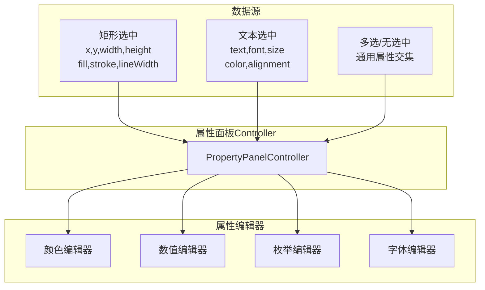
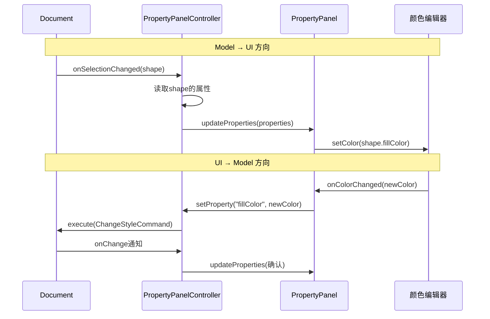
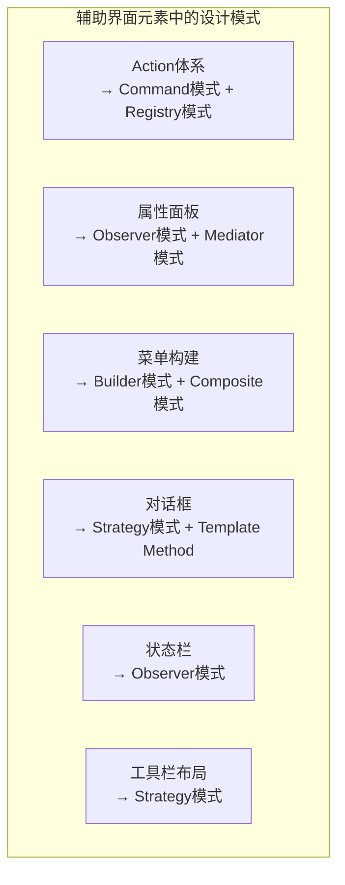
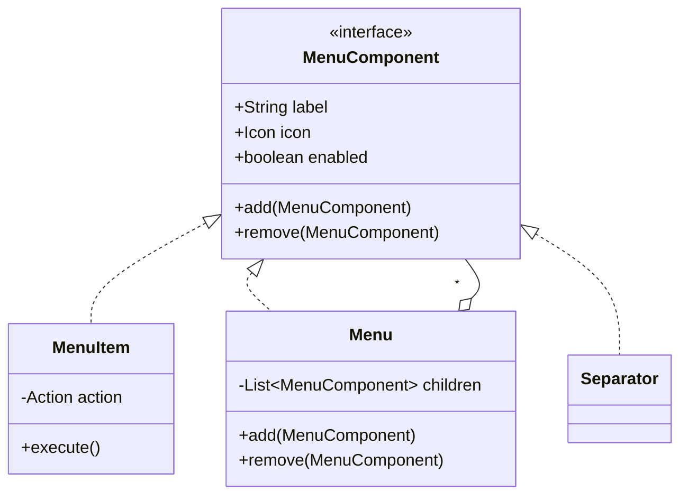

# 辅助界面元素的架构设计

## 导言：被忽视的"配角"决定架构成败

在 MVC 架构的讨论中，我们通常聚焦于核心交互——Model、View、Controller 三角的运转。但实际桌面应用中，大量界面元素并非核心交互的一部分，而是服务于用户的辅助需求：菜单、工具栏、状态栏、对话框、右键菜单、属性面板等。这些"辅助界面元素"看似简单，实则蕴含了**可扩展性、一致性、可维护性**三大架构挑战。

许式伟的核心观点：**辅助界面元素的设计质量，决定了应用是否可持续演进。** 一个菜单项的添加如果需要修改五个文件，这个应用的架构就是失败的。

> **关联阅读**：本节承接第 22 讲"桌面程序的架构建议"中关于界面组成的讨论，并与第 26-30 讲画图实战中的 MVC 架构相呼应。接口抽象的相关设计原则（开闭原则、接口隔离等）在本节有大量应用。

---

## 一、辅助界面元素的分类与特征

### 1.1 辅助界面元素全景图



### 1.2 辅助元素 vs 核心交互

| 维度 | 核心交互（Canvas+Tool） | 辅助界面元素 |
|------|------------------------|-------------|
| **交互频率** | 高（每秒多次） | 低（偶尔触发） |
| **数据依赖** | 依赖 Model 核心 | 依赖 Model 子集或全局状态 |
| **变更频率** | 相对稳定 | 随功能迭代频繁增减 |
| **架构关注点** | 性能与响应性 | 可扩展性与一致性 |

**关键洞察**：辅助元素的高变更频率意味着它们对**可扩展性**的要求比核心交互更高。

---

## 二、命令触发型元素：Action 体系

### 2.1 统一的命令抽象——Action

菜单项、工具栏按钮、右键菜单项、快捷键——它们的共同本质是**触发一个命令**。许式伟的核心设计是将其统一抽象为 Action：



### 2.2 Action 的注册与发现



**Action 体系的架构价值**：

1. **单一修改点**：新增功能只需定义一个 Action，自动出现在菜单、工具栏、右键菜单中
2. **状态一致性**：Undo 按钮和 Edit > Undo 菜单项的 enabled 状态始终一致
3. **可配置性**：用户可自定义快捷键、工具栏布局，因为 Action 与 UI 解耦

### 2.3 Action 与 Command 的关系



Action 是 Command 在 UI 层的代理——它负责命令的**触发**和**状态同步**，但不包含业务逻辑本身。

---

## 三、信息展示型元素：观察者模式的应用

### 3.1 状态栏的架构

状态栏是最典型的信息展示型元素——它需要实时反映应用的当前状态，但不接受用户的直接编辑。



### 3.2 观察者模式的正确使用



关键原则：**StatusBarController 作为观察者，聚合多个数据源的状态，更新 StatusBar 视图**。StatusBar 本身不知道数据来源——它只负责展示。

### 3.3 常见的反模式

```c
// 反模式：StatusBar 直接依赖所有状态源
class StatusBar {
    void refresh() {
        toolLabel.text = toolManager.currentTool.name;
        posLabel.text = mouseTracker.position;
        // 每增加一个状态源就要改这里
    }
}
```

**正确做法**：通过观察者模式解耦，新增状态源只需注册新观察者。

---

## 四、数据编辑型元素：属性面板与对话框

### 4.1 属性面板的架构挑战

属性面板是最复杂的辅助界面元素，因为它需要：

1. **动态适配**：不同选中对象显示不同属性
2. **双向绑定**：UI 修改即时反映到 Model，Model 变更即时更新 UI
3. **类型安全**：颜色、数值、枚举等不同类型需要不同的编辑器



### 4.2 属性面板的数据绑定



### 4.3 对话框的架构定位

对话框在架构上是一个**模态的交互上下文**——它中断正常的工作流，要求用户做出选择。

| 对话框类型 | 架构含义 | 典型场景 |
|-----------|---------|---------|
| **确认对话框** | 阻断危险操作 | 删除确认、放弃保存 |
| **输入对话框** | 获取单值输入 | 新建文件名、输入尺寸 |
| **属性对话框** | 编辑复杂属性 | 页面设置、导出选项 |

许式伟的警告：**对话框是交互流的断裂点，应尽量少用**。能用属性面板实时编辑的，就不要用对话框。

---

## 五、设计模式在辅助元素中的应用

### 5.1 设计模式应用矩阵



### 5.2 Composite 模式：菜单的树形结构

菜单天然是树形结构，Composite 模式完美适配：



### 5.3 Builder 模式：菜单的声明式构建

```text
menuBar.build {
    menu("文件") {
        item(UndoAction)
        item(RedoAction)
        separator()
        item(SaveAction)
        item(ExportAction)
    }
    menu("编辑") {
        item(CopyAction)
        item(PasteAction)
        item(DeleteAction)
    }
}
```

这种声明式构建方式将菜单结构与业务逻辑（Action）分离，修改菜单布局只需改声明，无需改代码逻辑。

---

## 六、设计原则与权衡

### 6.1 辅助元素设计的核心权衡

| 决策点 | 方案 A | 方案 B | 选择 |
|--------|--------|--------|------|
| 命令抽象 | 硬编码菜单/按钮 | 统一 Action 体系 | Action——单一修改点 |
| 状态同步 | 主动轮询 | 观察者模式 | 观察者——响应式 |
| 属性编辑 | 对话框 | 属性面板 | 优先面板——实时反馈 |
| 菜单构建 | 命令式代码 | 声明式构建 | 声明式——可读可配 |
| 面板布局 | 硬编码 | 数据驱动 | 数据驱动——可扩展 |

### 6.2 反模式：辅助元素与核心交互耦合

```c
// 反模式：Canvas直接创建菜单项
class Canvas {
    void setupMenu() {
        menuBar.add("Edit").add("Undo", () -> history.undo());
        // Canvas不该管菜单，职责混乱
    }
}
```

**正确做法**：菜单由 Action Registry 驱动，Canvas 只负责核心交互。辅助元素和核心交互通过 Action 这一中间层解耦。

### 6.3 核心原则

1. **辅助元素不应侵入核心架构**——它们是核心架构的"消费者"，不是"组成部分"
2. **统一命令抽象**——菜单、工具栏、快捷键共享 Action 定义
3. **观察者解耦**——状态展示型元素通过观察者获取数据，不直接持有引用
4. **声明式优于命令式**——菜单/工具栏的构建应该是声明式的
5. **对话框是最后的手段**——能用面板实时编辑就不用对话框

---

## 小结与关键要点

| 要点 | 说明 |
|------|------|
| **辅助元素高变更率** | 它们对可扩展性的要求比核心交互更高 |
| **Action 统一抽象** | 菜单项、按钮、快捷键共享 Action 定义，单一修改点 |
| **观察者解耦展示** | 信息展示型元素通过观察者获取数据，不直接依赖 |
| **属性面板双向绑定** | 通过 Controller 协调 Model 和编辑器的双向同步 |
| **Composite 构建菜单** | 菜单的树形结构用 Composite 模式 + 声明式 Builder |
| **辅助不侵入核心** | 辅助元素是核心架构的消费者，不是组成部分 |

> **关联阅读**：下一篇（第 32 讲）将从更高维度讨论系统概要设计的方法论，将 MVC、辅助元素等具体设计统一到概要设计的框架中。
