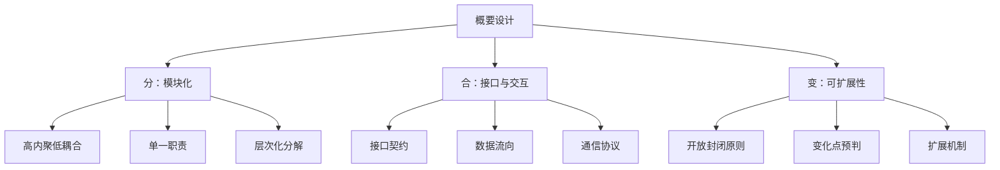
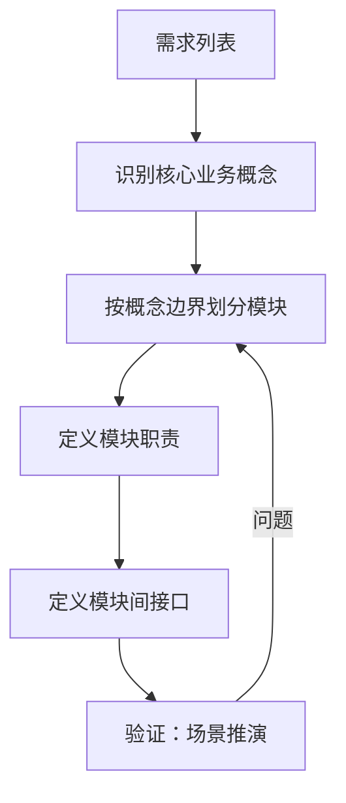
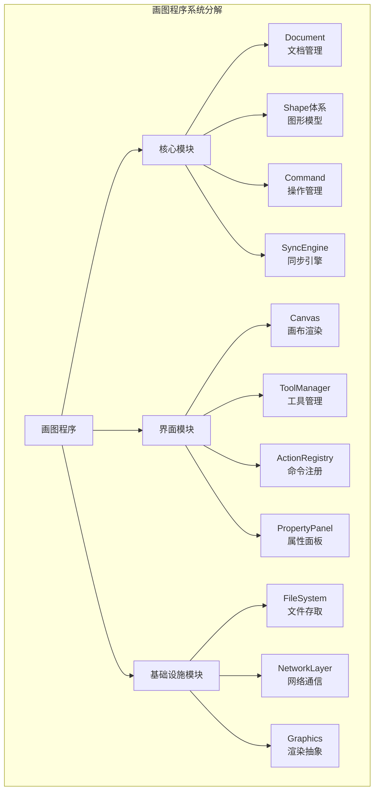
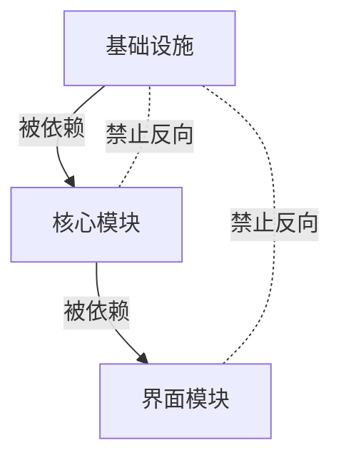
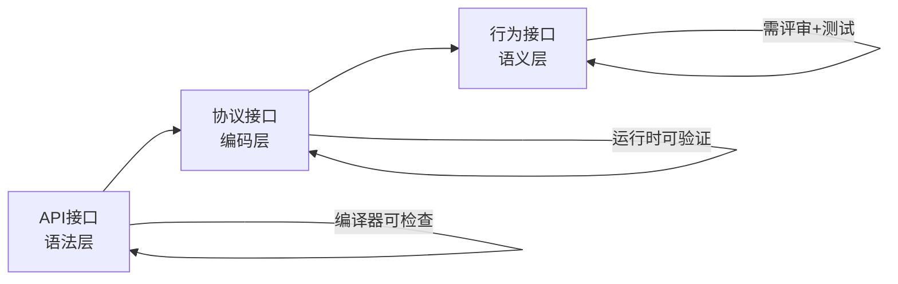
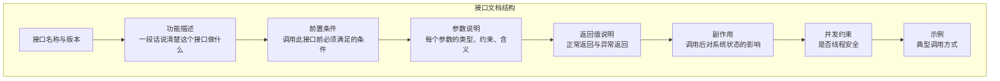
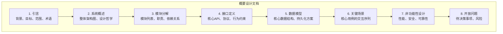
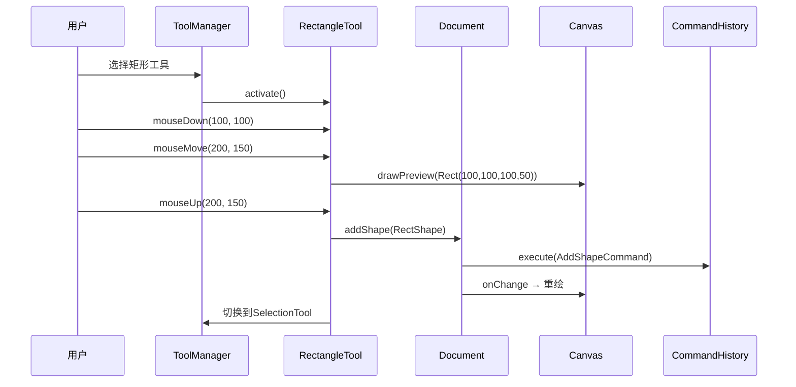
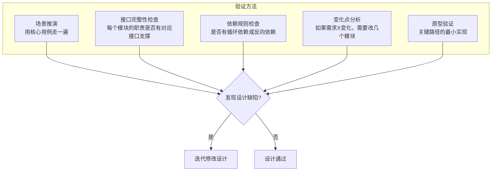

# 架构-系统的概要设计

## 导言：概要设计——从混沌到秩序的关键一步

在软件工程实践中，有一个被反复验证的规律：**相当大比例的缺陷可追溯到概要设计阶段的决策失误**。概要设计（High-Level Design）是架构师最核心的工作产出——它将需求规格说明中的"做什么"转化为技术方案中的"怎么做"，同时为详细设计和编码划定边界。

许式伟在本节中提出的核心问题是：**概要设计到底要设计什么？写到什么深度？如何验证其正确性？**

> **关联阅读**：本节是方法论层面的总结，将前面各讲（画图实战、辅助界面元素等）的架构实践统一到概要设计的框架中。

---

## 一、概要设计的本质与定位

### 1.1 概要设计在工程流程中的位置

概要设计的输入是需求规格说明，输出是**系统分解方案和关键接口定义**。它不是详细设计——不涉及算法选择、数据结构细节——但它是详细设计的约束和指南。

### 1.2 概要设计 vs 详细设计

| 维度 | 概要设计 | 详细设计 |
|------|---------|---------|
| **关注点** | 模块分解、接口定义、数据流向 | 算法、数据结构、具体实现 |
| **受众** | 架构师、技术负责人 | 开发工程师 |
| **变更成本** | 极高（影响全局） | 中等（影响局部） |
| **验证方式** | 评审、原型、推演 | 单元测试、集成测试 |
| **抽象层次** | 模块/子系统级 | 类/函数级 |

### 1.3 概要设计的三个核心问题

许式伟将概要设计归纳为回答三个核心问题：

1. **分**：系统如何分解为模块？（模块化）
2. **合**：模块之间如何协作？（接口与交互）
3. **变**：系统如何应对未来的变化？（可扩展性）

---

## 二、系统分解：从整体到模块

### 2.1 分解的方法论

系统分解不是随意的切割，而是遵循明确的方法论。许式伟推荐的分解方法：

### 2.2 以画图程序为例的分解过程

### 2.3 模块依赖规则

分解后必须定义模块间的依赖规则——哪些模块可以依赖哪些模块：

**依赖规则**：界面模块依赖核心模块，核心模块依赖基础设施；反向依赖被禁止。这保证了核心模块的可测试性和可复用性。

---

## 三、接口设计：模块间的契约

### 3.1 接口的三个层次

许式伟将接口分为三个层次：

| 层次 | 内容 | 示例 |
|------|------|------|
| **API 接口** | 函数签名、参数、返回值 | `Document.addShape(Shape): void` |
| **协议接口** | 通信格式、序列化规则 | JSON Schema、Protobuf 定义 |
| **行为接口** | 语义约束、不变式 | "addShape 后 shapes.length 必定 +1" |

### 3.2 接口设计的原则

1. **最小化原则**：接口暴露的越少越好，内部实现细节不应泄漏
2. **稳定性原则**：接口一旦发布就应保持稳定，变更必须向后兼容
3. **完备性原则**：接口应覆盖所有合法使用场景，不迫使使用者"绕过"接口

### 3.3 接口的文档化

概要设计文档中，接口描述应包含：

---

## 四、概要设计文档的结构

### 4.1 推荐的文档模板

许式伟推荐的概要设计文档包含以下核心章节：

### 4.2 各章节的深度要求

| 章节 | 深度要求 | 常见错误 |
|------|---------|---------|
| 系统概述 | 一张架构图 + 三段话说明设计哲学 | 过于笼统，缺乏决策依据 |
| 模块分解 | 每个模块一段职责描述 + 依赖图 | 只有列表没有依赖关系 |
| 接口定义 | 核心 API 的签名 + 行为约束 | 只写函数签名不写语义 |
| 关键场景 | 核心用例的序列图 | 场景覆盖不全 |
| 开放问题 | 明确列出未决事项 | 回避问题，假装设计已完成 |

### 4.3 关键场景的推演

以画图程序"绘制矩形"为例，概要设计中的场景推演：

**场景推演的目的**：验证模块分解和接口定义是否足以支撑核心流程。如果推演中需要"绕过"某个接口，说明设计有缺陷。

---

## 五、概要设计的验证

### 5.1 验证方法

### 5.2 变化点分析

许式伟特别强调变化点分析——这是概要设计区别于编码的关键价值：

| 变化场景 | 预期影响范围 | 如果影响范围过大 |
|----------|------------|----------------|
| 新增一种图形 | 只加一个 Shape 子类 | Shape 体系设计有问题 |
| 新增一种工具 | 只加一个 Tool 子类 | Tool 接口设计有问题 |
| 修改文件格式 | 只改序列化层 | 持久化泄漏到了核心层 |
| 替换渲染引擎 | 只改 Graphics 实现 | 渲染抽象层不够 |
| 新增同步功能 | 只在 Model 层增厚 | Model 和 View/Controller 耦合了 |

---

## 六、设计原则与权衡

### 6.1 概要设计的核心权衡

| 决策点 | 方案 A | 方案 B | 选择 |
|--------|--------|--------|------|
| 设计深度 | 足够详细 | 适度抽象 | 适度抽象——过细则与详细设计重复 |
| 文档形式 | 正式文档 | 轻量 Wiki | 核心系统用正式文档，辅助系统用 Wiki |
| 验证时机 | 设计完成一次性验证 | 持续验证 | 持续验证——设计是迭代过程 |
| 接口粒度 | 细粒度 | 粗粒度 | 核心接口细粒度，辅助接口粗粒度 |
| 变更策略 | 设计冻结 | 允许演进 | 允许演进但有变更评审 |

### 6.2 反模式：概要设计沦为形式

最常见的反模式是把概要设计文档当作"交付物"而非"思考工具"：

- 复制粘贴需求文档作为"系统概述"
- 只画架构图不定义接口
- 不做场景推演就进入编码
- 文档写完就束之高阁，与代码脱节

**正确态度**：概要设计是活的文档——它应该在编码过程中持续更新，反映架构的实际状态。

### 6.3 许式伟的概要设计心法

1. **先分后合**：先做模块分解，再定义接口——顺序不能反
2. **场景驱动**：用核心场景推演验证设计，而非凭空想象
3. **适度设计**：概要设计解决 80% 的架构问题，剩余 20% 在详细设计中解决
4. **文档即思维**：写文档的过程就是思考的过程，不是为了交差
5. **持续演进**：设计不是一次性活动，是持续迭代的过程

---

## 小结与关键要点

| 要点 | 说明 |
|------|------|
| **三个核心问题** | 分（模块化）、合（接口与交互）、变（可扩展性） |
| **系统分解** | 按业务概念边界划分，定义依赖规则，禁止反向依赖 |
| **接口三层** | API接口（语法）、协议接口（编码）、行为接口（语义） |
| **场景推演** | 用核心用例验证设计，发现缺陷及时迭代 |
| **变化点分析** | 预判需求变化的影响范围，验证模块化的有效性 |
| **活文档** | 概要设计是思考工具，不是交付物，应持续演进 |

> **关联阅读**：下一篇将转入服务端开发的宏观视角，讨论服务端程序区别于客户端程序的本质问题。
