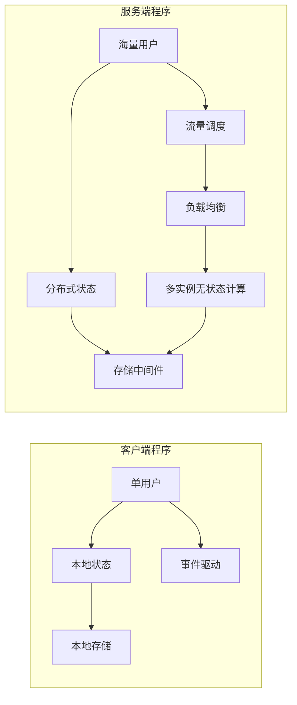
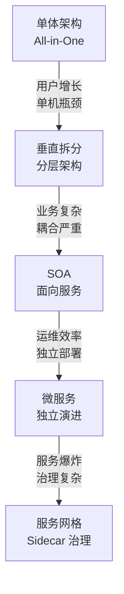
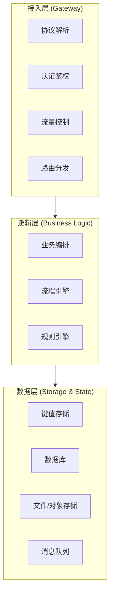
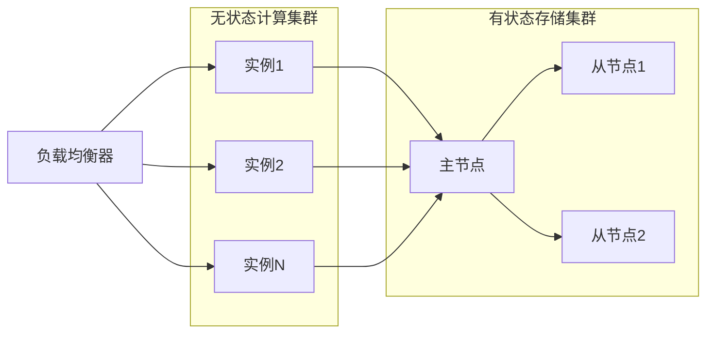
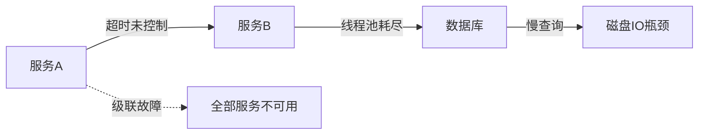

# 服务端开发的宏观视角

## 一、章节导言：服务端开发的本质问题

当我们从客户端开发转向服务端开发，面对的不再是一台确定的机器、一个确定的用户，而是**不确定的流量、不确定的状态、不确定的故障**。服务端开发的核心命题可以归结为一句话：

> **如何在分布式环境下，对海量用户的请求进行可靠、高效、可扩展的处理？**

许式伟指出，服务端程序的本质差异在于：它不再服务于单一用户，而是服务于海量用户。这一根本差异催生了服务端所有的技术挑战——从流量调度到状态管理，从存储中间件到容错设计。

---

## 二、核心概念与原理

### 2.1 服务端与客户端的根本分野

客户端程序与服务端程序的差异，不是"运行在哪里"这么简单，而是**问题域的根本不同**：

| 维度 | 客户端程序 | 服务端程序 |
|------|-----------|-----------|
| 用户模型 | 单用户，状态确定 | 海量用户，状态不确定 |
| 并发模型 | 主线程驱动，关注响应 | 多协程/多线程，关注吞吐 |
| 故障模型 | 本地崩溃可重启 | 集群局部故障必须容灾 |
| 状态管理 | 本地存储为主 | 分布式状态，强/弱一致性 |
| 扩展方式 | 升级单机硬件 | 水平扩容，弹性伸缩 |
| 生命周期 | 用户启停 | 7x24 常驻 |



### 2.2 服务端架构的演进脉络

服务端架构经历了从单体到微服务的演进，但演进的本质驱动力始终是**对规模与复杂度的响应**：



**关键洞察**：架构演进的每一步，都是在用**更高的系统复杂度**换取**更低的业务耦合度**。这不是免费的午餐，而是权衡的结果。

### 2.3 服务端开发的三层模型

许式伟将服务端开发抽象为三层：



**接入层**解决"请求怎么进来"的问题；**逻辑层**解决"业务怎么处理"的问题；**数据层**解决"状态怎么持久"的问题。三层之间的边界清晰，职责分明，但层与层之间的交互模式决定了系统的上限。

### 2.4 无状态计算与有状态存储的分离

服务端架构最核心的设计原则之一是**无状态计算与有状态存储的分离**：

- **计算节点无状态**：任何请求可以路由到任意计算实例，支持水平扩缩容
- **存储节点有状态**：数据一致性、持久化、副本同步是核心挑战



**为什么这个分离如此重要？** 因为无状态节点的失败是廉价的（重启或替换即可），而有状态节点的失败是昂贵的（数据可能丢失或不一致）。将两者分离，使得我们可以用不同的策略应对不同类型的故障。

---

## 三、设计原则与权衡（Trade-off 分析）

### 3.1 服务端核心 Trade-off 矩阵

| Trade-off | 一端 | 另一端 | 决策依据 |
|-----------|------|--------|----------|
| 一致性 vs 可用性 | 强一致（CP） | 高可用（AP） | 业务语义：金融选CP，社交选AP |
| 性能 vs 正确性 | 异步最终一致 | 同步强一致 | 数据重要性：关键数据同步，日志异步 |
| 简单性 vs 可扩展性 | 单体 | 微服务 | 团队规模与业务复杂度 |
| 延迟 vs 吞吐 | 低延迟响应 | 高吞吐批处理 | 业务场景：在线交互 vs 离线分析 |
| 资源利用率 vs 隔离性 | 共享资源池 | 独立资源 | 故障爆炸半径 vs 成本 |

### 3.2 服务端开发的黄金法则

1. **面向失败设计**（Design for Failure）：假设任何组件随时可能故障
2. **无状态优先**：计算逻辑尽量无状态，状态下沉到专门的存储层
3. **渐进式退化**（Graceful Degradation）：核心功能优先保障，非核心功能可降级
4. **可观测性先行**：日志、指标、追踪三件套在开发之初就规划好
5. **容量规划前置**：在架构设计阶段就考虑 QPS 上限与扩容路径

---

## 四、实践案例与反模式

### 4.1 反模式：在计算节点上存储业务状态

```go
// 反模式：将用户会话存在本地内存
var sessions = make(map[string]*Session)

func handleRequest(w http.ResponseWriter, r *http.Request) {
    session := sessions[sessionID]  // 本地内存状态
    // 请求路由到其他实例时，session 丢失！
}
```

**正确做法**：将 session 存入 Redis 等外部存储，计算节点保持无状态。

### 4.2 反模式：忽略故障的级联效应

没有熔断、限流、超时控制的调用链，一个下游慢节点可以拖垮整个系统。这是服务端最常见的雪崩场景。



### 4.3 正确模式：弹性服务架构

一个设计良好的服务端系统应具备：
- **接入层**：限流、熔断、降级
- **逻辑层**：无状态、可水平扩展
- **数据层**：主从复制、分片、读写分离
- **观测层**：全链路监控、告警、自动扩缩容

---

## 五、小结与关键要点

1. **服务端的本质**是处理"不确定的流量 × 不确定的状态 × 不确定的故障"，与客户端的问题域根本不同
2. **三层模型**（接入层-逻辑层-数据层）是理解服务端架构的基础框架
3. **无状态计算与有状态存储的分离**是服务端架构的核心设计原则
4. **面向失败设计**不是可选项，而是必须项——任何组件都可能故障，架构必须优雅应对
5. 服务端的每个架构决策都是 Trade-off，没有银弹，只有适合业务场景的选择

> **相关章节**：[35丨流量调度与负载均衡](21-流量调度与负载均衡.md) 将深入接入层的流量调度机制；[36丨业务状态与存储中间件](22-业务状态与存储中间件.md) 将深入数据层的状态管理
