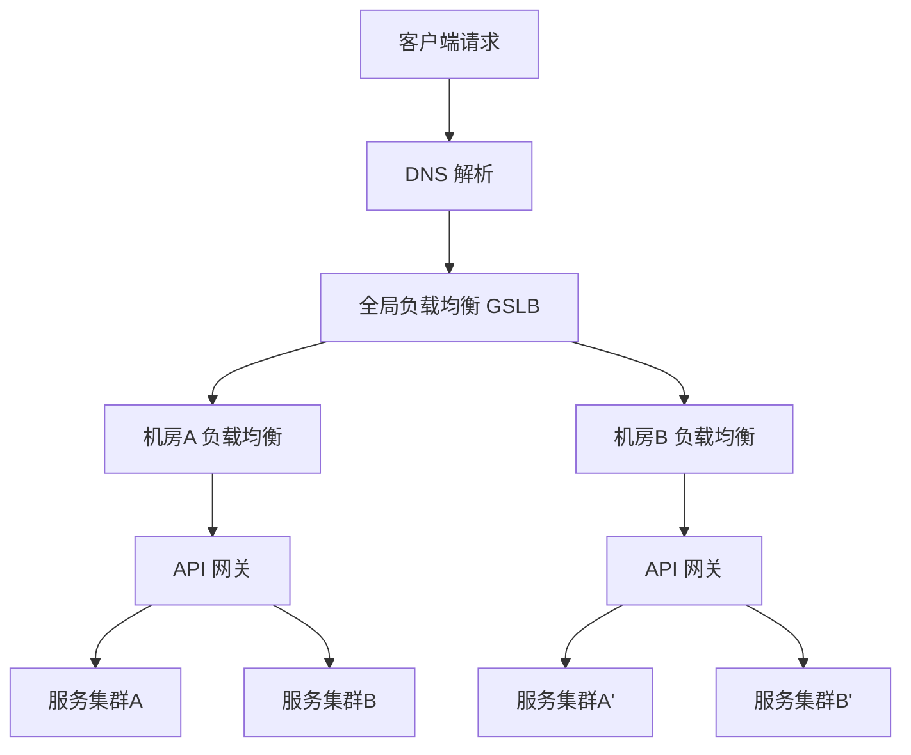
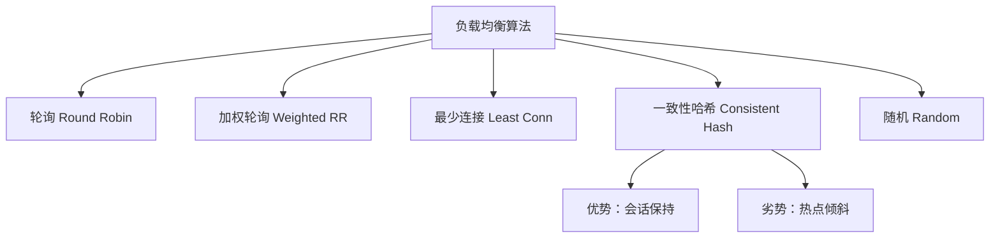
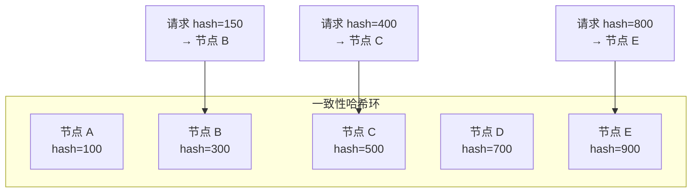
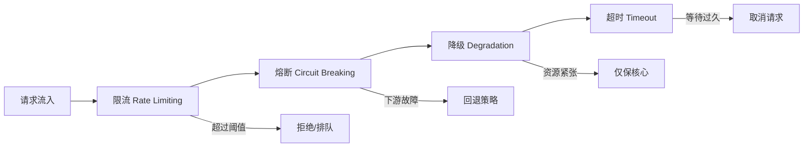
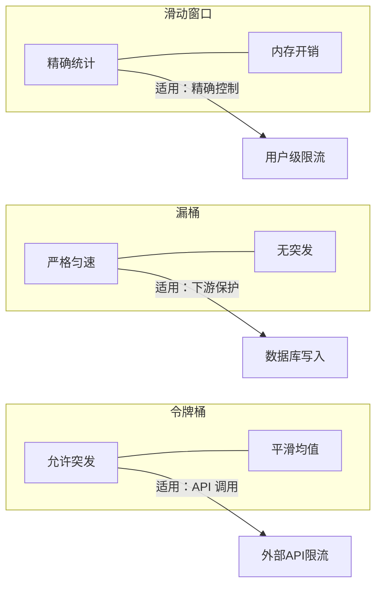
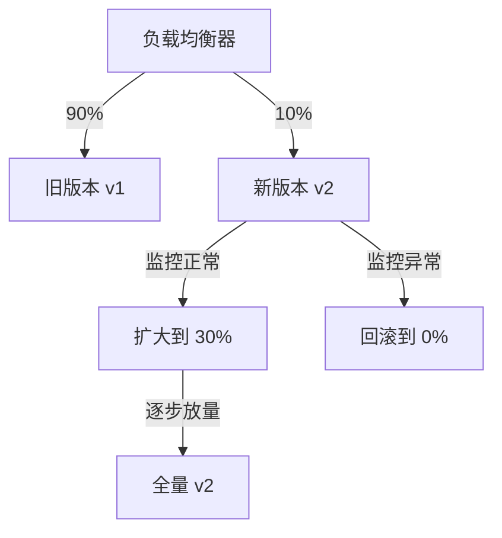

# 流量调度与负载均衡

## 一、章节导言：流量是服务端的血液

服务端程序存在的意义就是**处理流量**。没有流量调度的服务端，就像没有红绿灯的十字路口——请求无序涌入，后端无差别崩溃。

许式伟强调，流量调度的本质是**对不确定需求的确定性管理**：当千万级请求同时到达时，如何让每一份计算资源都被高效利用？如何让每一个用户都获得合理的响应？这不是简单的"分发"，而是一个涉及**路由策略、负载均衡、限流熔断、灰度发布**的系统性工程。

---

## 二、核心概念与原理

### 2.1 流量调度的全景视图

流量从客户端到服务端，依次经过四个层次的调度：

1. **DNS 层**：域名解析级别的流量分配（地理路由）
2. **GSLB 层**：全局负载均衡，跨机房/跨区域调度
3. **LB 层**：机房内负载均衡（四层/七层）
4. **网关层**：API 级别的路由、限流、鉴权

### 2.2 负载均衡算法对比

负载均衡的核心问题是：**将请求分配给哪个后端实例？** 不同的算法适用于不同的场景。

| 算法 | 原理 | 优势 | 劣势 | 适用场景 |
|------|------|------|------|----------|
| 轮询（Round Robin） | 依次分配 | 实现简单，绝对公平 | 不考虑后端差异 | 后端实例同构 |
| 加权轮询 | 按权重比例分配 | 支持异构实例 | 权重配置静态 | 实例性能不均 |
| 最少连接 | 选当前连接数最少的 | 动态感知负载 | 计算开销略高 | 长连接/请求耗时不均 |
| 一致性哈希 | 对请求特征哈希映射 | 会话保持，扩缩容影响小 | 热点倾斜风险 | 需要会话亲和 |
| 随机 | 随机选择 | 零状态，实现极简 | 大数定律才趋均衡 | 极简场景/内部调用 |

### 2.3 一致性哈希深入分析

一致性哈希是服务端流量调度中最精巧的算法之一，它解决了**"扩缩容时尽量少迁移请求"**的问题。

**关键特性**：
- **虚拟节点**：通过为每个物理节点映射多个虚拟节点，解决节点少时分布不均匀的问题
- **扩容影响**：新增节点仅影响哈希环上相邻区间的请求迁移
- **缩容影响**：故障节点移除后，其请求仅转移到后继节点

**Trade-off**：一致性哈希以 O(log N) 的查找复杂度换取了最小化的请求迁移，但在极端热点场景下仍需结合热点打散策略。

### 2.4 流量调度的四重防护

**限流（Rate Limiting）**：
- 计数器法：固定窗口/滑动窗口
- 令牌桶（Token Bucket）：允许突发流量，平滑速率
- 漏桶（Leaky Bucket）：严格匀速，无突发

**熔断（Circuit Breaking）**：
- 三状态模型：Closed → Open → Half-Open
- 本质是**快速失败**，避免无效等待消耗线程资源

**降级（Degradation）**：
- 核心与非核心业务分离
- 非核心功能可开关控制，核心功能保证可用

**超时（Timeout）**：
- 连接超时 vs 读超时 vs 写超时
- 超时时间设置是经验与理论的结合：通常 P99 延迟的 2-3 倍

### 2.5 四层与七层负载均衡

| 维度 | 四层（L4） | 七层（L7） |
|------|-----------|-----------|
| 工作层 | 传输层（TCP/UDP） | 应用层（HTTP/gRPC） |
| 路由依据 | IP + 端口 | URL、Header、Cookie 等 |
| 性能 | 高（内核态转发） | 相对低（用户态解析） |
| 灵活性 | 低 | 高（可做内容路由） |
| 典型实现 | LVS、DPVS | Nginx、Envoy、HAProxy |

许式伟的观点是：**四层做入口分流，七层做业务路由**，两者配合使用，各取所长。

---

## 三、设计原则与权衡（Trade-off 分析）

### 3.1 流量调度核心 Trade-off

| Trade-off | 一端 | 另一端 | 决策依据 |
|-----------|------|--------|----------|
| 公平性 vs 亲和性 | 轮询/随机 | 一致性哈希 | 是否需要会话保持 |
| 性能 vs 灵活性 | 四层 LB | 七层 LB | 简单转发 vs 内容路由 |
| 保护 vs 可用 | 严格限流 | 弹性放行 | 系统容量余量 |
| 一致性 vs 延迟 | 同步校验 | 异步放行 | 风控等级 |
| 全局 vs 局部 | 集中式调度 | 分布式自治 | 规模与复杂度 |

### 3.2 限流算法的 Trade-off

---

## 四、实践案例与反模式

### 4.1 反模式：无差别全局限流

只设一个全局限流阈值，而不区分核心与非核心接口，导致低频核心接口被高频非核心接口挤占资源。

**正确做法**：按接口重要性分级限流——核心接口独立限流池，非核心接口共享限流池。

### 4.2 反模式：一致性哈希无虚拟节点

3 个物理节点直接映射哈希环，数据倾斜严重，某个节点可能承担 50%+ 的流量。

**正确做法**：每个物理节点映射 100-200 个虚拟节点，使流量分布趋近均匀。

### 4.3 实战模式：灰度发布的流量调度

灰度发布是流量调度在发布场景的应用：通过精确控制流量比例，实现从 1% → 10% → 50% → 100% 的渐进式上线，将故障影响范围控制在最小。

---

## 五、小结与关键要点

1. **流量调度是服务端的生命线**，从 DNS 到网关，四层调度各有分工
2. **负载均衡算法选择**取决于业务场景：轮询适合同构后端，一致性哈希适合会话亲和，最少连接适合耗时不均
3. **四重防护**（限流-熔断-降级-超时）是服务端稳定性的基石，缺一不可
4. **四层做分流，七层做路由**，是性能与灵活性的最佳平衡
5. 流量调度的每个决策都是 Trade-off：公平 vs 亲和、保护 vs 可用、全局 vs 局部

> **相关章节**：[34丨服务端开发的宏观视角](20-服务端开发的宏观视角.md) 建立了三层模型框架；[36丨业务状态与存储中间件](22-业务状态与存储中间件.md) 将深入流量到达后端后的状态管理
