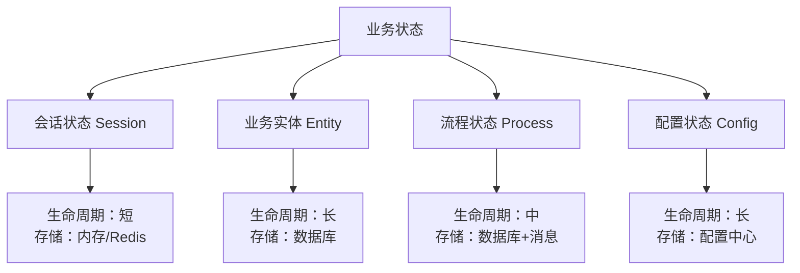
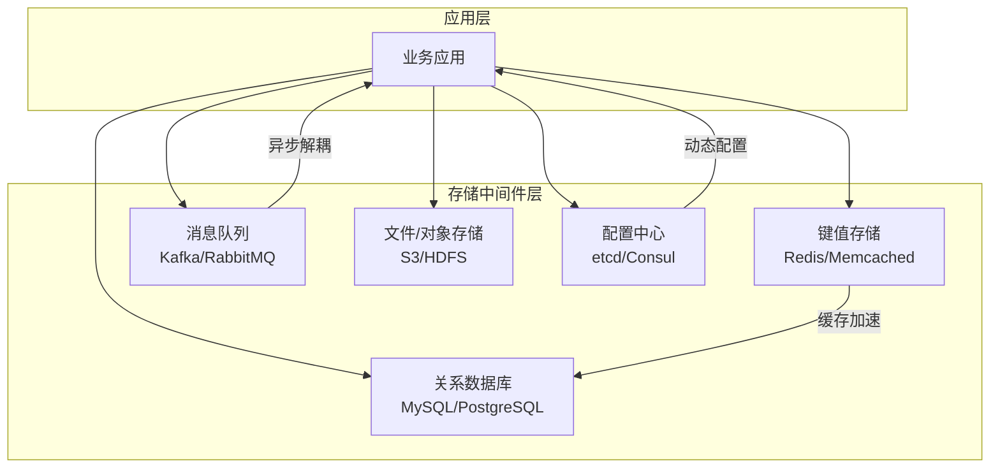
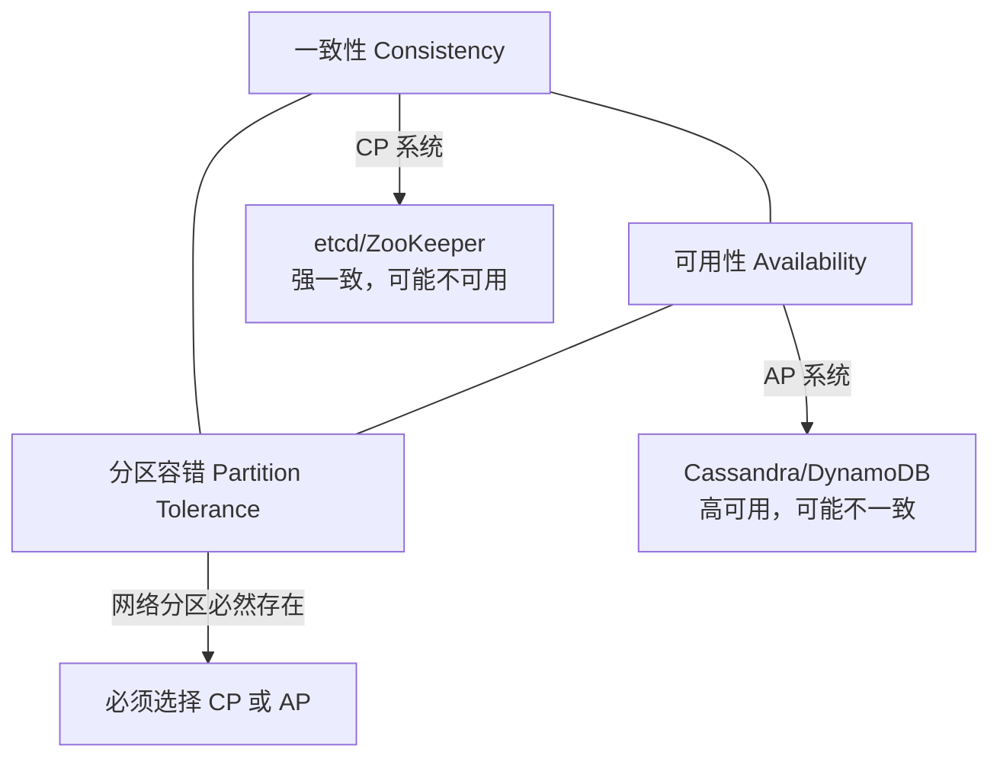
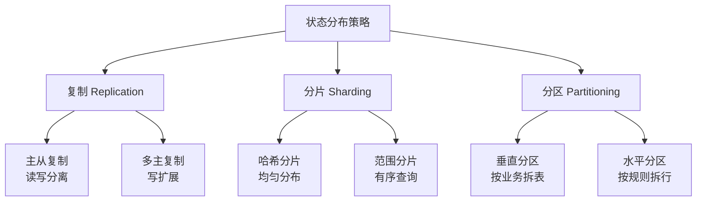
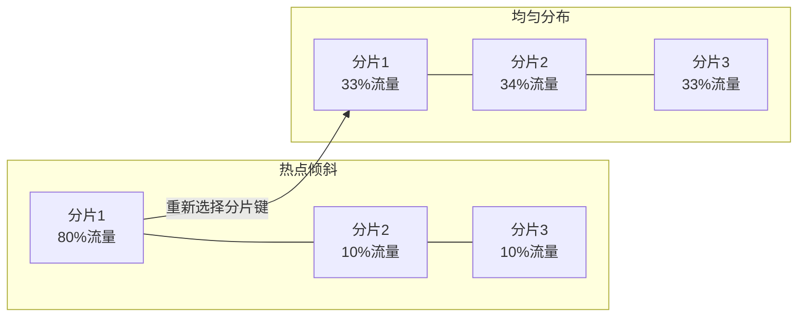

# 业务状态与存储中间件

## 一、章节导言：状态是服务端的核心难题

如果说流量调度解决的是"请求怎么进来"，那么**状态管理解决的就是"业务怎么持续"**。一个没有状态的服务端程序，充其量是一个计算器——它无法记住用户的购物车、无法追踪订单的流转、无法保持会话的上下文。

许式伟指出，服务端程序与客户端程序的根本差异之一，就是**状态的生命周期跨越了请求边界**。客户端的状态往往随进程结束而消散，服务端的状态却必须在请求之间、在重启之间、在故障之间保持连续。这一需求催生了整个存储中间件生态。

---

## 二、核心概念与原理

### 2.1 业务状态的分类体系



| 状态类型 | 特征 | 一致性要求 | 典型存储 | 生命周期 |
|----------|------|-----------|----------|----------|
| 会话状态 | 高频读写，关联用户 | 弱一致可接受 | Redis/Memcached | 分钟~小时 |
| 业务实体 | 结构化数据，关联关系 | 强一致要求 | MySQL/PostgreSQL | 永久 |
| 流程状态 | 有序流转，可补偿 | 最终一致即可 | DB + 消息队列 | 小时~天 |
| 配置状态 | 低频变更，全局生效 | 强一致 | 配置中心/etcd | 永久 |

### 2.2 存储中间件的架构定位

存储中间件是**数据层的核心基础设施**，它在服务端架构中的位置如下：



**关键洞察**：存储中间件不是"数据库"一个词能概括的。不同类型的业务状态需要不同特性的存储中间件，选错存储类型是架构设计中最昂贵的技术债之一。

### 2.3 状态管理的本质：一致性与可用性的博弈

分布式状态管理面临的核心矛盾是 CAP 定理所揭示的：



许式伟强调：**CAP 不是三元选择，而是二元的——在分区发生时选择 C 还是 A**。日常运行中，大多数系统既一致又可用；只有在网络分区时才被迫选择。

### 2.4 状态一致性模型谱系

```mermaid
graph LR
    S[强一致<br/>Linearizable] --> W[顺序一致<br/>Sequential]
    W --> C[因果一致<br/>Causal]
    C --> F[最终一致<br/>Eventual]

    S -->|"延迟最高"| LAT1[延迟：高"]
    F -->|"延迟最低"| LAT2[延迟：低"]

    S -->|"适用：金融交易"| EX1[场景：账户余额"]
    F -->|"适用：社交动态"| EX2[场景：点赞数"]

```

| 一致性模型 | 保证 | 性能代价 | 典型应用 |
|-----------|------|---------|----------|
| 线性一致 | 全局实时一致 | 最高（需同步复制） | 银行账户、库存 |
| 顺序一致 | 全局有序，但可能有延迟 | 高 | 配置分发 |
| 因果一致 | 有因果关系的操作有序 | 中 | 社交评论 |
| 最终一致 | 无冲突时最终收敛 | 最低 | CDN、DNS |

### 2.5 状态分布策略



---

## 三、设计原则与权衡（Trade-off 分析）

### 3.1 存储中间件选型的 Trade-off

| Trade-off | 一端 | 另一端 | 决策依据 |
|-----------|------|--------|----------|
| 一致性 vs 可用性 | CP 系统 | AP 系统 | 业务容忍度 |
| 功能丰富 vs 性能极致 | 关系数据库 | 键值存储 | 查询复杂度 |
| 灵活查询 vs 水平扩展 | SQL | NoSQL | 数据规模与查询模式 |
| 强一致 vs 延迟 | 同步复制 | 异步复制 | 数据重要性 |
| 存储成本 vs 查询效率 | 列式存储 | 行式存储 | OLTP vs OLAP |

### 3.2 状态管理的黄金法则

1. **最小状态原则**：能不持久化的状态就不持久化，能短生命周期的就不要长生命周期
2. **选对存储类型**：会话用 KV、实体用 DB、大文件用对象存储、流式用消息队列
3. **读写分离优先**：状态被高频读取时，优先考虑读写分离而非加机器
4. **分层存储**：热数据在缓存，温数据在数据库，冷数据在归档存储

---

## 四、实践案例与反模式

### 4.1 反模式：用数据库做缓存

将高频读取的会话数据存入 MySQL，每次请求都查询数据库，导致数据库连接池耗尽。

**正确做法**：热数据存 Redis，冷数据存 MySQL，Redis 做读写穿透或旁路缓存。

### 4.2 反模式：忽视状态倾斜

分片策略选择不当，导致 80% 的请求集中在 20% 的分片上，热点分片成为瓶颈。



**正确做法**：选择高基数字段作为分片键（如 user_id 而非 status），确保数据均匀分布。

### 4.3 实战模式：电商订单的状态管理

一个电商订单涉及多种状态，需要不同的存储中间件协同：

- **订单实体** → MySQL（强一致，事务保证）
- **库存扣减** → Redis + Lua 脚本（原子操作，防超卖）
- **订单事件** → Kafka（异步通知下游：物流、积分）
- **商品图片** → S3 对象存储

---

## 五、小结与关键要点

1. **状态是服务端的核心难题**，不同类型的状态需要不同特性的存储中间件
2. **CAP 定理揭示了分布式状态的本质矛盾**：网络分区时必须在 C 和 A 之间选择
3. **一致性模型是一个谱系**，从线性一致到最终一致，性能递增、保证递减
4. **存储中间件选型是架构师最重要的决策之一**，选错的代价远大于实现错误的代价
5. **分层存储**是应对不同访问模式的标准策略：热数据缓存、温数据持久、冷数据归档

> **相关章节**：[34丨服务端开发的宏观视角](20-服务端开发的宏观视角.md) 定义了三层模型；[37丨键值存储与数据库](23-键值存储与数据库.md) 将深入键值存储和关系数据库的技术细节
