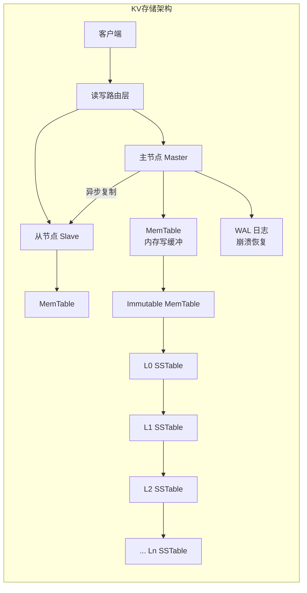
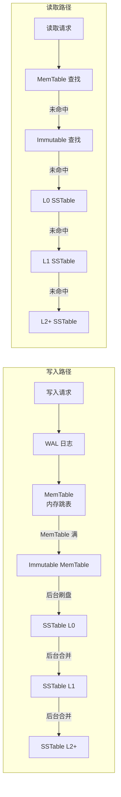
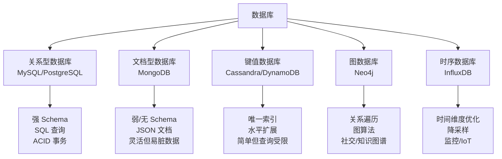
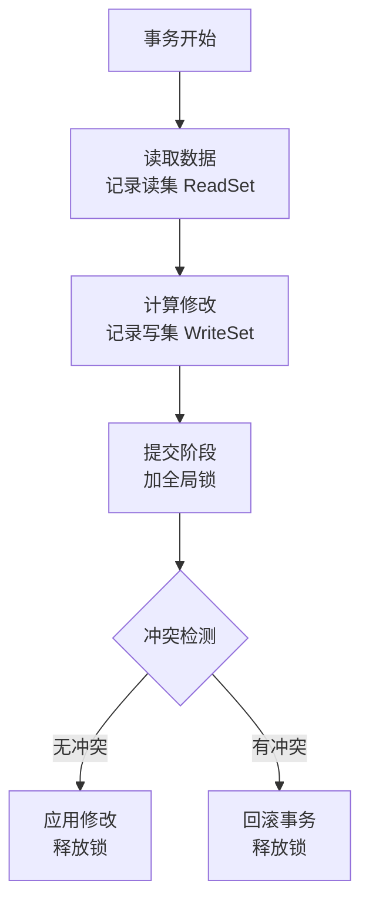
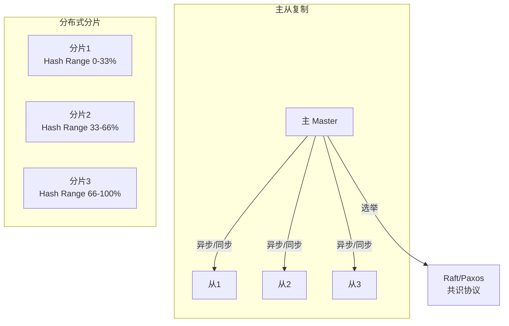

# 键值存储与数据库

## 一、章节导言：存储即数据结构

许式伟提出了一个深刻的洞察：**存储即数据结构**。在客户端开发中，数据结构是内存中的 Map、List、Tree；在服务端开发中，数据结构是外存上的 KV 存储、数据库、消息队列。存储中间件本质上是**面向外存的、高可用的、分布式的"元数据结构"**。

本节聚焦于最基础的两类存储中间件：**键值存储（KV Storage）** 和 **数据库（Database）**——前者是后者的实现基础，后者是前者的业务封装。

---

## 二、核心概念与原理

### 2.1 键值存储的本质

键值存储是最简单的存储抽象：**一个从 Key 到 Value 的映射**。它的接口极简：

```text
Get(key)     → value
Put(key, value) → ok
Delete(key)  → ok
Scan(prefix) → iterator
```

但极简的接口背后，是极复杂的实现——因为服务端的 KV 存储必须同时满足：

- **持久性**：数据不能因宕机而丢失
- **可用性**：单机故障不能导致服务中断
- **高性能**：单机 IOPS 达到 10 万级
- **可扩展**：数据量增长时可以水平扩容



### 2.2 LSM-Tree：写优化的存储引擎

LSM-Tree（Log-Structured Merge Tree）是现代 KV 存储的核心数据结构，LevelDB、RocksDB、Cassandra 都基于它。



**LSM-Tree 的核心 Trade-off**：

| 维度 | LSM-Tree | B+Tree |
|------|----------|--------|
| 写性能 | 极高（顺序写） | 中等（随机写） |
| 读性能 | 中等（需多级查找） | 高（直接定位） |
| 空间放大 | 高（多版本+待合并） | 低 |
| 写放大 | 中（Compaction 开销） | 高（每次写可能分裂节点） |
| 适用场景 | 写多读少 | 读多写少 |

**关键洞察**：LSM-Tree 将随机写转化为顺序写，是磁盘 I/O 模型的根本优化。代价是读路径变长（需要从 MemTable 到 L0 到 L1 逐级查找），以及 Compaction 带来的后台 I/O 开销。

### 2.3 数据库的分类体系



### 2.4 事务：ACID 的实现原理

事务是数据库区别于 KV 存储的核心能力。许式伟深入分析了**乐观锁**的实现机制：



**乐观锁的核心思想**：

1. **读阶段不加锁**：事务自由读取和计算，只记录读集和写集
2. **提交时才检测冲突**：检查读集中的数据是否被其他事务修改过
3. **冲突则回滚**：宁可重试，不阻塞等待

**数据版本化**：每个 Key 维护版本链 `KEY → [(VER0, VAL0), (VER1, VAL1), ...]`，已提交版本和未提交版本共存。

### 2.5 主从复制与分布式



**主从复制的三种模式**：

| 模式 | 一致性 | 可用性 | 延迟 | 适用 |
|------|--------|--------|------|------|
| 异步复制 | 弱（可能丢数据） | 高 | 低 | 日志、非关键数据 |
| 半同步复制 | 中（至少一个从确认） | 中 | 中 | 大多数业务 |
| 全同步复制 | 强 | 低（任一从挂则阻塞） | 高 | 金融核心 |

**分片策略**：

- **哈希分片**：`shard = hash(key) % N`，分布均匀但范围查询困难
- **范围分片**：按 Key 范围划分，支持范围查询但可能热点倾斜

---

## 三、设计原则与权衡（Trade-off 分析）

### 3.1 数据库选型 Trade-off 矩阵

| Trade-off | 一端 | 另一端 | 决策依据 |
|-----------|------|--------|----------|
| Schema 灵活性 | 文档数据库 | 关系数据库 | Schema 是否频繁变化 |
| 查询能力 | SQL（多索引） | KV（单索引） | 查询模式复杂度 |
| 事务支持 | ACID | BASE | 业务是否需要原子操作 |
| 扩展性 | 水平分片 | 垂直扩展 | 数据规模增长预期 |
| 写性能 | LSM-Tree | B+Tree | 写多读少 vs 读多写少 |

### 3.2 事务的 Trade-off

| 维度 | 有事务 | 无事务 |
|------|--------|--------|
| 开发效率 | 高（一个操作单元） | 低（需手动补偿） |
| 性能 | 低（锁/冲突检测开销） | 高（无锁开销） |
| 分布式 | 极难（2PC/3PC/TCC） | 简单（每操作独立） |
| 适用 | 转账、库存扣减 | 日志写入、计数累加 |

---

## 四、实践案例与反模式

### 4.1 反模式：用 KV 存储做复杂查询

将需要多条件组合查询的数据存入 Redis，然后在应用层做过滤和排序，导致大量数据传输和内存开销。

**正确做法**：结构化数据存入关系数据库，利用索引和 SQL 优化器完成查询。

### 4.2 反模式：忽视 LSM-Tree 的 Compaction 风暴

LSM-Tree 在 L0 → L1 合并时，如果层级大小比例设置不当（如 10:1），可能在某个时刻触发大量数据搬迁，造成 I/O 风暴，影响在线读写延迟。

**正确做法**：合理设置层级大小比例（如 4:1 或 8:1），控制单次 Compaction 的数据量，分时段限速 Compaction。

### 4.3 实战模式：多级存储协同

一个用户系统同时使用多种存储：

- **用户核心信息** → MySQL（强一致，事务保证注册原子性）
- **用户会话** → Redis（高频读写，TTL 自动过期）
- **用户行为日志** → Kafka + ClickHouse（异步写入，OLAP 分析）
- **用户头像** → S3 对象存储（大文件，CDN 加速）

---

## 五、小结与关键要点

1. **存储即数据结构**，存储中间件是服务端的"元数据结构"，选对存储类型是架构决策的核心
2. **LSM-Tree 是写优化的存储引擎**，通过顺序写和延迟合并实现高写吞吐，代价是读路径变长
3. **乐观锁是事务实现的主流方案**，通过"先计算后检测"避免阻塞，但冲突率高时性能退化
4. **主从复制解决可用性，分片解决扩展性**，两者正交组合构成分布式数据库的基础
5. **CAP 定理下没有银弹**，每个数据库选型都是在一致性、可用性、性能之间的权衡

> **相关章节**：[36丨业务状态与存储中间件](22-业务状态与存储中间件.md) 讨论了状态管理的宏观框架；[38丨文件系统与对象存储](24-文件系统与对象存储.md) 将讨论非结构化数据的存储方案
