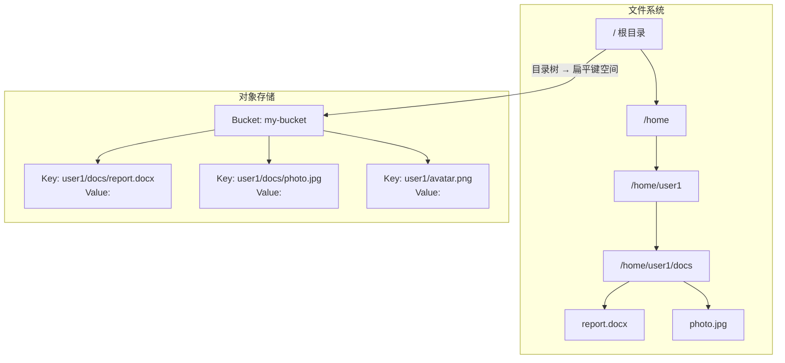
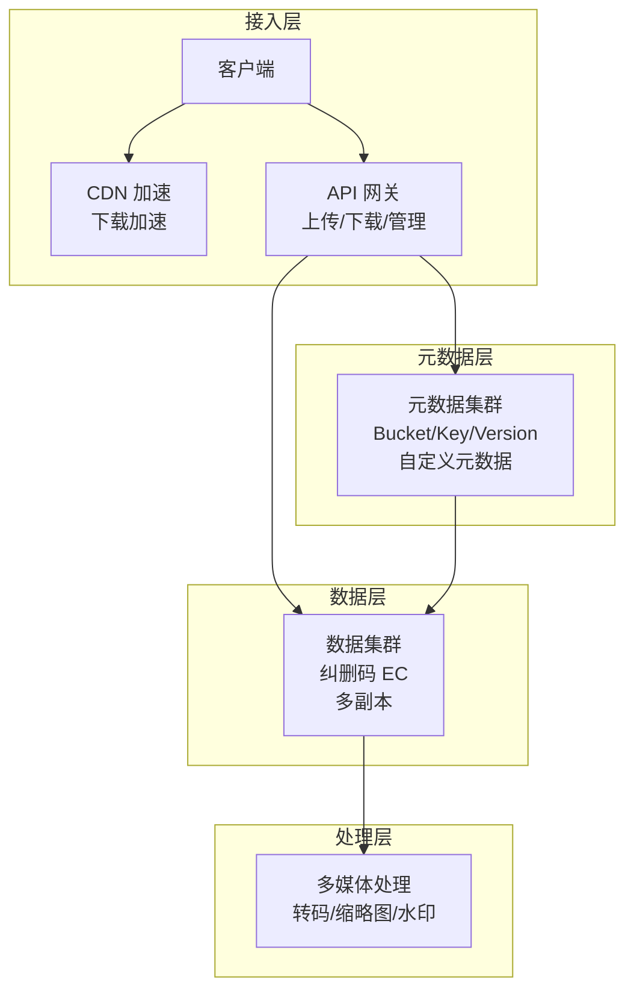
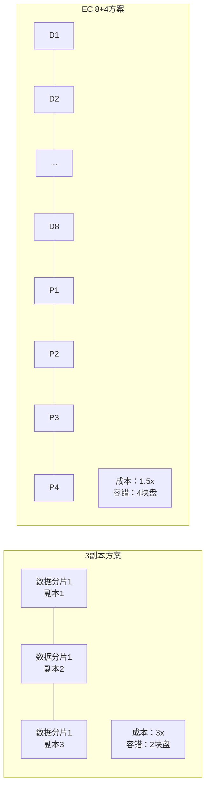
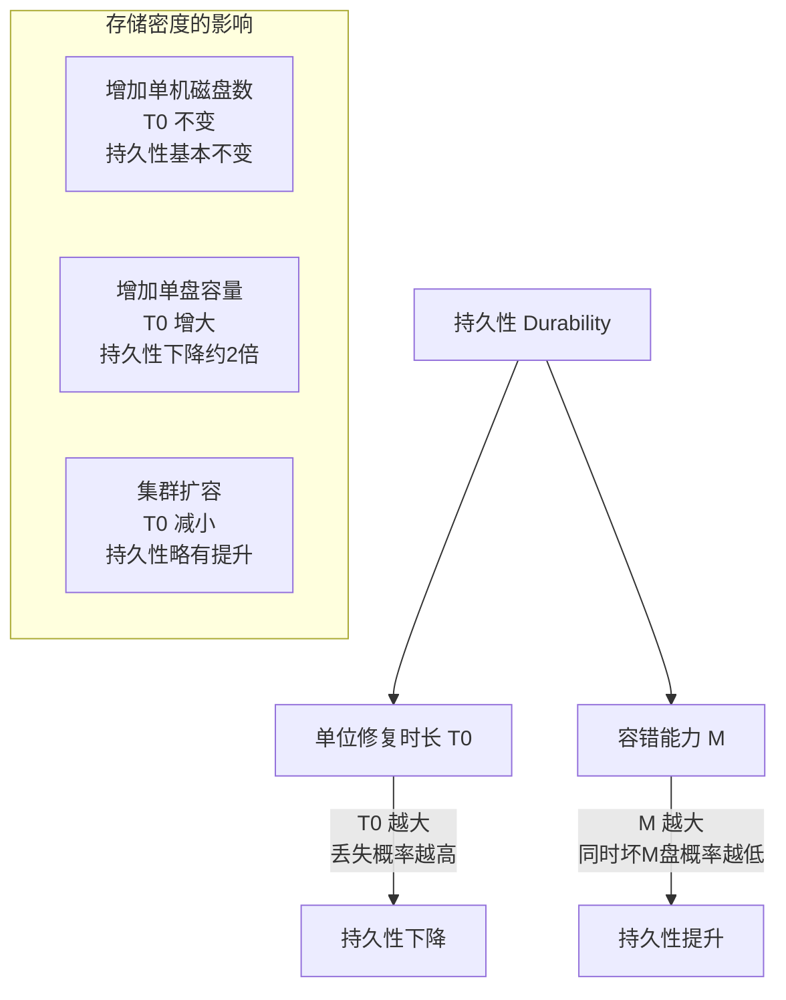
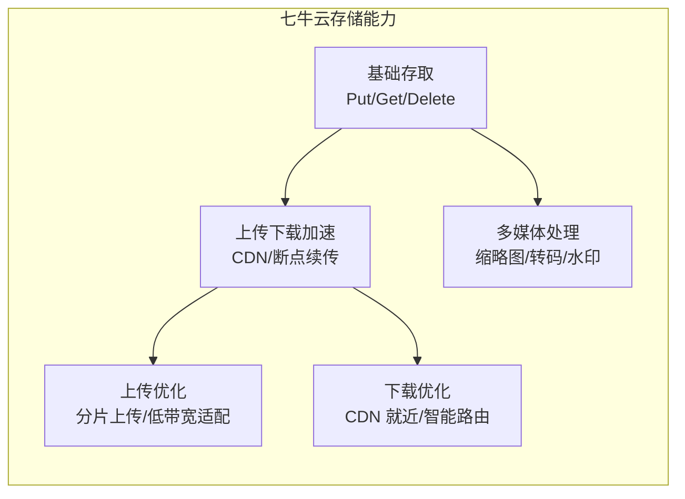
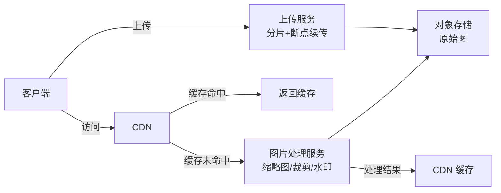

# 文件系统与对象存储

## 一、章节导言：非结构化数据的存储困境

互联网上绝大多数数据量是非结构化数据（业界通常估计约占 80%~90%）——图片、音视频、Office 文档。这些数据的存储需求与结构化数据截然不同：**没有固定的 Schema，文件大小差异巨大，访问模式以整文件读写为主**。

许式伟指出，**对象存储的出现，是服务端体系架构与桌面操作系统分道扬镳的标志性事件**。文件系统（File System）是桌面操作系统为"人手工管理数据"设计的产物，而对象存储（Object Storage）是服务端为"机器高效存取海量数据"设计的产物。两者从设计哲学到实现机制都根本不同。

---

## 二、核心概念与原理

### 2.1 文件系统 vs 对象存储



| 维度 | 文件系统 | 对象存储 |
|------|---------|---------|
| 数据组织 | 目录树（层级关系） | 扁平键空间（无层级） |
| 元数据 | 固定属性（权限/时间/大小） | 自定义元数据（KV 对） |
| 一致性 | POSIX 语义（强一致） | 早期以最终一致为主（S3/GCS 等主流服务现已提供读后写强一致） |
| 扩展性 | 单机瓶颈 | 水平扩展 |
| API 风格 | POSIX 文件 API | RESTful HTTP API |
| 适用规模 | 百万级文件 | 百亿级对象 |

**关键洞察**：对象存储的 Key 中虽然可以有 `/` 字符，看起来像路径，但 `/` 只是一个普通字符，**不存在目录的概念**。这使得对象存储可以轻松通过 Key 的 Hash 或 Range 分区，将请求路由到特定机器。

### 2.2 对象存储的架构



**对象存储的三大核心接口**：

```text
PutObject(bucket, key, object) → etag    // 上传对象
GetObject(bucket, key) → object           // 下载对象
DeleteObject(bucket, key) → ok            // 删除对象
```

### 2.3 纠删码（Erasure Coding）：成本与持久性的平衡

3 副本存储的冗余度为 3x，成本高昂。纠删码用**算术冗余**替代**复制冗余**，在保持同等持久性的前提下大幅降低成本。



**EC (N+M) 方案分析**：

以 28+4 为例：
- 将文件切分为 28 份数据片，计算出 4 份冗余片，共 32 份存储在 32 台机器
- **成本**：1.14x（对比 3 副本的 3x，节省 62%）
- **容错**：允许同时损坏 4 块盘（对比 3 副本仅允许 2 块）
- **代价**：读修复需要 N 台机器参与计算，网络和 CPU 开销更大

### 2.4 持久性的定量分析

许式伟对存储密度与持久性的关系做了精辟的定性分析：



**核心结论**：
- 增加单机磁盘数对持久性影响不大（T0 不变）
- 增加单盘容量对持久性伤害较大（T0 增大，修复时间变长）
- 集群规模扩大对持久性略有正面影响（T0 减小，修复更快）

### 2.5 对象存储的完整能力模型

许式伟以七牛云存储为例，定义了对象存储的完整能力模型：

> **对象存储 = 基础存取 + 上传下载加速 + 多媒体处理**



---

## 三、设计原则与权衡（Trade-off 分析）

### 3.1 对象存储核心 Trade-off

| Trade-off | 一端 | 另一端 | 决策依据 |
|-----------|------|--------|----------|
| 成本 vs 持久性 | EC 编码 | 多副本 | 存储规模与预算 |
| 一致性 vs 可用性 | 强一致读 | 最终一致 | 是否需要立即读到新写入 |
| 存储密度 vs 修复速度 | 大容量单盘 | 多小容量盘 | 磁盘故障率与修复带宽 |
| 功能 vs 简单 | 全功能网关 | 极简 API | 业务复杂度 |
| 就近访问 vs 一致性 | CDN 缓存 | 源站直连 | 数据更新频率 |

### 3.2 冗余方案选择指南

| 场景 | 推荐方案 | 理由 |
|------|---------|------|
| 热数据，高频访问 | 3 副本 | 读性能好，无需解码 |
| 温数据，中等访问 | EC 8+4 | 成本低，持久性好 |
| 冷数据，归档访问 | EC 12+4 + 压缩 | 极致成本优化 |
| 超冷数据，合规归档 | EC + 磁带 | 最低成本，可接受慢速 |

---

## 四、实践案例与反模式

### 4.1 反模式：用 HDFS 存海量小文件

HDFS 的 Block 大小默认 64MB（或 128MB），设计目标是大文件日志存储。将百万级小图片存入 HDFS：

- 每个文件至少占 64MB 空间（空间浪费 99%+）
- NameNode 内存瓶颈（每个文件约 150B 元数据，1 亿文件需 15GB 内存）
- 目录树维护代价高

**正确做法**：海量小文件用对象存储，大文件日志用 HDFS。

### 4.2 反模式：在对象存储上模拟目录操作

试图实现 `CreateDirectory`、`MoveDirectory` 等操作——对象存储没有目录概念，这些操作要么无意义，要么代价极高（"移动目录"需要修改所有子对象的 Key）。

**正确做法**：接受扁平键空间的设计，用 Key 的前缀约定模拟逻辑分组，但不依赖其实现目录语义。

### 4.3 实战模式：图片服务的完整架构



---

## 五、小结与关键要点

1. **对象存储是服务端与桌面分道扬镳的标志**，扁平键空间取代目录树，RESTful API 取代 POSIX API
2. **纠删码是成本与持久性的最佳平衡**，相比 3 副本节省 60%+ 成本，同时提升容错能力
3. **存储密度与持久性的关系**：增加单盘容量伤害持久性，增加集群规模略微提升持久性
4. **对象存储的完整能力** = 基础存取 + 上传下载加速 + 多媒体处理
5. **选对存储类型**：海量小文件用对象存储，大文件日志用 HDFS，结构化数据用数据库

> **相关章节**：[37丨键值存储与数据库](23-键值存储与数据库.md) 讨论了结构化数据的存储；[39丨存储与缓存](25-存储与缓存.md) 将讨论缓存如何加速存储访问
