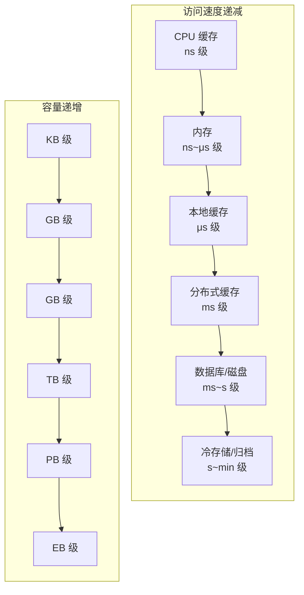
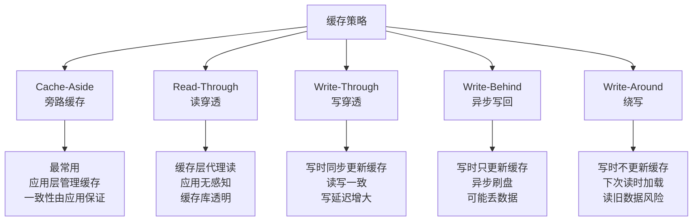
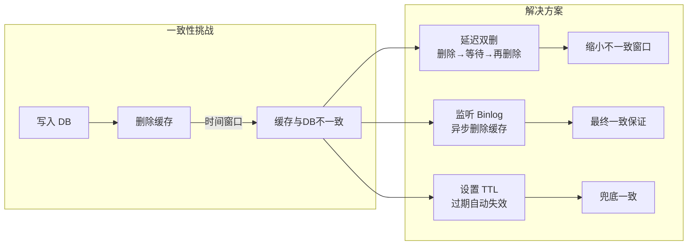
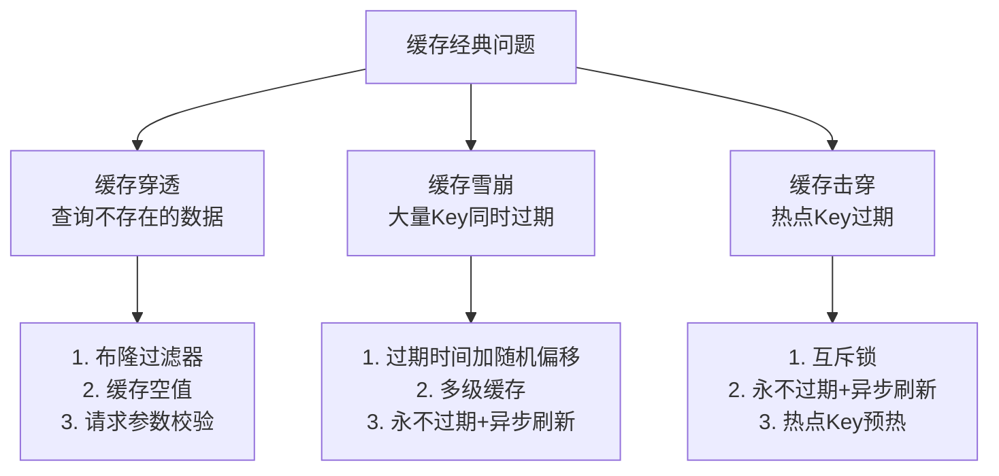
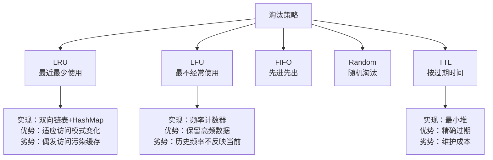
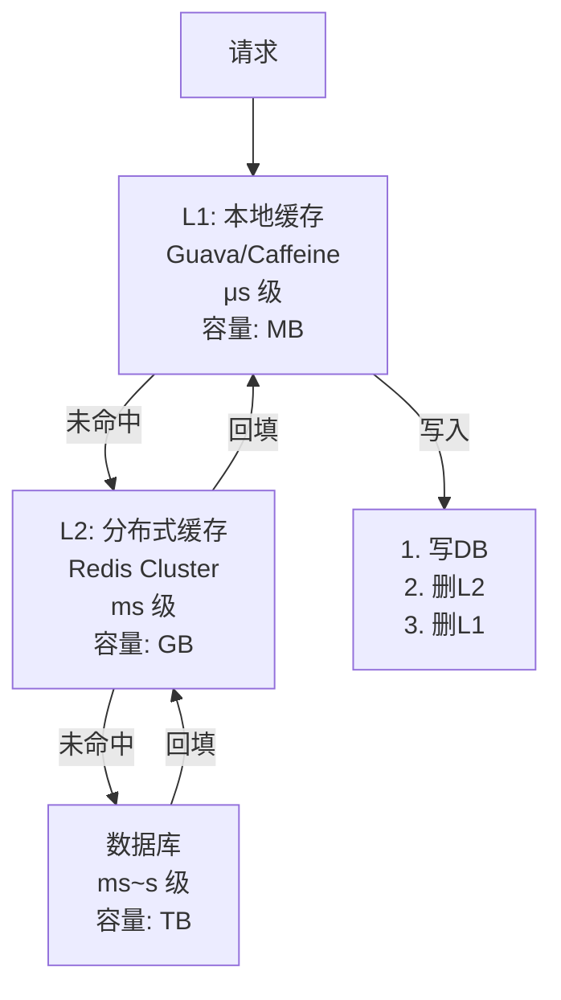

# 存储与缓存

## 一、章节导言：缓存是性能的万金油，还是万丈深渊？

在服务端开发中，**缓存是解决性能问题最常用的手段**，也是最容易被滥用的手段。许式伟警告：缓存不是免费的——它引入了**数据一致性、缓存穿透、缓存雪崩、缓存击穿**等一整套新问题。加缓存容易，管缓存难。

缓存的本质是**用空间换时间、用冗余换速度**。理解缓存，不是记住几个策略名称，而是深刻理解**数据访问的局部性原理**和**一致性边界的妥协**。

---

## 二、核心概念与原理

### 2.1 存储与缓存的分层体系



**核心定律**：存储层级中，**速度越快，容量越小，成本越高**。缓存的本质是在这个层级链路中插入一个"速度-成本平衡点"。

### 2.2 缓存策略全景



| 策略 | 写操作 | 读操作 | 一致性 | 适用场景 |
|------|--------|--------|--------|----------|
| Cache-Aside | 先更新DB，再删缓存 | 先查缓存，未命中查DB | 最终一致 | 通用场景 |
| Read-Through | 同 Cache-Aside | 缓存层自动加载 | 最终一致 | 简化应用层 |
| Write-Through | 同步写DB和缓存 | 同 Read-Through | 强一致 | 数据安全优先 |
| Write-Behind | 只写缓存，异步写DB | 同 Read-Through | 弱一致 | 写密集场景 |
| Write-Around | 只写DB，不更新缓存 | 同 Cache-Aside | 最终一致 | 写多读少 |

### 2.3 缓存一致性：从理论到实践

缓存引入的核心矛盾是：**数据存在于两个地方（缓存 + 数据源），如何保持一致？**



**Cache-Aside 的经典并发问题**：

```text
时间线:
T1: 读请求 A 缓存未命中，查 DB 得到旧值
T2: 写请求 B 更新 DB 为新值
T3: 写请求 B 删除缓存
T4: 读请求 A 将旧值写入缓存  ← 缓存中是旧值！
```

**解决方案**：延迟双删——写请求在删除缓存后，等待一段时间再删一次，覆盖 T4 时刻的脏写。

### 2.4 缓存三大经典问题



| 问题 | 触发条件 | 后果 | 根因 | 最佳方案 |
|------|---------|------|------|----------|
| 穿透 | 大量请求查询不存在的数据 | 全部打到DB | 缓存无值可缓存 | 布隆过滤器 + 空值缓存 |
| 雪崩 | 大量Key同时过期 | 瞬间DB压力暴增 | TTL集中 | 随机过期时间 + 多级缓存 |
| 击穿 | 热点Key过期瞬间大量并发 | DB被单Key请求压垮 | 热点+并发 | 互斥锁 + 预热 |

### 2.5 缓存淘汰策略

当缓存空间不足时，选择淘汰哪些数据？



**LRU 的变种**：
- **LRU-K**：记录最近 K 次访问，只有被访问 K 次才进入缓存，过滤偶发访问
- **2Q（Two Queues）**：冷数据区和热数据区，新数据先进冷区，再次访问才进入热区
- **TinyLFU**：用 Count-Min Sketch 近似频率统计，空间效率极高

### 2.6 多级缓存架构



**多级缓存的一致性策略**：
- L1（本地缓存）TTL 短（秒级），只做热数据加速
- L2（分布式缓存）TTL 中（分钟级），做共享缓存
- DB（持久层）永不过期，数据唯一真相源（Single Source of Truth）

---

## 三、设计原则与权衡（Trade-off 分析）

### 3.1 缓存核心 Trade-off

| Trade-off | 一端 | 另一端 | 决策依据 |
|-----------|------|--------|----------|
| 一致性 vs 性能 | Write-Through | Write-Behind | 数据安全 vs 写入延迟 |
| 命中率 vs 内存 | 大缓存+长TTL | 小缓存+短TTL | 成本预算 |
| 淘汰精度 vs 开销 | LFU/TinyLFU | LRU | 是否有热点稳定分布 |
| 本地 vs 分布式 | 本地缓存（快但不共享） | 分布式缓存（慢但共享） | 数据更新频率 |
| 缓存层级 vs 复杂度 | 多级缓存 | 单级缓存 | QPS 要求 |

### 3.2 缓存的黄金法则

1. **先加监控再加缓存**：缓存命中率、QPS、延迟必须在加缓存的同时建设
2. **缓存不是持久层**：任何时刻缓存数据都可能丢失，系统必须能在缓存全部失效时正常工作
3. **过期时间必须加随机**：避免 Key 集中过期导致雪崩
4. **缓存空值防止穿透**：对不存在的数据也缓存一个短 TTL 的空值
5. **热点Key必须预热**：系统启动时主动加载热点数据，避免冷启动击穿

---

## 四、实践案例与反模式

### 4.1 反模式：缓存作为持久层

将数据只存在 Redis 中，不落盘。Redis 宕机后数据全部丢失。

**正确做法**：Redis 作为缓存层，MySQL 作为持久层。Redis 故障时系统降级但可用（直接查 DB，响应变慢但数据不丢）。

### 4.2 反模式：无过期时间的缓存

Key 不设 TTL，依赖手动删除。结果大量僵尸数据占满内存，新数据被淘汰。

**正确做法**：所有 Key 必须设置合理的 TTL，即使预期"永不过期"的数据也应设长 TTL（如 24h）并配合自动刷新机制。

### 4.3 实战模式：电商商品详情页的多级缓存

```mermaid
graph LR
    REQ[用户请求] --> L1[本地缓存<br/>Caffeine<br/>TTL: 5s]
    L1 -->|"未命中"| L2[Redis 集群<br/>TTL: 60s"]
    L2 -->|"未命中"| DB[MySQL]

    subgraph 缓存更新
        BINLOG[Binlog 监听] --> MQ[消息队列]
        MQ --> DEL1[删除 Redis Key]
        MQ --> DEL2[通知其他节点删本地缓存]
    end

    DB --> BINLOG

```

**一致性保证**：DB 变更 → Binlog → 消息队列 → 异步删缓存，最终一致窗口 < 1s。

---

## 五、小结与关键要点

1. **缓存是空间换时间的经典手段**，但引入了数据一致性、穿透/雪崩/击穿等新问题
2. **Cache-Aside 是最通用的缓存策略**，但需要理解其并发场景下的一致性缺陷
3. **缓存三大问题的根源不同**：穿透是查询不存在的数据，雪崩是 Key 集中过期，击穿是热点 Key 突然失效
4. **多级缓存是高 QPS 系统的标准架构**：本地缓存做第一道防线，分布式缓存做共享加速
5. **缓存不是持久层**——系统必须能在缓存全部失效时正常工作，只是性能退化

> **相关章节**：[37丨键值存储与数据库](23-键值存储与数据库.md) 中 Redis 既是 KV 存储也是缓存；[38丨文件系统与对象存储](24-文件系统与对象存储.md) 中 CDN 是对象存储的缓存层
