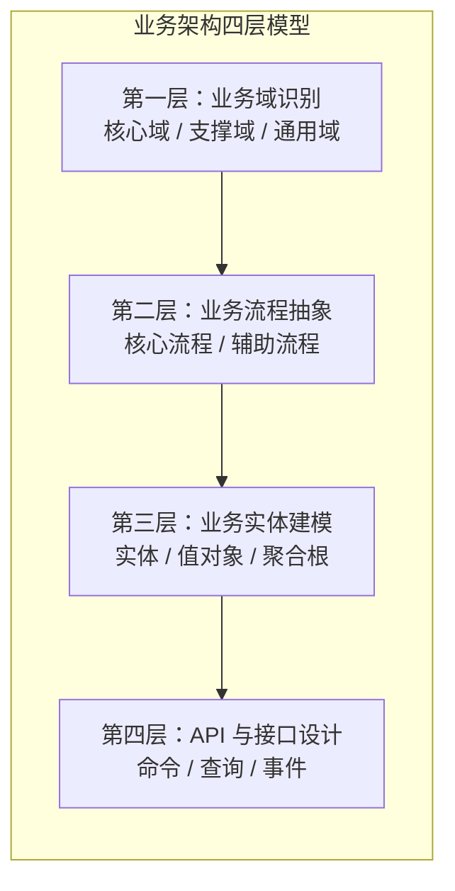
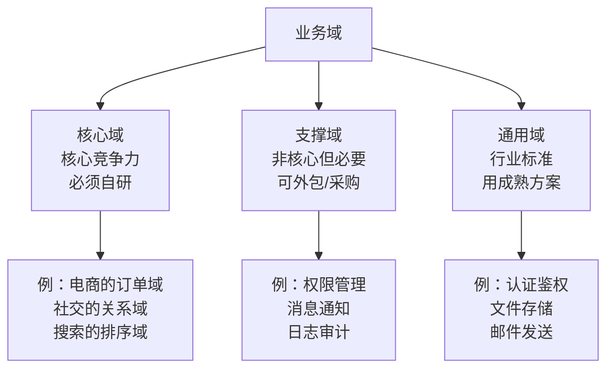
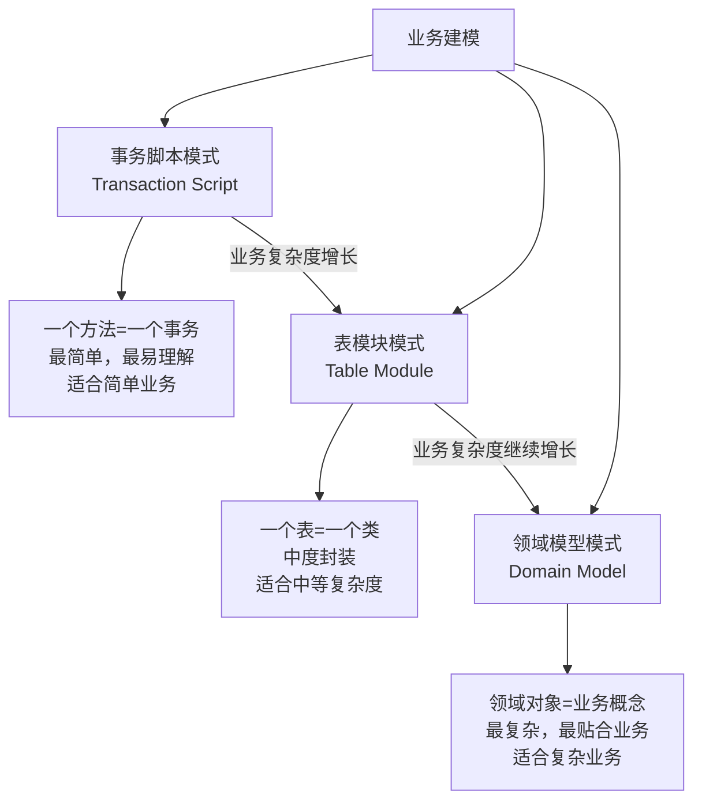
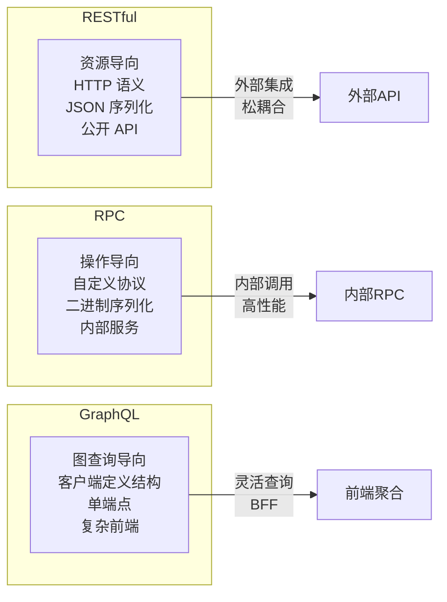
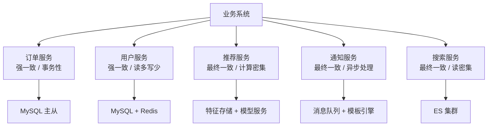
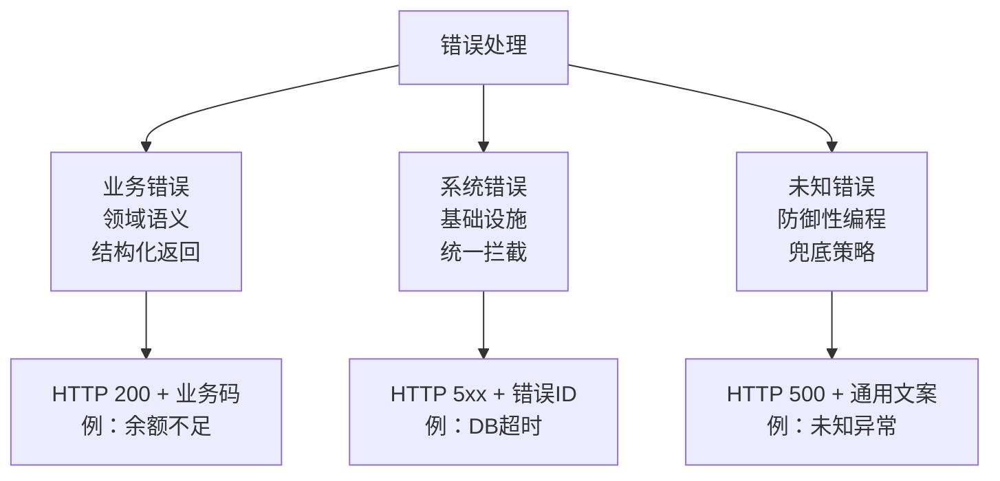
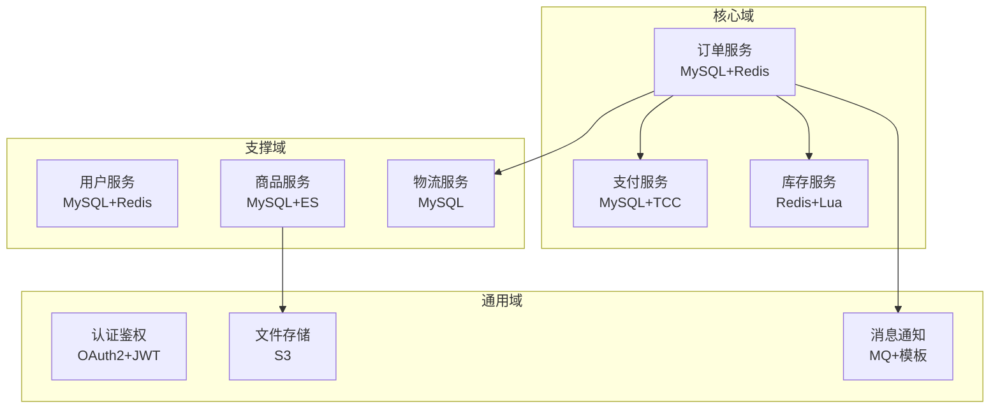

# 服务端的业务架构建议

## 一、章节导言：业务架构是服务端开发的地基

前面的章节讨论了服务端的技术架构——流量调度、存储中间件、缓存策略。但技术架构是"骨架"，**业务架构才是"灵魂"**。许式伟强调，服务端开发最容易犯的错误不是技术选型错误，而是**业务建模错误**——模型错了，技术再强也是空中楼阁。

业务架构的核心问题是：**如何将复杂的业务需求分解为清晰的软件结构？** 这不是一个技术问题，而是一个认知问题——你对业务的理解深度，决定了代码的结构质量。

---

## 二、核心概念与原理

### 2.1 业务架构的层次模型



### 2.2 业务域识别：DDD 的战略设计

许式伟的方法论与 DDD（领域驱动设计）的战略设计不谋而合：



**核心原则**：
- **核心域必须自研**，投入最优秀的工程师
- **通用域直接用成熟方案**，不重复造轮子
- **支撑域可自研可采购**，看团队能力与成本

### 2.3 业务建模的三大模式



| 模式 | 核心思想 | 优势 | 劣势 | 适用场景 |
|------|---------|------|------|----------|
| 事务脚本 | 一个函数完成一个业务操作 | 简单直观 | 逻辑分散，难以复用 | CRUD 为主 |
| 表模块 | 以数据表为中心组织逻辑 | 适度封装 | 与表结构耦合 | 中等复杂度 |
| 领域模型 | 以业务概念为中心组织逻辑 | 高度内聚，贴合业务 | 学习成本高 | 复杂业务规则 |

### 2.4 API 设计的 RESTful 与 RPC 之争



**许式伟的建议**：
- **对外 API 用 RESTful**：语义清晰、工具丰富、易于理解
- **对内服务用 RPC/gRPC**：性能高、类型安全、代码生成
- **BFF 层可用 GraphQL**：为不同前端灵活聚合数据

### 2.5 业务状态的拆分建议

许式伟提出了一个重要的架构建议：**按业务状态的生命周期和一致性要求拆分服务边界**。



**核心原则**：
- **强一致的业务放同一个服务**，避免分布式事务
- **最终一致的业务独立成服务**，通过消息队列异步解耦
- **不同一致性要求的业务不要放在同一个事务中**

### 2.6 错误处理的架构建议



**许式伟的建议**：
- 业务错误不是异常，是正常的业务分支，用结构化的业务码返回
- 系统错误需要告警和自动恢复机制
- 未知错误需要兜底策略，不能让用户看到堆栈信息

---

## 三、设计原则与权衡（Trade-off 分析）

### 3.1 业务架构核心 Trade-off

| Trade-off | 一端 | 另一端 | 决策依据 |
|-----------|------|--------|----------|
| 简单性 vs 扩展性 | 事务脚本 | 领域模型 | 当前与预期的业务复杂度 |
| 性能 vs 灵活性 | RPC | RESTful | 调用方是内部还是外部 |
| 一致性 vs 可用性 | 强一致服务 | 最终一致服务 | 业务容忍度 |
| 通用性 vs 特化 | 通用平台 | 垂直业务 | 业务差异化程度 |
| 拆分粒度 | 粗粒度（单体） | 细粒度（微服务） | 团队规模与运维能力 |

### 3.2 服务拆分的黄金法则

1. **按业务域拆分，不按技术层拆分**：订单服务包含自己的 API、逻辑、数据层
2. **强一致的业务不拆**：需要事务保证的操作放在同一个服务内
3. **拆分后独立可部署**：如果不能独立部署，拆分就没有意义
4. **先粗后细，渐进拆分**：从大的业务域开始，随着团队和业务增长逐步细分

---

## 四、实践案例与反模式

### 4.1 反模式：按技术层拆分服务

```text
API层服务 → 逻辑层服务 → 数据层服务
```

这种拆分方式的问题是：一个简单的业务操作需要跨越三个服务，增加了网络开销、降低了开发效率、放大了故障面。

**正确做法**：按业务域拆分——每个服务包含自己的 API、逻辑、数据层。

### 4.2 反模式：分布式事务滥用

跨服务调用使用 2PC（两阶段提交），一个服务失败导致整个事务回滚，性能极差且可用性低。

**正确做法**：
- 强一致操作放在同一个服务内，用本地事务保证
- 跨服务的最终一致用 Saga 模式或消息队列 + 补偿机制

### 4.3 实战模式：电商系统的业务架构



---

## 五、小结与关键要点

1. **业务架构是服务端开发的地基**，模型错了，技术再强也无济于事
2. **按业务域拆分服务**，核心域自研、通用域采购、支撑域灵活选择
3. **强一致的业务不拆**，需要事务的操作放在同一个服务内，用本地事务保证
4. **API 设计要分内外**：对外 RESTful，对内 RPC/gRPC
5. **错误处理要分三层**：业务错误结构化返回、系统错误告警恢复、未知错误兜底

> **相关章节**：[31-服务端开发的宏观视角](20-服务端开发的宏观视角.md) 建立了三层模型；[41-44丨实战](27-实战-"画图"程序后端实战.md) 将以画图程序为例完整实践业务架构
