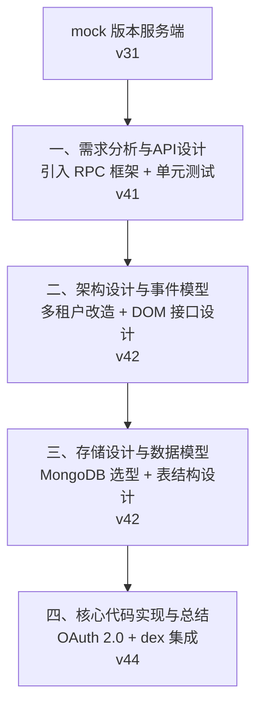
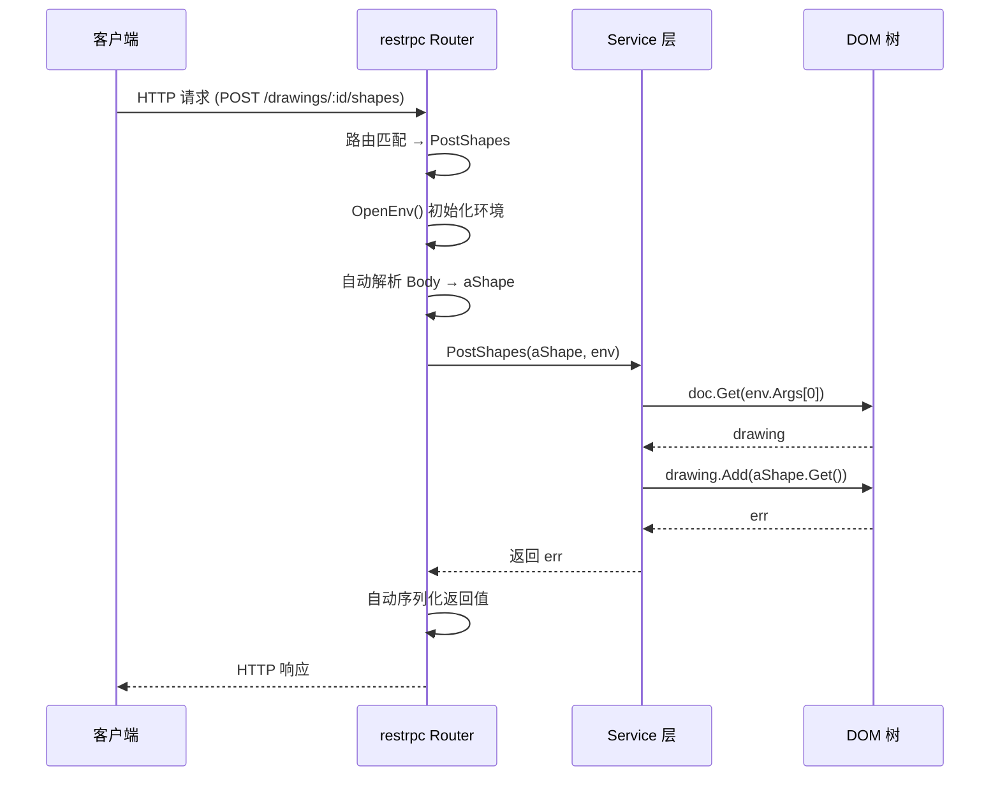
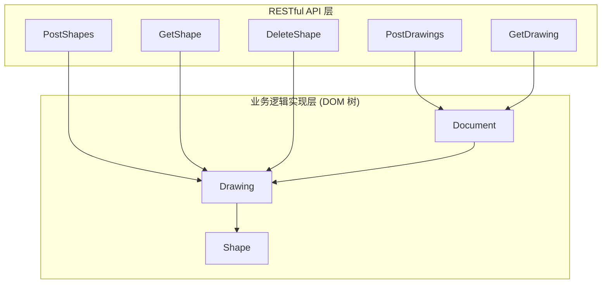
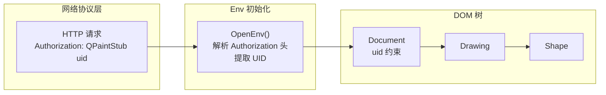
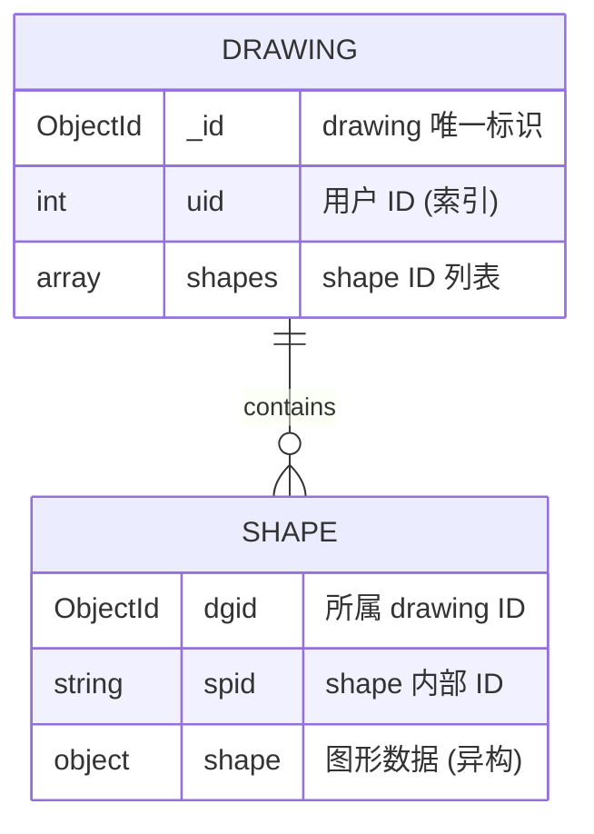
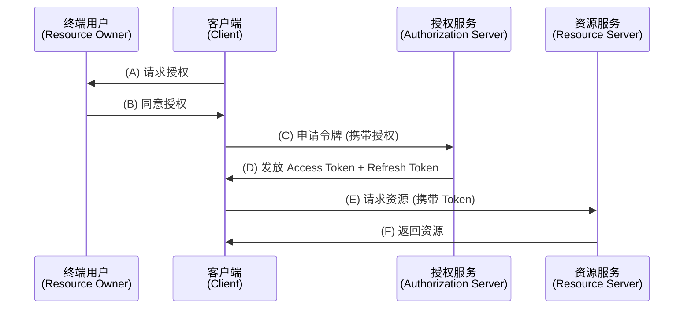
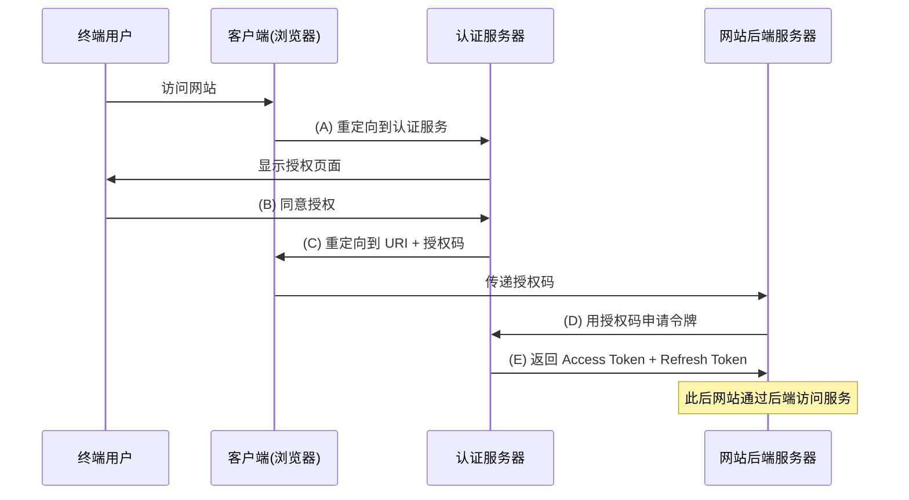
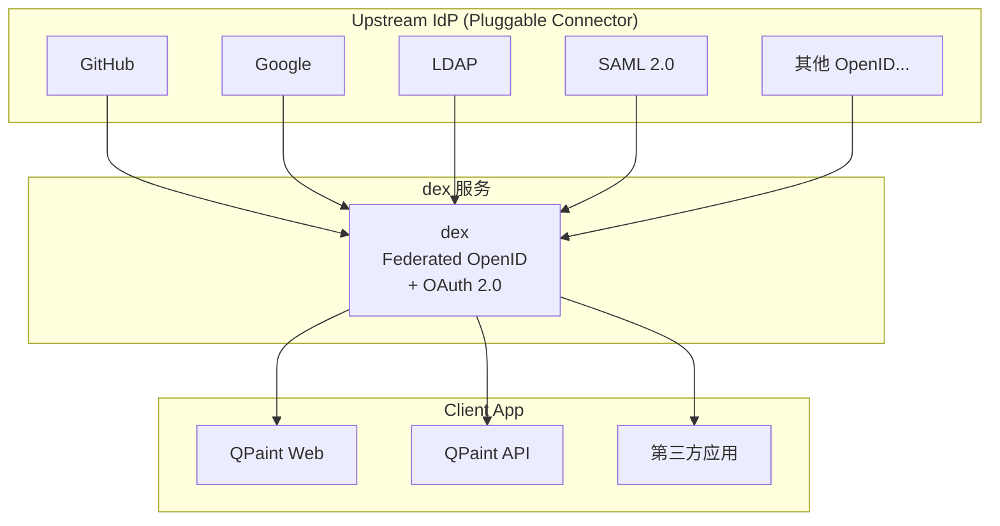

# 实战-"画图"程序后端实战

到今天为止，服务端开发的基本内容已经讲完了。我们花了比较长的篇幅来介绍服务端的基础软件，包括负载均衡和各类存储中间件，然后介绍了服务端在业务架构上的一些通用问题。

现在，我们进入实战环节。

**核心问题**：如何从一个 mock 版本的服务端出发，一步步迭代，将其改造成一个产品级的服务端程序？这不仅是一个编码过程，更是一个完整的架构设计过程——从需求分析到 API 设计，从架构分层到事件模型，从存储选型到数据建模，再到最终的认证授权与代码落地。

对比服务端和桌面端的内容可以看出，服务端开发和桌面端开发各自有各自的复杂性。服务端开发，难在基础软件很多，对程序员和架构师的知识面和理解深度都有较高的要求。但从业务复杂性来说，服务端的业务逻辑相对简单。而桌面端开发则相反，它的难点在于用户交互逻辑复杂，代码量大，业务架构的复杂性高。

在上一章的实战中，我们从架构角度偏重于概要设计（系统架构），把重心放在模块之间的接口耦合上，希望大家把关注点放在全局，而不是一上来就进入局部细节。但这也导致缺乏完整流程的剖析，理解上打了折扣。这一章，我们会在架构上偏重于详细设计，从需求到代码的完整链路将逐一展开。

我们的起点是一个已经实现的 mock 版本服务端：

- [https://github.com/qiniu/qpaint/tree/v31/paintdom](https://github.com/qiniu/qpaint/tree/v31/paintdom)

接下来，我们将通过四个阶段，一步步把它变成一个产品级的服务端程序。



---

## 一、需求分析与 API 设计

### 引入 RPC 框架

第一步，我们引入 RPC 框架。在上一章的实战中，mock 服务端程序没有引入任何非标准库的内容，整个 Service 大约 280 行代码。我们改为基于七牛云开源的 [restrpc](https://github.com/qiniu/http/tree/v2.0.1/restrpc) 框架来实现：

- [https://github.com/qiniu/qpaint/blob/v41/paintdom/service.go](https://github.com/qiniu/qpaint/blob/v41/paintdom/service.go)

改造后整个 Service 只剩下约 163 行代码，不到原先的 60%。

到底少写了哪些代码？我们拿创建一个新图形来看。原先这样写：

```go
func (p *Service) PostShapes(w http.ResponseWriter, req *http.Request, args []string) {
    id := args[0]
    drawing, err := p.doc.Get(id)
    if err != nil {
        ReplyError(w, err)
        return
    }

    var aShape serviceShape
    err = json.NewDecoder(req.Body).Decode(&aShape)
    if err != nil {
        ReplyError(w, err)
        return
    }

    err = drawing.Add(aShape.Get())
    if err != nil {
        ReplyError(w, err)
        return
    }
    ReplyCode(w, 200)
}
```

现在这样写：

```go
func (p *Service) PostShapes(aShape *serviceShape, env *restrpc.Env) (err error) {
    id := env.Args[0]
    drawing, err := p.doc.Get(id)
    if err != nil {
        return
    }
    return drawing.Add(aShape.Get())
}
```

再看一个返回包比较复杂的例子——取图形的内容。原先：

```go
func (p *Service) GetShape(w http.ResponseWriter, req *http.Request, args []string) {
    id := args[0]
    drawing, err := p.doc.Get(id)
    if err != nil {
        ReplyError(w, err)
        return
    }

    shapeID := args[1]
    shape, err := drawing.Get(shapeID)
    if err != nil {
        ReplyError(w, err)
        return
    }
    Reply(w, 200, shape)
}
```

现在：

```go
func (p *Service) GetShape(env *restrpc.Env) (shape Shape, err error) {
    id := env.Args[0]
    drawing, err := p.doc.Get(id)
    if err != nil {
        return
    }

    shapeID := env.Args[1]
    return drawing.Get(shapeID)
}
```

对比这两个例子，可以看出：

- 原先 URL 参数如 DrawingID、ShapeID 的值通过 `args[0]`、`args[1]` 传入，现在通过 `env.Args[0]`、`env.Args[1]` 传入。
- 原先 PostShapes 需要自己定义 Shape 实例并解析 HTTP 请求包 `req.Body` 的内容，现在只需在参数中指定 Shape 类型，restrpc 框架自动完成参数的解析。
- 原先 GetShape 需要自己回复错误或返回正常的 HTTP 协议包，现在只需在返回值列表中返回要回复的数据，restrpc 框架自动完成返回值的序列化并回复 HTTP 请求。

restrpc 的 HTTP 处理函数核心代码：

- [https://github.com/qiniu/http/blob/v2.0.2/rpcutil/rpc_util.go#L96](https://github.com/qiniu/http/blob/v2.0.2/rpcutil/rpc_util.go#L96)

值得关注的是 Env 的支持，RPC 框架并没有限定 Env 类具体是什么样子的，只是规定它需要满足以下接口：

```go
type itfEnv interface {
    OpenEnv(rcvr interface{}, w *http.ResponseWriter, req *http.Request) error
    CloseEnv()
}
```

在 OpenEnv 方法中，一般进行 Env 的初始化工作。CloseEnv 方法则反之。为什么 OpenEnv 方法中 ResponseWriter 接口以指针方式传入？因为可能会有客户希望改写 ResponseWriter 的实现——比如要给 RPC 框架扩展 API 审计日志的功能，就需要接管并记录用户返回的 HTTP 包。

另外值得注意的是，restrpc 版本的 HTTP 请求处理函数看起来不再那么像 HTTP 处理函数，倒像一个普通函数。这意味着我们可以有两种方式来测试 Service 类：除了用正常测试 HTTP Service 的方法来测试它以外，也可以把 Service 类当成普通类来测试，这大大降低了单元测试的成本——不再需要包装服务的 Client SDK 再基于它做单元测试。

### restrpc 路由机制

restrpc 的路由功能由 restrpc.Router 类的 Register 函数完成：

- [https://github.com/qiniu/http/blob/v2.0.1/restrpc/restroute.go#L39](https://github.com/qiniu/http/blob/v2.0.1/restrpc/restroute.go#L39)

它支持两种路由方式。一种是根据方法名字自动路由，比如 `POST /drawings/<DrawingID>/shapes` 要求方法名为 `PostDrawings_Shapes`，`GET /drawings/<DrawingID>/shapes/<ShapeID>` 要求方法名为 `GetDrawings_Shapes_`。规则比较简单：路径中的 "/" 由单词首字母大写来分隔，URL 参数替换为 "_"。

当然有的人会认为这种方法名字看起来很丑，那么就可以选择手工路由的方式，传入 routeTable：

```go
var routeTable = [][2]string{
    {"POST /drawings", "PostDrawings"},
    {"GET /drawings/*", "GetDrawing"},
    {"DELETE /drawings/*", "DeleteDrawing"},
    {"POST /drawings/*/sync", "PostDrawingSync"},
    {"POST /drawings/*/shapes", "PostShapes"},
    {"GET /drawings/*/shapes/*", "GetShape"},
    {"POST /drawings/*/shapes/*", "PostShape"},
    {"DELETE /drawings/*/shapes/*", "DeleteShape"},
}
```

虽然是手工路由，但方法名仍然有限制，要求必须是 Get、Put、Post、Delete 开头。

### RESTful API 流程图



### 单元测试

之前单元测试基本上没怎么做：

- [https://github.com/qiniu/qpaint/blob/v31/paintdom/service_test.go#L62](https://github.com/qiniu/qpaint/blob/v31/paintdom/service_test.go#L62)

```go
type idRet struct {
    ID string `json:"id"`
}

func TestNewDrawing(t *testing.T) {
    ...
    var ret idRet
    err := Post(&ret, ts.URL + "/drawings", "")
    if err != nil {
        t.Fatal("Post /drawings failed:", err)
    }
    if ret.ID != "10001" {
        t.Log("new drawing id:", ret.ID)
    }
}
```

从单元测试的角度，这样的测试力度当然是非常不足的。同样的测试案例，用 [httptest](https://github.com/qiniu/httptest) 测试框架实现如下：

```go
func TestNewDrawing(t *testing.T) {
    ...
    ctx := httptest.New(t)
    ctx.Exec(`
    post http://qpaint.com/drawings
    ret 200
    json '{"id": "10001"}'
    `)
}
```

实际应该去测试更多的情况，比如：

```go
func TestService(t *testing.T) {
    ...
    ctx := httptest.New(t)
    ctx.Exec(
    `
    post http://qpaint.com/drawings
    ret 200
    json '{
        "id": $(id1)
    }'
    match $(line1) '{
        "id": "1",
        "line": {
            "pt1": {"x": 2.0, "y": 3.0},
            "pt2": {"x": 15.0, "y": 30.0},
            "style": {
                "lineWidth": 3,
                "lineColor": "red"
            }
        }
    }'
    post http://qpaint.com/drawings/$(id1)/shapes
    json $(line1)
    ret 200
    get http://qpaint.com/drawings/$(id1)/shapes/1
    ret 200
    json $(line1)
    `)
    if !ctx.GetVar("id1").Equal("10001") {
        t.Fatal(`$(id1) != "10001"`)
    }
}
```

这个案例演示了 qiniutest DSL 脚本和 Go 语言代码的互操作性：创建 drawing 并将 drawingID 放到变量 `$(id1)` 中，向该 drawing 中添加直线 `$(line1)`，取出图形对象并判断取得的图形和添加进去的 `$(line1)` 是否一致，最后用 Go 代码取得变量 `$(id1)` 判断是否和 "10001" 相等。

关于 qiniutest 更多内容，请查阅：

- [https://github.com/qiniu/httptest](https://github.com/qiniu/httptest)
- [https://github.com/qiniu/qiniutest](https://github.com/qiniu/qiniutest)
- 演讲稿：[http://open.qiniudn.com/qiniutest.pdf](http://open.qiniudn.com/qiniutest.pdf)

测试代码中还使用了一个七牛云开源的 mockhttp 组件，它并不真去监听端口，非常有趣：

- [https://github.com/qiniu/x/blob/v8.0.1/mockhttp/mockhttp.go](https://github.com/qiniu/x/blob/v8.0.1/mockhttp/mockhttp.go)

---

## 二、架构设计与事件模型

### 业务逻辑的分层

QPaint 服务端的业务逻辑被分为两层：底层是业务逻辑的实现层，通常有意识地把它组织为一颗 DOM 树；上层则是 RESTful API 层，它负责接收用户的网络请求，并转为对底层 DOM 树的方法调用。



完整的 DOM 树实现代码：

- [https://github.com/qiniu/qpaint/blob/v41/paintdom/drawing.go](https://github.com/qiniu/qpaint/blob/v41/paintdom/drawing.go)
- [https://github.com/qiniu/qpaint/blob/v41/paintdom/shape.go](https://github.com/qiniu/qpaint/blob/v41/paintdom/shape.go)

有了 restrpc 框架，RESTful API 层的每个方法往往都比较简单，甚至有的只是一句函数调用：

```go
func (p *Service) DeleteDrawing(env *restrpc.Env) (err error) {
    id := env.Args[0]
    return p.doc.Delete(id)
}
```

完整的 RESTful API 层代码：

- [https://github.com/qiniu/qpaint/blob/v41/paintdom/service.go](https://github.com/qiniu/qpaint/blob/v41/paintdom/service.go)

### 为什么分层？

这样分层的原因，是因为实现核心业务逻辑的时候，并不假设一定通过 RESTful API 暴露。我们考虑这样几种可能性：

**其一，有可能根本不需要网络调用。** 做个类比，mysql 是通过 TCP 协议提供服务接口的，而 sqlite 是嵌入式数据库，通过本地函数调用提供服务接口。这里分层就类似于实现 mysql 的时候，先在底层实现了一个类似 sqlite 的嵌入式数据库，然后再提供基于 TCP 协议的网络接口。

**其二，有可能需要支持很多种网络协议。** 今天流行 RESTful API，所以接口是 RESTful 风格的。如果有一天像 Github 一样想改用 GraphQL，至少底层的业务逻辑实现层不需要改变，只需实现相对薄的 GraphQL 层就行了。而且往往 RESTful API 和 GraphQL 需要同时支持——不可能为了赶时髦就把老用户弃之不顾。

在需要同时支持多套网络接口的时候，这种分层的价值就体现出来了：不同网络接口的模块之间共享同一份 DOM 树的实例，整个体系不仅实现了多协议并存，还实现了完美的解耦，彼此之间完全独立。

### 多租户改造：DOM 接口设计

接下来我们将 mock 服务端改造成支持多租户的版本。

从 DOM 树的角度来说，在引入多租户（即多用户，每个用户有自己的 uid）之前，DOM 树的逻辑结构如下：

```text
<Drawing1> <Shape11> ... <Shape1M>...<DrawingN>
```

从大的层次结构来说只有三层：

- Document => Drawing => Shape

那么，引入多租户之后的 DOM 树，应该发生什么样的变化？是否应该变成四层？

- Document => User => Drawing => Shape

```text
<User1> <Drawing11> <Shape111> ... <Shape11M> ... <Drawing1N>...<UserK>
```

**答案是：多租户不应该影响 DOM 树的结构。** 正确的设计应该是：

```text
<Drawing1>, 隶属于某个 <uid> <Shape11> ... <Shape1M> ...<DrawingN>, 隶属于某个 <uid>
```

也就是说，多租户只会导致 DOM 树多了一些额外的约定，通常应该把它看作某种程度的安全约定，避免访问到没有权限访问的资源。所以多租户不会导致 DOM 层级变化，但是它会导致接口方法的变化。

比如 Document 类的方法，之前：

```go
func (p *Document) Add() (drawing *Drawing, err error)
func (p *Document) Get(dgid string) (drawing *Drawing, err error)
func (p *Document) Delete(dgid string) (err error)
```

现在：

```go
// Add 创建新 drawing。
func (p *Document) Add(uid UserID) (drawing *Drawing, err error)

// Get 获取 drawing。
// 我们会检查要获取的 drawing 是否为该 uid 所拥有，如果不属于则获取会失败。
func (p *Document) Get(uid UserID, dgid string) (drawing *Drawing, err error)

// Delete 删除 drawing。
// 我们会检查要删除的 drawing 是否为该 uid 所拥有，如果不属于删除会失败。
func (p *Document) Delete(uid UserID, dgid string) (err error)
```

正如注释中所说，传入 uid 是一种约束——无论是获取还是删除 drawing，都会检查该 drawing 是否隶属于该用户。

对于 QPaint 程序来说，Document 类之外其他类的接口没有发生变化。比如 Drawing 类的接口：

```go
func (p *Drawing) GetID() string
func (p *Drawing) Add(shape Shape) (err error)
func (p *Drawing) List() (shapes []Shape, err error)
func (p *Drawing) Get(id ShapeID) (shape Shape, err error)
func (p *Drawing) Set(id ShapeID, shape Shape) (err error)
func (p *Drawing) SetZorder(id ShapeID, zorder string) (err error)
func (p *Drawing) Delete(id ShapeID) (err error)
func (p *Drawing) Sync(shapes []ShapeID, changes []Shape) (err error)
```

但这只是因为 QPaint 程序的业务逻辑比较简单。虽然需要极力避免接口因多租户而产生变化，但这种影响有时候是不可避免的。

另外，在描述类的使用界面时，不能只描述语言层面的约定。比如上面的 Drawing 类，引用图形（Shape）对象时用的是 Go 语言的 interface：

```go
type ShapeID = string

type Shape interface {
    GetID() ShapeID
}
```

但这并不是图形（Shape）的全部约束。一个最基本的约束是：考虑到 Drawing 类的 List 和 Get 返回的 Shape 实例会被直接作为 RESTful API 的结果返回，所以 Shape 已知的一大约束是其 `json.Marshal` 结果必须符合 API 层的预期。

### 多租户事件模型



### 网络协议的调整

既然底层的业务逻辑实现层已经支持多租户，网络协议也需要做出相应的修改。这一阶段我们先做最简单的调整，引入一个 mock 的授权机制：

```text
Authorization QPaintStub <uid>
```

既然有了 Authorization，就不能继续用 restrpc.Env 作为 RPC 请求的环境了。我们自己实现一个 Env：

```go
type Env struct {
    restrpc.Env
    UID UserID
}

func (p *Env) OpenEnv(rcvr interface{}, w *http.ResponseWriter, req *http.Request) error {
    auth := req.Header.Get("Authorization")
    pos := strings.Index(auth, " ")
    if pos < 0 || auth[:pos] != "QPaintStub" {
        return errBadToken
    }
    uid, err := strconv.Atoi(auth[pos+1:])
    if err != nil {
        return errBadToken
    }
    p.UID = UserID(uid)
    return p.Env.OpenEnv(rcvr, w, req)
}
```

把所有的 restrpc.Env 替换为我们自己的 Env，再对代码进行一些微调（Document 类的调用增加 env.UID 参数），就完成了基本的多租户改造。

改造后完整的 RESTful API 层代码：

- [https://github.com/qiniu/qpaint/blob/v42/paintdom/service.go](https://github.com/qiniu/qpaint/blob/v42/paintdom/service.go)

---

## 三、存储设计与数据模型

### 数据结构：存储即数据结构

明确了使用界面，下一步就要考虑实现相关的内容。可能大家都听过这样一个说法：

> 程序 = 数据结构 + 算法

这是一个很好的指导思想。所以当我们谈程序的实现时，总是从数据结构和算法两个维度去描述它。

对于服务端程序，数据结构不完全是我们自己能够做主的。存储即数据结构——所以服务端程序在数据结构这一点上，最为重要的一件事是选择合适的存储中间件，然后再在该存储中间件之上组织数据。

### 为什么选 MongoDB？

对于 QPaint 的服务端程序，我们选择了 MongoDB。

为何是 MongoDB，而不是某种关系型数据库？**最重要的理由是图形（Shape）对象的开放性。** 图形的种类很多，它的 Schema 不是我们今天所能够提前预期的。故此，文档型数据库更为合适。

如果选择关系型数据库，面对不断扩展的图形类型，要么频繁 ALTER TABLE 加列，要么用一个 JSON 字段存储异构数据——后者本质上就是退化为文档型数据库的用法，但关系型数据库对 JSON 字段的查询和索引支持远不如 MongoDB 原生。

### 表结构设计

确定了基于 MongoDB 这个存储中间件，下一步就是定义集合（Collection）结构。我们定义了两个 Collection：drawing 和 shape。其中，drawing 表记录所有的 drawing，而 shape 表记录所有的 shape。



我们重点关注索引的设计：

- **drawing 表**：为 uid 建立索引。虽然目前没有提供 List 某个用户所有 drawing 的方法，但这是迟早的事情。
- **shape 表**：为 (dgid, spid) 建立联合唯一索引。这是因为 spid 作为 ShapeID 是 drawing 内部唯一的，而不是全局唯一的，需要联合 dgid 作为唯一索引。

这个设计揭示了一个重要的架构决策：**drawing 表中维护了一个 shapes 数组作为索引**，而 shape 的实际数据存储在独立的 shape 表中。这种设计使得获取 drawing 列表时只需查询 drawing 表，而获取具体图形内容时再去 shape 表查询，实现了"索引"与"数据"的分离。

### 算法：用户故事的实现

在 "程序 = 数据结构 + 算法" 这个说法中，"算法" 指的是什么？

在架构过程中，需求分析阶段关注用户需求的精确表述，引入角色（系统的各类参与方）以及角色间的交互方式（用户故事）。到了详细设计阶段，角色和用户故事就变成了子系统、模块、类或者函数的使用界面（接口）。使用界面应该自然体现业务需求，因为程序是为用户需求服务的。而架构设计在需求分析与后续的概要设计、详细设计等过程之间有自然的延续性。

所以算法，最直白的含义，指的是**用户故事背后的实现机制**。数据结构 + 算法，是为了满足最初的角色与用户故事定义，这是架构的详细设计阶段核心关注点。

以下是一些典型的用户故事：

**创建新 drawing (uid):**

```javascript
dgid = newObjectId()
db.drawing.insert({_id: dgid, uid: uid, shapes:[]})
return dgid
```

**取得 drawing 的内容 (uid, dgid):**

```javascript
doc = db.drawing.findOne({_id: dgid, uid: uid})
shapes = []
foreach spid in doc.shapes {
    o = db.shape.findOne({dgid: dgid, spid: spid})
    shapes.push(o.shape)
}
return shapes
```

**删除 drawing (uid, dgid):**

```javascript
if db.drawing.remove({_id: dgid, uid: uid}) { // 确保用户可删除该 drawing
    db.shape.remove({dgid: dgid})
}
```

**创建新 shape (uid, dgid, shape):**

```javascript
if db.drawing.find({_id: dgid, uid: uid}) { // 确保用户可以操作该 drawing
    db.shape.insert({dgid: dgid, spid: shape.id, shape: shape})
    db.drawing.update({_id: dgid}, {$push: {shapes: shape.id}})
}
```

**删除 shape (uid, dgid, spid):**

```javascript
if db.drawing.find({_id: dgid, uid: uid}) { // 确保用户可以操作该 drawing
    if db.drawing.update({_id: dgid}, {$pull: {shapes: spid}}) {
        db.shape.remove({dgid: dgid, spid: spid})
    }
}
```

这些算法的表达整体是一种伪代码，但也不完全是——如果用过 mongo 的 shell 的话，里面的每一条 mongo 数据库操作代码都是真实有效的。

### 事务一致性

从严谨的角度来说，以上算法中凡是涉及到多次修改操作的，都应该以事务形式来做。比如删除 drawing 的代码：

```javascript
if db.drawing.remove({_id: dgid, uid: uid}) { // 确保用户可删除该 drawing
    db.shape.remove({dgid: dgid})
}
```

假如第一句 drawing 表的 remove 操作执行成功，但此时发生了故障停机事件导致 shape 表的 remove 没有完成，那么从用户业务逻辑角度来说一切正常，但从系统维护角度来说，系统残留了一些孤立的 shape 对象，永远都没有机会被清除。

更完整的实现细节，请重点阅读：

- [https://github.com/qiniu/qpaint/blob/v42/paintdom/README_IMPL.md](https://github.com/qiniu/qpaint/blob/v42/paintdom/README_IMPL.md)
- [https://github.com/qiniu/qpaint/blob/v42/paintdom/drawing.go](https://github.com/qiniu/qpaint/blob/v42/paintdom/drawing.go)

---

## 四、核心代码实现与总结

### 帐号与授权体系

前面我们实现了一个支持多租户的服务端，但用的是一种 mock 的认证方式。接下来要动真格了——引入真正的帐号（Account）与认证（Authorization）体系。

#### 帐号（Account）

帐号，简单说就是某种表征用户身份的实体，它代表了一个"用户"。虽然一个物理的自然人用户可能会在同一个网站开多个帐号，但从业务角度，往往把这些帐号看作不同的用户。

互联网帐号的表征方式有很多，比较常见的有：

- 电子邮件
- 手机号
- 用户自定义的网络 ID
- 自动分配的唯一 ID

前三者容易理解。对于自动分配的唯一 ID，最典型的是银行——银行帐号从来不是自己定义的，而是预先分配好的一个卡号。

#### 授权（Authorization）

授权是帐号对服务的访问方式。有帐号就会有授权，但帐号和授权并不是对应的关系——同一个帐号可能会有多种授权。

常见的授权机制有三种：

- **用户名 + 密码**：最常见的授权方式，但安全性上要求尽可能减少密码在网络中传输的次数。主要用于两个场景：一是登录（login），登录后生成 Session Cookie；二是作为 Token 授权的入口。
- **Token 授权**：RESTful API 层的主流选择。Token 授权和 Web 应用中的 Session 授权地位非常相似——都有过期时间、都有自动顺延/Refresh 机制、都有"用户名+密码"作为入口。差别只是应用场景和承载机制不同：Token 基于 HTTP 的 Authorization 头，Session 基于 Cookie。
- **AK/SK**：适用于服务端之间的授权，不在本次讨论范围内。

### OAuth 2.0

由于 QPaint 程序是一个 To C 的应用，在 API 层的授权机制选择上，自然选择 Token 授权。当前推荐的 Token 授权标准是 OAuth 2.0，它得到了广泛支持。

有两种场景下会考虑 OAuth 2.0：

**第一种场景，也是 OAuth 的核心场景，就是提供开放接口。** 把服务以 API 方式开放出来，让更多的 App 接入自己的服务，一旦希望授权第三方应用程序来调用服务，最好的选择就是 OAuth 2.0。

**第二种场景，是作为 OpenID 提供方。** 第三方应用接入 OAuth 接口不是为了调用什么能力，而只是为了复用用户。这需要有足够大的用户基数和入口价值。国内被广泛使用的典型 OpenID 提供方有微信和 QQ、支付宝、新浪微博。

为了支持 OAuth 2.0 作为 OpenID 的场景，OpenID Foundation 专门引入了 OpenID Connect 协议规范：

- [https://openid.net/connect/](https://openid.net/connect/)

OAuth 2.0 涉及以下三个角色：

- **服务提供商**：包括授权服务（Authorization Server）和资源服务（Resource Server）
- **终端用户**：也就是资源拥有方（Resource Owner），资源的归属属于终端用户
- **第三方应用**：也就是客户端（Client），官方应用和第三方应用以相同机制工作



常见的授权模式有：

- 授权码模式（Authorization Code）：OAuth 作为第三方开放接口用得最多的场景
- 简化模式（Implicit）：在 OAuth 2.0 Security BCP 中已不再推荐使用
- 用户名 + 密码模式（Resource Owner Password Credentials）：同样已不再推荐
- 客户端模式（Client Credentials）：服务间通信的典型选择

除授权模式外，还有两类核心令牌：

- 访问令牌（Access Token）：最核心的一种，请求频率最大
- 更新令牌（Refresh Token）：Access Token 失效后获得新的 Access Token

重点解释下授权码模式（Authorization Code），这是 OAuth 作为第三方开放接口用得最多的一种场景：



### 基于 dex 的实现

最常规的做法，当然是自己建立一个帐号数据库，做基于用户名+密码的登录授权并转为基于 Cookie 的会话（Session）：

- [https://github.com/qiniu/qpaint/tree/v44-bear](https://github.com/qiniu/qpaint/tree/v44-bear)
- [https://github.com/qiniu/qpaint/compare/v42...v44-bear](https://github.com/qiniu/qpaint/compare/v42...v44-bear)

但如果考虑提供 Open API，就需要遵循 OAuth 2.0 的授权协议规范，以便第三方应用可以快速接入。除此之外，也可以考虑基于微信、支付宝等 OpenID 来实现用户的快速登录。

所以，比较理想的方式是基于 [OpenID Connect](https://openid.net/connect/) 协议来提供帐号系统，基于 OAuth 2.0 协议来实现 [Open API](https://oauth.net/2/) 体系。这个选择与业务无关——很自然地，我们评估是否有开源项目和我们的想法一样。

最后，发现 CoreOS 团队搞了一个叫 dex 的项目：

- [https://github.com/dexidp/dex](https://github.com/dexidp/dex)
- [https://github.com/xushiwei/dex](https://github.com/xushiwei/dex)（部分依赖库受 GFW 的影响，调整 Makefile 改为基于 go-mod=vendor 来编译）

dex 项目的自我描述：

> dex - A federated OpenID Connect provider
> OpenID Connect Identity (OIDC) and OAuth 2.0 Provider with Pluggable Connectors.
> Dex is an identity service that uses OpenID Connect to drive authentication for other apps. Dex acts as a portal to other identity providers through "connectors." This lets dex defer authentication to LDAP servers, SAML providers, or established identity providers like GitHub, Google, and Active Directory. Clients write their authentication logic once to talk to dex, then dex handles the protocols for a given backend.

概要来说，dex 基于各类主流的 OpenID 来提供帐号系统，上游的 OpenID Provider（Upstream IdP）以插件方式（Pluggable Connector）提供，这也是为什么把它叫联邦 OpenID（federated OpenID）的原因。然后 dex 再通过 OAuth 2.0 协议对客户端（Client app）提供授权服务。



#### 联邦 OpenID

dex 在联邦 OpenID 这块的支持：那些支持 [OpenID Connect](https://openid.net/connect/) 协议的 OpenID（如 Google、Salesforce、Azure 等）可以统一用同一个 Connector 来支持；而对于其他的 OpenID（如 GitHub），则实现一个独立的 Connector 来支持。

除了 OpenID Connect，也可以看到很多耳熟能详的开放帐号授权协议，比如单点登录 SAML 2.0 和 LDAP：

- LDAP：[https://www.openldap.org/](https://www.openldap.org/)
- SAML 2.0 Web Browser Single-Sign-On：[https://en.wikipedia.org/wiki/SAML_2.0](https://en.wikipedia.org/wiki/SAML_2.0)

不同的 OpenID Provider 作为后端，会导致一些细节上的差异——有的不支持更新令牌（Refresh Token），有的会导致 ID Token 不支持 groups 字段。

另外，虽然 dex 支持了颇为丰富的 OpenID Provider，但国内的主流 OpenID Provider（如微信和支付宝）都没有在支持之列。不过好在它基于开放的插件机制，可以自己依葫芦画瓢实现一个：

- [https://godoc.org/github.com/dexidp/dex/connector](https://godoc.org/github.com/dexidp/dex/connector)

国内也有类似的尝试：

- [https://github.com/tiantour/union](https://github.com/tiantour/union)

#### 提供 OpenID + OAuth 2.0 服务

尽管 dex 底层所基于的 OpenID Provider 多种多样，但 dex 对外统一提供了标准的 [OpenID Connect](https://openid.net/connect/) 协议和 [OAuth 2.0](https://oauth.net/2/) 服务。

OpenID Connect 作为 OAuth 2.0 的一个扩展，最重要的改进是引入了身份令牌（ID Token）概念。为什么需要扩展 OAuth 2.0？因为 OAuth 2.0 本身只关心授权，所以它返回访问令牌（Access Token）和更新令牌（Refresh Token），但无论哪个都没有包含身份（Identity）信息——没有身份信息就没法作为 OpenID Provider。

ID Token 解决了这一问题。ID Token 是一个 [JSON Web Token (JWT)](https://jwt.io)，支持对 Token 进行解码（decode）并验证（verify）用户身份。

dex 并不是一个包（package），而是一个可执行程序（application），它提供了帐号与授权服务：

```text
dex config.yaml
```

其中 config.yaml 是配置文件，格式可参考：

- [examples/config-dev.yaml](https://github.com/xushiwei/dex/blob/master/examples/config-dev.yaml)（开发用途，用 mock 的帐号与授权服务）
- [examples/config-ldap.yaml](https://github.com/xushiwei/dex/blob/master/examples/config-ldap.yaml)（基于 LDAP 来做帐号与授权服务）

#### 使用 dex

有了 dex 服务，就可以回到 QPaint 业务去支持帐号与授权了。我们并不需要自己开发太多东西：

OAuth 2.0 的客户端 SDK（Go 语言准官方版本）：

- 包名：[golang.org/x/oauth2](https://godoc.org/golang.org/x/oauth2)
- 项目地址：[https://github.com/golang/oauth2/](https://github.com/golang/oauth2/)

OpenID Connect 的客户端 SDK（CoreOS 团队开发）：

- [https://github.com/coreos/go-oidc](https://github.com/coreos/go-oidc)

具体如何对接 dex，CoreOS 团队写了详细的说明文档：

- [https://github.com/xushiwei/dex/blob/master/Documentation/using-dex.md](https://github.com/xushiwei/dex/blob/master/Documentation/using-dex.md)

有了这些 SDK 和 dex 的使用说明，QPaint 业务对接 dex 就比较简单了，详细代码请参考：

- [https://github.com/qiniu/qpaint/tree/v44](https://github.com/qiniu/qpaint/tree/v44)
- [https://github.com/qiniu/qpaint/compare/v42...v44](https://github.com/qiniu/qpaint/compare/v42...v44)

---

## 设计原则与权衡（Trade-off 分析）

| 决策点 | 选择 | 替代方案 | 权衡理由 |
|--------|------|----------|----------|
| RPC 框架 | restrpc（约定优于配置） | 手写 HTTP 处理函数 | 用 60% 的代码量换取 95% 的表达能力，Env 接口开放了扩展点，不失灵活性 |
| 业务分层 | DOM 树 + RESTful API 层 | 单层混合 | 分层的核心价值不在当下而在未来——支持多协议并存时，不同网络接口模块共享同一份 DOM 树实例，实现多协议并存与完美解耦 |
| 多租户影响 | uid 作为安全约束，不改变 DOM 层级 | 增加 User 层级变成四层 | 多租户是安全维度的关注点而非业务维度的关注点，不应污染领域模型的结构 |
| 存储选型 | MongoDB | 关系型数据库 | 图形（Shape）类型的开放性决定了 Schema 无法提前预期，文档型数据库的灵活性远优于关系型数据库对 JSON 字段的间接支持 |
| 认证方案 | dex（OpenID Connect + OAuth 2.0） | 自建帐号系统 | 标准协议降低第三方接入成本，联邦 OpenID 机制提供插件式扩展，避免重复造轮子 |
| 索引设计 | drawing 表索引 uid，shape 表联合唯一索引 (dgid, spid) | 全局唯一 spid | spid 只在 drawing 内部唯一是业务本质——一个 drawing 就是一个独立的画布，shape ID 的作用域自然限定在画布内 |

---

## 实践案例与反模式

### 反模式一：多租户 = 加一层

很多人一看到多租户需求，就本能地在 DOM 树中加一层 User 节点，把原本三层的 Document => Drawing => Shape 变成四层的 Document => User => Drawing => Shape。这种做法的代价是：

- 所有已有的 Drawing 和 Shape 相关代码都需要感知 User 层的存在
- 领域模型被租户概念污染，业务逻辑和权限逻辑耦合
- 当租户模型发生变化（如引入组织、团队）时，DOM 树面临又一次重构

**正确做法**：多租户是安全约束而非领域概念，应作为参数传递而非层级嵌入。

### 反模式二：自建认证系统

很多团队倾向于自己实现用户名+密码的认证系统，认为这"更可控"。但实际上：

- OAuth 2.0 是业界标准，第三方接入时无需额外学习成本
- 自建系统往往忽视安全细节（如 Token 刷新机制、CSRF 防护、密码哈希算法选择等）
- 自建系统难以支持联邦登录（微信、GitHub 等）

**正确做法**：基于标准协议（OpenID Connect + OAuth 2.0）和成熟开源项目（如 dex）构建认证体系，把精力集中在业务本身。

### 反模式三：忽略事务一致性

在删除 drawing 的算法中，先删除 drawing 记录再删除关联的 shape 记录。如果中间发生故障，就会产生孤立的 shape 数据。这种"先删索引再删数据"的模式在没有事务保障的情况下是危险的。

**正确做法**：对涉及多次修改操作的逻辑使用事务，或者采用"先标记删除 + 异步清理"的策略。

### 最佳实践：分层带来的测试红利

restrpc 框架让 HTTP 处理函数看起来像普通函数，这意味着 Service 类既可以作为 HTTP Service 测试，也可以作为普通类测试。这种低成本的测试方式是架构决策带来的意外收获——好的架构设计往往会在多个维度产生正向收益。

---

## 小结与关键要点

1. **RPC 框架的价值不在于减少代码量，而在于改变代码的组织方式**。restrpc 让 RESTful API 层的每个方法从"HTTP 处理函数"变为"普通函数调用"，这不仅减少了样板代码，更重要的是打开了低成本单元测试的大门——Service 类可以不经过 HTTP 协议直接测试。

2. **业务分层的核心动机是面向变化**。DOM 树 + API 层的分层不是为了当下的优雅，而是为了未来的适配——当需要同时支持 RESTful API 和 GraphQL 时，只需实现新的 API 层，底层业务逻辑完全不变。

3. **多租户是安全约束，不是领域概念**。多租户不应该改变 DOM 树的层级结构，而应该作为参数化的安全约束存在——uid 是权限边界，不是数据结构的一部分。

4. **存储选型的根本依据是数据特征的开放性**。图形（Shape）类型的不可预知性决定了文档型数据库是更优选择。当数据的 Schema 无法提前确定时，关系型数据库的严格模式反而成为负担。

5. **标准协议和成熟开源项目是认证体系的正确选择**。基于 OpenID Connect + OAuth 2.0 标准和 dex 开源项目构建帐号与授权体系，避免重复造轮子，把精力集中在业务本身——这是架构师最重要的判断力之一：知道什么该自己造，什么该用现成的。
