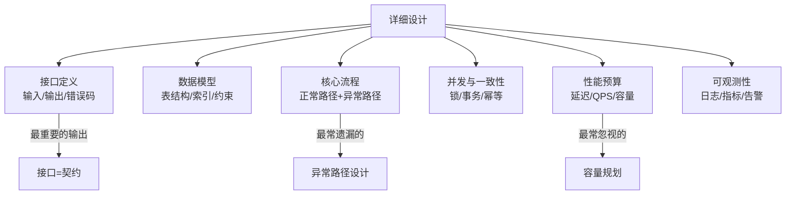
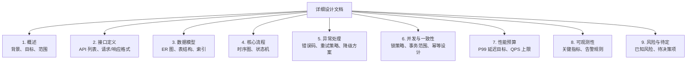
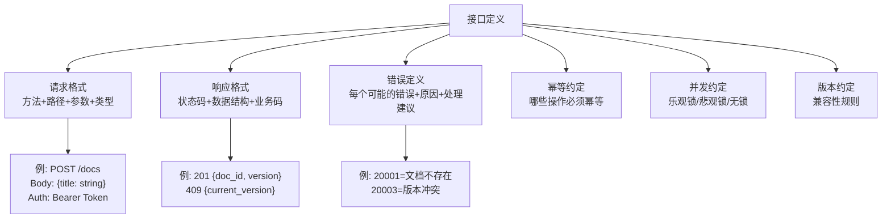
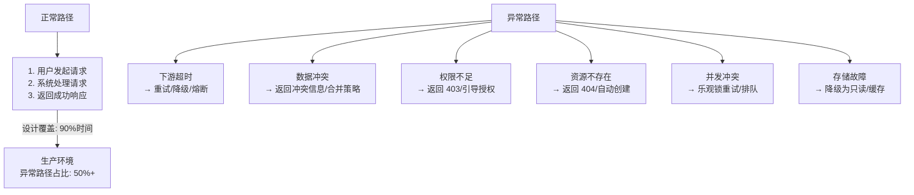
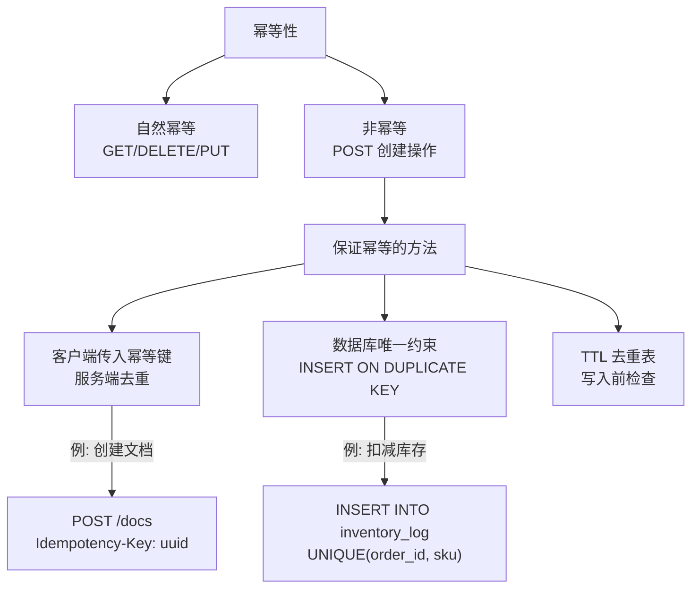
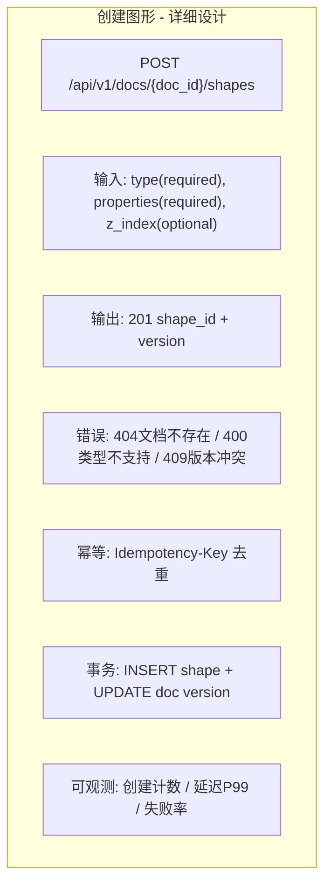

# 架构-怎么做详细设计

## 一、章节导言：详细设计是架构落地的桥梁

许式伟在之前讨论过"架构=接口+规格"，本节他回答了一个更实操的问题：**如何把架构决策系统化地表达为一份可执行的设计文档？**

详细设计不是写文档的仪式，而是**思维的系统化输出**。一份好的详细设计文档，应该让任何合格的工程师读完就能实现，而不需要反复追问"这个场景怎么处理"。

> 架构师的核心能力不是画图，而是**把模糊的需求转化为精确的规格**。

---

## 二、核心概念与原理

### 2.1 详细设计在工程流程中的位置


**详细设计与架构设计的关系**：

| 维度 | 架构设计 | 详细设计 |
|------|---------|---------|
| 关注点 | 子系统划分、接口定义 | 实现细节、数据模型、异常处理 |
| 受众 | 架构师、技术负责人 | 全体开发工程师 |
| 粒度 | 系统级 | 模块/类级 |
| 变更频率 | 低 | 中 |
| 输出 | 架构文档 | 详细设计文档 |

### 2.2 详细设计的核心要素



### 2.3 详细设计文档模板

许式伟推荐了一份结构化的详细设计文档模板：



### 2.4 接口定义：详细设计的核心输出

接口是子系统之间的契约，接口定义必须精确到**可以直接编码**的程度。



### 2.5 异常路径设计：最常遗漏的部分

大多数详细设计只描述正常路径，但生产环境中**异常路径才是系统稳定性的试金石**。



**许式伟的建议**：为每个接口列举**至少5种异常场景**及其处理方式。这不是过度设计，而是生产系统的基本要求。

### 2.6 幂等设计

幂等性是分布式系统中最容易被忽视但最关键的设计约束。



### 2.7 性能预算

详细设计必须包含**量化的性能目标**，而不是模糊的"要快"。

```mermaid
graph TD
    PERF[性能预算] --> P1[P99 延迟<br/>关键接口 ≤ 200ms"]
    PERF --> P2[QPS 上限<br/>单机 ≥ 1000"]
    PERF --> P3[容量规划<br/>存储增长量/月<br/>连接数上限"]
    PERF --> P4[资源预算<br/>CPU/内存/带宽/存储"]

    P1 --> HOW["如何验证"]
    HOW --> BENCH[基准测试]
    HOW --> STRESS[压力测试]
    HOW --> CANARY[灰度验证]

```

---

## 三、设计原则与权衡（Trade-off 分析）

### 3.1 详细设计深度的 Trade-off

| Trade-off | 一端 | 另一端 | 决策依据 |
|-----------|------|--------|----------|
| 设计深度 vs 效率 | 详尽到伪代码 | 接口+流程即可 | 团队经验水平 |
| 文档 vs 代码 | 先完善文档 | 代码即文档 | 项目阶段和团队文化 |
| 前瞻 vs 务实 | 设计未来3年扩展 | 只满足当前需求 | 变更成本 vs 过度设计成本 |
| 标准化 vs 灵活 | 统一模板 | 按模块定制 | 组织规模 |

### 3.2 详细设计的黄金法则

1. **接口先行**：先定义接口，再定义实现。接口是契约，实现是细节
2. **异常路径必须列举**：每个接口至少 5 种异常场景及处理方式
3. **性能目标必须量化**：P99 延迟、QPS 上限、容量增长率
4. **幂等设计必须明确**：哪些操作需要幂等、如何保证
5. **待决策项必须标注**：未决定的设计选择标注为 TODO，不要假装已经想清楚

---

## 四、实践案例与反模式

### 4.1 反模式：详细设计只描述正常路径

设计文档中只有"用户点击按钮→系统处理→返回成功"的流程，没有超时、重试、降级、冲突等异常场景。

**后果**：实现时遇到异常不知如何处理，各工程师自行处理导致行为不一致。

**正确做法**：每个接口列举正常路径 + 至少 5 种异常路径的处理方式。

### 4.2 反模式：接口定义含糊

```text
创建文档接口：
输入：文档信息
输出：文档ID
```

缺少参数类型、必填/可选、错误码、幂等约定、并发策略。

**正确做法**：

```text
POST /api/v1/docs
Authorization: Bearer <access_token>
Content-Type: application/json

Request Body:
  title: string, required, max 200 chars
  description: string, optional, max 2000 chars

Response 201:
  doc_id: string (UUID)
  version: integer (初始值 1)
  created_at: string (ISO 8601)

Response 400: 参数校验失败
Response 401: Token 无效或过期
Response 429: 限流

Idempotency: 支持通过 Idempotency-Key 头实现幂等
Concurrency: 乐观锁，基于 version 字段
```

### 4.3 实战模式：画图程序的详细设计片段

以"创建图形"接口为例，展示完整的详细设计：



---

## 五、小结与关键要点

1. **详细设计是架构落地的桥梁**，它将架构决策转化为可实现、可测试的规格
2. **接口定义是详细设计的核心输出**，必须精确到可以直接编码的程度
3. **异常路径设计是最常遗漏的部分**，却是生产系统稳定性的关键
4. **幂等设计必须明确**：哪些操作需要幂等、如何保证、去重策略
5. **性能目标必须量化**：P99 延迟、QPS 上限、容量增长率，模糊目标等于没有目标
6. **待决策项必须标注**，不要用假设填满设计，诚实面对不确定性

> **相关章节**：[34丨服务端开发的宏观视角](20-服务端开发的宏观视角.md) 定义了架构=接口+规格；[云计算、容器革命与服务端的未来](34-云计算、容器革命与服务端的未来.md) 将展望服务端技术栈的演进方向
