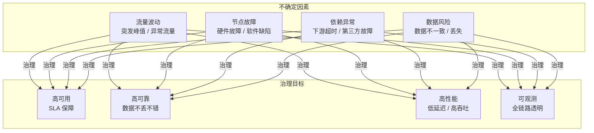
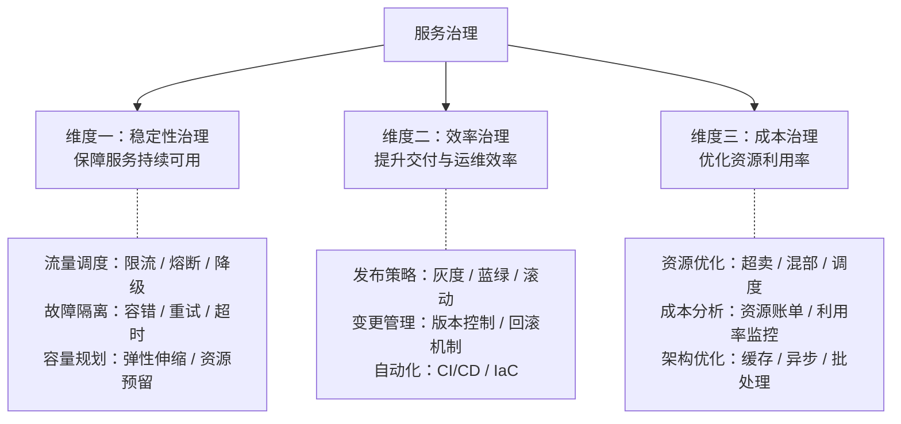
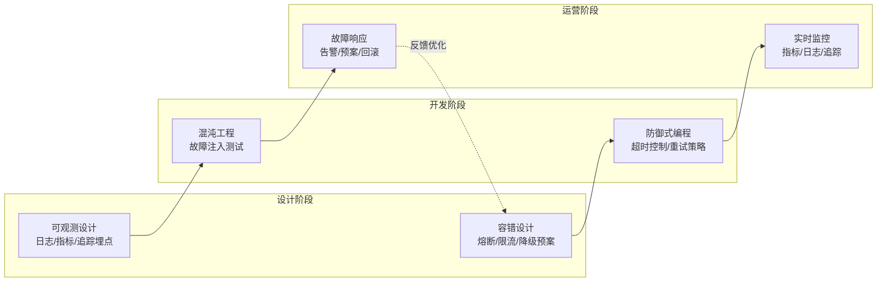
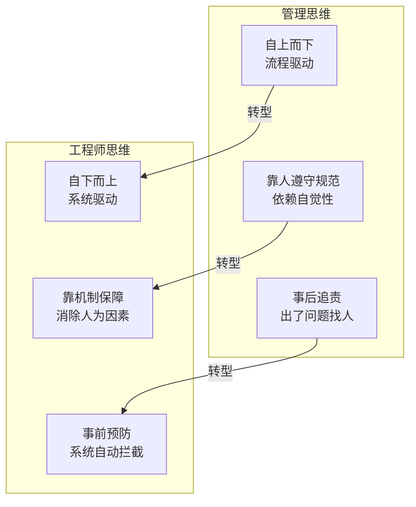
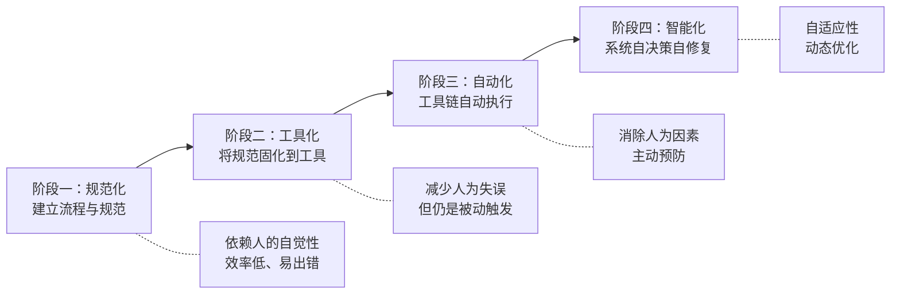

# 服务治理的宏观视角与工程师思维

## 一、章节导言：服务治理的双重命题

服务治理（Service Governance）是服务端系统的最后一道防线。当系统从"功能实现"走向"持续运营"，治理能力便成为决定系统生死存亡的关键。服务治理要解决的核心问题可以归结为两句话：

> **如何让线上服务在不确定的环境下持续可靠地运行？如何以工程师思维而非管理思维去构建治理体系？**

这两个问题分别对应了服务治理的"道"与"术"——宏观框架是道，工程师思维是术。只有道术兼备，才能构建出真正有效的治理体系。

---

## 二、服务治理的宏观视角

### 2.1 服务治理的核心命题

服务治理的核心命题是：**在分布式环境下，确保服务在面对流量波动、节点故障、依赖异常等不确定因素时，仍能持续可靠地提供业务能力。**

### 2.2 服务治理的三大维度

许式伟将服务治理分解为三个维度，每个维度对应一组核心能力：

**关键洞察**：三个维度之间存在张力。例如，过度的稳定性保障（如冗余部署）会增加成本，极致的成本优化可能牺牲稳定性。服务治理的本质是在三个维度之间寻找动态平衡。

### 2.3 服务治理的生命周期

服务治理不是上线后才开始的，而是贯穿软件的整个生命周期：

### 2.4 服务治理与架构层次的关系

服务治理的能力建立在之前各篇讨论的架构基础之上：

| 架构层次 | 服务治理的相关能力 |
|----------|-------------------|
| 接入层 | 流量调度、限流、认证鉴权 |
| 逻辑层 | 熔断、降级、重试、超时控制 |
| 数据层 | 读写分离、主从切换、数据一致性 |
| 基础设施 | 容器编排、服务发现、配置中心 |
| 可观测性 | 日志采集、指标聚合、分布式追踪 |

> **交叉参考**：[31-服务端开发的宏观视角](20-服务端开发的宏观视角.md) 中讨论的三层模型（接入层-逻辑层-数据层），每一层都有对应的服务治理能力。

---

## 三、工程师思维：从管理思维到工程思维

### 3.1 为什么工程师思维是服务治理的基石？

服务治理的失败，往往不是技术方案的失败，而是思维方式的失败。许式伟强调，**服务治理必须以工程师思维而非管理思维来驱动**，二者存在根本差异：

### 3.2 工程师思维的核心原则

**原则一：系统胜于规范**

规范告诉人"应该怎么做"，但人可能遗忘、偷懒或误解。系统则强制约束行为，无需人的自觉性。

| 场景 | 管理思维 | 工程师思维 |
|------|---------|-----------|
| 代码质量 | 要求大家写单元测试 | CI 流水线没有测试就不许合入 |
| 发布安全 | 要求做灰度观察 | 系统自动灰度，自动检测异常回滚 |
| 故障响应 | 出了问题打电话找人 | 告警系统自动触发预案 |

**原则二：自动化胜于人工**

凡是能自动化的，绝不依赖人工操作。人工操作的失败率远高于系统执行——疲劳、紧张、操作顺序错误，都会导致更严重的二次故障。

**原则三：数据胜于直觉**

治理决策必须基于数据，而非经验直觉。指标体系、SLA 定义、容量评估，都需要量化数据支撑。

**原则四：预防胜于补救**

最高效的故障处理是让故障不发生。通过预检机制、容量规划、混沌工程等手段，在故障发生前发现并消除隐患。

### 3.3 从管理思维到工程师思维的转型路径

这个路径不可跳跃。没有规范化，就无法工具化；没有工具化，自动化就是空中楼阁。但每个阶段的终点都应该是下一个阶段的起点，而非停滞不前。

### 3.4 事务性思维与工程性思维

许式伟特别区分了**事务性思维**与**工程性思维**：

| 维度 | 事务性思维 | 工程性思维 |
|------|-----------|-----------|
| 关注点 | 任务完成 | 系统演进 |
| 衡量标准 | 做了多少事 | 创造了多少价值 |
| 时间维度 | 短期交付 | 长期可维护 |
| 风险态度 | 出了问题再修 | 设计阶段就预防 |
| 创新倾向 | 按部就班 | 主动优化 |

**关键洞察**：事务性思维把问题看作一次性的"任务"，工程性思维把问题看作持续演进的"系统"。服务治理恰恰需要工程性思维——它不是一次性的部署任务，而是系统级的持续运营能力。

---

## 四、设计原则与权衡（Trade-off 分析）

### 4.1 服务治理的 Trade-off 矩阵

| Trade-off | 一端 | 另一端 | 决策依据 |
|-----------|------|--------|----------|
| 稳定性 vs 成本 | 多机房多活冗余部署 | 最小化资源投入 | 业务 SLA 要求 vs 预算约束 |
| 自动化 vs 灵活性 | 全自动发布流水线 | 人工审批介入 | 故障恢复速度 vs 关键变更的风险承受度 |
| 预防 vs 响应 | 混沌工程 + 容量规划 | 故障发生后的应急响应 | 预防投入的成本 vs 故障损失的期望值 |
| 规范 vs 效率 | 严格流程管控 | 快速迭代发布 | 业务安全等级 vs 竞争压力 |
| 集中管控 vs 自治 | 统一治理平台 | 各团队自主决策 | 治理一致性 vs 团队响应速度 |

### 4.2 工程师思维的黄金法则

1. **系统胜于规范**：用机制约束行为，而非依赖人的自觉性
2. **自动化优先**：能自动化的绝不依赖人工，减少操作风险
3. **数据驱动决策**：治理策略基于量化指标，而非经验直觉
4. **预防优于补救**：在故障发生前消除隐患，而非事后救火
5. **渐进式演进**：从规范化 → 工具化 → 自动化 → 智能化，不可跳跃

---

## 五、实践案例与反模式

### 5.1 反模式：靠文档规范保障发布安全

许多团队制定了详细的发布规范文档，要求"发布前检查清单""灰度观察 30 分钟""发布后验证"。但现实是：半夜发布的工程师可能跳过检查，紧急修复时可能省略灰度，新员工可能不理解检查项的含义。

**正确做法**：将规范固化到 CI/CD 流水线——没有通过测试的代码无法合入，灰度发布自动执行，异常指标自动触发回滚。

### 5.2 反模式：用事务性思维做服务治理

将服务治理视为一系列待完成的"任务"——部署监控、配置告警、写应急预案。但任务完成后并不等于治理到位。真正的问题在于：监控覆盖是否完整？告警阈值是否合理？预案是否经过演练验证？

**正确做法**：以工程性思维审视治理体系——建立可量化的 SLA 指标，通过混沌工程验证预案有效性，持续迭代优化治理能力。

### 5.3 正确模式：工程师思维驱动的治理体系

一个以工程师思维构建的治理体系应具备：
- **发布阶段**：自动化流水线，灰度/蓝绿/滚动策略，异常自动回滚
- **运行阶段**：全链路可观测，智能告警，熔断/限流自动触发
- **故障阶段**：预案自动化执行，故障根因分析，改进措施跟踪闭环
- **演进阶段**：混沌工程持续验证，容量评估定期刷新，治理能力持续升级

---

## 六、小结与关键要点

1. **服务治理的双重命题**：宏观框架（道）+ 工程师思维（术），缺一不可
2. **三大治理维度**：稳定性、效率、成本——三者之间存在张力，需要动态平衡
3. **服务治理贯穿全生命周期**：从设计阶段到运营阶段，而非仅限线上
4. **工程师思维的核心**：系统胜于规范、自动化胜于人工、数据胜于直觉、预防胜于补救
5. **事务性思维 vs 工程性思维**：前者关注任务完成，后者关注系统演进——服务治理需要后者
6. **从管理思维到工程师思维的路径**：规范化 → 工具化 → 自动化 → 智能化，不可跳跃

> **相关章节**：[50丨日志、监控、报警与故障预案](31-日志、监控、报警与故障预案.md) 深入可观测性与故障响应；[49丨发布、升级与版本管理](30-发布、升级与版本管理.md) 深入发布治理的工程实践
