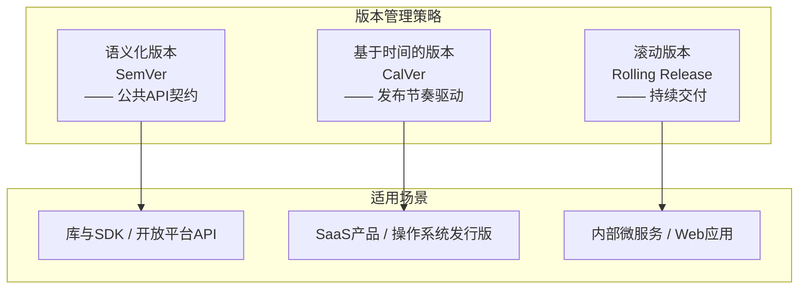
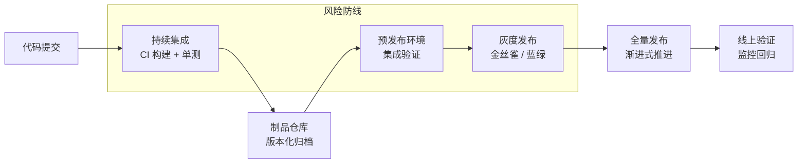
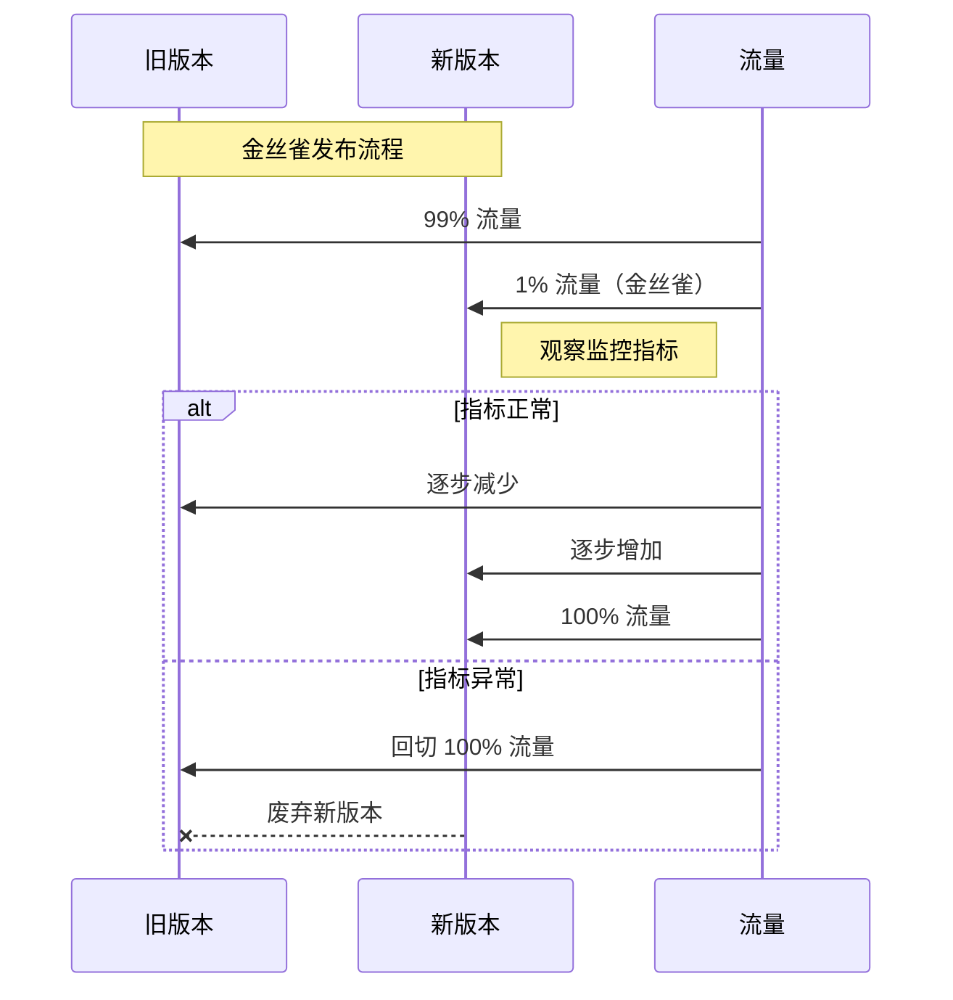

# 发布、升级与版本管理

## 章节导言：变更——故障的第一大根源

在服务治理的宏观视角中，我们指出故障的三大根源为：软硬件升级与配置变更、软硬件环境故障、终端用户请求。其中，**软硬件升级与配置变更是故障的第一大问题源头。**

发布、升级与版本管理看似是一个工程效率问题，但从服务治理的角度看，它本质上是一个**风险控制问题**——如何在持续交付业务价值的同时，将变更引入的风险降到最低。

## 核心概念与原理

### 版本的概念模型

版本管理的基础是版本号语义。语义化版本（Semantic Versioning）是行业标准：

```text
MAJOR.MINOR.PATCH[-PRERELEASE][+BUILD]
```

| 版本段 | 含义 | 变更规则 | 兼容性影响 |
|--------|------|---------|-----------|
| MAJOR | 主版本号 | 不兼容的 API 变更 | 破坏性变更 |
| MINOR | 次版本号 | 向后兼容的功能新增 | 不影响现有行为 |
| PATCH | 修订号 | 向后兼容的问题修复 | 纯修复，无新功能 |
| PRERELEASE | 预发布标识 | alpha / beta / rc | 不保证稳定性 |
| BUILD | 构建元数据 | 构建编号 / commit hash | 不影响优先级 |

### 版本管理策略对比



### 发布流程的核心环节

一个完整的发布流程包含以下关键环节，每个环节都承担着风险过滤的职责：



### 灰度发布策略

灰度发布是降低变更风险的核心手段。常见的灰度策略包括：

| 策略 | 原理 | 优点 | 缺点 |
|------|------|------|------|
| **金丝雀发布** | 先将新版本部署到一小部分实例 | 风险可控，影响面小 | 推进速度慢 |
| **蓝绿部署** | 维护两套完整环境，切换流量 | 回滚极快（切回旧环境） | 资源成本翻倍 |
| **滚动更新** | 逐批替换旧实例 | 无需额外资源 | 回滚较慢，存在混合版本窗口 |
| **特性开关** | 代码已部署，通过开关控制功能 | 线上验证，无需重新部署 | 代码分支复杂度增加 |



### 版本兼容性管理

版本的兼容性管理是大型系统中极具挑战性的课题。核心原则：

1. **向后兼容优先**：新增不破坏旧，接口只增不删
2. **废弃路径清晰**：Deprecated 标注 + 版本时间线 + 迁移指引
3. **多版本并行窗口**：在迁移期内同时维护 N 和 N+1 版本
4. **强制升级策略**：对客户端强制最低版本要求，服务端无此便利

**服务端 API 兼容性**的特殊挑战：客户端可以强制升级，但服务端 API 的消费者往往不可控。因此服务端 API 的变更必须遵循更严格的兼容性纪律——**接口只增不改不删**。

## 设计原则与权衡

### 发布频率 vs 变更风险

| 策略 | 逻辑 | 适用场景 |
|------|------|---------|
| **高频小批量** | 每次变更小，风险低，回滚快 | 互联网产品、SaaS |
| **低频大批量** | 集中发布，测试充分，但单次变更量大 | 传统企业软件、嵌入式系统 |

核心洞察：**发布频率越高，每次发布的风险越低**。这不是反直觉的——每次变更越少，引入缺陷的概率越小，回滚的代价也越低。持续交付的本质不是"更频繁地发布"，而是"让每次发布变得足够安全，从而敢于更频繁地发布"。

### 自动化 vs 人工审批

- **过度依赖人工审批**：审批环节成为瓶颈，发布节奏被拖慢，且人工审批的质量并不可靠
- **过度依赖自动化**：缺少人类对异常的直觉判断

合理策略：**低风险变更自动化，高风险变更人工确认**。风险等级由变更影响面和回滚难度决定。

### 回滚能力 vs 前进修复

当线上出现问题时，有两种选择：

| 策略 | 优点 | 缺点 |
|------|------|------|
| **回滚** | 恢复速度快 | 丢失已上线功能 |
| **前进修复** | 不丢失功能 | 修复速度不确定 |

最佳实践：**优先回滚恢复服务，再择机修复。** 保证回滚能力是发布系统的底线要求。

## 实践案例与反模式

### 反模式：Big Bang 发布

将大量功能集中在一个大版本中发布。看似"测试更充分"，实则：
- 变更集太大，定位问题困难
- 回滚代价高（连带回滚大量正常功能）
- 发布窗口长，延迟业务交付

### 案例：Google 的发布工程实践

Google 的发布工程（Release Engineering）团队建立了一套完整的发布基础设施：
- **自动化构建与测试**：每次提交触发完整的构建和测试流水线
- **渐进式发布**：从内部 Dogfood → Beta → 全量，每一级都有明确的通过标准
- **发布列车**：固定节奏的发布周期，功能赶不上本次列车就等下一班

### 反模式：配置变更不在发布管控范围内

很多团队对代码发布有严格的流程，但对配置变更（如开关翻转、参数调整）缺乏管控。配置变更与代码变更一样属于"变更"，必须纳入同样的灰度和回滚流程中。

### 案例：数据兼容性迁移

数据库 schema 变更是发布中最棘手的问题之一。标准做法：
1. **双写阶段**：新代码同时写入新旧 schema
2. **迁移阶段**：将历史数据迁移到新 schema
3. **双读阶段**：从新 schema 读取，但保留旧 schema 作为回退
4. **清理阶段**：确认稳定后删除旧 schema

每个阶段都是一次独立发布，每次只做一件事。

## 小结与关键要点

1. **变更 = 风险**，发布管理的本质是风险控制，不是效率优化
2. **语义化版本是 API 契约的基石**，版本号的语义必须严格遵守
3. **灰度发布是核心风控手段**，金丝雀 → 蓝绿 → 滚动更新各有适用场景
4. **发布频率越高，单次风险越低**，持续交付的真正价值在于让每次发布变安全
5. **配置变更与代码变更同等重要**，必须纳入发布管控
6. **回滚能力是底线**，优先回滚恢复服务，再择机修复

> **交叉引用**：发布引发的故障检测见 [第50讲](31-日志、监控、报警与故障预案.md)，故障恢复与预案见 [第51讲](32-故障排查与根因分析.md)，工程师思维在发布系统中的体现见 [第48讲](29-服务治理的宏观视角与工程师思维.md)。
