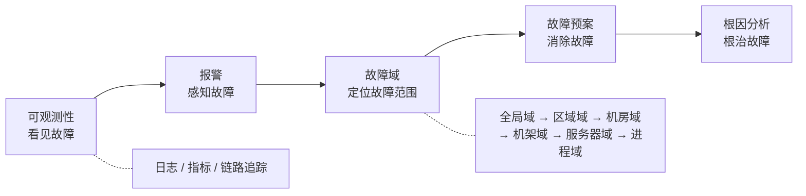
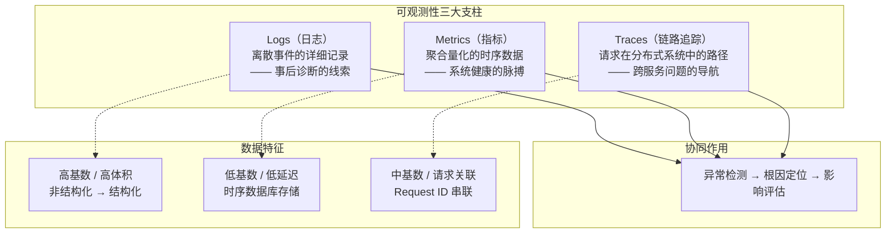
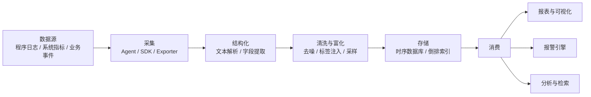
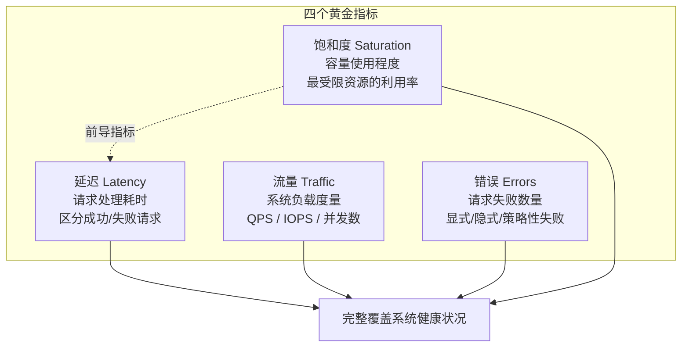
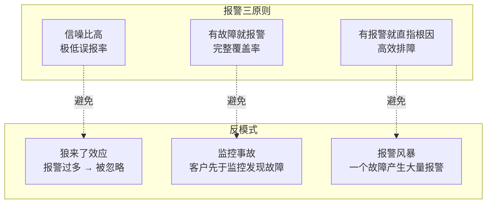
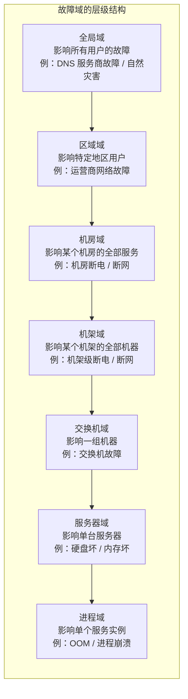
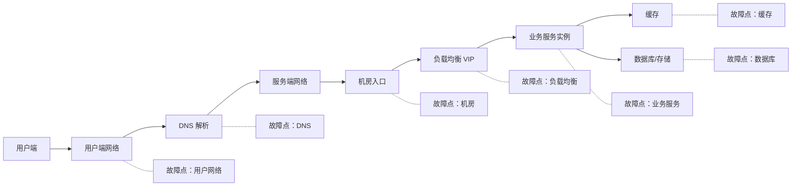
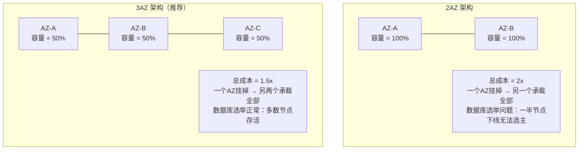
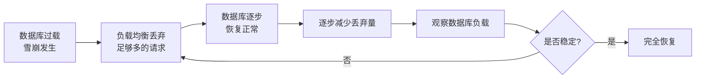
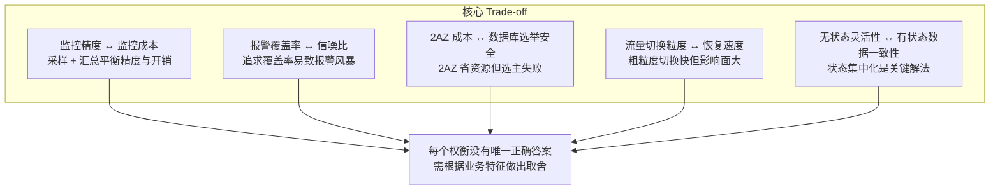

# 日志、监控、报警与故障预案

## 一、章节导言：从发现问题到应对问题的完整链路

发布与升级虽然事务复杂，但总体上只与集群中服务之间的调用关系有关，与具体业务特性关联不大。真正难工程化的是**监控与报警**——它需要因人而异、因地制宜，如同私人医生，而非交通工具。

监控的核心目标只有两个：**什么东西出故障了**，以及**为什么它出故障了**。前者是现象（Symptom），后者是原因（Cause），找到的原因可能只是中间原因，而非根因（Root Cause）。

然而，发现故障只是第一步。在规模化系统中，软硬件环境故障是**必然事件，而非概率事件**。追求 24 小时不间断服务，意味着我们必须为所有可能的故障点建立预案。从"看见故障"到"应对故障"，构成了一条完整的链路：

## 二、可观测性：日志、监控与报警

### 2.1 可观测性的三大支柱

现代可观测性（Observability）体系建立在三大支柱之上：

| 支柱 | 数据特征 | 核心价值 | 典型工具 |
|------|---------|---------|---------|
| **Logs** | 高基数、高体积、非/半结构化 | 事后诊断、审计追踪 | ELK, Loki |
| **Metrics** | 低基数、低延迟、数值型时序 | 实时监控、趋势分析、报警 | Prometheus, InfluxDB |
| **Traces** | 请求级关联、跨服务传播 | 分布式根因定位、性能剖析 | Jaeger, Zipkin |

### 2.2 日志系统的架构

日志系统是监控与报警的底座。广义的日志不局限于程序日志，还包括各类系统指标的时序采集数据——**凡时序相关的、持续产生的数据，都可称之为日志**。

结构化后的日志存储系统，本质上是一个**时序数据库**。采用时序数据库做监控的好处是：不依赖特定脚本来判断系统是否正常，而是依赖标准数据分析模型进行报警，使批量、大规模、低成本的数据收集成为可能。

### 2.3 四个黄金指标

Google SRE 提出的四个黄金指标（Four Golden Signals）是监控设计的核心框架：

**延迟**：区分成功请求和失败请求的延迟至关重要。"慢"错误比"快"错误更糟——极少量的慢错误请求就可能导致系统吞吐能力大幅降低。

**流量**：不同系统的流量指标差异很大——Web 服务器用 HTTP QPS，流媒体用网络 I/O 速率，键值存储用每秒交易量。

**错误**：不只是显式失败（HTTP 500），还包括隐式失败（HTTP 200 但内容报错）和策略性失败（超时即视为失败）。

**饱和度**：是最需要预测的指标。很多系统在达到 100% 利用率之前性能就会严重下降。延迟增加是饱和度的前导现象——99% 请求延迟可作为饱和度早期预警。

### 2.4 长尾问题与直方图

构建监控系统时，平均值具有欺骗性。如果某服务每秒处理 1000 请求，平均延迟 100ms，但 1% 的请求耗时 5s——在依赖多个服务的场景下，某个后端的 P99 延迟很可能成为前端延迟的中位数。

正确做法：将请求按延迟分组计数，构建**直方图**，边界定义为指数型增长（如倍数约为 3），这是直观展现请求分布的最佳方式。

### 2.5 报警设计哲学

一个完善的监控系统，不是"报警很多很完善"的系统，而是**信噪比高、有故障就报警、有报警就直指根因**的系统。

**报警设计决策清单**：在添加新报警规则前，必须回答以下问题：
- 该规则能否检测到目前检测不到的、紧急的、即将发生的用户可见故障？
- 收到报警后是否需要立即操作？该操作能否被安全自动化？
- 该报警是否确实显示用户正在受到影响？
- 每个紧急报警是否代表一个新问题？不应彼此重叠

### 2.6 监控精度 vs 监控成本

高精度数据采集成本高昂。通过**采样 + 汇总**可以降低成本：
- 按秒记录 CPU 利用率
- 按 5% 粒度分组，对应计数 +1
- 每分钟汇总一次

这种方式可以观测短暂热点，又不需要高额的存储成本。

### 2.7 监控项的增与删

添加监控项是最难的事情——它看起来像事务工作，实际上非常依赖架构能力。**少就是指数级的多！** 优秀的监控 SRE 不是不停地添加监控项，而是经常重构监控指标，用最少的监控项全面覆盖系统健康状况。

## 三、故障域与故障预案

### 3.1 故障域的分类体系

故障域（Fault Domain）是指一个故障可能影响的范围边界。理解故障域的关键在于：**故障的影响范围不是均匀的，而是沿着物理和逻辑的边界传播。**

故障域越小，影响面越小，恢复越容易。设计目标是：**让故障的影响被最小化地隔离在最小故障域内。**

### 3.2 请求链路中的故障点分析

一个完整的 API 请求，从用户发出到服务响应，经历多个故障点。每个 IO 操作都是潜在的故障点：

### 3.3 各故障点的预案策略

| 故障点 | 故障特征 | 预案策略 | 关键技术 |
|--------|---------|---------|---------|
| **用户端网络** | 个体不可控，区域性可调度 | 多链路域名 + 客户端链路选择 | HTTP DNS, 多域名 |
| **DNS** | 解析中断影响全部入口 | 多权威DNS + 多递归DNS + HTTP DNS | DNS容灾, HTTP DNS |
| **机房** | 整机房服务中断 | 多机房容灾（推荐3AZ） | 3AZ架构, 跨机房流量调度 |
| **机架** | 整机架机器下线 | 服务+数据分散编排 | 反亲和调度 |
| **交换机** | 大范围机器下线 | 双交换机HSRP热备 | HSRP协议 |
| **负载均衡** | 入口级故障 | VIP技术自动切换 | VIP虚IP |
| **业务服务** | 单实例故障 | 无状态设计 + 负载均衡自动重试 | 服务无状态化 |
| **缓存** | 部分实例故障影响命中率 | 一致性哈希 + 自动重建 | 分片算法, 延迟容忍 |
| **数据库/存储** | 主节点故障 | 主从选举 + 过载保护 | Master选举, 限流降级 |

### 3.4 机房容灾：2AZ vs 3AZ

机房级容灾是最复杂也最关键的预案。2AZ 与 3AZ 架构的选择涉及成本与可靠性的权衡：

**3AZ 的三大优势**：
1. **成本更低**：总成本 1.5x vs 2x
2. **数据库选举更安全**：一个 AZ 下线后多数节点仍存活，可以正常选主
3. **故障恢复更平滑**：两个存活 AZ 共同承载流量，压力分布均匀

### 3.5 数据库雪崩的恢复策略

数据库压力过大导致雪崩时的恢复策略是一个经典难题：

核心原则：**先让数据库能正常服务，再逐步放开流量**。不是一刀切恢复，而是渐进式释放。

### 3.6 流量切换 vs 过载保护 vs 扩容

面对故障，三种恢复手段各有适用场景：

| 手段 | 适用场景 | 优点 | 缺点 |
|------|---------|------|------|
| **流量切换** | 无状态服务的故障域切换 | 恢复快，影响小 | 只适用于无状态服务 |
| **过载保护（降级）** | 有状态服务的过载 | 防止雪崩 | 牺牲部分用户体验 |
| **扩容** | 资源不足导致的过载 | 根本解决 | 扩容需要时间 |

**最小切量原则**：流量切换应遵循最小切量原则——能用更细粒度的切量消除故障，就不用粗粒度的。

### 3.7 无状态 vs 有状态

这是影响故障预案策略的核心架构决策：

- **无状态服务**：任何实例故障不影响用户，负载均衡自动重试即可
- **有状态服务**：故障恢复涉及数据一致性，是容灾最复杂的问题

业务架构应尽量做到"业务服务无状态，状态集中到中间件"——这是强大的基础架构带来的好处，让业务更轻松。

### 3.8 灰度发现的局限

灰度发布能发现大部分短期故障，但**无法发现具有长潜伏期的故障**。例如数据库规模达到临界点导致的操作异常——故障爆发时点与风险产生时点间隔太远，不容易定位，且对有状态服务而言可能是不可控制的灾难。消除此类风险，只能依靠严谨的白盒代码审查和全面的测试覆盖率。

## 四、设计原则与权衡（Trade-off 分析）

从可观测性到故障预案，整条链路中存在若干核心权衡：

**关键权衡解读**：

1. **监控精度 vs 成本**：高精度采集存储开销巨大。通过采样 + 汇总（如按 5% 粒度分桶、每分钟汇总）可以在有限成本下保留对短暂热点的感知能力。
2. **报警覆盖率 vs 信噪比**：追求 100% 覆盖率往往导致大量低价值报警，触发"狼来了效应"。应坚持报警三原则：信噪比高、有故障就报警、有报警就直指根因。
3. **2AZ vs 3AZ**：2AZ 表面省钱，但数据库选举有根本缺陷（一半节点下线无法选主）；3AZ 总成本 1.5x，却从根本上保障了多数节点存活，是更优的架构选择。
4. **流量切换粒度 vs 恢复速度**：最小切量原则要求用最细粒度的切换消除故障，粗粒度切换虽然更快，但影响面更大。
5. **无状态 vs 有状态**：业务服务无状态化是降低故障预案复杂度的核心手段，将状态集中到中间件（数据库、缓存、消息队列），让业务层容灾变得简单。

## 五、实践案例与反模式

### 反模式：报警风暴

线上一个故障同时触发大量报警，接警人看到一堆杂乱报警，无法快速定位根因。解决方案：
- 按故障域聚合报警
- 定义报警优先级与升级路径
- 每个报警关联明确的故障场景与恢复预案

### 案例：基于时序数据库的报警

传统方式用脚本判断系统是否正常，新方式用数学表达式定义报警规则。优势：
- 历史数据可参与计算（如"数据库 5 小时内填满硬盘"的预测）
- 批量、大规模、低成本
- 同一数据源同时服务报表和报警

### 反模式：只加不减的监控膨胀

持续添加监控项但不做删减和重构，导致监控系统越来越臃肿、信噪比持续下降。正确做法是像代码重构一样定期重构监控指标。

### 案例：接警后的正确响应流程

1. **尽快消除故障**（找根因不是第一位）
2. 若故障原因未知，尽量保留现场
3. 故障消除后进行根因分析
4. 推动各方彻底解决根因，避免复发

对于原因不清晰的报警，消除故障的最简方法是基于**流量调度**——迅速把用户请求从故障域切走，同时保留故障现场。

### 反模式：基于物理机绑定的服务治理

将服务绑定在物理机上，面临硬件故障时被动响应，需要人工配置变更。这不是自治系统，只是高度自动化的脚本系统。

### 案例：VIP 技术消除负载均衡单点

负载均衡实例故障意味着 1/N 的用户受影响。通过 DNS 解析去除故障 IP 的理论可行，但 DNS 生效周期过长（TTL + 递归服务器忽略 TTL）。VIP 技术的解决方案：所有负载均衡实例 IP 为 VIP，一旦检测到主实例故障，立即将流量切换到备实例——恢复时间从小时级降到秒级。

### 案例：HTTP DNS 解决 DNS 生效延迟

机房故障导致一批 IP 下线，DNS 解析需要去除这些 IP，但传统 DNS 的生效时间与 TTL 相关（可能 1 小时），且部分递归服务器忽略 TTL。HTTP DNS 基于 HTTP 协议提供 DNS 解析，绕过传统 DNS，结合客户端 DNS 缓存，解决 DNS 生效不及时的问题。

### 反模式：2AZ 架构下的数据库选举

2AZ 中一个 AZ 下线意味着数据库一半节点下线，无法选举出新的 Master。这是 2AZ 架构的根本性缺陷——3AZ 架构通过保证多数节点存活来解决此问题。

## 六、小结与关键要点

1. **可观测性是故障治理的起点**：Logs / Metrics / Traces 三大支柱协同构成完整的感知系统，四个黄金指标（延迟、流量、错误、饱和度）基本覆盖系统健康状况
2. **报警的核心是信噪比**：信噪比高、有故障就报警、有报警就直指根因——避免狼来了效应和报警风暴
3. **故障域越小越安全**：从全局域到进程域，层级化的故障域设计目标是将故障隔离在最小范围内；3AZ 架构以 1.5x 成本实现比 2AZ 更可靠的容灾
4. **无状态化是降低容灾复杂度的关键**：业务服务无状态、状态集中到中间件，让流量切换和故障恢复变得简单
5. **故障响应的第一原则是尽快消除故障**：而非找根因；流量调度是最快的消除手段，数据库雪崩需渐进式释放流量

> **交叉引用**：根因分析方法论见 [第52讲](32-故障排查与根因分析.md)，过载保护与容量规划见 [第53讲](33-过载保护与容量规划.md)，工程师思维在监控重构中的应用见 [第48讲](29-服务治理的宏观视角与工程师思维.md)，服务治理宏观视角见 [第47讲](29-服务治理的宏观视角与工程师思维.md)。
