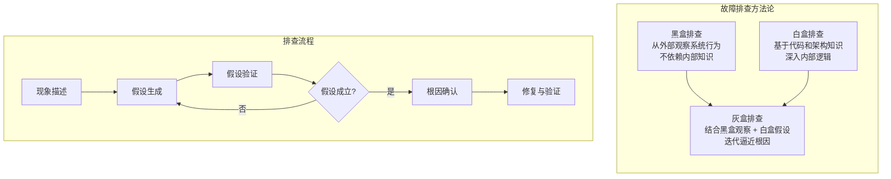
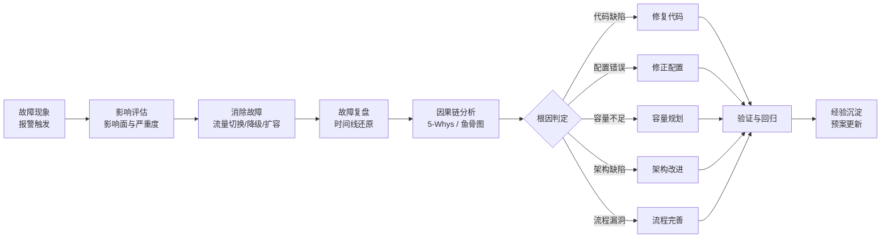
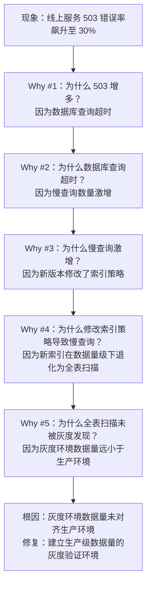
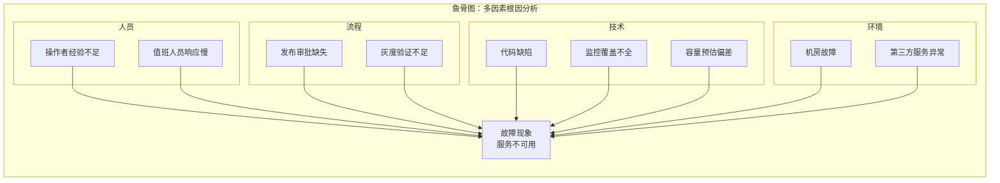

# 故障排查与根因分析

## 章节导言：消除故障 vs 消除根因

在 [第50讲](31-日志、监控、报警与故障预案.md) 中我们指出，接警后的第一原则是尽快消除故障，而非找根因。但这不意味着根因分析不重要——**消除故障只是治标，消除根因才是治本。** 如果根因不消除，同样的故障会反复发生。

故障排查与根因分析的核心挑战在于：现实世界中的故障往往不是单一原因导致的，而是多个因素叠加的结果。根因分析的目的是找到**最值得投入精力去修复的因素**——即消除它后，此类故障将不再发生。

## 核心概念与原理

### 故障排查的方法论体系

### 根因分析流程

完整的根因分析遵循结构化的流程：

### 5-Whys 方法

5-Whys 是最经典的根因分析工具，其核心思想是连续追问"为什么"，直到找到可操作的根因：

5-Whys 的关键不在于恰好问 5 个为什么，而在于**追问到可操作的层级**。如果根因落在"人为疏忽"上而不进入系统层面，说明追问还不够深。

### 鱼骨图分析

鱼骨图（因果图）适用于多因素叠加的故障分析，能够将因果关系可视化：

### 故障排查中的常见陷阱

| 陷阱 | 表现 | 正确做法 |
|------|------|---------|
| **确认偏误** | 只寻找支持自己假设的证据 | 主动寻找否定自己假设的证据 |
| **相关当因果** | 两个现象同时发生就认为有因果关系 | 证明因果链，而非仅证明相关性 |
| **近因偏误** | 把最后发生的事件当作根因 | 完整还原时间线，追溯完整因果链 |
| **过早收敛** | 找到一个"足够好"的原因就停止 | 继续追问，直到根因可操作 |
| **根因归人** | 把根因归结为"人为疏忽" | 追问系统层面为何未防止疏忽 |

## 设计原则与权衡

### 消除故障优先 vs 保留现场

接警后面临两个矛盾的诉求：
- **消除故障**：尽快恢复服务
- **保留现场**：为根因分析提供信息

**策略**：优先消除故障（用户影响是第一位的），在消除故障的过程中尽量保留现场。具体手段：
- 通过流量调度将请求从故障域切走，而非重启故障实例
- 保留故障实例的日志和核心转储
- 记录故障发生时的关键指标快照

### 黑盒分析 vs 白盒分析

| 维度 | 黑盒分析 | 白盒分析 |
|------|---------|---------|
| 依赖 | 外部可观测数据 | 内部代码和架构知识 |
| 速度 | 快，可自动化 | 慢，需要深度理解 |
| 深度 | 有限，只能定位到现象层 | 深，可定位到代码行 |
| 适用 | 日常故障的快速定位 | 复杂故障的根因挖掘 |

最佳策略是**灰盒分析**：用黑盒方法快速缩小范围，用白盒方法精确定位。

### 自动化排查 vs 人工排查

- **可模式化的故障**：报警规则匹配 → 自动预案执行 → 自动验证恢复
- **不可模式化的故障**：人工介入 → 假设验证 → 迭代逼近

目标是将更多故障从"不可模式化"转化为"可模式化"。

## 实践案例与反模式

### 反模式：故障复盘沦为追责会

故障复盘的目的是改进系统，而非追究个人责任。如果复盘会变成追责会，会带来两个严重后果：
1. 关键信息被隐瞒（"这不是我做的"）
2. 系统性问题被掩盖（"下次注意"而非"系统如何防止"）

Google 的无指责复盘（Blameless Postmortem）文化是正确做法。

### 案例：Google SRE 的故障复盘模板

Google 的故障复盘文档包含以下标准要素：
- 故障概述与时间线
- 根因分析（5-Whys 或鱼骨图）
- 影响评估（用户影响、收入影响）
- 做得好的方面
- 做得不好的方面
- 行动项（每个行动项有负责人和截止日期）

### 反模式：将根因归为"人为疏忽"

"值班人员疏忽"不是根因，而是中间原因。真正的根因在系统层面：为什么系统没有防止疏忽？是缺少自动化验证？是审批流程缺失？是监控覆盖不全？**根因分析的终点必须落在可操作的系统改进上。**

### 案例：长潜伏期故障的排查

数据库规模达到临界点导致的操作异常，故障爆发时点与风险产生时点间隔太远。此类故障的排查极其困难，因为：
- 时间线跨越多天甚至多周
- 因果链涉及多个系统的交互
- 灰度发布无法发现此类风险

解决方案：白盒代码审查 + 全面测试覆盖率 + 数据库容量预警。

## 小结与关键要点

1. **消除故障是治标，消除根因是治本**，两者不可偏废
2. **5-Whys 和鱼骨图**是根因分析的核心工具，追问到系统层面的可操作改进
3. **故障排查的常见陷阱**：确认偏误、相关当因果、过早收敛、根因归人
4. **灰盒分析是最佳策略**：黑盒快速缩小范围，白盒精确定位
5. **故障复盘必须无指责**：目的是改进系统，而非追究个人
6. **根因的终点必须是可操作的系统改进**：停在"人为疏忽"说明分析不够深

> **交叉引用**：故障域与预案是消除故障的手段见 [第50讲](31-日志、监控、报警与故障预案.md)，监控与报警是发现故障的第一道防线见 [第50讲](31-日志、监控、报警与故障预案.md)，工程师思维中的"Close 问题"见 [第48讲](29-服务治理的宏观视角与工程师思维.md)。