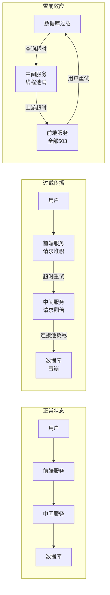
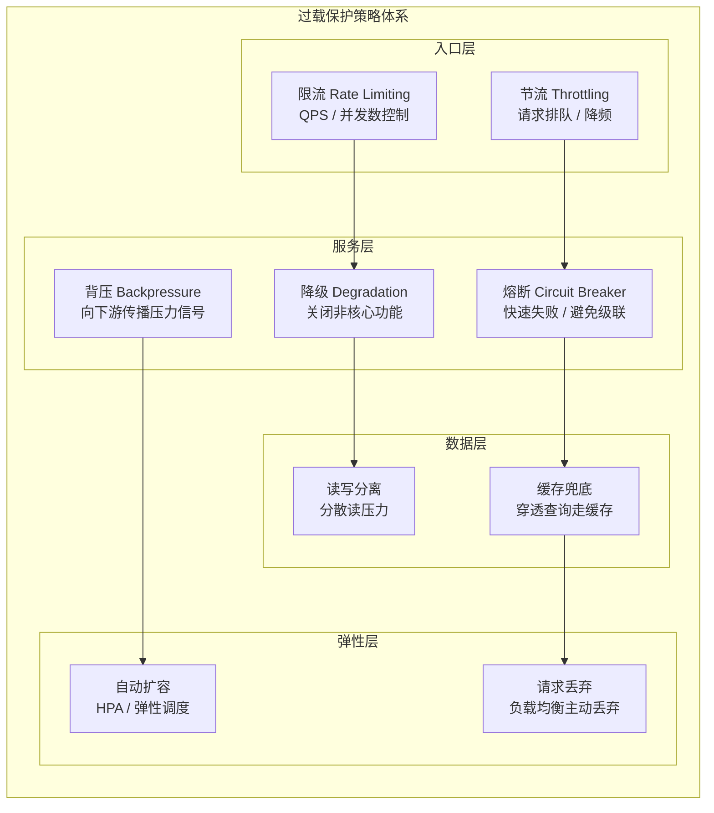
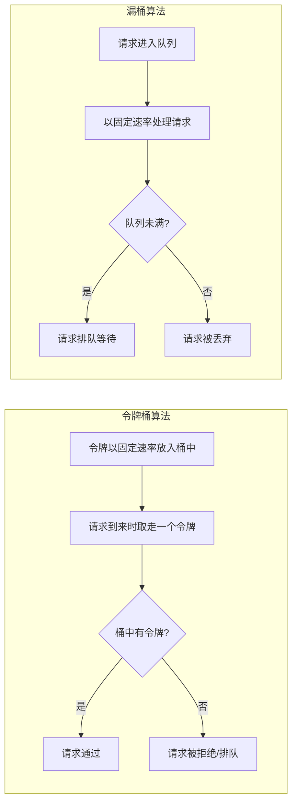
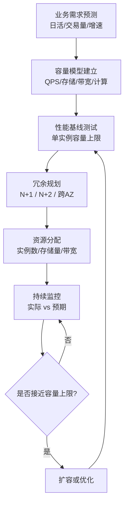

# 过载保护与容量规划

## 章节导言：用户请求——故障的第三大根源

在故障的三大根源中，发布变更和软硬件环境故障属于"内部因素"，可以通过灰度发布和故障预案来应对。而**终端用户请求**则是完全的外部因素——流量模式不可控、突发性不可预测、量级变化可能远超预期。

过载保护与容量规划要解决的核心问题是：**当系统负载超过设计容量时，如何在保护系统不崩溃的前提下，尽可能多地服务用户请求。**

## 核心概念与原理

### 过载的本质与传播

过载不是孤立事件——在依赖链上，一个服务的过载会向上下游传播：

**雪崩效应的恶性循环**：过载 → 超时 → 重试 → 更过载。客户端重试行为是加剧过载的关键放大器。

### 过载保护策略体系

### 限流算法详解

| 算法 | 原理 | 优点 | 缺点 |
|------|------|------|------|
| **固定窗口** | 固定时间窗口内计数 | 实现简单 | 窗口边界突发流量问题 |
| **滑动窗口** | 窗口滑动统计 | 平滑限流 | 实现略复杂 |
| **令牌桶** | 固定速率放入令牌，请求消耗令牌 | 允许突发流量 | 需要合理配置桶容量 |
| **漏桶** | 请求排队，固定速率处理 | 流量绝对平滑 | 无法处理突发，延迟增加 |

### 客户端限流 vs 服务端限流

| 维度 | 客户端限流 | 服务端限流 |
|------|-----------|-----------|
| **位置** | 请求发出前 | 请求到达后 |
| **感知** | 基于历史配额 | 基于实时负载 |
| **优点** | 避免无效网络请求 | 精确反映实际负载 |
| **缺点** | 配额可能与实际容量不符 | 已消耗网络资源 |

**最佳实践**：两者结合——客户端做粗粒度配额控制，服务端做细粒度负载感知限流。

### 容量规划流程

容量规划不是一次性活动，而是持续循环的过程：

### 容量规划的关键指标

| 指标 | 含义 | 规划依据 |
|------|------|---------|
| **QPS 上限** | 单实例最大处理能力 | 压测结果 |
| **资源利用率** | CPU/内存/IO/网络的使用率 | 告警阈值 |
| **饱和度** | 最受限资源的使用程度 | 黄金指标之一 |
| **冗余度** | 可承受的实例故障数 | N+1 / N+2 |
| **增长速率** | 业务量的增长趋势 | 历史数据拟合 |

## 设计原则与权衡

### 优雅降级 vs 直接拒绝

| 策略 | 用户体验 | 实现复杂度 | 适用场景 |
|------|---------|-----------|---------|
| **优雅降级** | 部分功能可用，体验降级 | 高 | 面向终端用户 |
| **直接拒绝** | 请求直接失败 | 低 | 内部服务间 |

优雅降级的核心是定义**功能优先级**——哪些功能是核心必须保障的，哪些功能在过载时可以暂时关闭。

### 丢弃请求 vs 排队等待

- **丢弃请求**：牺牲部分用户，保护大多数用户的体验。请求被负载均衡丢弃是更优的选择——负载均衡器是调度而非瓶颈，其丢弃足够多的请求后，业务服务可以快速恢复正常。
- **排队等待**：保证请求不被丢弃，但增加了延迟。延迟超过超时阈值的请求等于无效等待。

**核心原则**：负载均衡丢弃请求优于业务服务超时丢弃——前者是主动控制，后者是被动崩溃。

### 扩容 vs 优化

当系统接近容量上限时，有两条路：
- **扩容**：增加资源，提高绝对容量。见效快，成本线性增长。
- **优化**：提高单实例性能，减少资源消耗。需要时间，但有持续收益。

**策略**：先优化后扩容。优化提升性价比，扩容满足绝对量需求。

### 配额的粗粒度 vs 细粒度

- **粗粒度配额**：每个客户端固定配额。简单但不公平——小用户浪费配额，大用户不够用。
- **细粒度配额**：基于实时负载动态分配。公平但复杂。

## 实践案例与反模式

### 反模式：超时即重试

客户端在请求超时后立即重试，看似合理，实际是加剧过载的元凶。在过载场景下，大量请求超时，重试使得实际请求量翻倍甚至数倍，加速雪崩。正确做法：**过载时使用指数退避重试，或直接快速失败。**

### 案例：数据库雪崩的恢复

数据库过载导致雪崩时，正确的恢复策略不是重启，而是：
1. 负载均衡丢弃足够多的请求
2. 数据库逐步恢复正常
3. 逐步减少丢弃量
4. 观察数据库负载是否稳定
5. 若不稳定，回到第 1 步

这是一个渐进式的恢复过程，不是一刀切。

### 反模式：依赖自动扩容解决一切

自动扩容（HPA）是弹性手段，但有其局限：
- 扩容需要时间（分钟级），无法应对秒级突发流量
- 有上限（集群资源总量），不是无限可扩
- 成本不可控——突发流量可能导致资源费用暴涨

正确做法：**预留冗余 + 自动扩容 + 过载保护**三管齐下。

### 案例：秒杀场景的过载保护

秒杀场景是典型的突发过载场景。标准方案：
1. **前端**：按钮灰化 + 倒计时 + 请求合并
2. **网关**：令牌桶限流 + 请求排队
3. **服务层**：预扣库存 + 异步下单
4. **数据层**：缓存预热 + 读写分离
5. **降级**：关闭非核心功能（推荐/评论等）

## 小结与关键要点

1. **过载会沿依赖链传播**，客户端重试是加剧过载的关键放大器
2. **过载保护是多层次的**：入口层限流/节流、服务层降级/熔断/背压、数据层分离/缓存、弹性层扩容/丢弃
3. **负载均衡主动丢弃优于业务服务被动超时**——主动控制胜过被动崩溃
4. **容量规划是持续循环**：需求预测 → 容量模型 → 基线测试 → 冗余规划 → 持续监控
5. **先优化后扩容**：优化提升性价比，扩容满足绝对量需求
6. **自动扩容不能解决一切**：必须配合预留冗余和过载保护

> **交叉引用**：故障域与流量切换见 [第50讲](31-日志、监控、报警与故障预案.md)，监控与容量预警见 [第50讲](31-日志、监控、报警与故障预案.md)，数据库雪崩恢复见 [第50讲](31-日志、监控、报警与故障预案.md)。