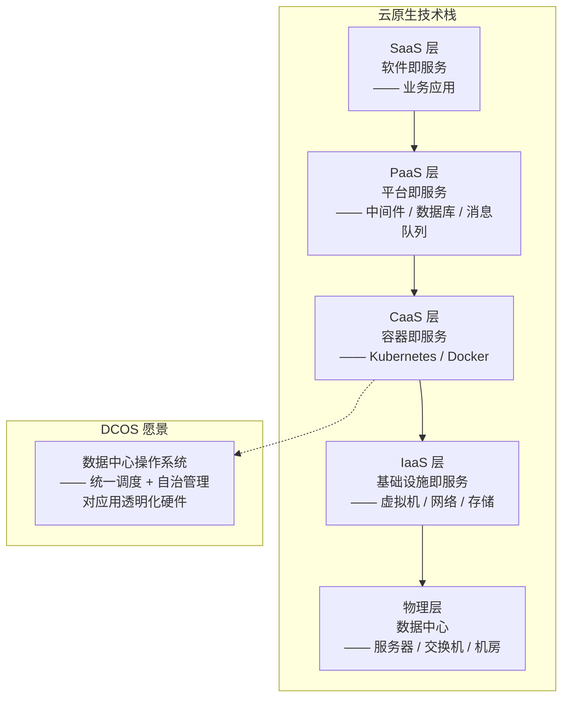
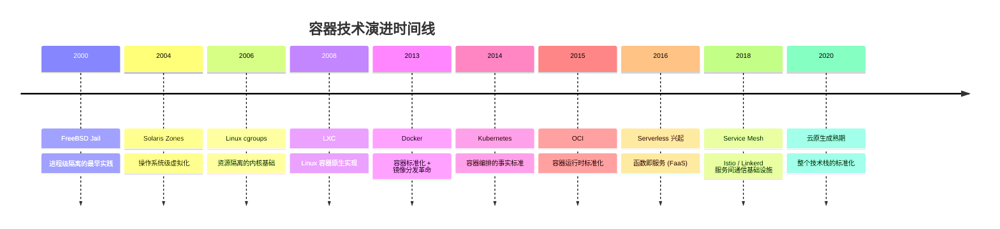
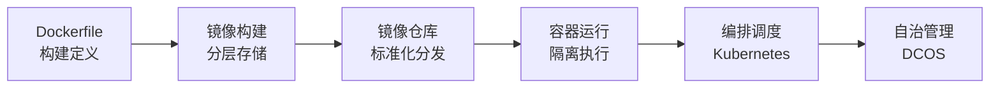
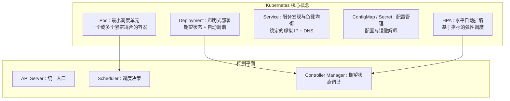
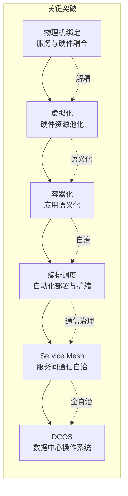

# 云计算、容器革命与服务端的未来

## 章节导言：服务端操作系统的终极形态

在 [第47讲](29-服务治理的宏观视角与工程师思维.md) 中，我们指出服务治理的终极方向是自治化——服务对故障有天然免疫力，无需人工介入。实现自治化的关键前提是**服务与硬件的解耦**，而容器技术正是这一解耦的技术基础。

从更宏观的视角看，云计算和容器革命不仅仅是基础设施层面的变革，它们正在重塑服务端的整个技术栈——**服务端正在走向操作系统化，最终形态是 DCOS（数据中心操作系统）。**

## 核心概念与原理

### 云原生技术栈的分层架构

### 容器革命的演进时间线

### 为什么是容器而非虚拟机

虚拟机和容器都实现了资源隔离，但它们的抽象层次和效率有本质区别：

| 维度 | 虚拟机 | 容器 |
|------|--------|------|
| **隔离级别** | 硬件级（独立内核） | 操作系统级（共享内核） |
| **启动速度** | 分钟级 | 秒级甚至毫秒级 |
| **资源开销** | 高（需运行完整 OS） | 低（共享宿主内核） |
| **镜像大小** | GB 级 | MB 级 |
| **密度** | 单机数十个 | 单机数百个 |
| **可移植性** | 受限于 Hypervisor | 受限于内核版本 |
| **语义化能力** | 硬件视图 | 应用语义视图 |

**容器的本质优势不是性能，而是语义化**——容器描述的是"应用需要什么"（声明式），而非"硬件如何配置"（命令式）。这使得 DCOS 的自治管理成为可能。

### Docker 的核心创新

Docker 并非容器的发明者，但它的三大创新使容器从边缘技术走向主流：

1. **镜像标准化**：Dockerfile 定义了构建环境的一致性，消除了"我这里能跑"的问题
2. **分层存储**：镜像的分层复用机制大幅降低了存储和分发成本
3. **分发机制**：Docker Hub / Registry 实现了镜像的标准化分发

### Kubernetes：容器编排的事实标准

Kubernetes 解决的核心问题是如何在集群级别管理大量容器：

### 从容器到 DCOS 的逻辑链

### DCOS 的核心特征

DCOS 是服务端操作系统的终极形态，其核心特征包括：

1. **硬件池化**：所有物理资源被统一管理，服务无需关心硬件位置
2. **语义化描述**：服务通过声明式配置描述自身需求，DCOS 负责满足
3. **自治调度**：自动完成部署、扩缩、故障恢复、负载均衡
4. **故障免疫**：硬件故障自动重建，服务无需人工介入
5. **全局视角**：从数据中心整体视角优化资源利用

## 设计原则与权衡

### 声明式 vs 命令式

| 维度 | 命令式 | 声明式 |
|------|--------|--------|
| **描述** | "做什么"（步骤） | "要什么"（目标状态） |
| **一致性** | 依赖脚本正确性 | 系统保证收敛到期望状态 |
| **可审计** | 难（需要回放步骤） | 易（期望状态即描述） |
| **自愈能力** | 无（步骤执行完即结束） | 有（持续调谐到期望状态） |

Kubernetes 的声明式 API 是 DCOS 的基础——系统持续将实际状态调谐到期望状态，天然支持自愈。

### Serverless vs 容器

| 维度 | Serverless (FaaS) | 容器 (CaaS) |
|------|-------------------|-------------|
| **抽象层次** | 函数级 | 应用级 |
| **冷启动** | 毫秒~秒级 | 秒级 |
| **运行时长** | 有限（分钟级超时） | 无限制 |
| **控制粒度** | 低（托管运行时） | 高（自定义运行时） |
| **适用场景** | 事件驱动 / 短任务 | 长运行服务 / 复杂应用 |

Serverless 是 DCOS 愿景在函数级别的实现，但并不适用于所有场景。

### Service Mesh 的价值与代价

Service Mesh（Istio/Linkerd）通过 Sidecar 代理实现了服务间通信的治理（流量管理、安全、可观测性）：

- **价值**：通信治理与应用代码解耦，统一治理策略
- **代价**：Sidecar 带来的延迟增加、资源消耗、运维复杂度

## 实践案例与反模式

### 反模式：容器化但不改变运维方式

将应用从虚拟机迁移到容器，但运维方式仍停留在"SSH 到容器里排查问题"。这完全错失了容器的语义化优势。容器化后的运维应该是声明式的——通过 Kubernetes API 管理期望状态，而非通过 SSH 管理容器内部。

### 案例：七牛云的 DCOS 实践

七牛云在实现 DCOS 的过程中，关键决策是将所有服务的描述完全语义化——服务依赖什么、需要多少资源、如何健康检查、如何故障恢复，全部以声明式配置描述。这使得：
- 硬件故障时服务自动在其他机器上重建
- SRE 对机器的损坏无需任何操作
- 扩缩容从人工决策变为系统自动执行

### 反模式：过早引入 Service Mesh

在服务规模较小（数十个服务）时引入 Service Mesh，Sidecar 的运维复杂度可能超过其带来的治理收益。Service Mesh 适用于服务规模大（数百个服务以上）、跨语言通信、治理策略统一的场景。

### 案例：从虚拟机到容器的渐进式迁移

大规模系统的容器化迁移不应一步到位，而是渐进式推进：
1. **无状态服务先行**：Web 服务、API 网关等无状态服务优先容器化
2. **有状态服务谨慎**：数据库、消息队列等有状态服务保持虚拟机部署，或使用托管服务
3. **混合编排**：Kubernetes 与虚拟机混合编排，逐步统一

## 小结与关键要点

1. **服务端的终极形态是 DCOS**——数据中心操作系统，实现对所有硬件资源的统一调度和自治管理
2. **容器的本质优势是语义化**，不仅是性能——声明式描述使得自治管理成为可能
3. **Docker 的三大创新**：镜像标准化、分层存储、标准化分发
4. **Kubernetes 是容器编排的事实标准**：声明式 API + 期望状态调谐
5. **从物理机到 DCOS 的演进路径**：虚拟化→容器化→编排调度→Service Mesh→DCOS
6. **声明式优于命令式**：声明式天然支持自愈和一致性

> **交叉引用**：服务治理的宏观视角见 [第47讲](29-服务治理的宏观视角与工程师思维.md)，工程师思维与自动化→自治化见 [第48讲](29-服务治理的宏观视角与工程师思维.md)，故障预案的自治化目标见 [第50讲](31-日志、监控、报警与故障预案.md)。
