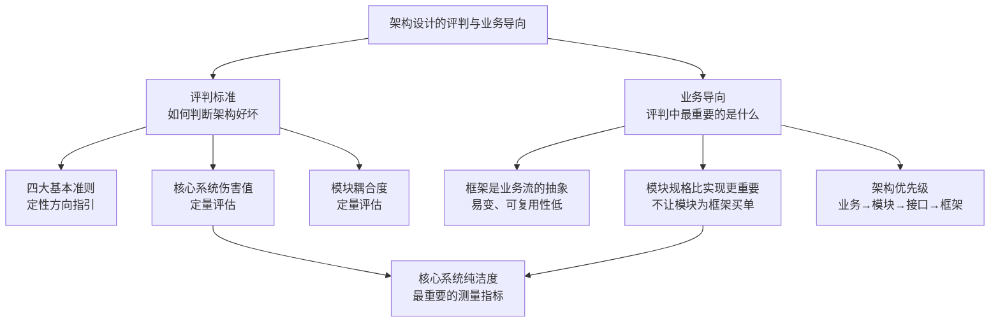
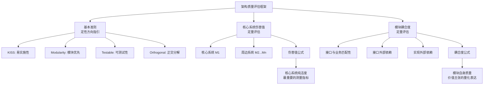
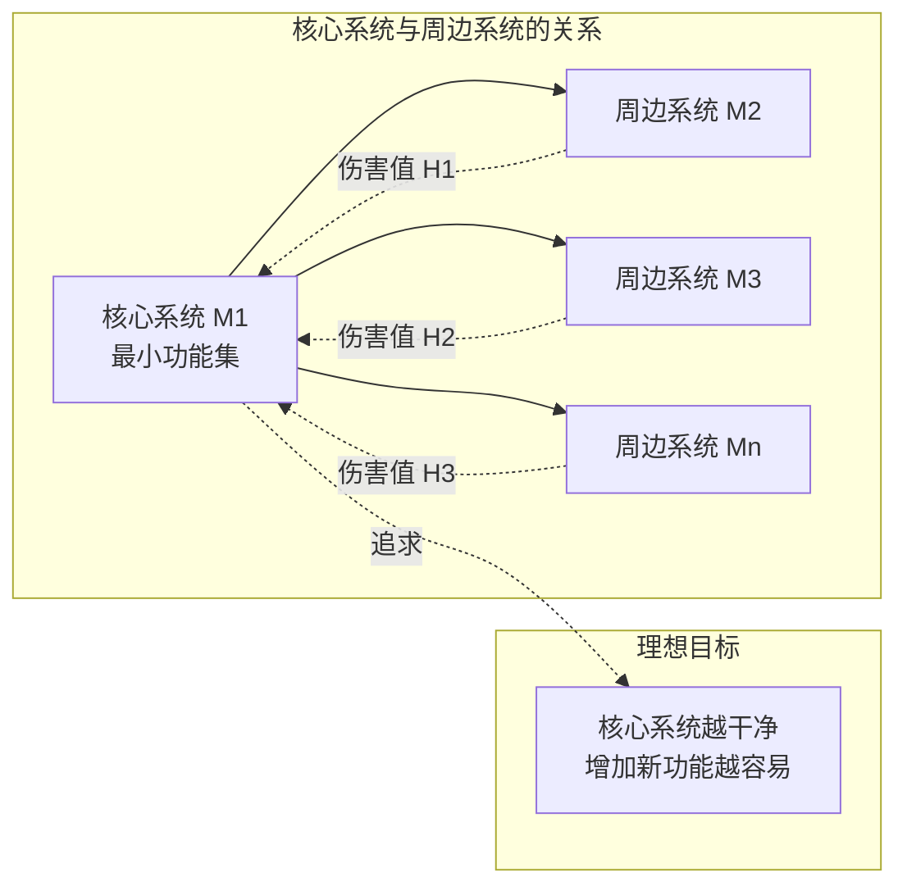
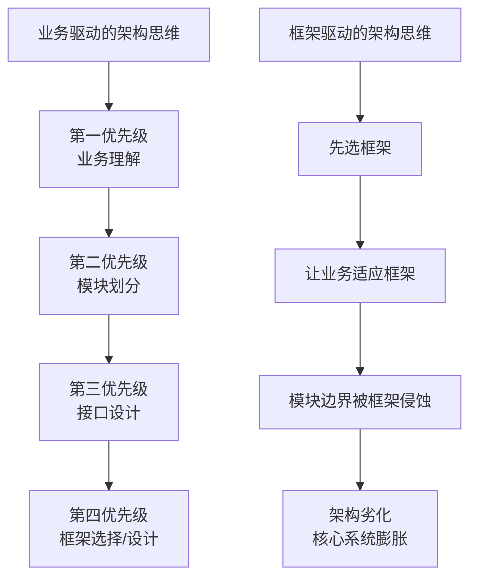
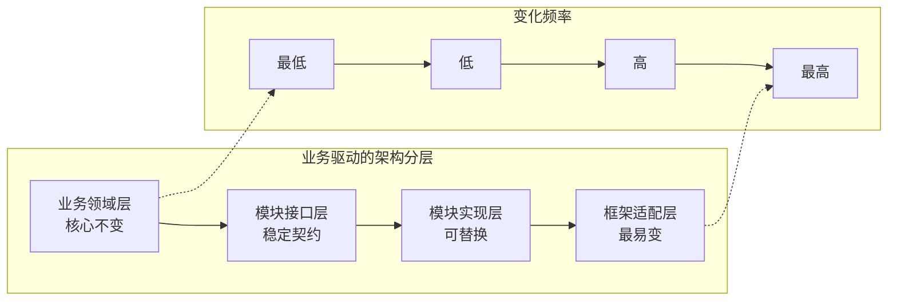
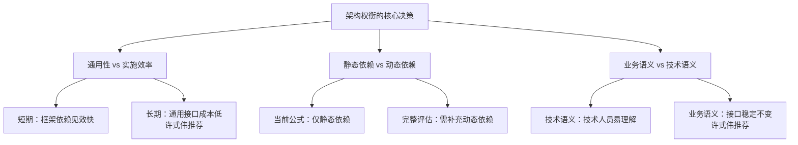

# 架构设计的评判与业务导向

## 一、章节导言：如何评判架构好坏，评判中最重要的是什么

架构设计的优劣判断，不能仅凭直觉——"我感觉这个更好"虽然有一定数据支撑，但终究模糊而感性。许式伟从基本准则出发，逐步推导出定量的经验公式，为架构质量评估提供了可操作的框架。

然而，仅有评判标准还不够。软件行业有一个普遍现象：工程师热衷于谈论框架、追逐技术潮流，却对业务逻辑避之不及。许式伟一针见血地指出，**框架并不重要，重要的是业务**。这不是反技术的宣言，而是对架构思维本源的回归——所有技术手段都应该服务于业务目标，脱离业务谈框架，无异于缘木求鱼。

评判架构优劣，最终要回到一个核心问题：**架构是否服务于业务，还是业务被迫适应架构？**

## 二、架构设计的评判标准

### 2.1 四大基本准则

#### KISS：简单比复杂好

KISS（Keep it Simple, Stupid）的核心主张是**易实施性**。让模块容易实现，实现时心智负担低，比复杂的优化更重要。KISS 的"简单"还主张代码和接口符合惯例——接口语义自然，一看方法名就知道怎么回事，避免惊异。

> 正确理解系统需求之后才进行设计。要避免过度设计，除非有人为复杂性买单。

#### Modularity：着眼于模块而非框架

从架构设计角度，**模块的规格（接口）比模块的实现机制更重要**。框架是易变的，框架是业务流，可复用性相对更低。框架都将经历不断发展演化的过程。所以——**不让模块为框架买单**。模块设计时应忽略框架的存在，认真审视模块接口中"过度的（或多余的）约束条件"，把它提高到足够通用、普适的场景来看。

#### Testable：保证可测试性

设计应该以可测试性为第一目标。可测试往往意味着低耦合。模块测试的第一步是环境模拟——模块依赖的模块列表、模块的输入输出，既是模块测试的需要，也是模块耦合度的表征。

更重要的是，测试让我们能够发现模块架构调整的潜在问题。通常模块在架构调整期（代码重构）最容易引入 Bug，只有在开发过程中就不断积累典型测试数据，以案例形式固化所有已知 Bug，才可能在架构调整时获得最佳效果。

#### Orthogonal Decomposition：正交分解

架构就是不断对系统进行正交分解的过程。"优先考虑组合，而不是继承"——从正交分解的角度诠释，它本质上是鼓励我们做**乘法而不是加法**。组合是乘法，用相互正交、完全没有相关性的模块组合出业务场景；继承是加法，通过叠加能力把一个模块改造成另一个模块。

### 2.2 架构质量评估框架

### 2.3 核心系统伤害值：最重要的测量公式

正交分解的第一步是分出核心系统与周边子系统。核心系统构成业务的最小功能集，通过不断增加新的周边功能演变为复杂系统。**核心系统的变更要额外小心。**

#### 伤害值经验公式

假设架构方案将系统分为 n 个模块 `[M1, M2, ..., Mn]`，其中 M1 是核心系统，其他为周边系统。为简化，假设周边系统间相互正交、没有耦合。则周边功能对核心系统的总伤害值为：

$$H = \sum_{\text{每一处修改}} \log_2(\text{修改行数} + 1)$$

其中：
- 同一个周边功能相邻的代码行算作一处修改
- 不同周边功能的修改哪怕相邻也算作多处

**公式含义**：修改处数越多，伤害越大。对于每一处修改，鼓励尽可能减少到只修改一行，更多代码放到周边模块自己那里去。

### 2.4 模块耦合度测量公式

模块自身质量包括接口质量和实现质量。接口质量取决于两方面：

1. **接口与业务的匹配性**：接口越自然体现业务越好（不可计算，依赖主观判断）
2. **接口的外部依赖**：模块接口对外部环境的耦合度

#### 耦合度公式

模块实现（或接口）与依赖模块 A 的耦合度：

$$C_A = \sum_{\text{每一个依赖的符号}} \log_2(\text{符号出现次数} + 1)$$

依赖的符号（symbol）包括：被引用的类型（typedef/class/struct）、被引用的全局变量、全局函数或成员函数。

#### 总耦合度公式

模块的总耦合度为：

$$C_{total} = \sum_{\text{每一个依赖模块 A}} C_A \times \text{不成熟度系数}_A$$

其中不成熟度系数 A：完全成熟（不再改变）为 0；规格都完全没法确定为 1。

**关键洞察**：
- 鼓励依赖外部成熟模块
- 理论上完全成熟的模块可能只有语言内置类型（int、string 等），所以还是尽量减少外部依赖
- 将接口参数改为 `object` 或 `interface{}` 并不能降低耦合度——interface 的耦合度要看功能实际使用时存在的各种可能类型

## 三、业务优先：少谈框架，多谈业务

### 3.1 框架的本质：业务流的一种抽象

框架是什么？框架是对业务流的抽象。它解决的问题场景通常是一个具体的业务领域。因此，框架的生命周期与业务紧密绑定：

- **框架是业务流**：框架描述的是"如何做事情"的流程，属于实现层面
- **框架是易变的**：因为业务在不断演化，框架也在不断演化
- **框架可复用性相对更低**：业务场景差异导致框架难以通用

### 3.2 模块与框架的根本区别

模块与框架的区别，是理解"少谈框架、多谈业务"的关键：

| 维度 | 模块（Module） | 框架（Framework） |
|-----|---------------|------------------|
| 关注点 | 规格即接口——做什么 | 实现即机制——怎么做 |
| 稳定性 | 接口稳定，变的是实现 | 流程稳定，变的是扩展点 |
| 可复用性 | 高——跨业务场景复用 | 低——与特定业务流绑定 |
| 设计原则 | 不为框架买单 | 为业务流服务 |
| 依赖方向 | 业务依赖模块接口 | 框架驱动业务流程 |

**核心论断**：模块的规格（接口）比模块的实现机制更重要。不应该让模块为框架买单。

### 3.3 业务架构的核心地位

当我们回归业务时，架构的优先级应该是：

1. **业务理解**：深入理解业务领域、用户场景、核心诉求
2. **模块划分**：基于业务领域做正交分解，识别出核心模块与周边模块
3. **接口设计**：定义模块间的契约（接口），确保接口自然体现业务语义
4. **框架选择/设计**：在模块和接口确定之后，才选择或设计框架来串联业务流

## 四、设计原则与权衡（Trade-off 分析）

### 4.1 评判标准的权衡

| 评估维度 | 价值主张 | 量化方法 | 局限性 |
|---------|---------|---------|-------|
| 核心系统纯洁度 | 核心系统越干净越好 | 伤害值公式 | 仅考虑静态修改，未考虑运行时影响 |
| 模块耦合度 | 依赖越少、越成熟越好 | 耦合度公式 | 仅考虑静态依赖，未考虑动态依赖（调用频率等） |
| 接口业务匹配性 | 接口自然体现业务 | 无量化方法 | 完全依赖主观判断 |
| 正交性 | 模块间相互独立 | 周边系统间零耦合假设 | 现实中周边系统间可能存在耦合 |

**核心权衡：静态依赖 vs 动态依赖。** 上述公式只考虑了静态依赖关系。例如网络模块 A 调用 B：A 调用 B 的网络接口数量越多，静态依赖越大（已考虑）；A 调用 B 的网络接口的次数越多，动态依赖越大（未考虑）。完整的评估需要同时考量两者。

**重要提醒**：耦合度测量公式是经验公式，代表某种价值主张。计算得到的具体值并无物理含义，只能用来对比**相同功能**的不同架构方案。功能完全不同的系统，其计算结果不能用于评判彼此好坏。

### 4.2 "不让模块为框架买单"的深层含义

模块设计时应该忽略框架的存在，认真审视模块接口中"过度的（或多余的）约束条件"，把它提高到足够通用、普适的场景来看。这意味着：

- **接口设计去框架化**：模块接口不应暴露框架特定的类型、概念或约定
- **实现可以依赖框架**：模块的实现层可以使用特定框架，但接口层必须保持独立
- **业务语义优先**：接口命名、参数设计应体现业务语义，而非技术框架语义

### 4.3 权衡：通用性 vs 实施效率

| 选择 | 优势 | 劣势 |
|-----|------|------|
| 追求通用接口 | 模块可跨框架复用，架构灵活 | 设计成本高，初期开发慢 |
| 接口依赖框架 | 初期开发快，框架功能直接用 | 框架切换成本高，模块耦合 |
| 业务语义接口 | 自然易懂，变化频率低 | 需要深入理解业务 |
| 技术语义接口 | 技术人员容易理解 | 业务变化时接口不稳定 |

**许式伟的建议**：长期来看，通用性和业务语义的优势远大于短期实施效率的收益。框架都会经历不断发展演化的过程，让模块为框架买单的短期便利，会变成长期的技术债。

## 五、实践案例与反模式

### 5.1 正面案例：插件机制——伤害值为零

是否有可能把功能添加对核心系统的影响降低到零（不改一行代码）？这是可能的，要求核心系统提供**插件机制**。这是开闭原则（OCP）在架构层面的体现（参见第62讲）。

### 5.2 正面案例：Office 软件的架构演进

以 Office 文档处理为例，正确的架构是：

1. 核心文档模型作为独立模块，接口不依赖任何具体的文件格式框架
2. IO 子系统作为独立模块，负责各种格式的读写
3. 文件格式框架（如 XML 解析框架）仅存在于 IO 模块的实现层
4. 新增文件格式支持，只需在 IO 模块添加适配器，核心文档模型零修改

### 5.3 反面案例：OOP 思想的误用

以 Office 软件的 IO 子系统为例，如果按 OOP 思想把读盘存盘代码散落在核心系统各处——每个类都需要 SaveWord、LoadWord、SaveRTF、LoadRTF——则核心系统伤害值极高。文件格式层出不穷、难以收敛，核心系统却被迫不断膨胀。这正是缺乏正交分解思维的典型表现（参见第60讲、第61讲）。

### 5.4 反面案例：框架侵蚀模块边界

典型的反模式：

- MVC 框架中的 Model 层直接暴露 ActiveRecord 对象到 View 层——模块接口被框架类型污染
- 微服务框架强制所有服务实现特定基类——模块为框架买单
- ORM 框架导致业务逻辑散落在数据模型中——模块边界被框架侵蚀

### 5.5 深层反思：为什么工程师热衷框架？

1. **框架提供安全感**：有最佳实践、有社区支持，降低了决策负担
2. **框架降低入门门槛**：不需要深入理解业务就能开始编码
3. **框架是简历加分项**：技术栈比业务知识更容易量化展示

但这三者恰恰是架构师需要警惕的——安全感可能掩盖业务理解不足，入门门槛低可能意味着深度不够，简历加分项与架构质量无关。

## 六、小结与关键要点

1. **四大基本准则指明评判方向**：KISS（易实施性）、Modularity（模块优先）、Testable（可测试性）、Orthogonal Decomposition（正交分解）——其中正交分解是架构质量的核心，组合是乘法，继承是加法，优先考虑组合。

2. **核心系统伤害值是最重要的测量指标**：修改处数越多伤害越大，鼓励每处修改只改一行。评判架构优劣，首先看核心系统是否足够纯洁——这本质上是对"业务核心是否被周边功能侵蚀"的量化度量。

3. **框架是对业务流的抽象，是易变的**：框架都将经历不断发展演化的过程，不应该让模块为框架买单。模块的规格（接口）比实现机制更重要，接口应体现业务语义而非框架约束。

4. **架构的优先级是业务→模块→接口→框架**：先理解业务，再划分模块，然后设计接口，最后才选框架。框架驱动是架构劣化的常见根源——让业务适应框架，必然导致模块边界被侵蚀、核心系统膨胀。

5. **评估框架有局限，深入业务是根本**：当前公式仅考虑静态依赖，未考虑动态依赖；接口业务匹配性尚无量化方法。评判架构好坏的终极标准，是架构是否真正服务于业务目标。脱离业务谈架构，一切都是空中楼阁。

> 参见第60讲「架构分解：边界，不断重新审视边界」（详见架构思维/架构设计篇对应章节）——如何基于业务做正交分解。参见第62讲「重新认识开闭原则(OCP)」（即本系列《架构原则-开闭原则与接口设计》）——开闭原则与插件机制。
