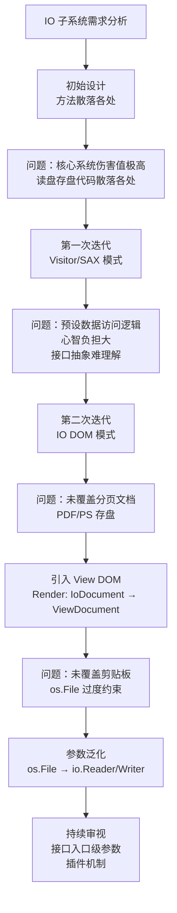
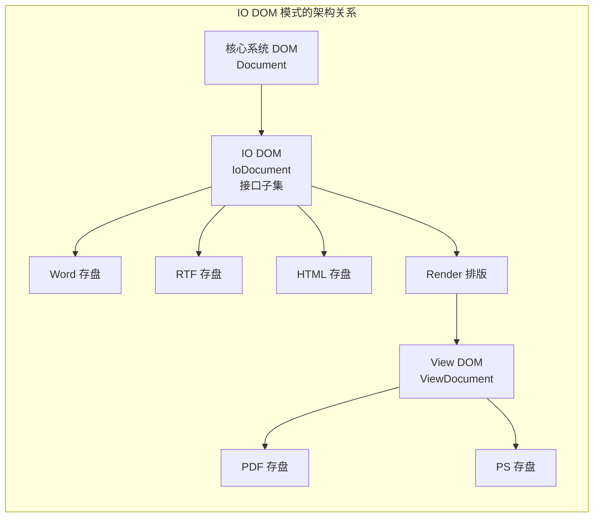
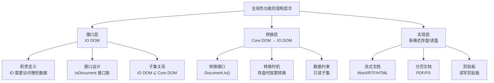
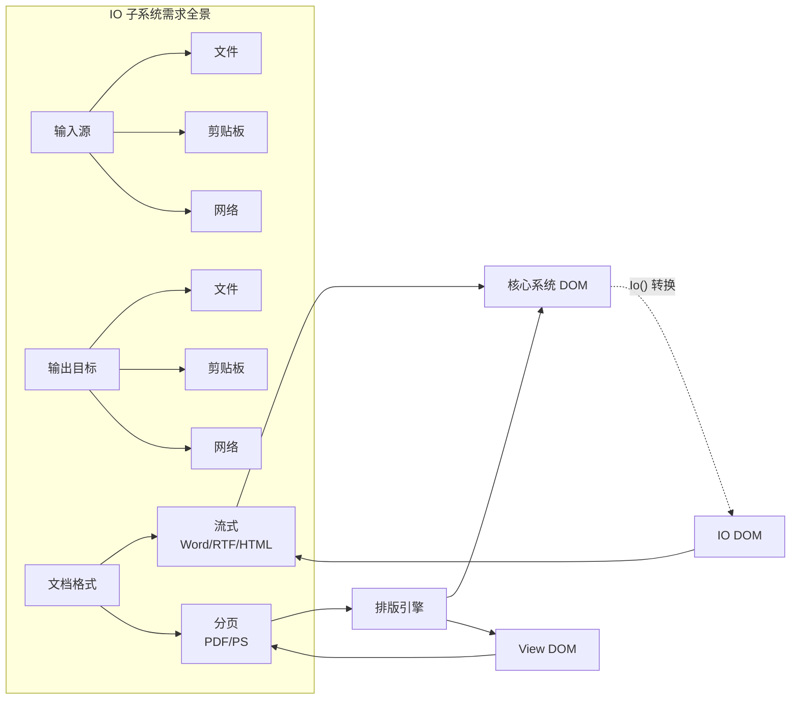
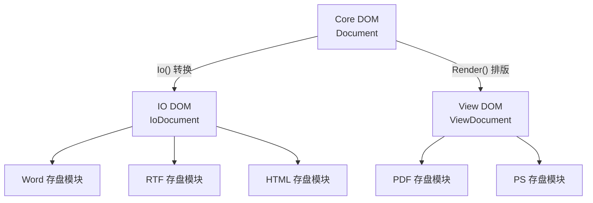

# 架构分解与全局性功能设计

## 章节导言：边界审视与跨切面功能的架构困境

架构就是业务的正交分解。每个模块都有它自己的业务。接口是业务的抽象，同时也是它与使用方的耦合方式。在业务分解的过程中，我们需要认真审视模块的接口，发现其中"过度的（或多余的）约束条件"，把它提高到足够通用的、普适的场景来看。

但说起来容易做起来难。边界在哪里？怎么判断一个约束是"过度的"？更棘手的是，有一类特殊的功能——日志、监控、IO、权限控制、事务管理——它们看起来"无处不在"，涉及几乎所有模块。这类**全局性功能**（Cross-cutting Concerns）是架构分解中最难处理的类型：如果放在核心系统中，核心系统会被侵蚀；如果独立出来，又面临与核心系统的深度耦合问题。

许式伟以 Office 软件的 IO 子系统为例，完整演示了从边界审视到全局性功能架构设计的思维过程——从初始设计到 Visitor 模式，再到 IO DOM 模式，每一步迭代都是对边界的重新审视，也是对全局性功能独立性的一次推进。

## 架构分解：不断重新审视边界

### 边界审视的三个维度

#### 维度一：职责边界——模块做什么

不同业务模块分别做什么，它们之间通过什么方式耦合在一起。这是边界审视的首要问题。以 IO 子系统为例：

- 核心系统：文档的编辑与展示逻辑
- IO 子系统：文档的读盘与存盘
- 两者耦合方式：IO 子系统需要访问核心系统的文档数据

#### 维度二：耦合方式——模块如何交互

耦合方式的需求适应性如何、开发人员实现上的心智负担如何，是决策的影响因素。以 IO 子系统为例，三种耦合方式的对比：

| 耦合方式 | 核心系统侵入性 | IO 模块独立性 | 心智负担 | 接口理解性 |
|---------|-------------|-------------|---------|----------|
| 方法散落各方 | 极高 | 无 | 高 | 差 |
| Visitor/SAX 模式 | 中 | 高 | 高 | 差 |
| IO DOM 模式 | 低 | 高 | 低 | 好 |

#### 维度三：参数约束——接口的过度约束

在具体接口的每个输入输出参数的类型选择上，要非常考究，尽可能发现其中"过度的（或多余的）"约束。例如：

- `SaveRTF(f *os.File, doc IoDocument)` → 过度约束，只能写文件
- `SaveRTF(f io.Writer, doc IoDocument)` → 合理泛化，支持剪贴板等场景

### 边界分解的迭代过程

### KISS 原则的正确理解

**KISS 原则提倡的简单，并不是接口外观上的简洁，而是业务语义表达上的准确无歧义。**

Visitor/SAX 模式看起来"简洁而高效"——接口只有几个事件方法。但实际编码中程序员心智负担大，有大量冗余代码纯粹用于缓存数据。接口仍然抽象而难以理解——不同事件的次序需要较长的文档说明。这不是 KISS，这是伪装成简洁的复杂。

### 正交分解的持续性

架构分解不是一次性的工作，而是**不断重新审视边界**的过程：

1. **需求分析要细致**：认真细致做好需求分析，过一遍所有用户故事（User Story），确认架构适应性
2. **边界审视要反复**：每次新需求都是审视架构合理性的机会
3. **参数约束要考究**：每个接口参数类型都要审视是否过度约束

## 全局性功能的架构设计

### 全局性功能的本质特征

全局性功能是横跨多个核心模块的功能需求。其本质特征是：

- **侵入性**：它需要与多个核心模块交互，天然具有侵入核心系统的倾向
- **正交性**：它本身是独立的业务领域，与核心系统的业务正交
- **可扩展性**：往往存在多种实现变体（如多种文件格式、多种日志后端）

### 全局性功能的三层模型

### 需求细化：全局性功能的全景视图

以 Office 软件的 IO 子系统为例，完整的需求全景包括：

**功能维度**：

- **读盘**：从外部数据源加载文档（文件、剪贴板、网络）
- **存盘**：将文档保存到外部数据目标
- **格式**：Word、RTF、HTML、PDF、PS、剪贴板格式
- **流式 vs 分页**：Word/RTF/HTML 是流式文档，PDF/PS 是分页文档

**关联维度**：

- **IO 与排版的关联**：分页文档需要排版后才能存盘
- **IO 与核心系统的关联**：IO 需要访问文档数据
- **IO 与剪贴板的关联**：剪贴板是 IO 的数据源/目标之一

### 全局性功能的设计模式

#### 模式一：接口子集模式（IO DOM）

核心思想：全局性功能只访问核心数据的子集，通过接口定义这个子集。

**优势**：

- 全局性功能模块与核心系统解耦，只通过 IO DOM 交互
- 各存盘模块彼此独立，新增格式不影响已有模块
- 核心系统的伤害值最小化

#### 模式二：渲染管道模式（View DOM）

核心思想：分页文档需要经过排版引擎，产生独立的视图数据模型。

- Core DOM 通过 Render 产生 ViewDocument
- ViewDocument 包含排版后的分页信息
- PDF/PS 模块只依赖 ViewDocument，不依赖 Core DOM

#### 模式三：参数泛化模式

核心思想：将接口参数从具体实现类型泛化为抽象接口。

- `SaveRTF(f *os.File)` → `SaveRTF(w io.Writer)` — 支持文件、剪贴板、网络
- `LoadWord(f *os.File)` → `LoadWord(r io.Reader)` — 支持文件、剪贴板、网络

### 核心原则：全局性功能的独立性

**全局性功能应该是独立的模块，不应该侵蚀核心系统。** 这意味着：

1. 核心系统不应该包含任何全局性功能的实现代码
2. 全局性功能通过接口与核心系统交互
3. 新增全局性功能变体不应该修改核心系统

## 设计原则与权衡（Trade-off 分析）

### 核心权衡一：接口通用性 vs 理解成本

| 选择 | 优势 | 劣势 |
|-----|------|------|
| IO DOM（子集关系） | 理解成本最低，核心系统常规接口 | 需要维护两套 DOM 的关系 |
| Visitor/SAX（事件机制） | 接口外观简洁 | 心智负担大，事件次序难理解 |
| 方法散落各处 | 实现最直接 | 核心系统伤害值极高 |

### 核心权衡二：接口复杂度 vs 核心系统侵入度

| 方案 | 接口复杂度 | 核心系统侵入度 | 新增格式成本 |
|-----|----------|-------------|-----------|
| 方法散落各处 | 低 | 极高 | 高（改核心系统） |
| Visitor/SAX | 中 | 中 | 中（改 Visitor） |
| IO DOM 子集 | 较高 | 低 | 低（加新模块） |
| IO DOM + View DOM | 高 | 极低 | 极低（加新模块） |

### 核心权衡三：转换成本 vs 耦合成本

IO DOM 方案引入了 Core DOM 到 IO DOM 的转换成本。但这个转换是值得的：

- **转换成本**：一次转换的 CPU 和内存开销
- **耦合成本**：如果不转换，IO 模块直接操作 Core DOM，核心系统被侵蚀

**结论**：转换是短暂的，耦合是持久的。用短暂的转换成本换取持久的低耦合，是值得的。

## 实践案例与反模式

### 正面案例：IO 子系统的三次架构迭代

**第一次：方法散落各处（反面教材）**

每个类（Span、Paragraph、TextPool、Document）都有 SaveWord、SaveRTF、LoadWord、LoadRTF 方法。读盘存盘代码散落在核心系统各处，核心系统伤害值极高。这是 OOP 思想的误用——以为一切都应该以对象为中心。

**第二次：Visitor/SAX 模式**

引入 Visitor 接口（StartDocument、StartParagraph、StartSpan、Characters、EndSpan...），核心系统提供 Visit 方法遍历数据。IO 子系统从核心系统中抽离出来，Word 和 RTF 模块彼此独立。

但问题在于：预设了数据访问逻辑，基于事件模型编程心智负担大，接口抽象难理解。

**第三次：IO DOM 模式**

引入 IoDocument 接口族作为核心系统 DOM 的子集，通过 `Document.Io()` 方法转换。所有存盘读盘模块的工程量降低，接口理解一致性更好，IO DOM 更自然——避免了惊异。

进一步迭代：引入 ViewDocument（通过 Render 排版得到），支持 PDF/PS 存盘；参数从 `*os.File` 泛化为 `io.Reader/Writer`，支持剪贴板。

### 正面案例：IO DOM + View DOM 的完整架构

1. 核心系统只包含文档编辑的业务逻辑
2. IO DOM 定义 IO 子系统需要的文档数据子集
3. View DOM 定义分页文档需要的排版后数据
4. 各格式存盘模块只依赖 IO DOM 或 View DOM
5. 核心系统提供 `Io()` 和 `Render()` 方法做数据转换
6. 新增格式只需新增模块，零修改核心系统

### 反面案例一：需求分析不充分

如果在需求分析时没有把需求关联性找到，那就不是一次合格的需求分析过程。例如：

- 只考虑了流式文档，遗漏了分页文档（PDF/PS）
- 只考虑了文件读写，遗漏了剪贴板
- 只考虑了数据读写，遗漏了 IO 与排版子系统的关联

**教训**：为了避免留下难以调整的架构缺陷，强烈建议认真细致做好需求分析，并且在架构设计时认真细致地过一遍所有用户故事。

### 反面案例二：AOP 的误用

AOP（面向切面编程）试图通过"织入"来解决全局性功能的问题，但本质上是"隐式耦合"——

- 全局性功能的逻辑被隐藏在切面中，不可见不可控
- 切面与核心系统的耦合是隐式的，调试困难
- 切面的执行顺序是隐式的，行为不确定

**对比**：IO DOM 方案是"显式解耦"——全局性功能的接口和数据流都是显式的，可控可调试。

## 小结与关键要点

1. **架构分解的核心是边界审视**：职责边界、耦合方式、参数约束三个维度缺一不可，每次新需求都是重新审视架构合理性的机会。
2. **全局性功能必须保持独立性**：通过接口子集模式（IO DOM）实现显式解耦，避免侵蚀核心系统；AOP 的隐式耦合是反模式。
3. **KISS 的本质是业务语义的准确无歧义**，不是接口外观的简洁——Visitor/SAX 的"简洁"是伪装的复杂。
4. **转换成本 < 耦合成本**：用短暂的转换换取持久的低耦合，是架构设计的基本权衡；IO DOM + View DOM 虽然接口复杂度最高，但核心系统侵入度极低，新增格式成本极低。
5. **需求全景视图是架构质量的前提**：遗漏用户故事和需求关联会导致架构缺陷，且难以调整——认真细致的需求分析是边界正确划分的根基。

> 参见第58讲「如何判断架构设计的优劣」——核心系统伤害值的量化评估。参见第62讲「重新认识开闭原则(OCP)」——IO DOM 模式正是 OCP 的实践体现。
