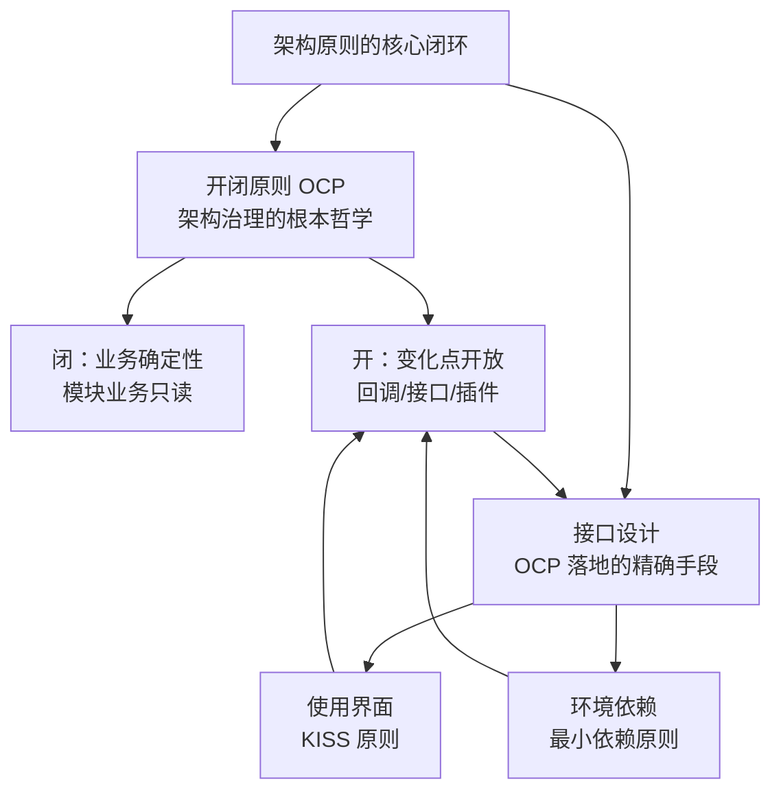
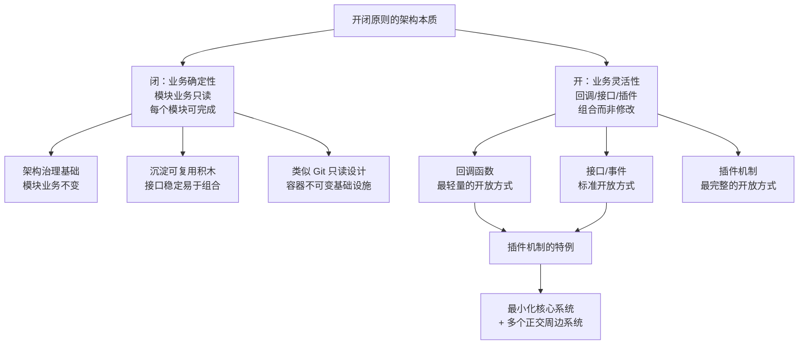
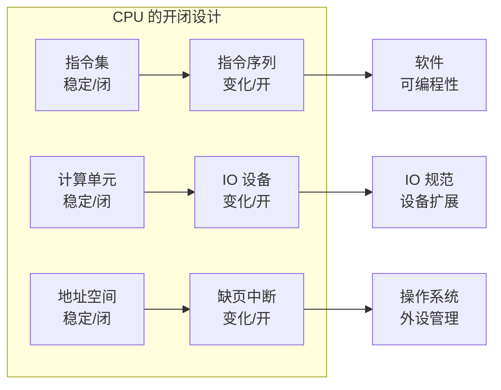
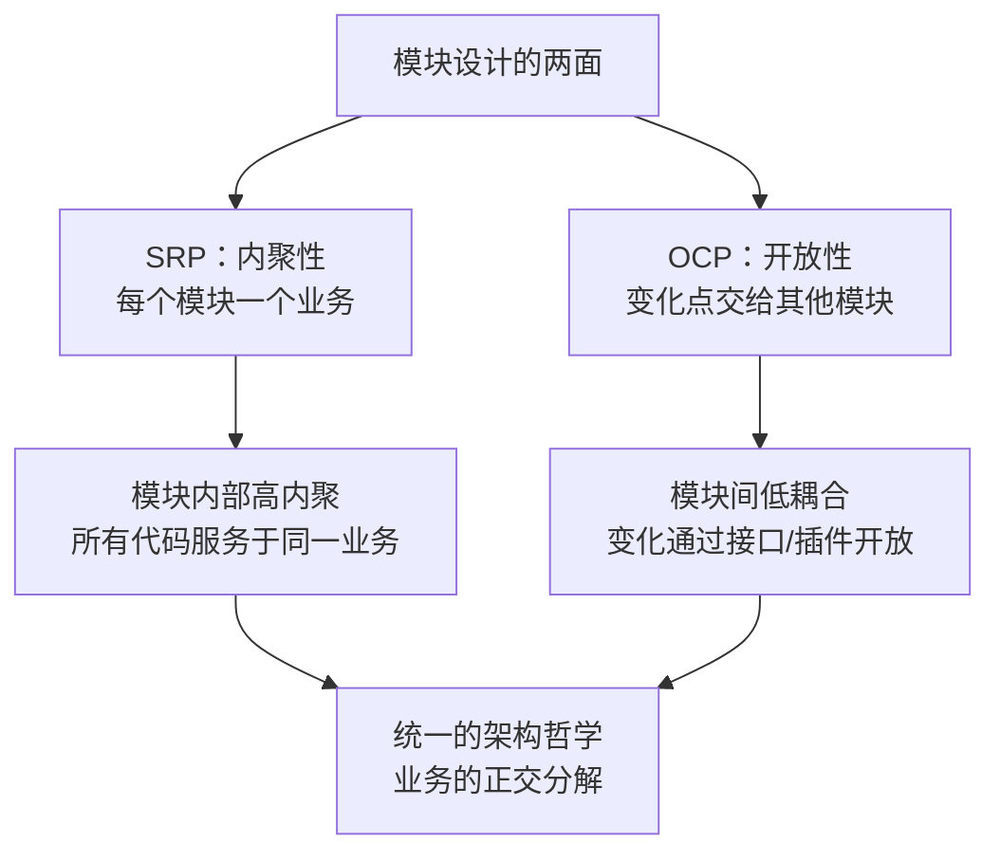
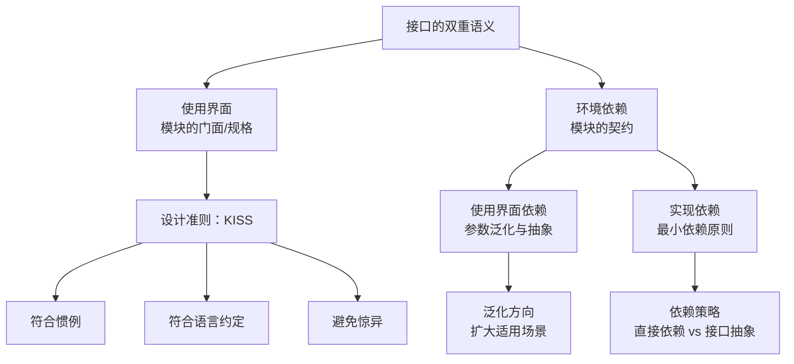
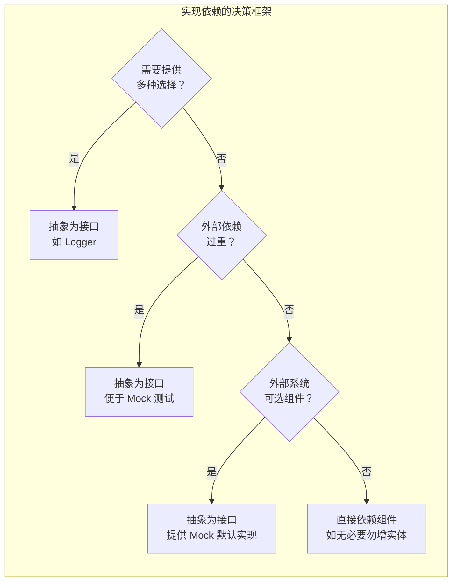
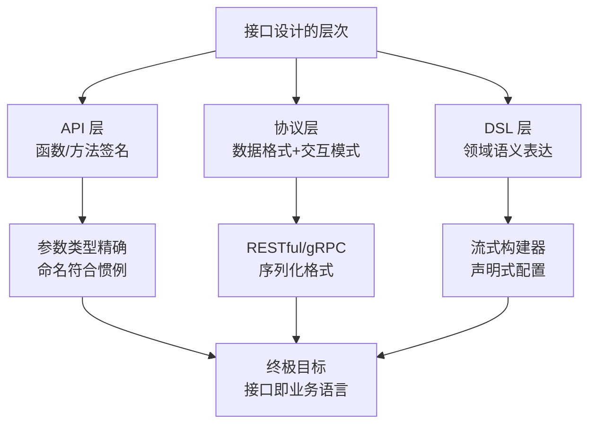
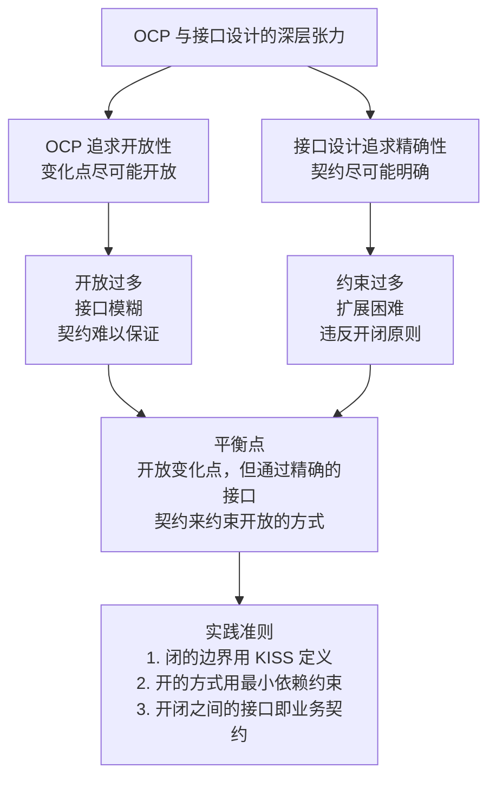

# 架构原则-开闭原则与接口设计

## 一、章节导言：架构最核心的设计原则及其实现手段

开闭原则（Open Closed Principle, OCP）是架构治理的根本哲学，也是架构设计中最核心的原则。许式伟的解读直指内核：**开闭原则的背后，推崇的是模块业务的确定性**。与其修改模块的业务，不如实现一个新业务。只要业务分解一直被正确执行，实现新的业务模块来完成新的业务范畴，是一件极其轻松的事情。

然而，OCP 的"开"——无论回调、接口还是插件——都离不开一个核心要素：**接口设计**。接口是业务的抽象，是模块间的契约，是架构治理的落脚点。接口在不同语境下有两层含义：模块的使用界面（规格），以及模块对依赖环境的抽象（契约）。这两者的设计准则截然不同，却常常被混为一谈。

开闭原则回答了"架构如何稳定与灵活"的问题，接口设计回答了"稳定与灵活如何精确落地"的问题。两者共同构成了架构原则的核心闭环。



## 二、重新认识开闭原则（OCP）

### OCP 的两层含义

**第一层：模块的业务要稳定**

模块的业务遵循"只读"设计。如果需要变化，不如归档、放弃掉。这种模块业务只读的思想，是架构治理的基础哲学。许式伟常说的话："每一个模块都应该是可完成的"——这正是开闭原则业务范畴"只读"的另一种表述。

**第二层：模块业务的变化点要开放**

简单变化点，通过回调函数或接口开放出去，交给其他业务模块。复杂变化点，通过插件机制把系统分解为"最小化的核心系统 + 多个彼此正交的周边系统"。回调函数或接口本质上就是一种事件监听机制，所以它是插件机制的特例。

### OCP 与业务正交分解的统一

开闭原则与"架构的本质是业务的正交分解"一脉相承：

- **闭**：业务分解的确定性——每个模块的业务范畴确定后不再变化
- **开**：业务组合的灵活性——通过组合已有模块来完成新的业务



### OCP 的历史根源：CPU 的开闭设计

一种广泛的误解认为开闭原则是 OOP 领域提出的编程思想。但开闭原则思想的应用贯穿整个信息科技发展历程，它是信息技术架构的基本原则——不仅适用于软件设计。

#### 冯·诺依曼体系：OCP 的经典实践

CPU 的设计完美体现了开闭原则：

- **指令是稳定的**（闭），但**指令序列是变化的**（开）——由此发明了软件
- **计算是稳定的**（闭），但**数据交换是多变的**（开）——由此定义了输入输出规范
- **缺页中断**（闭中的开）：CPU 通过中断将自身与多变的外设演进解耦

> 我们不必去修改 CPU，但我们却支持了如此多姿多彩的信息世界。多么优雅的设计。它与面向对象无关，完全是开闭原则带来的威力。



### 插件机制：OCP 的完整实践

#### 插件机制的三个组成部分

1. **DOM API**：软件自身能力的暴露，插件以此调用已有功能
2. **插件加载机制**：通常基于文件系统（指定插件目录）或注册表
3. **事件监听**：这是关键——没有事件，插件没有机会介入业务

#### 事件的三种类型

| 事件类型 | 说明 | 示例 |
|---------|------|------|
| 界面操作类 | 高级界面事件（不暴露底层鼠标/键盘） | 菜单项点击、按钮点击 |
| 数据变更类 | 数据变化时触发 | onSelectionChanged、onDataChanged |
| 业务流程类 | 业务流中间或完成后触发 | 打开文件前后、保存前后 |

#### 轻量级插件：Go image 包

```go
import "image"
import _ "image/jpeg"  // 加载 jpeg 插件
import _ "image/png"   // 加载 png 插件
```

这里最大的简化是放弃了插件加载机制——手工加载插件。只要提供 `Decode` 和 `DecodeConfig` 功能，就可以增加格式支持，无需修改 image 包。

#### 插件机制的成本与前提

- **成本**：插件机制本身是核心系统的一个功能，也需要考虑与其他功能的耦合度
- **前提**：维持足够的通用性——如果插件没有多少客户，投入产出不成比例

### OCP 与 SRP 的统一

单一职责原则（SRP）强调每个模块只负责一个业务。开闭原则强调把模块业务的变化点抽离出来，包给其他模块。它们谈的是**同一个问题的两个面**：



## 三、接口设计的准则

开闭原则告诉我们：模块业务要稳定（闭），变化点要开放（开）。但"开放"的方式——回调、接口、插件——都离不开一个核心要素：**接口设计**。接口是业务的抽象，是模块间的契约，是架构治理的落脚点。

### 接口的双重语义

#### 语义一：模块的使用界面

模块的使用界面，即公开的类或函数的原型。这是模块对外暴露的"门面"，最重要的是 **KISS 原则**——让人一眼就明白这个模块在做什么样的业务。

KISS 的"简单"不是接口外观上的简洁，而是：
- **符合惯例**：接口语义自然，一看方法名就知道怎么回事
- **符合语言约定**：如果语言中已有约定俗成的接口，尽量沿用相同的语义
- **避免惊异**：不引入反直觉的设计，不偏离社区的惯用模式

#### 语义二：模块的环境依赖

模块对依赖环境的抽象，即模块与模块之间的契约。这是"契约式设计（Design by Contract）"的范畴——模块间的交互基于接口作为契约，而非具体实现。

环境依赖又分两种：
- **使用界面依赖**：用户使用模块时自然涉及的依赖
- **实现依赖**：模块当前实现方案涉及的组件，换实现方案可能就不再存在



### 使用界面设计：KISS 原则的实践

#### 案例：mockhttp 的接口演进

**v1 版本**（违反 KISS）：

```go
package mockhttp

var Client rpc.Client  // 类型不对：应该是 http.Client

func Bind(host string, service interface{})  // 不符合 Go 惯例
```

问题：
- `Bind` 不符合 Go 语言惯例语义
- `Client` 类型是 `rpc.Client` 而非 `http.Client`，产生多余依赖
- 违反单一职责原则——同时做了"启动 HTTP 测试服务"和"实现请求路由分派"

**v2 版本**（符合 KISS）：

```go
package mockhttp

var DefaultTransport *Transport     // 命名符合 Go 惯例
var DefaultClient *http.Client      // 类型正确

func ListenAndServe(host string, service http.Handler)  // 语义与标准库一致
```

改进：
- 方法和变量命名 Go 程序员一看即明其义
- 语义与 Go 标准库 `net/http` 自然融合
- `service` 参数类型是 `http.Handler`——恰如其分的描述

#### KISS 的深层理解

**形式泛化 ≠ 真正泛化。** v1 的 `service interface{}` 看似更泛化，实际上有更强假设（通过反射实现路由分派）。v2 的 `service http.Handler` 看似更具体，实际上是更恰如其分的描述。

### 环境依赖设计：最小依赖原则

#### 使用界面依赖：参数泛化

接口定义更多考虑对参数的泛化与抽象，以适应更广泛的场景：

- `*os.File` → `io.Reader` / `io.Writer`：从文件泛化到任意读写器，支持剪贴板
- `rpc.Client` → `http.Client`：消除多余依赖，对齐标准库类型

**注意避免过度泛化**：如果某种泛化不会发生，那就是过度设计。不要一开始就把系统设计得非常复杂。应该让系统足够简单，却又不失扩展性——其中的平衡完全依赖对业务的理解。

#### 实现依赖：直接依赖 vs 接口抽象

大部分情况下应该**直接依赖组件**，而不必去抽象它。如无必要，勿增实体。



#### 抽象接口的三种正当理由

1. **需要提供多种选择**：典型如日志组件 Logger——绝大部分业务模块不希望绑定 Logger 的选择。但注意：抽象数据库依赖以便在 MySQL 和 MongoDB 间切换，通常是**过度设计**——选择数据库应该是非常谨慎的行为。

2. **解除庞大外部系统的依赖**：不是为了多选择，而是外部依赖过重，测试时需要 mock。

3. **外部系统为可选组件**：模块实现一个 mock 组件，初始化时将接口设为 mock。客户可以当模块不存在这个配置项，降低学习门槛。

### 接口设计的 DSL 视角

接口设计的高级形态是 DSL（领域特定语言）。好的接口本身就是一种 DSL——它用精确的语义表达业务领域概念，让使用者用最自然的方式描述业务意图。



## 四、设计原则与权衡（Trade-off 分析）

开闭原则与接口设计各有其权衡空间，而两者之间又存在更深层的张力：OCP 追求开放性，接口设计追求精确性。如何在"开放"与"精确"之间找到平衡，是架构设计的核心命题。

### OCP 实践方式的权衡

| OCP 实践方式 | 适用场景 | 侵入性 | 灵活性 | 实现成本 |
|-------------|---------|-------|-------|---------|
| 回调函数 | 简单变化点（1-2个扩展位置） | 低 | 低 | 低 |
| 接口/事件 | 中等变化点（多个扩展位置） | 中 | 中 | 中 |
| 插件机制 | 复杂变化点（大量扩展位置） | 高 | 高 | 高 |
| 全新模块 | 业务范畴变化 | 无 | 最高 | 取决于业务复杂度 |

**核心权衡：稳定性 vs 适应性。**

- 过度追求"闭"（稳定）：模块僵化，无法适应新需求
- 过度追求"开"（扩展）：插件机制过于复杂，核心系统负担增加
- **理想状态**：核心系统最小化且稳定，变化通过周边系统的组合来适应

### 接口设计的权衡

| 原则 | 适用场景 | 过度风险 |
|-----|---------|---------|
| KISS（符合惯例） | 使用界面设计 | 为"简单"而牺牲表达能力 |
| 最小依赖原则 | 环境依赖设计 | 为"最少"而增加间接层 |
| 参数泛化 | 使用界面依赖 | 泛化不会发生的场景 = 过度设计 |
| 接口抽象 | 实现依赖 | 抽象不需要多选的依赖 = 过度设计 |
| 契约式设计 | 模块间交互 | 契约过于严格 = 灵活性不足 |

**核心权衡：通用性 vs 简洁性。**

- 通用接口适应更多场景，但学习成本更高
- 简洁接口容易理解，但可能过度约束
- **平衡点**：让接口足够通用以覆盖已知场景，但不为"可能发生"的泛化买单

### OCP 与接口设计的深层张力



## 五、实践案例与反模式

### 正面案例：Git 的只读设计

Git 的版本管理体现了 OCP 的"闭"——每次提交都是不可变的快照。分支和合并体现了"开"——通过组合已有提交来创建新的历史线，整体模型稳定、可治理。

### 正面案例：容器技术的不可变基础设施

Docker 容器的镜像层是只读的（闭），容器运行时通过叠加可写层来扩展（开）。这正是 OCP 在基础设施层面的实践。

### 正面案例：Go 标准库的接口设计

Go 标准库的 `io.Reader` 和 `io.Writer` 是接口设计的典范：

- 极简接口（一个方法），但覆盖了文件、网络、缓冲区、压缩等所有 IO 场景
- 命名符合惯例，一看就知道是读写操作
- 按需组合（`io.ReadWriter` = `Reader` + `Writer`），不预设组合方式

### 正面案例：Go image 包的轻量级插件

Go 标准库的 `image` 包通过接口 + 手工注册实现了轻量级插件机制——只要提供 `Decode` 和 `DecodeConfig` 功能，就可以增加图片格式支持，无需修改 image 包本身。这是 OCP 与接口设计完美结合的范例：接口精确（只要求两个方法），开放充分（任意扩展格式），侵入最小（无需修改核心）。

### 反面案例：过度修改模块业务

最常见反模式：每当新需求到来，就修改既有模块的业务范畴——给它加功能、改接口、调整设计。一个需求捏着鼻子做，两个需求捏着鼻子做，系统不堪重负。这正是违反 OCP"闭"的典型表现。

### 反面案例：插件机制的过度设计

如果某个插件机制只有一两个客户使用，而它的代码散落在核心系统各处，投入产出不成比例。插件机制的前提是足够的通用性——没有足够客户，就不要提供插件机制。

### 反面案例：mockhttp.v1 的接口问题

- `Bind` 方法名不符合 Go 惯例（标准库用 `ListenAndServe`）
- `service interface{}` 看似泛化，实际有更强假设
- `Client rpc.Client` 类型引入多余依赖

### 反面案例：数据库抽象的过度设计

抽象数据库依赖以便在 MySQL 和 MongoDB 间切换——这是常见的过度设计。选择数据库是架构决策，不应该被当作可配置项。不同数据库的数据模型、查询能力、一致性保证差异巨大，"透明切换"几乎不可能实现。

## 六、小结与关键要点

1. **OCP 的本质是业务确定性，接口是实现 OCP 的精确手段**：模块业务只读（闭），变化点通过精确的接口开放（开）。开闭原则回答"如何稳定与灵活"，接口设计回答"如何精确落地"，两者构成架构原则的核心闭环。

2. **OCP 的开放方式是渐进的，接口设计的抽象是审慎的**：回调函数 → 接口/事件 → 插件机制，根据变化点的复杂度选择开放方式；使用界面遵循 KISS，环境依赖遵循最小依赖原则——如无必要，勿增实体。

3. **OCP 不只是 OOP 的原则，接口设计也不只是 API 设计**：CPU 的设计、Git、容器技术都是 OCP 的实践；接口的双重语义（使用界面 + 环境依赖）覆盖了模块对外和对内的全部契约，其高级形态是 DSL。

4. **形式泛化不等于真正泛化，过度泛化就是过度设计**：`interface{}` 看似更泛化，实际有更强假设；`io.Reader` 看似更具体，实际上是更恰如其分的抽象。让系统足够简单，却又不失扩展性——其中的平衡完全依赖对业务的理解。

5. **OCP 与 SRP 是同一问题的两面，开闭与接口是同一架构的两个维度**：内聚性（一个模块一个业务）+ 开放性（变化点交给其他模块）= 正交分解；稳定性（闭的边界）+ 精确性（接口的契约）= 可治理的架构。
