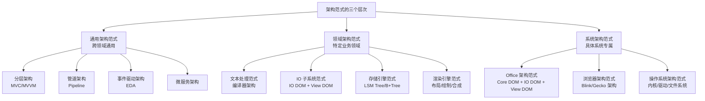
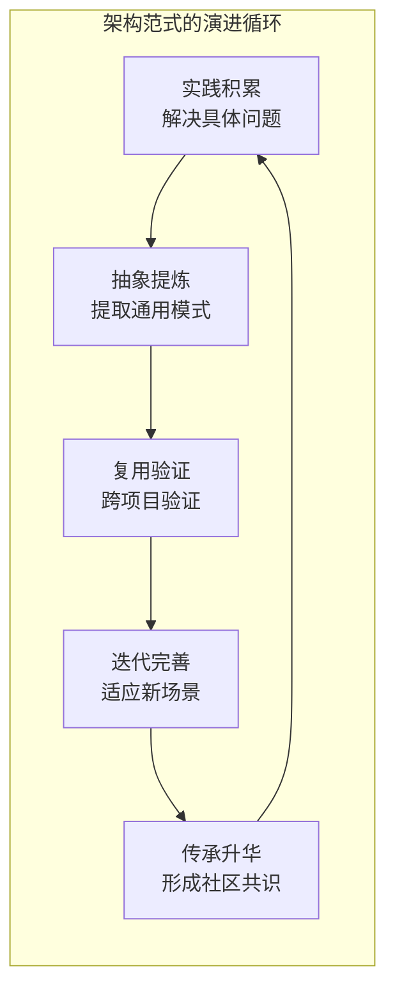
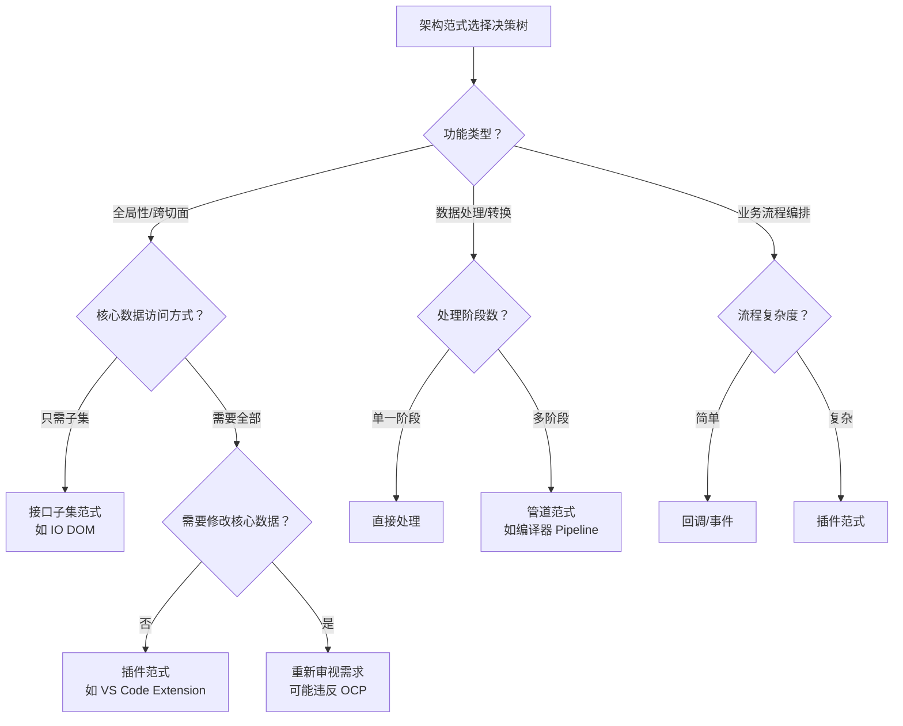

# 不断完善的架构范式

## 章节导言：架构知识的沉淀与传承

架构学习不是从零开始。无数架构师在长期实践中积累了大量经验，形成了一个个架构范式（Paradigm）。这些范式是架构师的"设计模式"——不是某个具体问题的解决方案，而是某一类问题的通用架构思维框架。

许式伟强调：**业务系统要有业务自身的架构范式**。这不是照搬教科书上的模式，而是在实践中不断沉淀、不断完善的方法论。架构范式的核心价值在于，它让架构师不必每次都从零开始思考，而是在前人智慧的基础上做出更优决策。

## 核心概念：架构范式的本质

### 什么是架构范式

架构范式是**针对特定问题域的架构思维框架**，它定义了：

- 问题的本质特征
- 解决问题的核心思路
- 关键的设计决策点
- 常见的反模式与陷阱

架构范式不是框架，不是库，不是可直接复用的代码。它是**思维的工具**，是"看问题的方式"。

### 架构范式的三个层次

### 架构范式的演进规律

架构范式不是一成不变的，它在实践中不断演进：

1. **从实践中来**：最初是对具体问题解决方案的抽象
2. **在复用中验证**：跨多个项目验证其通用性
3. **在演进中完善**：随着新需求、新场景的出现而迭代
4. **在传承中升华**：被社区接纳为标准范式，形成共识

## 架构范式与设计模式的关系

### 层次差异

| 维度 | 设计模式 | 架构范式 |
|-----|---------|---------|
| 粒度 | 类/对象级别 | 模块/子系统级别 |
| 关注点 | 代码结构 | 业务结构 |
| 抽象度 | 相对具体 | 相对抽象 |
| 影响范围 | 单个类/函数 | 整个系统 |
| 稳定性 | 语言相关，相对稳定 | 业务相关，持续演进 |

### 继承关系

架构范式包含设计模式，但不等同于设计模式。一个架构范式中可能运用多种设计模式，但设计模式本身不是架构范式。例如：

- **IO DOM 范式**包含：接口子集模式（结构型）、渲染管道模式（行为型）、参数泛化模式（创建型）
- **编译器范式**包含：管道模式（架构级）、访问者模式（结构型）、策略模式（行为型）

## 核心架构范式详解

### 范式一：接口子集范式

**适用场景**：全局性功能需要访问核心数据的子集。

**核心思路**：定义独立的接口族描述数据子集，全局性功能只依赖此接口。

**关键决策点**：
- 子集的粒度：太粗则解耦不彻底，太细则接口膨胀
- 转换的时机：按需转换 vs 预先转换
- 子集的维护成本：核心数据模型变更时子集如何同步

### 范式二：插件范式

**适用场景**：系统需要在不修改核心代码的前提下扩展功能。

**核心思路**：核心系统提供 DOM API + 事件监听 + 插件加载机制。

**关键决策点**：
- 事件的粒度：太细则事件风暴，太粗则插件无法介入
- DOM API 的暴露范围：太少则插件能力不足，太多则核心系统负担增加
- 插件的生命周期管理：加载、卸载、依赖处理

### 范式三：管道范式

**适用场景**：数据需要经过多个阶段的加工处理。

**核心思路**：将处理过程分解为多个独立的阶段，数据在阶段间流动。

**关键决策点**：
- 阶段的粒度：太细则管道过长，太粗则灵活性不足
- 阶段间的数据格式：统一格式 vs 各阶段自定义
- 错误处理策略：短路 vs 容错

## 设计原则与权衡分析

### 范式的选择与组合

**核心权衡：范式收益 vs 范式成本。**

每个范式都有实施成本：
- 接口子集范式：维护子集接口与核心数据的同步
- 插件范式：设计事件体系、暴露 DOM API、管理插件生命周期
- 管道范式：设计阶段间数据格式、处理错误传播

**原则**：选择最简单的范式解决问题。如果简单的回调就能解决，不要上插件机制。

### 范式的适用边界

每个范式都有其适用边界，超出边界就是过度设计：

| 范式 | 适用边界 | 超出边界的表现 |
|-----|---------|-------------|
| 接口子集 | 多个模块需要访问同一数据子集 | 只有一个模块使用时，接口冗余 |
| 插件 | 有足够多的第三方扩展需求 | 只有一两个"插件"时，机制过重 |
| 管道 | 数据确实需要多阶段处理 | 只有单一处理阶段时，管道冗余 |

## 实践案例与反模式

### 正面案例：Office 软件的多范式组合

Office 软件同时运用了多种架构范式：

- **接口子集范式**：IO DOM 定义 IO 需要的数据子集
- **渲染管道范式**：Core DOM → Render → View DOM → PDF/PS
- **插件范式**：宏、扩展、加载项

### 反面案例：强行套用范式

- 为只有两个处理阶段的场景引入完整的管道框架——过度设计
- 为只有一两个扩展点的场景引入完整的插件机制——成本不成比例
- 不理解业务就套用架构范式——南辕北辙

## 小结与关键要点

1. **架构范式是架构师的思维工具**：不是代码，不是框架，而是看问题的方式。
2. **架构范式分三个层次**：通用架构范式、领域架构范式、系统架构范式。
3. **架构范式在实践中不断演进**：从实践中来，在复用中验证，在演进中完善，在传承中升华。
4. **选择最简单的范式解决问题**：如果回调能解决，不要上插件机制。
5. **业务系统要有业务自身的架构范式**：不是照搬教科书，而是在实践中沉淀专属方法论。

> 参见第65讲「架构范式：文本处理」——以文本处理为例，完整推演一个领域架构范式。参见第63讲「接口设计的准则」——架构范式的实现依赖精确的接口设计。