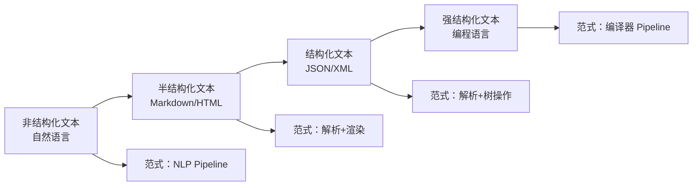
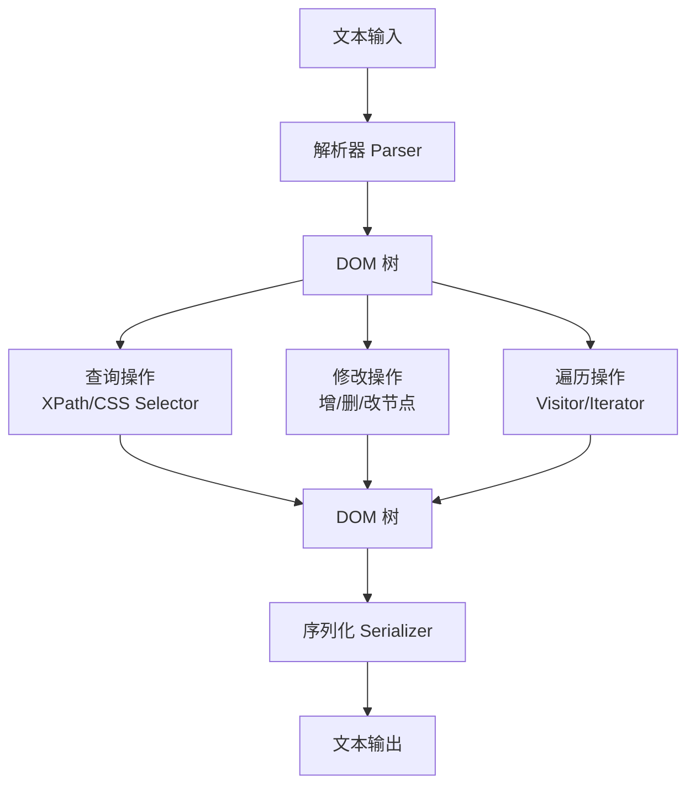
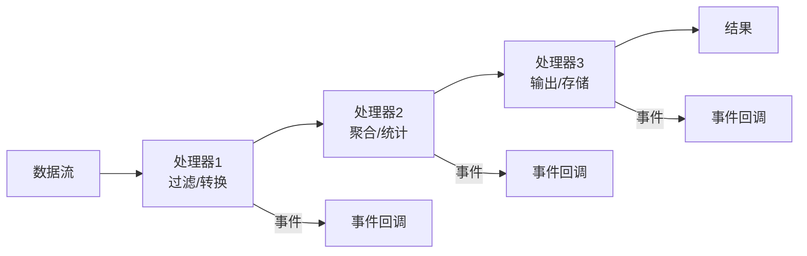
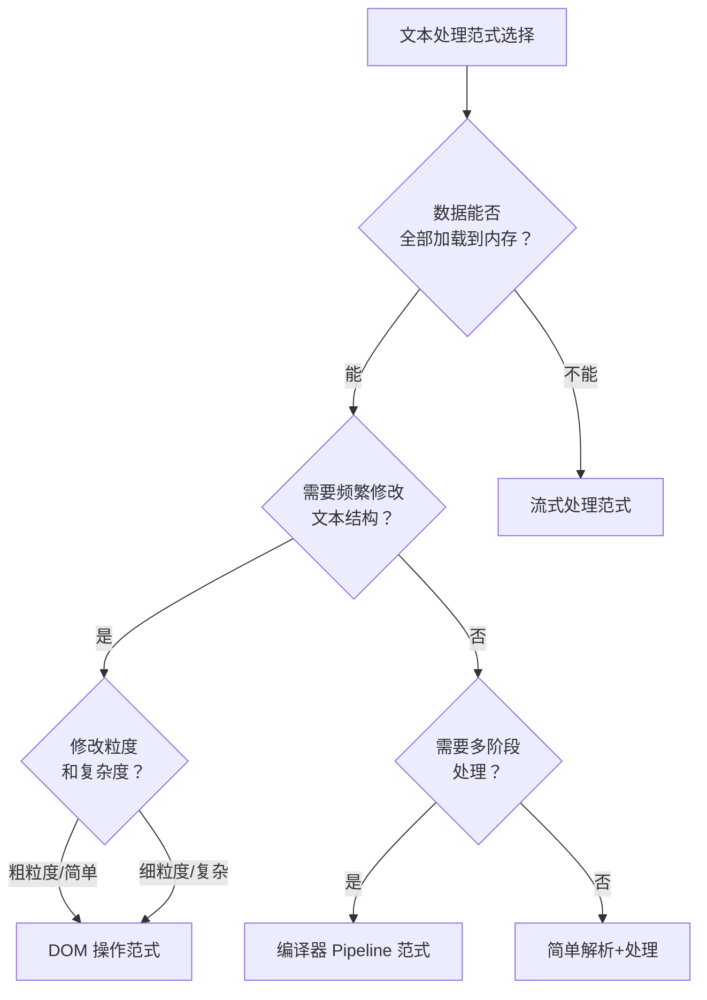

# 架构范式-文本处理

## 章节导言：从具体领域看架构范式的构建

上一篇讨论了架构范式的通用理论。本节以文本处理为例，完整推演一个领域架构范式的构建过程——从问题本质分析到架构设计，从范式提炼到实践验证。文本处理是信息科技的基础能力，从编译器到搜索引擎，从编辑器到自然语言处理，无处不在。它是理解架构范式的绝佳切入点。

## 核心概念：文本处理的本质特征

### 文本处理的基本模型

文本处理的核心问题是：将输入文本转换为期望的输出。这个转换过程可以用统一模型描述：

```text
输入文本 → [处理管道] → 输出结果
```

但这个模型过于笼统。不同类型的文本处理，其架构范式差异巨大。关键在于区分文本的**结构化程度**。

### 文本结构化的光谱



## 架构范式一：编译器 Pipeline

### 适用场景

编程语言处理、配置语言处理、DSL 处理等强结构化文本。

### 架构模型

编译器 Pipeline 是最经典的文本处理架构范式。其核心思想是：**将文本处理分解为多个独立的阶段，数据在阶段间以标准化的数据结构传递。**


### 关键设计决策

| 决策点 | 选项 | 权衡 |
|-------|------|------|
| 词法分析与语法分析的边界 | 正则/自动生成 vs 手写 | 自动生成方便但性能差，手写灵活但开发成本高 |
| AST 的表示 | 具体语法树 vs 抽象语法树 | 具体树保留更多细节（如括号），抽象树更适合分析 |
| 阶段间数据格式 | 统一 IR vs 各阶段自定义 | 统一 IR 便于跨阶段优化，自定义 IR 更灵活 |
| 错误处理 | 急停 vs 错误恢复 | 急停简单但用户体验差，错误恢复复杂但可以一次报多个错 |

### 范式提炼

编译器 Pipeline 的核心范式要素：

1. **管道分解**：将处理过程分解为词法→语法→语义→优化→生成的管道
2. **中间表示**：每个阶段产出标准化的数据结构（Token、AST、IR）
3. **正交阶段**：各阶段关注点分离，互不干扰
4. **可插拔阶段**：优化阶段可以灵活增删

## 架构范式二：DOM 操作范式

### 适用场景

编辑器、文档处理、富文本处理等需要频繁修改文本结构的场景。

### 架构模型

DOM 操作范式的核心思想是：**将文本加载为内存中的树形数据结构（DOM），通过对树的增删改操作来处理文本。**



### 与 IO DOM 的对应关系

此范式与《架构分解与全局性功能设计》中的 IO DOM 模式高度一致：

- Core DOM 对应编辑器内部数据模型
- IO DOM 对应文本格式的数据子集
- 序列化/反序列化对应存盘/读盘

### 关键设计决策

| 决策点 | 选项 | 权衡 |
|-------|------|------|
| DOM 粒度 | 细粒度（每个标签一个节点）vs 粗粒度 | 细粒度灵活但内存大，粗粒度省内存但操作受限 |
| 增量更新 | 全量重建 vs 增量 Diff | 全量简单但性能差，增量复杂但性能好 |
| 并发访问 | 读写锁 vs Copy-on-Write | 读写锁粒度难控制，COW 内存开销大 |

## 架构范式三：流式处理范式

### 适用场景

大文件处理、日志分析、网络数据流等无法一次性加载到内存的场景。

### 架构模型



### 与 SAX 模式的对比

流式处理范式与《架构分解与全局性功能设计》中的 SAX/Visitor 模式本质相同。它们的核心问题是：

- **内存效率高**：不需要加载全量数据
- **心智负担大**：基于事件/回调的编程模型不够直观
- **不适合复杂逻辑**：无法方便地回溯或修改已处理的数据

**改进方向**：将流式处理与 DOM 操作结合——流式处理做初步过滤，DOM 操作做精细处理。

## 三种范式的选择决策



## 设计原则与权衡分析

| 原则 | 说明 | 典型反模式 |
|-----|------|----------|
| 管道正交性 | 各阶段关注点分离，互不干扰 | 阶段间隐式依赖，改一个影响另一个 |
| 中间表示标准化 | 阶段间数据格式明确 | 用全局变量在阶段间传递数据 |
| 可插拔阶段 | 阶段可增删替换 | 阶段间强耦合，无法独立替换 |
| 流式优先 | 大数据场景优先考虑流式处理 | 对大文件做全量 DOM 加载 |

**核心权衡：内存效率 vs 处理灵活性。**

- DOM 操作：内存占用大，但操作灵活（可回溯、可修改）
- 流式处理：内存效率高，但操作受限（只能向前、不能修改）
- 编译器 Pipeline：介于两者之间，AST 在内存中但通常只读

## 实践案例与反模式

### 正面案例：Go 编译器的 Pipeline

Go 编译器采用了经典的 Pipeline 范式：源代码 → 词法分析 → 语法分析 → 类型检查 → SSA 中间表示 → 优化 → 机器码生成。各阶段接口清晰，可独立测试。

### 正面案例：浏览器渲染引擎

浏览器渲染引擎融合了多种范式：HTML 解析（Pipeline → DOM）、CSS 解析（Pipeline → CSSOM）、布局（DOM 操作）、绘制（DOM → 像素流）、合成（流式处理）。

### 反面案例：用正则表达式解析 HTML

正则表达式无法处理嵌套结构，强行解析会导致不可预测的结果。这是典型的范式选择错误——应该使用 DOM 操作范式而非简单的正则匹配。

### 反面案例：全量 DOM 加载大文件

对 GB 级日志文件做全量 DOM 加载，导致内存溢出。应该使用流式处理范式。

## 小结与关键要点

1. **文本处理的核心变量是结构化程度**：从非结构化到强结构化，架构范式差异巨大。
2. **编译器 Pipeline 是强结构化文本的经典范式**：词法→语法→语义→优化→生成，各阶段正交分解。
3. **DOM 操作范式适合频繁修改文本结构的场景**：加载为树形结构，通过增删改操作处理。
4. **流式处理范式适合大数据场景**：内存效率高，但操作受限。
5. **范式选择的关键是数据特征**：能否全量加载？是否需要修改？是否需要多阶段处理？
6. **架构范式在实践中不断完善**：从具体问题出发，提炼通用模式，在复用中验证。

> 参见第64讲「不断完善的架构范式」——架构范式的通用理论。参见第60讲「架构分解：边界，不断重新审视边界」（详见架构思维/架构设计篇对应章节）——DOM 操作范式与 IO DOM 的对应关系。