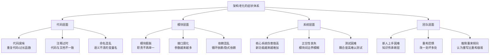
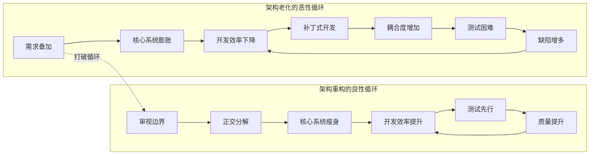
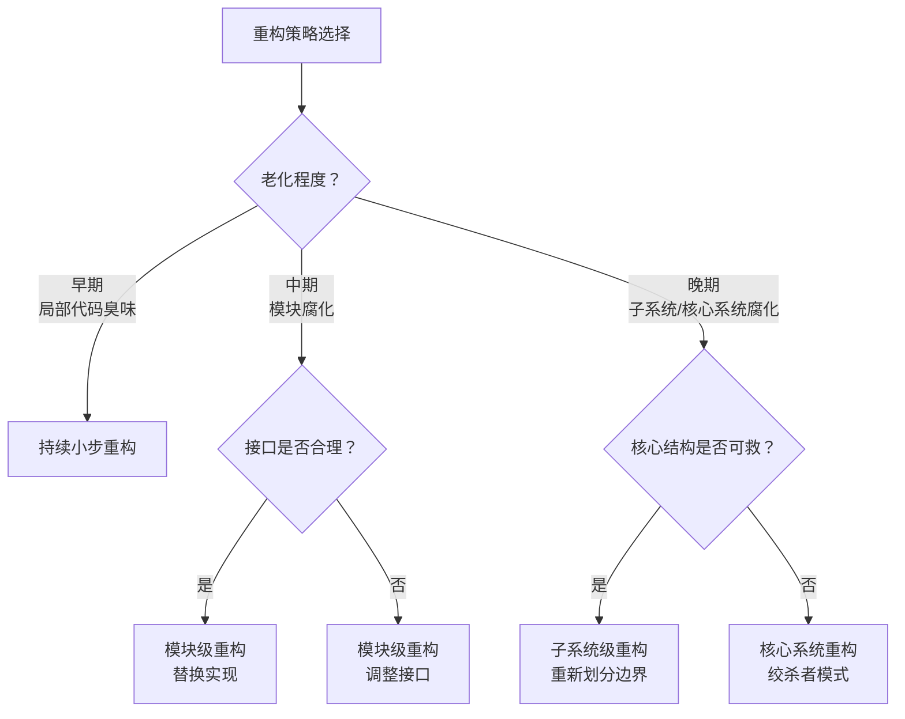
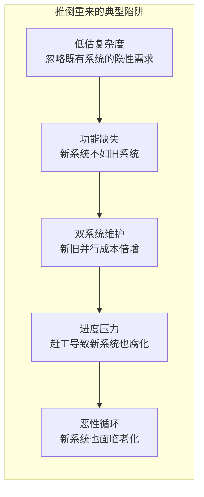

# 架构老化与重构

## 章节导言：软件的必然宿命

软件架构如同生命体，有其诞生、成长、壮年与衰老。架构老化是必然的——随着需求不断叠加，最初精心设计的架构逐渐变得臃肿、脆弱、难以维护。许式伟没有回避这个残酷现实，而是直面它：**架构老化不可完全避免，但可以通过正确的重构策略来延缓老化、恢复活力。**

重构不是推倒重来。推倒重来是承认失败，而重构是在既有基础上焕发新生。两者的选择，取决于老化的程度与重构的能力。

## 核心概念：架构老化的本质

### 为什么架构会老化

架构老化的根本原因不是技术选型错误，不是工程师能力不足，而是**需求的不确定性与架构的确定性之间的永恒矛盾**：

1. **需求叠加**：每个新需求都是在既有架构上增加约束，约束累积导致架构僵化
2. **边界模糊**：模块边界随需求叠加而逐渐模糊，模块职责不再清晰
3. **耦合累积**：模块间耦合度随时间递增，核心系统伤害值不断增长
4. **知识流失**：核心人员离开，架构意图逐渐不为人知
5. **补丁文化**：捏着鼻子做需求，一个需求一个补丁，系统不堪重负

### 架构老化的症状

**要点解读**：架构老化的症状分布在代码、模块、系统、团队四个层面，从代码臭味、接口腐化一路演化到核心系统伤害值升高乃至团队陷入重构恐惧。识别这些由浅入深的信号，是判断何时、以何种力度介入重构的前提。

## 架构老化的量化指标

基于第58讲的架构质量评估框架，架构老化可以用以下量化指标衡量：

| 指标 | 计算方式 | 健康阈值 | 老化预警 |
|-----|---------|---------|---------|
| 核心系统伤害值 | $\sum \log_2(\text{修改行数}+1)$ | 低 | 持续增长 |
| 模块总耦合度 | $\sum C_A \times \text{不成熟度系数}_A$ | 低 | 依赖数量增加 |
| 新功能开发成本 | 人天/功能点 | 稳定或下降 | 持续上升 |
| 缺陷密度 | Bug数/千行代码 | 低 | 持续上升 |
| 测试覆盖率变化 | 新增代码覆盖率 | 不低于既有水平 | 持续下降 |

**要点解读**：图左的恶性循环中，需求叠加导致核心系统膨胀，最终使测试困难、缺陷增多，又反过来加剧补丁式开发；图右的重构良性循环则通过审视边界、正交分解实现核心系统瘦身并提升效率。打破两者的联结点，在于以重构主动切入老化的起点，而非等待腐化累积到被迫重写。

## 重构策略：从局部到全局

### 策略一：持续小步重构（首选）

**核心思想**：在正常功能开发过程中持续进行小规模重构，不让问题积累。

**适用条件**：架构老化处于早期，核心结构仍然健康，只是局部模块需要优化。

**实施要点**：
- 发现代码臭味立刻修复，不拖延
- 每次提交都让代码比之前更好
- 依赖充分的自动化测试保障
- 遵循"童子军规则"：让代码比你发现时更干净

### 策略二：模块级重构

**核心思想**：对特定模块进行独立的架构调整，不影响其他模块。

**适用条件**：某个模块的接口仍然合理，但实现已经腐化；或者模块的接口需要调整，但影响范围可控。

**实施要点**：
- 先写测试覆盖模块的所有行为
- 保持接口不变，替换实现（实现级重构）
- 或者调整接口，逐步迁移调用方（接口级重构）
- 使用适配器模式在过渡期兼容旧接口

### 策略三：子系统级重构

**核心思想**：对跨多个模块的子系统进行重新设计。

**适用条件**：模块边界需要重新划分，如《架构分解与全局性功能设计》中 IO 子系统从 Visitor 模式迁移到 IO DOM 模式。

**实施要点**：
- 先明确新架构的目标形态
- 逐步迁移，新旧架构共存
- 每个迁移步骤都可独立验证
- 设定迁移的里程碑和截止日期

### 策略四：核心系统重构（最危险）

**核心思想**：对核心系统进行重新设计，影响面最大。

**适用条件**：核心系统伤害值极高，新功能开发几乎无法进行。

**实施要点**：
- 这是最危险的重构，必须有充分的理由和充分的准备
- 先建立完整的回归测试体系
- 采用绞杀者模式（Strangler Pattern），逐步替换核心系统
- 绝对不要"推倒重来"

**要点解读**：重构策略的选择取决于老化程度与接口的健康状况——早期优先持续小步重构，模块腐化时视接口是否合理选择替换实现或调整接口，子系统与核心系统腐化时才启用更大范围的重构，其中核心系统重构是影响面最大的最后手段。

## 推倒重来 vs 重构

### 许式伟的忠告

许式伟强调：**改代码的过程才是架构能力真正升华的过程。** 推倒重来意味着放弃了从既有架构中学习的机会，也放弃了在约束中创新的能力。

### 何时考虑推倒重来

满足以下全部条件时，可以考虑推倒重来：

1. 既有架构的核心思想已经完全过时，无法通过增量调整挽救
2. 团队对既有系统的理解几乎为零，重构成本高于重写成本
3. 新架构已经在独立项目中验证过可行性
4. 有足够的资源和时间完成重写，且不会影响既有用户

### 推倒重来的风险

**要点解读**：推倒重来往往陷入低估复杂度、功能缺失、双系统并行维护、进度压力导致的连串陷阱，最终新系统同样走向老化。它只能作为既有架构完全过时、理解成本过高时的最后选择，而非面对老化的默认答案。

## 设计原则与权衡分析

| 原则 | 说明 | 权衡 |
|-----|------|------|
| 测试先行 | 先建立测试保障再重构 | 测试编写成本 vs 重构安全性 |
| 小步迭代 | 每步可验证、可回滚 | 迭代成本 vs 风险控制 |
| 保持运行 | 系统始终可用 | 过渡期复杂度 vs 业务连续性 |
| 接口稳定 | 优先保持接口不变 | 接口约束 vs 重构灵活性 |
| 同理心 | 理解既有设计再改动（参见第57讲） | 理解成本 vs 改动质量 |

**核心权衡：重构投入 vs 业务交付。**

架构师面临的永恒张力是：业务方要求快速交付新功能，而重构需要额外时间。许式伟的建议是：**早迭代、小步迭代**——不要等到架构老化到无法挽回时才重构，在正常开发过程中持续小规模重构。这既是技术策略，也是心性修炼（参见第57讲）。

## 实践案例与反模式

### 正面案例：IO 子系统的架构演进

《架构分解与全局性功能设计》详细描述的 IO 子系统架构演进，就是一次成功的子系统级重构：

- 从"方法散落各处"到 Visitor/SAX，再到 IO DOM——每次都是对边界的重新审视
- 每次迭代都有明确的改进目标
- 最终实现新格式零修改核心系统——这是架构演进的理想状态

### 正面案例：绞杀者模式

用新的微服务逐步替换单体应用中的模块：
1. 新功能用微服务实现
2. 在网关层将旧功能的流量逐步切到微服务
3. 旧功能逐步下线
4. 最终完成迁移

### 反面案例：Netscape 的推倒重来

Netscape Navigator 6.0 的推倒重来是软件史上最著名的失败案例之一：

- 从 Communicator 4.x 的代码库推倒重来
- 重写期间竞争对手持续迭代
- 新版本发布时已失去市场
- 隐性需求（浏览器兼容性、插件生态）在重写中被遗漏

### 反面案例：大版本重构

"我们下个版本做一次大重构"——这是最危险的重构方式：

- 大版本重构意味着大量代码同时变更
- 变更范围越大，引入 Bug 的概率越高
- 如果缺乏充分的测试保障，大版本重构几乎注定失败

## 小结与关键要点

1. **架构老化是必然的**：需求的不确定性与架构的确定性之间的永恒矛盾导致老化。
2. **架构老化有量化指标**：核心系统伤害值、模块耦合度、开发成本、缺陷密度、测试覆盖率。
3. **重构策略从局部到全局**：持续小步重构 → 模块级重构 → 子系统级重构 → 核心系统重构。
4. **推倒重来是最后手段**：改代码的过程才是架构能力升华的过程，推倒重来放弃了学习的机会。
5. **测试先行是重构的前提**：没有测试保障的重构是盲目的。
6. **早迭代、小步迭代**：在正常开发过程中持续小规模重构，是延缓老化的最佳策略。

> 参见第57讲「心性：架构师的修炼之道」（详见架构思维/架构设计篇对应章节）——重构中的同理心与迭代能力。参见第58讲「如何判断架构设计的优劣」（即本系列《架构设计的评判与业务导向》）——架构老化的量化评估。参见第60讲「架构分解：边界，不断重新审视边界」（详见架构思维/架构设计篇对应章节）——IO 子系统的架构演进案例。