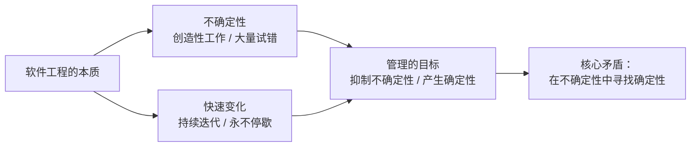
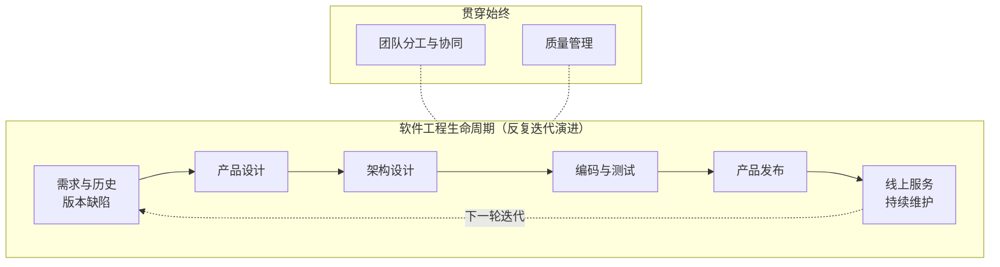
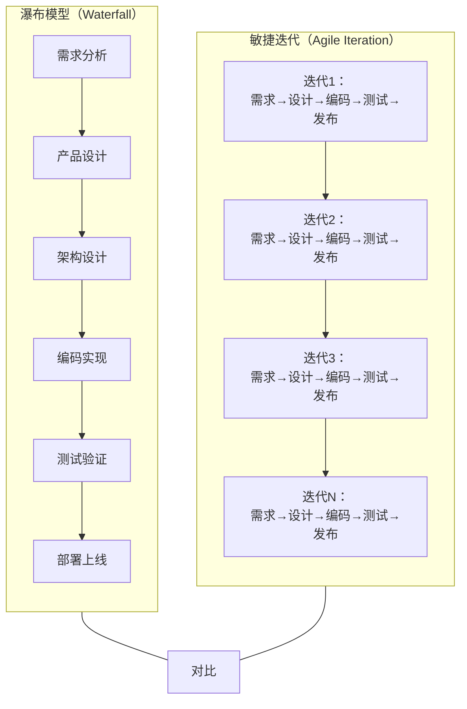
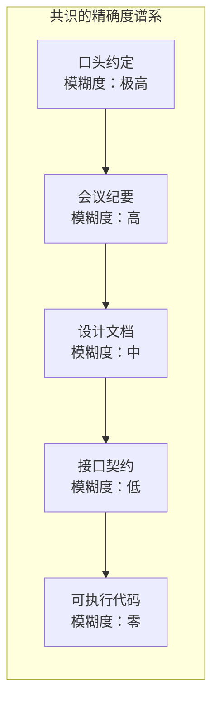
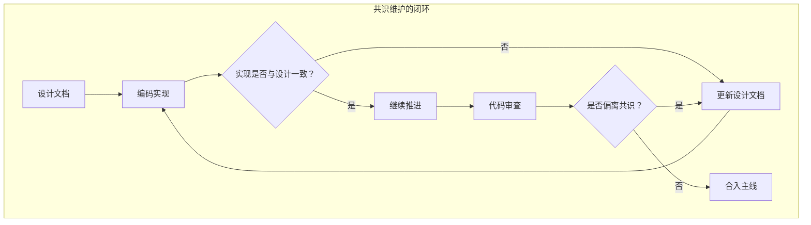

# 软件工程的宏观视角

## 章节导言：软件工程的核心矛盾

软件工程只有约 60 年的历史（"软件工程"一词于 1968 年 NATO 会议上正式提出）。相比动辄跨世纪的自然科学，它是一门极其年轻的学科。正因为实践时间太短，我们对其认知仍然肤浅。但恰恰是这门年轻的学科，却承担着人类有史以来最复杂的创造性工程活动。

软件工程的核心矛盾可以用一句话概括：**软件工程本身是不确定的、快速变化的，但软件项目的管理却期望达到确定性。** 我们的目标，是在大量的不确定性中找到确定性——这才是软件工程最核心的点。

> 交叉参考：本篇内容是整个"软件工程篇"的总纲，后续各讲（69-77）均围绕此矛盾展开具体论述。第四章"服务治理篇"则专门探讨了软件工程最后一个环节——线上服务管理。

---

## 核心概念与原理

### 软件工程的两大本质特征

软件工程与传统工程截然不同，其根本差异体现在两个维度：

**其一，不确定性。** 大型软件系统中几千甚至几万人参与，却没有两个人的工作是重复的。每个人每天都在写新的代码、做新的工作。软件工程从事的是创造性活动，而创造意味着大量试错——因为我们没有做过。涉及的人力、时间、业务变数，都远超传统工程。

**其二，快速变化。** 建筑工程完工即结束，极少变更。但软件生产出来只是开始——只要软件还在服务客户，迭代更新就永不停歇，从诞生到消亡，始终在变化。这与传统工程"一锤定音"的模式大相径庭。

这两点导致一个根本性的管理悖论：

### 架构师的职责：对工程执行结果负责

架构师的职责远不止"边界划分和模块规格定义"。从根本目标来说，**软件架构师要对软件工程的执行结果负责**，具体包括：

| 职责维度 | 具体内容 |
|---------|---------|
| 交付质量 | 按时按质进行软件的迭代和发布 |
| 响应能力 | 敏捷地响应需求变更 |
| 风险防范 | 防范软件质量风险，避免质量事故 |
| 成本控制 | 降低迭代维护成本 |

这意味着架构师虽然是一个技术岗，但其工作并非纯技术。至少有两项关键能力超越了技术范畴：

- **用户需求的解读能力**：尤其是需求演进的预判能力。关键不在技术，而在心态——心里得装着用户。
- **产品设计的参与能力**：产品边界的确立不是纯需求问题，也不是纯技术问题，而是两者合而为一的过程。

### 软件工程生命周期

关键认知：**软件工程不是一个项目，而是无数个项目。** 每个项目只是软件工程的一个里程碑（Milestone）。其生命周期以数年甚至数十年计。

---

## Mermaid 图表：瀑布模型 vs 敏捷迭代

| 维度 | 瀑布模型 | 敏捷迭代 |
|------|---------|---------|
| 变更成本 | 越晚发现越昂贵 | 每个迭代都可调整 |
| 确定性 | 早期追求完整规划 | 在迭代中逐步明确 |
| 适合场景 | 需求稳定、一次性交付 | 需求不确定、持续演进 |
| 风险暴露 | 集中在后期 | 分散在每个迭代 |
| 与软件工程本质的匹配度 | 较低——无法应对快速变化 | 较高——拥抱不确定性 |

**许式伟的核心判断**：现代软件工程的实践，本质上是在瀑布模型的基础上增加了迭代闭环。瀑布模型描述了单次迭代的过程，而软件工程的真实形态是无数个瀑布的螺旋上升。

---

## 团队共识管理（详解）

在不确定性中寻找确定性，最核心的手段是**团队共识管理**。架构师的首要工作不是画架构图，而是建立团队共识——只有共识才是可靠的协作基础。

### 共识的本质：精确而非模糊

共识的精确性决定了协作的效率。模糊的共识（口头约定、会议纪要）会在执行中产生歧义，导致返工甚至冲突。

**许式伟的核心主张**：共识必须尽可能精确。最精确的共识是代码级别的接口定义和数据结构规格，而非架构图或会议纪要。

### 共识的载体：设计文档

设计文档是团队共识的核心载体。好的设计文档应包含：

| 文档要素 | 作用 | 精确度要求 |
|---------|------|-----------|
| 需求背景 | 统一对"为什么做"的理解 | 中等——说清目标与约束 |
| 模块接口 | 统一模块间的契约 | 高——接口签名、参数、返回值 |
| 数据结构 | 统一数据模型的定义 | 高——字段、类型、约束 |
| 关键流程 | 统一核心逻辑的理解 | 中等——时序图 + 关键分支 |
| 变更影响 | 统一风险评估 | 中等——影响范围 + 兼容性 |

### 共识的维护：持续更新而非一次性

共识不是一次性的产物，而是需要持续维护的活文档。当实现与设计出现偏差时，必须同步更新共识，否则文档就会失去可信度。

### 共识管理的反模式

1. **架构图即共识**：架构图不精确，无法作为协作契约。模块接口和数据结构才是精确的共识
2. **文档写完即弃**：过时文档比没有文档更危险——它误导而非帮助
3. **口头约定替代文档**：会议上的口头约定，到执行时各人理解不同
4. **过度追求完美文档**：文档的价值在于精确，而非篇幅。精确的接口定义远胜冗长的文字描述

---

## 设计原则与权衡（Trade-off 分析）

### 原则一：在不确定性中寻找确定性

这是软件工程的第一性原理。所有工程实践——版本管理、自动化测试、持续集成、代码审查——本质上都是为系统注入确定性的手段。

| 实践手段 | 注入的确定性 | 付出的代价 |
|---------|------------|----------|
| 版本管理 | 代码可回溯、可对比 | 仓库管理成本 |
| 自动化测试 | 行为可验证、可回归 | 测试代码维护成本 |
| 持续集成 | 构建结果可预期 | CI 环境维护 |
| 代码审查 | 质量门槛可执行 | 人力时间投入 |
| 接口契约 | 模块边界可依赖 | 设计约束成本 |

### 原则二：架构师对工程结果负责，而非仅对技术设计负责

这一原则意味着架构师必须关注以下"非纯技术"领域：

- **团队协同效率**（详见下文"团队共识管理"）
- **质量管理体系**（详见 [73讲 - 软件质量管理]）
- **人力资源规划**：什么外包，包给谁（详见 [74讲 - 开源、云服务与外包管理]）
- **版本迭代规划**：哪些先做，哪些后做（详见 [75讲 - 软件版本迭代的规划]）

### Trade-off：确定性 vs 灵活性

- 过度追求确定性（如过重的流程）会扼杀创造力与响应速度
- 过度追求灵活性（如无约束的变更）会导致系统失控
- **最佳实践**：在关键节点（接口契约、发布基线）追求确定性，在实现细节上保留灵活性

---

## 实践案例与反模式

### 案例：架构师参与产品边界决策

在实际项目中，产品功能的开放性设计不是一个纯粹的用户需求问题，它通常涉及技术方案的探讨。例如：

- 某功能是否做成插件化？这既是产品决策，也是架构决策
- API 是否版本化？这既是用户契约，也是技术约束
- 数据模型是否预留扩展字段？这既是业务判断，也是设计前瞻

架构师深度参与产品边界的确立，是降低后期架构腐化风险的关键。

### 反模式：架构师只画架构图

许多架构师将画架构图视为核心工作，但架构图并不精确，无法作为团队协作的可靠契约。精确的架构表达应该是：

1. 模块接口的定义（代码级别）
2. 关键 UserStory 的时序图
3. 核心数据结构的规格说明

> 交叉参考：上文「团队共识管理」深入讨论了"精确共识"的重要性；后续《怎么写设计文档》将详细阐述设计文档的写法。

### 反模式：用管理传统工程的方式管理软件工程

检查清单（Check List）在传统工程中行之有效，因为重复性工作占绝大部分。但在软件工程中，设计工作贯穿始终，连编码实现都依赖个体创造力。用 Check List 管理软件质量，无异于刻舟求剑。

---

## 小结与关键要点

1. **软件工程的核心矛盾**：不确定性、快速变化 vs 管理对确定性的追求。所有工程实践的本质都是在不确定性中寻找确定性。

2. **架构师的职责边界**：不只是技术设计，而是对整个工程执行结果负责。这要求架构师具备超越技术的影响力——需求预判、产品参与、团队协同、质量把控。

3. **软件工程不是项目而是产品**：每个里程碑只是漫长生命周期中的一个节点。理解这一点，才能正确选择工程方法论。

4. **瀑布与敏捷并非对立**：瀑布描述单次迭代的过程，敏捷描述持续迭代的节奏。真实的软件工程是两者的结合——螺旋上升的瀑布。

5. **本章后续脉络**：
   - 团队如何形成高效共识 → [69讲]
   - 如何将共识精确表达为设计文档 → [70讲]
   - 如何从代码中反向理解架构 → [71讲]
   - 如何管理发布单元与版本 → [72讲]
   - 如何构建质量管理体系 → [73讲]
   - 如何做出正确的外包决策 → [74讲]
   - 如何规划版本迭代节奏 → [75讲]
   - 软件工程将走向何方 → [76讲]
   - 全篇回顾与总结 → [77讲]
