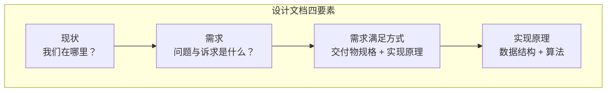
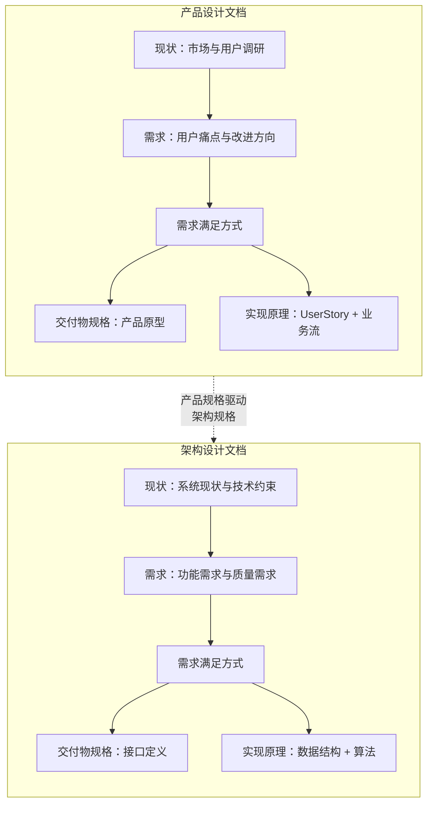
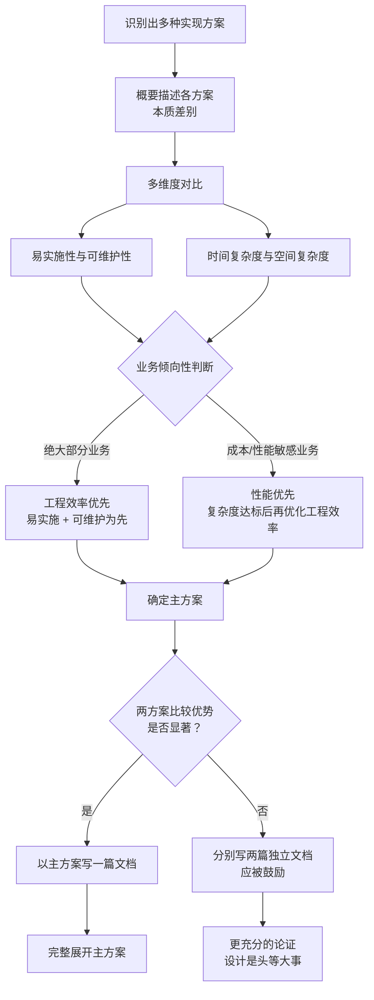
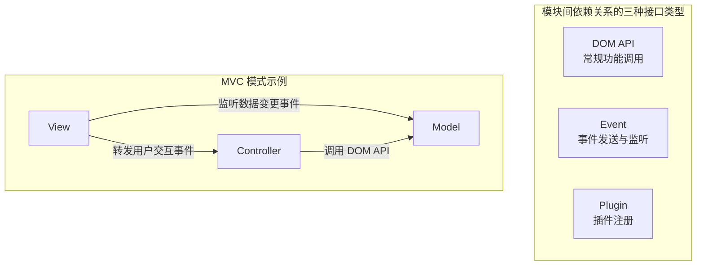
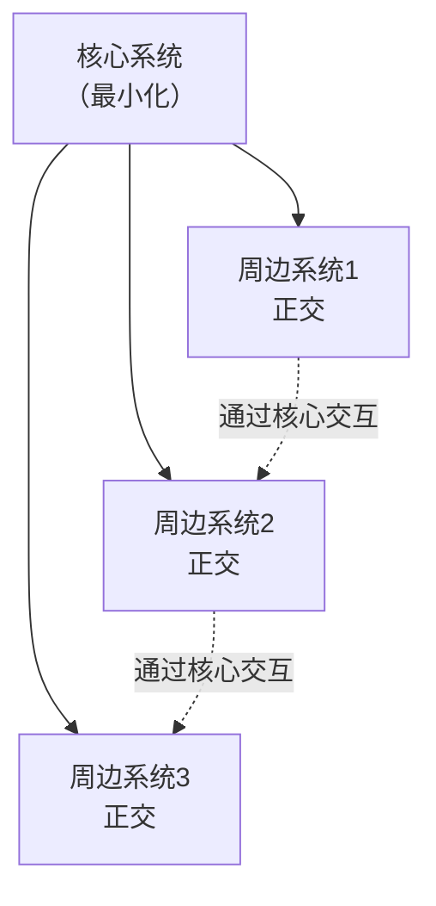

# 怎么写设计文档

## 章节导言：设计文档是共识的精确载体

在软件工程的全过程中，有两个阶段最为关键：**产品设计**与**架构设计**。前者由产品经理主导，关注"如何以产品特性系统化地满足用户需求"；后者由架构师主导，关注"业务系统如何系统化地进行分解与交付"。

无论是产品文档还是架构文档，它们都是设计文档的一种，本质都是**团队内及团队间协同的共识载体**。上一篇 [69讲] 从协同角度谈了共识的重要性，本节我们聚焦：如何将共识精确地表达为设计文档。

> 交叉参考：[45讲 - 架构：怎么做详细设计？] 已介绍模块级设计文档的写法，本节补充系统概要设计与产品设计文档的异同。[32讲 - 架构：系统的概要设计] 讨论了系统分解的逻辑。

---

## 核心概念与原理

### 设计文档的统一结构

所有设计文档的内容组织逻辑是相通的，无论产品设计还是架构设计，都遵循以下四段式结构：

| 要素 | 写法要求 | 核心关注点 |
|------|---------|-----------|
| **现状** | 不要长篇累牍。陈述与改变相关的重要事实，强调存在性和重要性 | 我们在哪里 |
| **需求** | 不需要长篇累牍。痛点够痛大家都知道，这是对痛点和改进方向的共识确认 | 问题是什么 |
| **需求满足方式** | **详写**。包括交付物规格和使用界面（接口） | 做成什么样 |
| **实现原理** | 数据结构 + 算法。用 UML 时序图或伪代码表达 | 怎么做到 |

### 产品设计 vs 架构设计的维度差异

产品经理与架构师是一体两面，对人的能力要求相似，但关注维度不同：

| 维度 | 产品设计 | 架构设计 |
|------|---------|---------|
| 关键词 | 用户需求、技术赋能、商业成功 | 用户需求、技术实现、业务迭代 |
| 交付物规格 | 产品原型 | 网络 API 协议 / 包导出的公开类或函数 |
| 实现原理 | UserStory 设计——业务流怎么完成 | UserStory 的程序逻辑实现 |
| 数据结构 | 业务对象模型 | 内存/外存数据结构、数据库表结构 |
| 算法 | 业务流程 | UML 时序图、伪代码 |

### 核心公式：程序 = 数据结构 + 算法

这是设计文档"实现原理"部分的指导思想：

- **数据结构**：可以是内存数据结构、外存数据结构、数据库表结构
- **算法**：基于数据结构描述 UserStory 的具体实现，可以是 UML 时序图或伪代码

---

## Mermaid 图表：设计文档结构与多方案对比

### 设计文档结构视图

### 多方案对比决策流程

**许式伟的关键判断**：设计是软件工程中的头等大事，我们应该在设计中"多浪费点时间"，这样的"浪费"最终会得到十倍甚至百倍以上的回报。如果两套方案的比较优势不显著，写两套独立的设计文档是应该被鼓励的。

---

## 设计原则与权衡（Trade-off 分析）

### 原则一：接口先行，实现随后

在描述交付物规格时，有两个核心关注点：

1. **接口是否足够简单，是否自然体现业务需求**
2. **尽可能避免接口变更，接口要向前兼容**

对于系统的概要设计：
- **第一关心的是模块关系**
- **第二关心的才是各个模块的核心接口**（这些接口能把关键 UserStory 串起来）

### 原则二：模块关系的三种表达方式

以 MVC 为例：
- View 监听 Model 层的数据变更事件（Event）
- View 转发用户交互事件给 Controller（Event）
- Controller 将用户交互事件转为 Model 层的 DOM API 调用

### 原则三：概要设计 vs 详细设计的实现表达差异

| 维度 | 系统概要设计 | 模块详细设计 |
|------|------------|------------|
| 关注焦点 | 不同模块的配合关系 | 模块内部实现 |
| 数据结构 | 不需要交代 | 必须先交代清楚 |
| UserStory | 讲清楚模块间协作流程 | 讲清楚内部业务流程 |
| 伪代码 | 必须——表达模块间交互语义 | 必须——表达业务逻辑 |

### 原则四：伪代码必须精确

伪代码的表达方式及语义需要在团队内形成默契。这种伪代码的语义表达必须是精确的：

- 网络请求：基于类似 qiniu httptest 的语法（`post /v1/foo/bar json {...}` / `ret json {...}`）
- MongoDB：直接用 JavaScript 脚本文法
- MySQL：直接基于 SQL 语法
- 其他：选择领域最自然的表达方式

### Trade-off：架构图 vs 接口定义

- 架构图有助于理解系统分解逻辑，但表达非常粗糙
- 接口定义精确无歧义，但缺乏全局视角
- **最佳实践**：架构图辅助理解，接口定义作为正式契约。模块关系图 + 核心接口规格，两者缺一不可

### Trade-off：单方案 vs 多方案文档

- 单方案文档：聚焦，撰写成本低，但可能错过更优解
- 多方案文档：论证充分，但投入大
- **最佳实践**：当两方案比较优势不显著时，写两篇独立文档。设计是头等大事，在此"浪费"时间回报百倍

---

## 实践案例与反模式

### 案例：画图程序的模块关系图

许式伟以画图程序为例，从"最小化核心系统 + 多个彼此正交的周边系统"的视角表达模块关系：

这种表达方式的关键：周边系统彼此正交，通过核心系统间接交互。但要注意，模块关系图仍然粗糙——为了共识的精确，必须将各模块核心的使用界面（接口）表达出来。

### 反模式：用业务流程图代替模块关系图

很多人喜欢画"上传文件的业务流程图"这类图——数据从客户端到 API 网关，到业务服务器，到存储。这类图：
- 没有对模块关系进行抽象
- 更多用于面向客户介绍 API SDK 的实现原理
- 不适合出现在设计文档中

**正确的做法**：对模块调用接口进行分类（DOM API / Event / Plugin），通过接口类型表达模块间的依赖关系。

### 反模式：概要设计只有文档没有代码

正如 [69讲] 所强调的，概要设计阶段最好的状态不是只有设计文档，而是同时有代码产出——系统初始框架 + 核心模块 mock 实现。这能极大降低"各模块做好了但拼不起来"的风险。

---

## 小结与关键要点

1. **设计文档的四要素**：现状、需求、需求满足方式（交付物规格）、实现原理（数据结构 + 算法）。其中需求满足方式和实现原理必须详写。

2. **规格高于实现**：交付物规格（接口）是团队间最重要的契约，必须精确无歧义。架构图只是辅助，接口定义才是正式契约。

3. **多方案对比应被鼓励**：设计是头等大事，在设计中"浪费"时间回报百倍。当方案比较优势不显著时，写两篇独立的设计文档。

4. **模块关系的三种接口类型**：DOM API、Event、Plugin。通过接口分类表达模块间依赖关系，比画流程图更有抽象力。

5. **伪代码必须精确**：团队内形成默契的伪代码表达方式，语义必须无歧义。

6. **概要设计与详细设计的差异**：概要设计关注模块配合，无需交代数据结构；详细设计关注内部实现，必须先交代数据结构。

> 下一篇 [71讲 - 如何阅读别人的代码] 将探讨设计文档的反向过程——如何从代码中还原架构设计。
